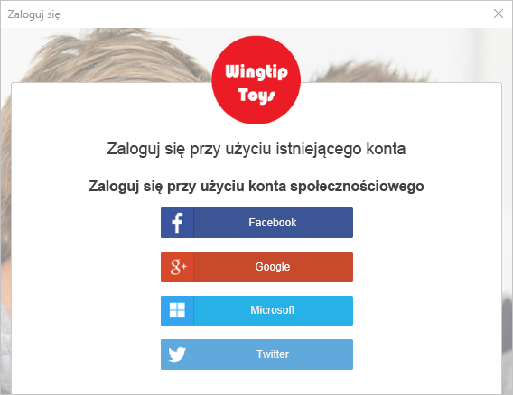
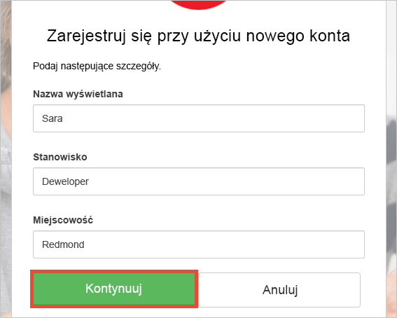

# Testowanie aplikacji pulpitu skonfigurowane w usłudze Azure AD B2C

Usługa Azure Active Directory B2C umożliwia zarządzanie tożsamości chmury do zachowania aplikacji, firmy oraz klientów chronionych.  Ta opcja szybkiego startu używa przykładową aplikację pulpitu systemu Windows Presentation Foundation (WPF) aby zademonstrować:

* Przy użyciu **Utwórz konto lub zaloguj** zasad, aby utworzyć lub zaloguj się przy użyciu dostawcy tożsamości społecznościowych lub lokalnego konta przy użyciu adresu e-mail. 
* **Wywołanie interfejsu API** można pobrać nazwy wyświetlanej z usługi Azure AD B2C zabezpieczonej zasobów.

## Wymagania wstępne

* Zainstaluj program [Visual Studio 2017](https://www.visualstudio.com/downloads/) z następującymi pakietami roboczymi:
    - **.NET — rozwój pulpitu**

* Konto społecznościowych z usługi Facebook, Google, Microsoft lub Twitter. Jeśli nie masz konta społecznościowych, wymagany jest prawidłowy adres e-mail.

[!INCLUDE [quickstarts-free-trial-note](../../includes/quickstarts-free-trial-note.md)]

## Pobierz przykład

[Pobrać lub sklonować przykładowej aplikacji](https://github.com/Azure-Samples/active-directory-b2c-dotnet-desktop) z usługi GitHub.

## Uruchom aplikację w programie Visual Studio

W folderze projektu aplikacji przykładowej Otwórz `active-directory-b2c-wpf.sln` rozwiązania w programie Visual Studio. 

Wybierz **Debuguj > Rozpocznij debugowanie** Aby skompilować i uruchomić aplikację. 

## Tworzenie konta usługi

Kliknij przycisk **Zaloguj** uruchomić **Utwórz konto lub zaloguj** przepływu pracy. Podczas tworzenia konta, można użyć istniejącego konta dostawcy tożsamości społecznościowych lub konto e-mail.

### Zaloguj przy użyciu dostawcy tożsamości społecznościowych

Aby utworzyć konto przy użyciu dostawcy tożsamości społecznościowych, kliknij przycisk dostawcy tożsamości, który ma być używany. Jeśli wolisz używać adresu e-mail, należy przejść do [zaloguj przy użyciu adresu e-mail](#sign-up-using-an-email-address) sekcji.

Musisz uwierzytelnić (logowania) za pomocą konta społecznościowych poświadczenia i zezwolić aplikacji na odczytywanie informacji z Twojego konta społecznościowych. Udzielenie dostępu, aplikacja może pobrać informacji o profilu konta społecznościowych, takie jak nazwa i Miasto. 

Szczegóły nowego profilu konta są wstępnie wypełnione informacjami z konta społecznościowych. Zmodyfikuj szczegóły, jeśli chcesz i kliknij przycisk **Kontynuuj**.

Pomyślnie utworzono nowe konto użytkownika usługi Azure AD B2C, która używa dostawcy tożsamości. Po zalogowaniu, token dostępu jest wyświetlany w obszarze *Token informacji* pola tekstowego. Token dostępu jest używany podczas uzyskiwania dostępu do zasobu interfejsu API.

Następny krok: [przeskoczyć do edycji profilu](#edit-your-profile) sekcji.

### Zaloguj przy użyciu adresu e-mail

Jeśli wybierzesz opcję rezygnacji z używania kont społecznościowych do zapewnienia uwierzytelniania, można utworzyć konta użytkownika usługi Azure AD B2C przy użyciu prawidłowy adres e-mail. Konto użytkownika lokalnego usługi Azure AD B2C używa usługi Azure Active Directory jako dostawcy tożsamości. Aby użyć adresu e-mail, kliknij przycisk **nie masz konta? Zarejestruj się teraz** łącza.

Wprowadź prawidłowy adres e-mail i kliknij przycisk **wysłać kod weryfikacyjny**. Prawidłowy adres e-mail jest wymagany, aby uzyskać kod weryfikacyjny z usługi Azure AD B2C.

Wprowadź kod weryfikacyjny wyświetlany w wiadomości e-mail i kliknij przycisk **Sprawdź kod**.

Dodawanie informacji o Twoim profilu, a następnie kliknij przycisk **Utwórz**.

Pomyślnie utworzono nowe konto użytkownika lokalnego dla usługi Azure AD B2C. Po zalogowaniu, token dostępu jest wyświetlany w obszarze *Token informacji* pola tekstowego. Token dostępu jest używany podczas uzyskiwania dostępu do zasobu interfejsu API.

## Edytowanie profilu

Usługa Azure Active Directory B2C zawiera funkcję, aby umożliwić użytkownikom aktualizowanie ich profile. Kliknij przycisk **edytowanie profilu** Aby edytować to profil utworzony.

Wybierz dostawcę tożsamości, skojarzone z utworzonego konta. Na przykład jeśli używasz usługi Twitter jako dostawca tożsamości, podczas tworzenia konta, wybierz pozycję Twitter, aby zmodyfikować szczegóły skojarzony profil.

Zmień Twoje **Nazwa wyświetlana** lub **miasta**. 

Nowy token dostępu jest wyświetlany w *Token informacji* pola tekstowego. Jeśli chcesz zweryfikować zmiany do swojego profilu, skopiuj i Wklej token dostępu do https://jwt.ms dekodera tokenów.

## Dostęp do zasobu

Kliknij przycisk **wywołania interfejsu API** Wyślij żądanie do usługi Azure AD B2C zabezpieczonej https://fabrikamb2chello.azurewebsites.net/hello zasobów. 

Aplikacja zawiera token dostępu wyświetlane w *Token informacji* pole tekstowe w żądaniu. Interfejs API odsyła nazwę wyświetlaną zawartych w tokenie dostępu.

## Następne kroki

Następnym krokiem jest tworzenie dzierżawy usługi Azure AD B2C i konfigurowanie przykładowych przy użyciu dzierżawy. 

> [!div class="nextstepaction"]
> [Tworzenie dzierżawy usługi Azure Active Directory B2C w portalu Azure](active-directory-b2c-get-started.md)
