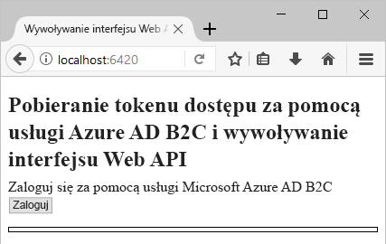
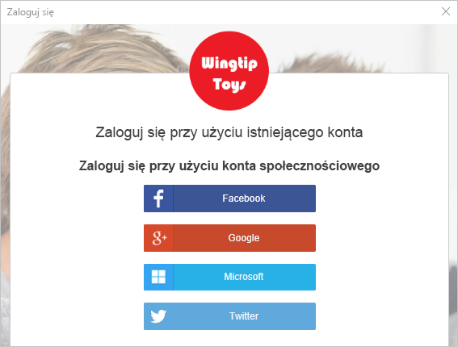
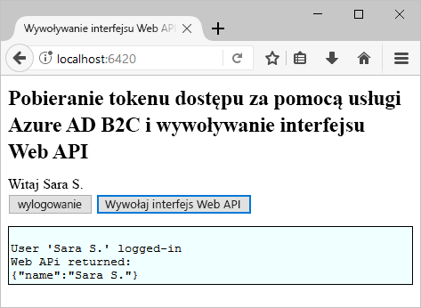

# <a name="quickstart-test-drive-an-azure-ad-b2c-enabled-single-page-app"></a>Szybki start: Testowanie jednostronicowej aplikacji z włączoną obsługą usługi Azure AD B2C

Usługa Azure Active Directory (Azure AD) B2C umożliwia zarządzanie tożsamościami w chmurze, chroniąc Twoją aplikację, firmę i klientów. Usługa Azure AD B2C umożliwia aplikacjom uwierzytelnianie względem kont społecznościowych i firmowych za pomocą protokołów zgodnych z otwartymi standardami.

W tym samouczku Szybki start przykładowa aplikacja jednostronicowa z obsługą usługi Azure AD B2C jest używana do logowania za pomocą dostawcy tożsamości dla sieci społecznościowej i wywołania internetowego interfejsu API chronionego przez usługę Azure AD B2C.

[!INCLUDE [quickstarts-free-trial-note](../../includes/quickstarts-free-trial-note.md)]

## <a name="prerequisites"></a>Wymagania wstępne

* Program [Visual Studio 2017](https://www.visualstudio.com/downloads/) z pakietem roboczym **Tworzenie aplikacji na platformie ASP.NET i aplikacji internetowych**.
* Zainstalować środowisko [Node.js](https://nodejs.org/en/download/).
* Konto w sieci społecznościowej: Facebook, Google, Microsoft lub Twitter.

## <a name="download-the-sample"></a>Pobierz przykład

[Pobierz plik zip](https://github.com/Azure-Samples/active-directory-b2c-javascript-msal-singlepageapp/archive/master.zip) lub sklonuj przykładową aplikację internetową z usługi GitHub.

```
git clone https://github.com/Azure-Samples/active-directory-b2c-javascript-msal-singlepageapp.git
```

## <a name="run-the-sample-application"></a>Uruchamianie przykładowej aplikacji

Aby uruchomić ten przykład z poziomu wiersza polecenia środowiska Node.js: 

```
cd active-directory-b2c-javascript-msal-singlepageapp
npm install && npm update
node server.js
```

Aplikacja Node.js generuje numer portu, którego nasłuchuje na hoście lokalnym.

```
Listening on port 6420...
```

Przejdź do adresu URL aplikacji `http://localhost:6420` w przeglądarce internetowej.



## <a name="create-an-account"></a>Tworzenie konta

Kliknij przycisk **Zaloguj się**, aby uruchomić przepływ pracy usługi Azure AD B2C o nazwie **Rejestracja lub Logowanie** bazujący na zasadach usługi Azure AD B2C. 

Przykład obsługuje kilka opcji rejestracji, w tym przy użyciu dostawcy tożsamości dla sieci społecznościowej, lub tworzenia konta lokalnego przy użyciu adresu e-mail. Dla tego przewodnika Szybki start należy użyć konta dostawcy tożsamości dla sieci społecznościowej Facebook, Google, Microsoft lub Twitter. 

### <a name="sign-up-using-a-social-identity-provider"></a>Rejestrowanie się przy użyciu dostawcy tożsamości dla sieci społecznościowej

Dla przykładowej aplikacji internetowej usługa Azure AD B2C wyświetla niestandardową stronę logowania fikcyjnej marki Wingtip Toys. 

1. Aby zarejestrować się przy użyciu dostawcy tożsamości dla sieci społecznościowej, kliknij przycisk dostawcy tożsamości, którego chcesz użyć.

    

    Uwierzytelniasz się (logujesz) za pomocą poświadczeń konta w sieci społecznościowej i autoryzujesz aplikację do odczytywania informacji z Twojego konta w sieci społecznościowej. Po udzieleniu dostępu aplikacji może ona pobrać informacje z profilu na koncie w sieci społecznościowej, takie jak Twoje nazwisko i miasto. 

2. Zakończ proces logowania dla dostawcy tożsamości. Na przykład jeśli wybranym dostawcą jest Twitter, wprowadź swoje poświadczenia usługi Twitter i kliknij przycisk **Zaloguj się**.

    

    Szczegóły profilu na nowym koncie są wstępnie wypełnione informacjami z konta w sieci społecznościowej. 

3. Zaktualizuj pola Nazwa wyświetlana, Stanowisko i Miasto, a następnie kliknij pozycję **Kontynuuj**.  Wprowadzone przez Ciebie wartości są używane w profilu na koncie użytkownika w usłudze Azure AD B2C.

    Pomyślnie utworzono nowe konto użytkownika usługi Azure AD B2C, które używa dostawcy tożsamości. 

## <a name="access-a-protected-web-api-resource"></a>Uzyskiwanie dostępu do zasobu chronionego internetowego interfejsu API

Kliknij przycisk **Wywołaj internetowy interfejs API**, aby uzyskać swoją nazwę wyświetlaną zwróconą jako obiekt JSON z wywołania internetowego interfejsu API. 



Przykładowa aplikacja jednostronicowa uwzględnia token dostępu usługi Azure AD w żądaniu do zasobu chronionego internetowego interfejsu API, aby wykonać operację zwrócenia obiektu JSON.

## <a name="clean-up-resources"></a>Oczyszczanie zasobów

Jeśli planujesz wypróbować inne przewodniki Szybki start lub samouczki usługi Azure AD B2C, możesz użyć swojej dzierżawy usługi Azure AD B2C. Możesz [usunąć dzierżawę usługi Azure AD B2C](active-directory-b2c-faqs.md#how-do-i-delete-my-azure-ad-b2c-tenant), gdy nie będzie już potrzebna.

## <a name="next-steps"></a>Kolejne kroki

W tym przewodniku Szybki start użyto przykładowej aplikacji platformy ASP.NET z obsługą usługi Azure AD B2C do logowania za pomocą niestandardowej strony logowania, logowania za pomocą dostawcy tożsamości dla sieci społecznościowej, utworzenia konta usługi Azure AD B2C i wywołania internetowego interfejsu API chronionego przez usługę Azure AD B2C. 

Następnym krokiem jest utworzenie własnej dzierżawy usługi Azure AD B2C i skonfigurowanie przykładu pod kątem uruchamiania przy użyciu dzierżawy. 

> [!div class="nextstepaction"]
> [Tworzenie dzierżawy usługi Azure Active Directory B2C w witrynie Azure Portal](active-directory-b2c-get-started.md)