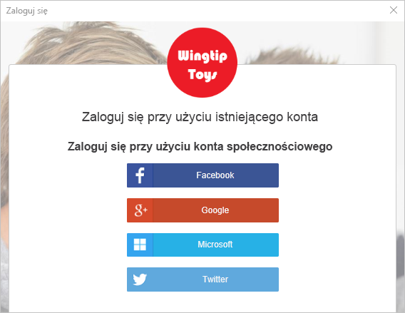
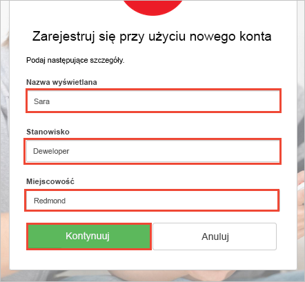
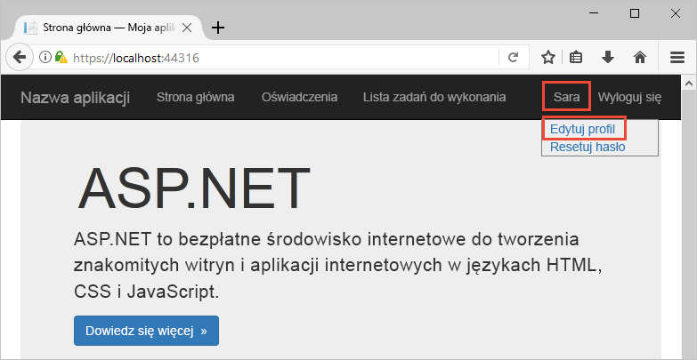

# <a name="quickstart-test-drive-an-azure-ad-b2c-enabled-web-app"></a>Szybki start: testowanie aplikacji internetowej z obsługą usługi Azure AD B2C

Usługa Azure Active Directory (Azure AD) B2C umożliwia zarządzanie tożsamościami w chmurze, chroniąc Twoją aplikację, firmę i klientów. Usługa Azure AD B2C umożliwia aplikacjom uwierzytelnianie względem kont społecznościowych i firmowych za pomocą protokołów zgodnych z otwartymi standardami.

W tym przewodniku Szybki start przykładowa aplikacja platformy ASP.NET z obsługą usługi Azure AD B2C jest używana do logowania za pomocą dostawcy tożsamości społecznościowych i wywoływania chronionego internetowego interfejsu API usługi Azure AD B2C.

[!INCLUDE [quickstarts-free-trial-note](../../includes/quickstarts-free-trial-note.md)]

## <a name="prerequisites"></a>Wymagania wstępne

* Program [Visual Studio 2017](https://www.visualstudio.com/downloads/) z pakietem roboczym **Tworzenie aplikacji na platformie ASP.NET i aplikacji internetowych**. 
* Konto w sieci społecznościowej: Facebook, Google, Microsoft lub Twitter.

## <a name="download-the-sample"></a>Pobierz przykład

[Pobierz plik zip](https://github.com/Azure-Samples/active-directory-b2c-dotnet-webapp-and-webapi/archive/master.zip) lub sklonuj przykładową aplikację internetową z usługi GitHub.

```
git clone https://github.com/Azure-Samples/active-directory-b2c-dotnet-webapp-and-webapi.git
```

## <a name="run-the-app-in-visual-studio"></a>Uruchamianie aplikacji w programie Visual Studio

W folderze projektu przykładowej aplikacji otwórz rozwiązanie `B2C-WebAPI-DotNet.sln` w programie Visual Studio.

Przykładowe rozwiązanie zawiera dwa projekty:

**Przykładowa aplikacja internetowa (TaskWebApp):** aplikacja internetowa do tworzenia i edytowania listy zadań. Ta aplikacja internetowa używa zasad **rejestracji lub logowania** na potrzeby rejestrowania lub logowania użytkowników.

**Przykładowa aplikacja internetowego interfejsu API (TaskService):** internetowy interfejs API, który obsługuje następujące funkcje listy zadań: tworzenie, odczytywanie, aktualizowanie i usuwanie. Internetowy interfejs API jest chroniony przez usługę Azure AD B2C i wywoływany przez aplikację internetową.

Na potrzeby tego przewodnika Szybki start uruchom równocześnie projekty `TaskWebApp` i `TaskService`. 

1. Wybierz rozwiązanie `B2C-WebAPI-DotNet` w Eksploratorze rozwiązań.
2. W menu programu Visual Studio wybierz pozycję **Projekt > Ustaw projekty startowe...**. 
3. Wybierz przycisk radiowy **Wiele projektów startowych**.
4. Zmień ustawienie **Akcja** dla obu projektów na wartość **Uruchom**. Kliknij przycisk **OK**.

Naciśnij klawisz **F5**, aby debugować obie aplikacje. Każda z aplikacji zostanie otwarta we własnej karcie przeglądarki:

`https://localhost:44316/` — ta strona to internetowa aplikacja platformy ASP.NET. W przewodniku Szybki start ta aplikacja jest używana bezpośrednio.
`https://localhost:44332/` — ta strona to internetowy interfejs API wywoływany przez internetową aplikację platformy ASP.NET.

## <a name="create-an-account"></a>Tworzenie konta

Kliknij link **Rejestruj / Zaloguj** w aplikacji internetowej platformy ASP.NET, aby uruchomić przepływ pracy **Rejestrowanie lub logowanie** na podstawie zasad usługi Azure AD B2C.


Przykład obsługuje kilka opcji rejestracji, w tym przy użyciu dostawcy tożsamości dla sieci społecznościowej, lub tworzenia konta lokalnego przy użyciu adresu e-mail. Dla tego przewodnika Szybki start należy użyć konta dostawcy tożsamości dla sieci społecznościowej Facebook, Google, Microsoft lub Twitter. 

### <a name="sign-up-using-a-social-identity-provider"></a>Rejestrowanie się przy użyciu dostawcy tożsamości dla sieci społecznościowej

Dla przykładowej aplikacji internetowej usługa Azure AD B2C wyświetla niestandardową stronę logowania fikcyjnej marki Wingtip Toys. 

1. Aby zarejestrować się przy użyciu dostawcy tożsamości dla sieci społecznościowej, kliknij przycisk dostawcy tożsamości, którego chcesz użyć.

    

    Uwierzytelniasz się (logujesz) za pomocą poświadczeń konta w sieci społecznościowej i autoryzujesz aplikację do odczytywania informacji z Twojego konta w sieci społecznościowej. Po udzieleniu dostępu aplikacji może ona pobrać informacje z profilu na koncie w sieci społecznościowej, takie jak Twoje nazwisko i miasto. 

2. Zakończ proces logowania dla dostawcy tożsamości. Na przykład jeśli wybranym dostawcą jest Twitter, wprowadź swoje poświadczenia usługi Twitter i kliknij przycisk **Zaloguj się**.

    

    Szczegóły profilu nowego konta usługi Azure AD B2C są wstępnie wypełnione informacjami z konta społecznościowego.

3. Zaktualizuj pola Nazwa wyświetlana, Stanowisko i Miasto, a następnie kliknij pozycję **Kontynuuj**.  Wprowadzone przez Ciebie wartości są używane w profilu na koncie użytkownika w usłudze Azure AD B2C.

    

    Pomyślnie użyto przykładowej aplikacji internetowej korzystającej z zasad usługi Azure AD B2C do uwierzytelnienia za pomocą dostawcy tożsamości i utworzenia konta użytkownika usługi Azure AD B2C. 

## <a name="edit-your-profile"></a>Edycja profilu

Usługa Azure Active Directory B2C zawiera funkcję umożliwiającą użytkownikom aktualizowanie profilów. Przykładowa aplikacja internetowa używa zasad profilu edycji usługi Azure AD B2C dla przepływu pracy. 

1. Na pasku menu aplikacji internetowej kliknij nazwę profilu, a następnie wybierz pozycję **Edytuj profil**, aby edytować utworzony profil.

    

2. Zmień wartości **Nazwa wyświetlana** i **Miasto**.  
3. Kliknij pozycję **Kontynuuj**, aby zaktualizować profil. Nowa nazwa wyświetlana jest wyświetlana w prawej górnej części strony głównej aplikacji internetowej.

## <a name="access-a-protected-web-api-resource"></a>Uzyskiwanie dostępu do zasobu chronionego internetowego interfejsu API

1. Kliknij pozycję **Lista zadań do wykonania**, aby określić i zmodyfikować pozycje listy zadań do wykonania. 

2. Wpisz tekst w polu tekstowym **Nowy element**. Kliknij pozycję **Dodaj**, aby wywołać chroniony internetowy interfejs API usługi Azure AD B2C, który dodaje pozycję listy zadań do wykonania.

    

    Aplikacja internetowa platformy ASP.NET dołącza token dostępu usługi Azure AD do żądania skierowanego do chronionego zasobu internetowego interfejsu API w celu wykonania operacji na pozycjach listy zadań do wykonania użytkownika.

Pomyślnie użyto konta użytkownika usługi Azure AD B2C do wykonania autoryzowanego wywołania chronionego internetowego interfejsu API usługi Azure AD B2C.

## <a name="clean-up-resources"></a>Oczyszczanie zasobów

Jeśli planujesz wypróbować inne przewodniki Szybki start lub samouczki usługi Azure AD B2C, możesz użyć swojej dzierżawy usługi Azure AD B2C. Możesz [usunąć dzierżawę usługi Azure AD B2C](active-directory-b2c-faqs.md#how-do-i-delete-my-azure-ad-b2c-tenant), gdy nie będzie już potrzebna.

## <a name="next-steps"></a>Następne kroki

W tym przewodniku Szybki start użyto przykładowej aplikacji platformy ASP.NET z obsługą usługi Azure AD B2C do logowania za pomocą niestandardowej strony logowania, logowania za pomocą dostawcy tożsamości dla sieci społecznościowej, utworzenia konta usługi Azure AD B2C i wywołania internetowego interfejsu API chronionego przez usługę Azure AD B2C. 

Kontynuuj pracę w samouczku, aby dowiedzieć się, jak skonfigurować przykład dla platformy ASP.NET pod kątem użycia własnej dzierżawy usługi Azure AD B2C.

> [!div class="nextstepaction"]
> [Samouczek: uwierzytelnianie użytkowników za pomocą usługi Azure Active Directory B2C w aplikacji internetowej platformy ASP.NET](active-directory-b2c-tutorials-web-app.md)