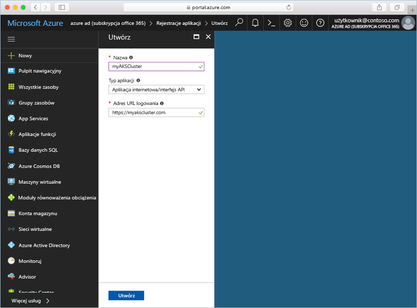
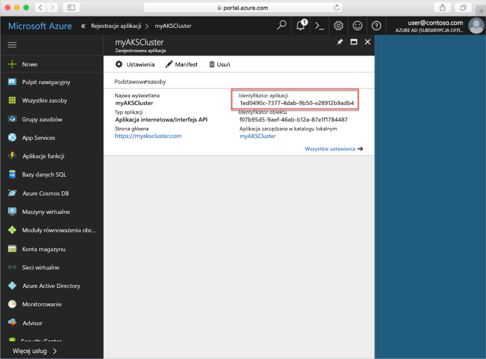
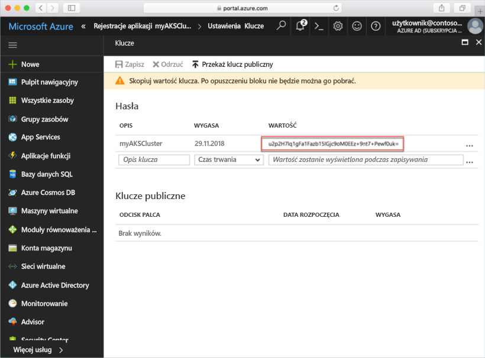
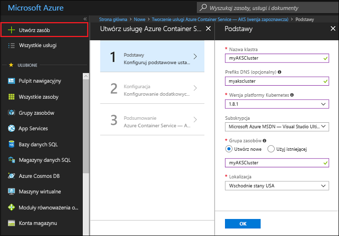

# <a name="deploy-an-azure-container-service-aks-cluster"></a>Wdrażanie klastra usługi Azure Container Service (AKS)

W tym przewodniku Szybki start wdrażany jest klaster AKS przy użyciu witryny Azure Portal. Następnie w klastrze jest uruchamiana aplikacja obsługująca wiele kontenerów, która składa się z frontonu internetowego i wystąpienia pamięci podręcznej Redis. Po ukończeniu aplikacja będzie dostępna w Internecie.


W tym przewodniku Szybki start założono, że masz podstawową wiedzę na temat pojęć związanych z rozwiązaniem Kubernetes. Aby uzyskać szczegółowe informacje na jego temat, zapoznaj się z [dokumentacją rozwiązania Kubernetes][kubernetes-documentation].

## <a name="sign-in-to-azure"></a>Logowanie do platformy Azure

Zaloguj się w witrynie Azure Portal pod adresem http://portal.azure.com.

## <a name="create-service-principal"></a>Tworzenie jednostki usługi

Przed utworzeniem klastra AKS w witrynie Azure Portal musisz utworzyć jednostkę usługi. Za pomocą tej jednostki usługi platforma Azure zarządza infrastrukturą skojarzoną z klastrem AKS.

Wybierz pozycję **Azure Active Directory** > **Rejestracje aplikacji** > **Rejestrowanie nowej aplikacji**.

Wprowadź nazwę aplikacji. Może to być dowolna wartość. Jako typ aplikacji wybierz pozycję **Interfejs API/aplikacja sieci Web**. Wprowadź wartość w polu **Adres URL logowania**. Może to być dowolna wartość w prawidłowym formacie adresu URL, ale nie musi odpowiadać rzeczywistemu punktowi końcowemu.

Po zakończeniu wybierz pozycję **Utwórz**.



Wybierz nowo utworzoną rejestrację aplikacji, a następnie zanotuj identyfikator aplikacji. Ta wartość jest potrzebna podczas tworzenia klastra AKS.



Następnie należy utworzyć hasło dla jednostki usługi. Wybierz pozycję **Wszystkie ustawienia** > **Klucze** i wprowadź dowolną wartość jako opis klucza. Wybierz czas trwania, czyli okres ważności jednostki usługi.

Kliknij przycisk **Zapisz** i zanotuj wartość hasła. Hasło jest potrzebne podczas tworzenia klastra AKS.



## <a name="create-aks-cluster"></a>Tworzenie klastra AKS

Wybierz pozycję **Nowy** > **Kontenery** > **Azure Container Service — AKS (wersja zapoznawcza)**.

Podaj nazwę klastra, prefiks DNS, nazwę grupy zasobów, lokalizację i wersję rozwiązania Kubernetes dla klastra. Zapamiętaj nazwę klastra oraz nazwę grupy zasobów — będą potrzebne podczas nawiązywania połączenia z klastrem.

Po zakończeniu wybierz przycisk **OK**.



W formularzu konfiguracji wprowadź następujące informacje:

- Nazwa użytkownika — nazwa nadana kontom z uprawnieniami administracyjnymi w węzłach klastra.
- Klucz publiczny SSH — skojarzony z kluczem, za pomocą którego będzie uzyskiwany dostęp do węzłów klastra.
- Identyfikator klienta jednostki usługi — identyfikator aplikacji jednostki usługi utworzonej we wcześniejszej części tego dokumentu.
- Klucz tajny klienta jednostki usługi — hasło jednostki usługi utworzonej we wcześniejszej części tego dokumentu.
- Liczba węzłów — liczba węzłów AKS do utworzenia.
- Rozmiar maszyny wirtualnej węzła — rozmiar maszyn wirtualnych dla węzłów AKS.
- Rozmiar dysku systemu operacyjnego — rozmiar dysku systemu operacyjnego węzłów AKS.

Po zakończeniu wybierz przycisk **OK**, a następnie ponownie wybierz przycisk **OK** po ukończeniu weryfikacji.


Po krótkim czasie oczekiwania klaster AKS zostanie wdrożony i będzie gotowy do użycia.

## <a name="connect-to-the-cluster"></a>Łączenie z klastrem

Aby zarządzać klastrem Kubernetes, należy użyć klienta wiersza polecenia usługi Kubernetes, narzędzia [kubectl][kubectl]. Klient kubectl jest preinstalowany wraz z usługą Azure Cloud Shell.

Otwórz usługę Cloud Shell za pomocą przycisku w prawym górnym rogu witryny Azure Portal.


Za pomocą polecenia [az aks get-credentials][az-aks-get-credentials] skonfiguruj narzędzie kubectl w celu nawiązania połączenia z klastrem Kubernetes.

Skopiuj poniższe polecenie i wklej je w usłudze Cloud Shell. W razie potrzeby zmodyfikuj nazwę klastra i nazwę grupy zasobów.

```azurecli-interactive
az aks get-credentials --resource-group myAKSCluster --name myAKSCluster
```

Aby sprawdzić połączenie z klastrem, użyj polecenia [kubectl get][kubectl-get], aby powrócić do listy węzłów klastra.

```azurecli-interactive
kubectl get nodes
```

Dane wyjściowe:

```
NAME                       STATUS    ROLES     AGE       VERSION
aks-agentpool-14693408-0   Ready     agent     6m        v1.8.1
aks-agentpool-14693408-1   Ready     agent     6m        v1.8.1
aks-agentpool-14693408-2   Ready     agent     7m        v1.8.1
```

## <a name="run-the-application"></a>Uruchamianie aplikacji

Plik manifestu rozwiązania Kubernetes definiuje żądany stan klastra, w tym informacje o obrazach kontenerów, które powinny zostać uruchomione. W tym przykładzie manifest służy do tworzenia wszystkich obiektów potrzebnych do uruchomienia aplikacji Azure Vote.

Utwórz plik o nazwie `azure-vote.yaml` i skopiuj go do poniższego kodu YAML. Jeśli pracujesz w usłudze Azure Cloud Shell, ten plik możesz utworzyć przy użyciu serwera vi lub Nano tak jak podczas pracy w systemie wirtualnym lub fizycznym.

```yaml
apiVersion: apps/v1beta1
kind: Deployment
metadata:
  name: azure-vote-back
spec:
  replicas: 1
  template:
    metadata:
      labels:
        app: azure-vote-back
    spec:
      containers:
      - name: azure-vote-back
        image: redis
        ports:
        - containerPort: 6379
          name: redis
---
apiVersion: v1
kind: Service
metadata:
  name: azure-vote-back
spec:
  ports:
  - port: 6379
  selector:
    app: azure-vote-back
---
apiVersion: apps/v1beta1
kind: Deployment
metadata:
  name: azure-vote-front
spec:
  replicas: 1
  template:
    metadata:
      labels:
        app: azure-vote-front
    spec:
      containers:
      - name: azure-vote-front
        image: microsoft/azure-vote-front:redis-v1
        ports:
        - containerPort: 80
        env:
        - name: REDIS
          value: "azure-vote-back"
---
apiVersion: v1
kind: Service
metadata:
  name: azure-vote-front
spec:
  type: LoadBalancer
  ports:
  - port: 80
  selector:
    app: azure-vote-front
```

Użyj polecenia [kubectl create][kubectl-create], aby uruchomić aplikację.

```azurecli-interactive
kubectl create -f azure-vote.yaml
```

Dane wyjściowe:

```
deployment "azure-vote-back" created
service "azure-vote-back" created
deployment "azure-vote-front" created
service "azure-vote-front" created
```

## <a name="test-the-application"></a>Testowanie aplikacji

Podczas uruchamiania aplikacji tworzona jest [usługa Kubernetes][kubernetes-service], która uwidacznia fronton aplikacji w Internecie. Ten proces może potrwać kilka minut.

Aby monitorować postęp, użyj polecenia [kubectl get-service][kubectl-get] z argumentem `--watch`.

```azurecli-interactive
kubectl get service azure-vote-front --watch
```

Początkowo adres *EXTERNAL-IP* dla usługi *azure-vote-front* pojawia się jako *oczekujący*.

```
NAME               TYPE           CLUSTER-IP   EXTERNAL-IP   PORT(S)        AGE
azure-vote-front   LoadBalancer   10.0.37.27   <pending>     80:30572/TCP   6s
```

Po zmianie adresu *EXTERNAL-IP* z *oczekującego* na *adres IP*, zatrzymaj proces śledzenia narzędzia kubectl za pomocą polecenia `CTRL-C`.

```
azure-vote-front   LoadBalancer   10.0.37.27   52.179.23.131   80:30572/TCP   2m
```

Teraz możesz przejść do zewnętrznego adresu IP, aby wyświetlić aplikację Azure Vote.


## <a name="delete-cluster"></a>Usuwanie klastra

Gdy klaster nie jest już potrzebny, można usunąć grupę zasobów klastra, co spowoduje usunięcie wszystkich skojarzonych zasobów. Można to zrobić w witrynie Azure Portal, wybierając grupę zasobów, a następnie klikając przycisk Usuń. Ewentualnie można użyć polecenia [az group delete][az-group-delete] w usłudze Cloud Shell.

```azurecli-interactive
az group delete --name myAKSCluster --no-wait
```

## <a name="get-the-code"></a>Uzyskiwanie kodu

W tym przewodniku Szybki start jest tworzone wdrożenie rozwiązania Kubernetes za pomocą utworzonych wcześniej obrazów kontenerów. Powiązany kod aplikacji, plik Dockerfile i plik manifestu rozwiązania Kubernetes są dostępne w serwisie GitHub.

[https://github.com/Azure-Samples/azure-voting-app-redis][azure-vote-app]

## <a name="next-steps"></a>Następne kroki

W tym przewodniku Szybki start wdrożono klaster Kubernetes oraz wdrożono w nim aplikację obsługującą wiele kontenerów.

Aby dowiedzieć się więcej o usłudze AKS i poznać dokładnie proces od kompletnego kodu do wdrożenia, przejdź do samouczka dotyczącego klastra Kubernetes.

> [!div class="nextstepaction"]
> [Zarządzanie klastrem AKS][aks-tutorial]

<!-- LINKS - external -->
[azure-vote-app]: https://github.com/Azure-Samples/azure-voting-app-redis.git
[kubectl]: https://kubernetes.io/docs/user-guide/kubectl/
[kubectl-create]: https://kubernetes.io/docs/reference/generated/kubectl/kubectl-commands#create
[kubectl-get]: https://kubernetes.io/docs/reference/generated/kubectl/kubectl-commands#get
[kubernetes-documentation]: https://kubernetes.io/docs/home/
[kubernetes-service]: https://kubernetes.io/docs/concepts/services-networking/service/

<!-- LINKS - internal -->
[az-aks-get-credentials]: /cli/azure/aks?view=azure-cli-latest#az_aks_get_credentials
[az-group-delete]: /cli/azure/group#delete
[aks-tutorial]: ./tutorial-kubernetes-prepare-app.md


