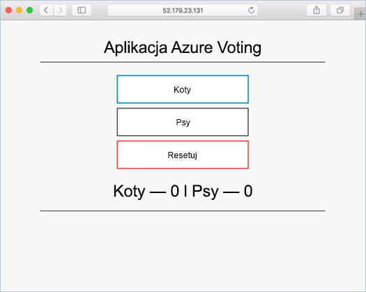

# <a name="deploy-an-azure-container-service-aks-cluster"></a>Wdrażanie klastra usługi kontenera platformy Azure (AKS)

W tym Szybki Start AKS klastra jest wdrażany przy użyciu wiersza polecenia platformy Azure. Następnie uruchomieniu aplikacji kontenera wielu składające się z frontonu sieci web oraz wystąpienia pamięci podręcznej Redis w klastrze. Po ukończeniu aplikacja będzie dostępna w Internecie.



Tego przewodnika Szybki Start założono podstawową wiedzę na temat pojęć Kubernetes, aby uzyskać szczegółowe informacje o Zobacz Kubernetes [dokumentacji Kubernetes]( https://kubernetes.io/docs/home/).

[!INCLUDE [cloud-shell-try-it.md](../../includes/cloud-shell-try-it.md)]

Jeśli do zainstalowania i używania interfejsu wiersza polecenia lokalnie tego przewodnika Szybki Start, wymaga używasz interfejsu wiersza polecenia Azure w wersji 2.0.20 lub nowszej. Uruchom polecenie `az --version`, aby dowiedzieć się, jaka wersja jest używana. Jeśli konieczna będzie instalacja lub uaktualnienie, zobacz [Instalowanie interfejsu wiersza polecenia platformy Azure]( /cli/azure/install-azure-cli).

## <a name="enabling-aks-preview-for-your-azure-subscription"></a>Włączenie subskrypcji platformy Azure w wersji zapoznawczej AKS
Gdy AKS jest w wersji zapoznawczej, tworzenia nowych klastrów wymaga flagi funkcji w ramach subskrypcji. Aby zażądać tej funkcji dla dowolnej liczby subskrypcje, które chcesz użyć. Użyj `az provider register` polecenie, aby zarejestrować dostawcę AKS:

```azurecli-interactive
az provider register -n Microsoft.ContainerService
```

Po zarejestrowaniu możesz teraz przystąpić do tworzenia klastra Kubernetes z AKS.

## <a name="create-a-resource-group"></a>Tworzenie grupy zasobów

Utwórz grupę zasobów za pomocą polecenia [az group create](/cli/azure/group#create). Grupa zasobów platformy Azure to logiczna grupa przeznaczona do wdrażania zasobów platformy Azure i zarządzania nimi.

Poniższy przykład tworzy grupę zasobów o nazwie *myResourceGroup* w *westus2* lokalizacji.

```azurecli-interactive
az group create --name myResourceGroup --location westus2
```

Dane wyjściowe:

```json
{
  "id": "/subscriptions/00000000-0000-0000-0000-000000000000/resourceGroups/myResourceGroup",
  "location": "westus2",
  "managedBy": null,
  "name": "myResourceGroup",
  "properties": {
    "provisioningState": "Succeeded"
  },
  "tags": null
}
```

## <a name="create-aks-cluster"></a>Tworzenie klastra AKS

W poniższym przykładzie tworzony klaster o nazwie *myK8sCluster* z jednym węzłem.

```azurecli-interactive
az aks create --resource-group myResourceGroup --name myK8sCluster --agent-count 1 --generate-ssh-keys
```

Po kilku minutach polecenie zostanie zakończone i zwróci informacje o klastrze sformatowanym przy użyciu formatu JSON.

## <a name="connect-to-the-cluster"></a>Łączenie z klastrem

Aby zarządzać klastrem Kubernetes, należy użyć klienta wiersza polecenia usługi Kubernetes, narzędzia [kubectl](https://kubernetes.io/docs/user-guide/kubectl/).

Jeśli używasz powłoki chmury Azure kubectl jest już zainstalowana. Jeśli użytkownik chce go zainstalować lokalnie, uruchom następujące polecenie.


```azurecli
az aks install-cli
```

Aby skonfigurować kubectl do nawiązania połączenia z klastrem Kubernetes, uruchom następujące polecenie. Ten krok umożliwia pobranie poświadczeń i skonfigurowanie interfejsu wiersza polecenia Kubernetes do ich użycia.

```azurecli-interactive
az aks get-credentials --resource-group=myResourceGroup --name=myK8sCluster
```

Aby sprawdzić połączenie z klastrem, użyj polecenia [kubectl get](https://kubernetes.io/docs/user-guide/kubectl/v1.6/#get), aby powrócić do listy węzłów klastra.

```azurecli-interactive
kubectl get nodes
```

Dane wyjściowe:

```
NAME                          STATUS    ROLES     AGE       VERSION
k8s-myk8scluster-36346190-0   Ready     agent     2m        v1.7.7
```

## <a name="run-the-application"></a>Uruchamianie aplikacji

Plik manifestu rozwiązania Kubernetes definiuje żądany stan klastra, w tym informacje o obrazach kontenera, które powinny zostać uruchomione. W tym przykładzie manifest służy do tworzenia wszystkich obiektów potrzebnych do uruchomienia aplikacji Azure Vote.

Utwórz plik o nazwie `azure-vote.yml` i skopiuj go do poniższego kodu YAML. Jeśli pracujesz w usłudze Azure Cloud Shell, ten plik można utworzyć przy użyciu serwera vi lub Nano tak jak podczas pracy w systemie wirtualnym lub fizycznym.

```yaml
apiVersion: apps/v1beta1
kind: Deployment
metadata:
  name: azure-vote-back
spec:
  replicas: 1
  template:
    metadata:
      labels:
        app: azure-vote-back
    spec:
      containers:
      - name: azure-vote-back
        image: redis
        ports:
        - containerPort: 6379
          name: redis
---
apiVersion: v1
kind: Service
metadata:
  name: azure-vote-back
spec:
  ports:
  - port: 6379
  selector:
    app: azure-vote-back
---
apiVersion: apps/v1beta1
kind: Deployment
metadata:
  name: azure-vote-front
spec:
  replicas: 1
  template:
    metadata:
      labels:
        app: azure-vote-front
    spec:
      containers:
      - name: azure-vote-front
        image: microsoft/azure-vote-front:redis-v1
        ports:
        - containerPort: 80
        env:
        - name: REDIS
          value: "azure-vote-back"
---
apiVersion: v1
kind: Service
metadata:
  name: azure-vote-front
spec:
  type: LoadBalancer
  ports:
  - port: 80
  selector:
    app: azure-vote-front
```

Użyj polecenia [kubectl create](https://kubernetes.io/docs/user-guide/kubectl/v1.6/#create), aby uruchomić aplikację.

```azurecli-interactive
kubectl create -f azure-vote.yml
```

Dane wyjściowe:

```
deployment "azure-vote-back" created
service "azure-vote-back" created
deployment "azure-vote-front" created
service "azure-vote-front" created
```

## <a name="test-the-application"></a>Testowanie aplikacji

Podczas uruchamiania aplikacji tworzona jest [usługa Kubernetes](https://kubernetes.io/docs/concepts/services-networking/service/), która uwidacznia fronton aplikacji w Internecie. Ten proces może potrwać kilka minut.

Aby monitorować postęp, użyj polecenia [kubectl get-service](https://kubernetes.io/docs/user-guide/kubectl/v1.6/#get) z argumentem `--watch`.

```azurecli-interactive
kubectl get service azure-vote-front --watch
```

Początkowo adres *EXTERNAL-IP* dla usługi *azure-vote-front* pojawia się jako *oczekujący*.

```
NAME               TYPE           CLUSTER-IP   EXTERNAL-IP   PORT(S)        AGE
azure-vote-front   LoadBalancer   10.0.37.27   <pending>     80:30572/TCP   6s
```

Raz *IP zewnętrznego* adres zmienił się z *oczekujące* do *adres IP*, użyj `CTRL-C` można zatrzymać procesu czujki kubectl.

```
azure-vote-front   LoadBalancer   10.0.37.27   52.175.236.185   80:30572/TCP   2m
```

Teraz możesz przejść do zewnętrznego adresu IP, aby wyświetlić aplikację Azure Vote.


## <a name="delete-cluster"></a>Usuwanie klastra
Gdy klaster nie będzie już potrzebny, możesz usunąć grupę zasobów, usługę kontenera i wszystkie pokrewne zasoby za pomocą polecenia [az group delete](/cli/azure/group#delete).

```azurecli-interactive
az group delete --name myResourceGroup --yes --no-wait
```

## <a name="get-the-code"></a>Uzyskiwanie kodu

W tym przewodniku Szybki start wcześniej utworzone obrazy kontenera zostały użyte w celu utworzenia wdrożenia rozwiązania Kubernetes. Powiązany kod aplikacji, plik Dockerfile i plik manifestu rozwiązania Kubernetes są dostępne w serwisie GitHub.

[https://github.com/Azure-Samples/azure-voting-app-redis](https://github.com/Azure-Samples/azure-voting-app-redis.git)

## <a name="next-steps"></a>Następne kroki

W tym przewodniku Szybki start wdrożono klaster Kubernetes oraz wdrożono w nim aplikację obsługującą wiele kontenerów.

Aby dowiedzieć się więcej o AKS i przeprowadzenie kompletny kod, na przykład wdrożenia, nadal Kubernetes samouczek klastra.

> [!div class="nextstepaction"]
> [Zarządzanie klastrem AKS](./tutorial-kubernetes-prepare-app.md)
