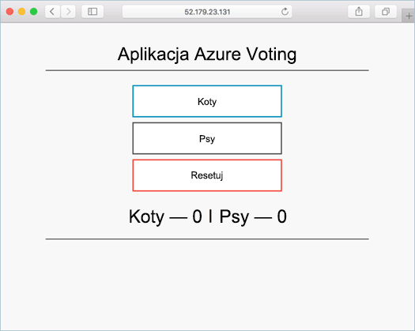

# <a name="prepare-application-for-azure-container-service-aks"></a>Przygotowanie aplikacji dla usługi kontenera platformy Azure (AKS)

W tym samouczku części ośmiu aplikacji kontenera wielu jest gotowy do użycia w Kubernetes. Ukończono kroki obejmują:  

> [!div class="checklist"]
> * Klonowanie źródła aplikacji z usługi GitHub  
> * Tworzenie obrazu kontenera ze źródła aplikacji
> * Testowanie aplikacji w środowisku lokalnym Docker

Po wykonaniu następującej aplikacji jest dostępny w środowisku projektowania lokalnego.



W kolejnych samouczkach obrazu kontenera jest przekazywane do rejestru kontenera platformy Azure, a następnie uruchom AKS klastra.

## <a name="before-you-begin"></a>Przed rozpoczęciem

Ten samouczek zakłada, że masz podstawową wiedzę na temat bazowych koncepcji usługi Docker, takich jak kontenery, obrazy kontenerów i podstawowe polecenia usługi Docker. Jeśli to konieczne, zobacz [Rozpoczynanie pracy z rozwiązaniem Docker] [ docker-get-started] dla Elementarz na podstawy kontenera. 

Do ukończenia tego samouczka konieczne będzie środowisko programowania Docker. Docker zawiera pakiety, które łatwo skonfigurować Docker na dowolnym [Mac][docker-for-mac], [Windows][docker-for-windows], lub [Linux] [ docker-for-linux] systemu.

Azure powłoki chmury nie zawiera składniki Docker wymagane do ukończenia każdego kroku w tym samouczku. Dlatego zaleca się używanie pełnego środowiska projektowania Docker.

## <a name="get-application-code"></a>Pobieranie kodu aplikacji

Przykładowa aplikacja używana w tym samouczku jest podstawowa aplikacja głosu. Aplikacja składa się z składników frontonu sieci web oraz wystąpienia pamięci podręcznej Redis zaplecza. Części sieci web jest dostarczana w obraz niestandardowy kontenera. Wystąpienie pamięci podręcznej Redis używa niezmodyfikowanego obrazu z Centrum Docker.  

Użyj git, aby pobrać kopię aplikacji w środowisku deweloperskim.

```console
git clone https://github.com/Azure-Samples/azure-voting-app-redis.git
```

Zmień katalogi, dzięki czemu użytkownik pracuje z katalogu sklonowany.

```console
cd azure-voting-app-redis
```

W tym katalogu jest kodu źródłowego aplikacji, wstępnie utworzone rozwiązania Docker compose plików i Kubernetes pliku manifestu. Te pliki są używane w całym zestawie samouczka. 

## <a name="create-container-images"></a>Tworzenie kontenera obrazów

[Rozwiązania docker Compose] [ docker-compose] może służyć do automatyzowania kompilacji poza kontener obrazów i wdrożenia usługi kontenera aplikacji.

Uruchom `docker-compose.yaml` plik, aby utworzyć obraz kontenera, pobranie obrazu do pamięci podręcznej Redis i uruchomić aplikację.

```console
docker-compose up -d
```

Po zakończeniu użyj [obrazy usługi docker] [ docker-images] polecenie, aby wyświetlić utworzony obrazów.

```console
docker images
```

Zwróć uwagę, że zostały pobrane lub utworzone trzy obrazy. `azure-vote-front` Obraz zawiera aplikację i używa `nginx-flask` obrazu jako podstawy. `redis` Obrazu są używane do uruchamiania wystąpienia pamięci podręcznej Redis.

```
REPOSITORY                   TAG        IMAGE ID            CREATED             SIZE
azure-vote-front             latest     9cc914e25834        40 seconds ago      694MB
redis                        latest     a1b99da73d05        7 days ago          106MB
tiangolo/uwsgi-nginx-flask   flask      788ca94b2313        9 months ago        694MB
```

Uruchom [docker ps] [ docker-ps] polecenie, aby wyświetlić uruchomionych kontenerów.

```console
docker ps
```

Dane wyjściowe:

```
CONTAINER ID        IMAGE             COMMAND                  CREATED             STATUS              PORTS                           NAMES
82411933e8f9        azure-vote-front  "/usr/bin/supervisord"   57 seconds ago      Up 30 seconds       443/tcp, 0.0.0.0:8080->80/tcp   azure-vote-front
b68fed4b66b6        redis             "docker-entrypoint..."   57 seconds ago      Up 30 seconds       0.0.0.0:6379->6379/tcp          azure-vote-back
```

## <a name="test-application-locally"></a>Testowanie aplikacji lokalnie

Przejdź do adresem http://localhost: 8080, aby zobaczyć działającej aplikacji.


## <a name="clean-up-resources"></a>Oczyszczanie zasobów

Teraz, funkcjonalność aplikacji została zweryfikowana, uruchomionych kontenerów można zatrzymać i usunięte. Nie należy usuwać obrazy kontenera. `azure-vote-front` Obraz jest przekazywany do wystąpienia rejestru kontenera platformy Azure w następnym samouczku.

Uruchom następujące polecenie, aby zatrzymać uruchomionych kontenerów.

```console
docker-compose stop
```

Usuń zatrzymane kontenery i zasobów przy użyciu następującego polecenia.

```console
docker-compose down
```

Po ukończeniu masz obraz kontenera, który zawiera aplikację Azure głos.

## <a name="next-steps"></a>Kolejne kroki

W tym samouczku przetestowano aplikacji i kontener obrazów utworzonych dla aplikacji. Wykonano następujące czynności:

> [!div class="checklist"]
> * Klonowanie źródła aplikacji z usługi GitHub  
> * Utworzony obraz kontenera ze źródła aplikacji
> * Przetestowany aplikacji w lokalnym środowisku Docker

Przejdź do kolejnego samouczka, aby dowiedzieć się więcej o przechowywaniu obrazów kontenera w usłudze Azure Container Registry.

> [!div class="nextstepaction"]
> [Wypychanie obrazów do rejestru kontenera platformy Azure][aks-tutorial-prepare-acr]

<!-- LINKS - external -->
[docker-compose]: https://docs.docker.com/compose/
[docker-for-linux]: https://docs.docker.com/engine/installation/#supported-platforms
[docker-for-mac]: https://docs.docker.com/docker-for-mac/
[docker-for-windows]: https://docs.docker.com/docker-for-windows/
[docker-get-started]: https://docs.docker.com/get-started/
[docker-images]: https://docs.docker.com/engine/reference/commandline/images/
[docker-ps]: https://docs.docker.com/engine/reference/commandline/ps/

<!-- LINKS - internal -->
[aks-tutorial-prepare-acr]: ./tutorial-kubernetes-prepare-acr.md