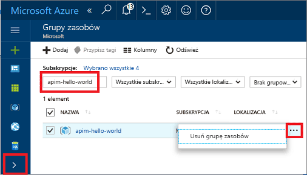

# Tworzenie nowego wystąpienia usługi Azure API Management

Usługa Azure API Management (APIM) pomaga organizacjom publikować interfejsy API dla deweloperów zewnętrznych, partnerskich i wewnętrznych, aby w pełni wykorzystać potencjał danych i usług. Usługa API Management zapewnia podstawowe możliwości, które pozwalają na pomyślne programowanie interfejsów API przez zaangażowanych deweloperów, a także udostępnia wgląd w kwestie biznesowe, analizy, zabezpieczenia i ochronę. Usługa APIM pozwala tworzyć nowoczesne bramy interfejsów API dla istniejących usług zaplecza hostowanych w dowolnym miejscu oraz zarządzać tymi bramami. Aby uzyskać więcej informacji, zobacz temat [Omówienie](api-management-key-concepts.md).

W tym przewodniku Szybki start opisano procedurę tworzenia nowego wystąpienia usługi API Management za pomocą witryny Azure Portal.

[!INCLUDE [quickstarts-free-trial-note](../../includes/quickstarts-free-trial-note.md)]

## Zaloguj się do platformy Azure.

Zaloguj się w witrynie Azure Portal pod adresem http://portal.azure.com.

## Tworzenie nowej usługi

1. W witrynie [Azure Portal](https://portal.azure.com/) wybierz pozycję **Nowy** > **Integracja w przedsiębiorstwie** > **API Management**.

    Możesz też wybrać pozycję **Nowy**, wpisać `API management` w polu wyszukiwania i nacisnąć klawisz Enter. Kliknij przycisk **Utwórz**.

2. Wprowadź ustawienia w oknie **Usługa API Management**.

    

    | Ustawienie      | Sugerowana wartość  | Opis              |
    | ------------ |  ------- | ---------------------------------|
    |**Nazwa**|Unikatowa nazwa dla usługi API Management| Nazwy nie można później zmienić. Nazwa usługi jest używana do generowania domyślnej nazwy domeny w postaci *{nazwa}.azure-api.net.* Jeśli chcesz użyć niestandardowej nazwy domeny, zobacz [Konfigurowanie domeny niestandardowej](configure-custom-domain.md).   Nazwa usługi jest używana do odwoływania się do usługi i odpowiedniego zasobu platformy Azure.|
    |**Subskrypcja**|Twoja subskrypcja | Subskrypcja, w ramach której zostanie utworzone to nowe wystąpienie usługi. Możesz wybrać jedną z różnych subskrypcji Azure, do których masz dostęp.|
    |**Grupa zasobów**|*apimResourceGroup*|Możesz wybrać nowy lub istniejący zasób. Grupa zasobów jest kolekcją zasobów, które mają ten sam cykl życia, uprawnienia i zasady. Więcej informacji można znaleźć [tutaj](../azure-resource-manager/resource-group-overview.md#resource-groups).|
    |**Lokalizacja**|*Zachodnie stany USA*|Wybierz region geograficzny w pobliżu. Na liście rozwijanej są wyświetlane tylko regiony dostępne w usłudze API Management. |
    |**Nazwa organizacji**|Nazwa organizacji|Ta nazwa jest używana w wielu miejscach, w tym w tytule portalu dla deweloperów i nadawcy wiadomości e-mail z powiadomieniem.|
    |**Adres e-mail administratora**|*admin@org.com*|Ustaw adres e-mail, na który będą wysyłane wszystkie powiadomienia z usługi **API Management**.|
    |**Warstwa cenowa**|*Developer*|Skonfiguruj warstwę **Developer**, aby ocenić usługę. Ta warstwa nie jest do użytku produkcyjnego. Aby uzyskać więcej informacji na temat skalowania warstw usługi API Management, zobacz [Upgrade and scale](upgrade-and-scale.md) (Uaktualnianie i skalowanie).|
3. Wybierz pozycję **Utwórz**.

    > [!TIP]
    > Zazwyczaj utworzenie usługi API Management trwa 20–30 minut. Wybranie pozycji **Przypnij do pulpitu nawigacyjnego** ułatwia znajdowanie nowo utworzonej usługi.

[!INCLUDE [api-management-navigate-to-instance.md](../../includes/api-management-navigate-to-instance.md)]

## Oczyszczanie zasobów

Gdy grupa zasobów i wszystkie pokrewne zasoby nie będą już potrzebne, można je usunąć, wykonując następujące kroki:

1. W witrynie Azure Portal wybierz .
2. Wybierz pozycję **Grupy zasobów**.
3. Znajdź swoją grupę zasobów.
4. Kliknij pozycję „. . .” i usuń grupę.

## Następne kroki

> [!div class="nextstepaction"]
> [Importowanie i publikowanie pierwszego interfejsu API](import-and-publish.md)
