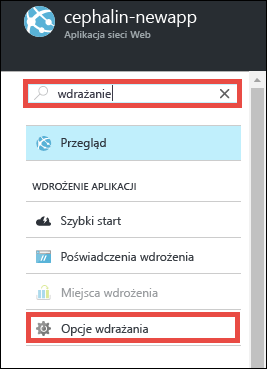
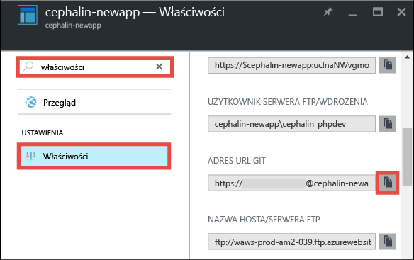
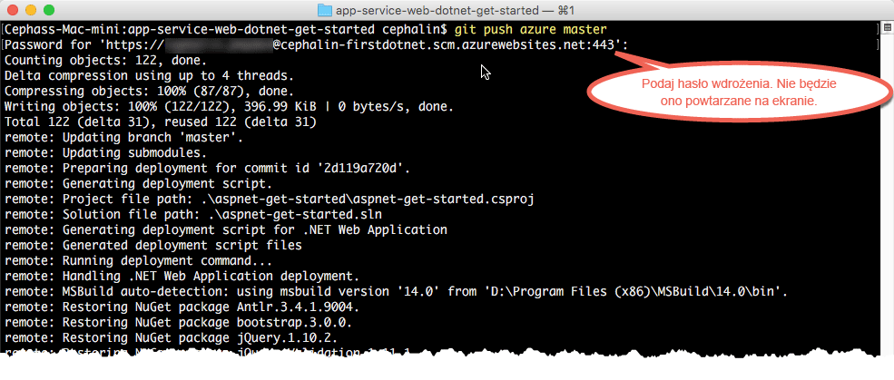

# Wdrażanie pierwszej aplikacji sieci Web platformy .NET na platformie Azure w ciągu pięciu minut
Ten samouczek ułatwia wdrażanie prostej aplikacji sieci Web platformy .NET w [usłudze Azure App Service](../app-service/app-service-value-prop-what-is.md).
Za pomocą usługi App Service można tworzyć aplikacje sieci Web, [zaplecza aplikacji mobilnych](/documentation/learning-paths/appservice-mobileapps/) oraz [aplikacje interfejsu API](../app-service-api/app-service-api-apps-why-best-platform.md).

Wykonasz następujące zadania: 

* utworzysz aplikację sieci Web w usłudze Azure App Service;
* wdrożysz przykładowy kod ASP.NET;
* sprawdzisz działanie kodu w środowisku produkcyjnym;
* zaktualizujesz aplikację sieci Web w taki sam sposób, w jaki [wypycha się zatwierdzenia Git](https://git-scm.com/docs/git-push).

## Wymagania wstępne
* [Zainstaluj oprogramowanie Git](http://www.git-scm.com/downloads). Sprawdź, czy instalacja powiodła się, uruchamiając polecenie `git --version` z nowego wiersza polecenia systemu Windows, okna programu PowerShell, powłoki systemu Linux lub terminalu systemu OS X.
* Utwórz konto platformy Microsoft Azure. Jeśli nie masz konta, możesz [utworzyć konto bezpłatnej wersji próbnej](/pricing/free-trial/?WT.mc_id=A261C142F) lub [aktywować korzyści dla subskrybentów programu Visual Studio](/pricing/member-offers/msdn-benefits-details/?WT.mc_id=A261C142F).

> [!NOTE]
> Usługę [App Service](http://go.microsoft.com/fwlink/?LinkId=523751) możesz wypróbować, nie mając konta platformy Azure. Utwórz aplikację startową i testuj ją nawet przez godzinę — bez kart kredytowych i bez zobowiązań.
> 
> 

## Tworzenie aplikacji sieci Web
1. Zaloguj się do [witryny Azure Portal](https://portal.azure.com) przy użyciu danych konta Azure.
2. W lewym menu kliknij kolejno pozycje **Nowy** > **Sieci Web i mobilność** > **Aplikacja sieci Web**.
   
    
3. W bloku tworzenia aplikacji użyj następujących ustawień dotyczących nowej aplikacji:
   
   * **Nazwa aplikacji**: wpisz unikatową nazwę.
   * **Grupa zasobów**: wybierz pozycję **Utwórz nową** i nadaj nazwę grupie zasobów.
   * **Plan/lokalizacja usługi App Service**: kliknij tę pozycję, aby skonfigurować, a następnie kliknij pozycję **Utwórz nowe**, aby ustawić nową nazwę, lokalizację i warstwę cenową planu usługi App Service. Możesz skorzystać z warstwy cenowej **Bezpłatna**.
     
     Po wprowadzeniu ustawień blok tworzenia aplikacji powinien wyglądać następująco:
     
     
4. Kliknij pozycję **Utwórz** na dole. Po kliknięciu ikony **Powiadomienie** u góry można zobaczyć postęp.
   
    
5. Po zakończeniu wdrożenia powinien pojawić się taki komunikat powiadomienia. Kliknij ten komunikat, aby otworzyć blok wdrożenia.
   
    
6. W bloku **Wdrożenie powiodło się** kliknij link **Zasób**, aby otworzyć blok nowej aplikacji sieci Web.
   
    

## Wdrażanie kodu w aplikacji sieci Web
Teraz zajmijmy się wdrożeniem kodu na platformie Azure przy użyciu narzędzia Git.

1. W bloku aplikacji sieci Web przewiń w dół do obszaru **Opcje wdrażania** lub wyszukaj, a następnie kliknij tę pozycję. 
   
    
2. Kliknij kolejno pozycje **Wybierz źródło** > **Lokalne repozytorium Git** > **OK**.
3. Wróć do bloku aplikacji sieci Web i kliknij pozycję **Poświadczenia wdrożenia**.
4. Ustaw poświadczenia wdrożenia i kliknij przycisk **Zapisz**.
5. Wróć do bloku aplikacji sieci Web, przewiń w dół do pozycji **Właściwości** lub wyszukaj, a następnie kliknij tę pozycję. Kliknij przycisk **Kopiuj** obok pozycji **Adres URL Git**.
   
    
   
    Teraz można przystąpić do wdrażania kodu przy użyciu narzędzia Git.
6. W terminalu wiersza polecenia przejdź do katalogu roboczego (`CD`) i sklonuj przykładową aplikację w następujący sposób:
   
        git clone https://github.com/Azure-Samples/app-service-web-dotnet-get-started.git
   
    
7. Przejdź do repozytorium przykładowej aplikacji. Na przykład: 
   
        cd app-service-web-dotnet-get-started
8. skonfiguruj zdalny adres usługi dla aplikacji Azure, czyli adres URL Git, który skopiowano z witryny Azure Portal kilka kroków temu.
   
        git remote add azure <giturlfromportal>
9. Wdróż przykładowy kod do nowej aplikacji Azure, tak jak wypycha się dowolny kod przy użyciu narzędzia Git:
   
        git push azure master
   
        
   
    `git push` Odpowiednie polecenie nie tylko umieszcza kod na platformie Azure, ale również przywraca wymagane pakiety i tworzy pliki binarne ASP.NET. 

Gotowe. Od teraz kod działa w środowisku Azure. Aby sprawdzić jego działanie, w przeglądarce przejdź do adresu http://*&lt;nazwa_aplikacji>*.azurewebsites.net. 

## Aktualizowanie aplikacji
Teraz możesz wypychać zmiany z katalogu głównego projektu (repozytorium) przy użyciu narzędzia Git, aby w dowolnej chwili aktualizować działającą witrynę. Procedura jest taka sama, jak podczas wdrażania kodu po raz pierwszy. Na przykład za każdym razem, gdy chcesz wypchnąć nową zmianę przetestowaną lokalnie, uruchom następujące polecenia w katalogu głównym (repozytorium) projektu:

    git add .
    git commit -m "<your_message>"
    git push azure master

## Następne kroki
Aby dowiedzieć się, jak tworzyć, rozwijać i wdrażać aplikacje sieci Web .NET na platformie Azure bezpośrednio w programie Visual Studio, zobacz [Wdrażanie aplikacji sieci Web ASP.NET w usłudze Azure App Service przy użyciu programu Visual Studio](web-sites-dotnet-get-started.md).

Możesz także wykonać inne zadania związane ze swoją pierwszą aplikacją sieci Web . Na przykład:

* Wypróbuj [inne sposoby wdrożenia kodu na platformie Azure](web-sites-deploy.md). Na przykład w celu wdrożenia jednego z naszych repozytoriów GitHub wystarczy wybrać pozycję **GitHub** zamiast **Lokalne repozytorium Git** w obszarze **Opcje wdrażania**.
* Przenieś swoją aplikację Azure na wyższy poziom. Uwierzytelniaj użytkowników. Skaluj ją zależnie od potrzeb. Skonfiguruj alerty dotyczące wydajności. Wszystkie te czynności możesz wykonać za pomocą kilku kliknięć. Zobacz [Dodawanie funkcji do pierwszej aplikacji sieci Web](app-service-web-get-started-2.md).

<!--HONumber=Sep16_HO3-->

