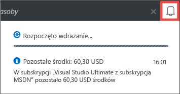
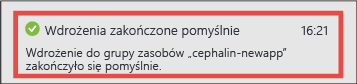
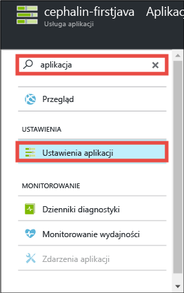
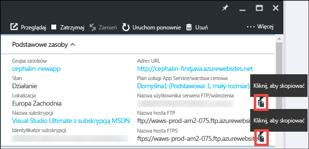
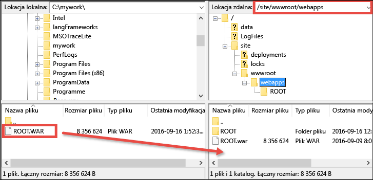

<properties
    pageTitle="Wdrożenie pierwszej aplikacji sieci Web Java na platformie Azure w ciągu pięciu minut | Microsoft Azure"
    description="Dowiedz się, jak łatwo można uruchamiać aplikacje sieci Web w usłudze App Service, wdrażając przykładową aplikację. Szybko rozpocznij rzeczywiste tworzenie aplikacji i od razu zobacz wyniki."
    services="app-service\web"
    documentationCenter=""
    authors="cephalin"
    manager="wpickett"
    editor=""
/>

<tags
    ms.service="app-service-web"
    ms.workload="web"
    ms.tgt_pltfrm="na"
    ms.devlang="na"
    ms.topic="hero-article"
    ms.date="09/16/2016"
    ms.author="cephalin"
/>

# Wdrażanie pierwszej aplikacji sieci Web Java na platformie Azure w ciągu pięciu minut

Ten samouczek ułatwia wdrażanie prostej aplikacji sieci Web Java w [usłudze Azure App Service](../app-service/app-service-value-prop-what-is.md).
Za pomocą usługi App Service można tworzyć aplikacje sieci Web, [zaplecza aplikacji mobilnych](/documentation/learning-paths/appservice-mobileapps/) oraz [aplikacje interfejsu API](../app-service-api/app-service-api-apps-why-best-platform.md).

Wykonasz następujące zadania:

- utworzysz aplikację sieci Web w usłudze Azure App Service,
- wdrożysz przykładową aplikację Java,
- sprawdzisz działanie kodu w środowisku produkcyjnym.

## Wymagania wstępne

- Pobierz klienta FTP/FTPS, np. program [FileZilla](https://filezilla-project.org/).
- Utwórz konto platformy Microsoft Azure. Jeśli nie masz konta, możesz [utworzyć konto bezpłatnej wersji próbnej](/pricing/free-trial/?WT.mc_id=A261C142F) lub [aktywować korzyści dla subskrybentów programu Visual Studio](/pricing/member-offers/msdn-benefits-details/?WT.mc_id=A261C142F).

>[AZURE.NOTE] Usługę [App Service](http://go.microsoft.com/fwlink/?LinkId=523751) możesz wypróbować, nie mając konta platformy Azure. Utwórz aplikację startową i testuj ją nawet przez godzinę — bez kart kredytowych i bez zobowiązań.

## Tworzenie aplikacji sieci Web

1. Zaloguj się do [witryny Azure Portal](https://portal.azure.com) przy użyciu danych konta platformy Azure.

2. W lewym menu kliknij kolejno pozycje **Nowy** > **Sieci Web i mobilność** > **Aplikacja sieci Web**.

    

3. W bloku tworzenia aplikacji użyj następujących ustawień dotyczących nowej aplikacji:

    - **Nazwa aplikacji**: wpisz unikatową nazwę.
    - **Grupa zasobów**: wybierz pozycję **Utwórz nową** i nadaj nazwę grupie zasobów.
    - **Plan/lokalizacja usługi App Service**: kliknij tę pozycję, aby skonfigurować, a następnie kliknij pozycję **Utwórz nowe**, aby ustawić nową nazwę, lokalizację i warstwę cenową planu usługi App Service. Możesz skorzystać z warstwy cenowej **Bezpłatna**.

    Po wprowadzeniu ustawień blok tworzenia aplikacji powinien wyglądać następująco:

    

3. Kliknij pozycję **Utwórz** na dole. Po kliknięciu ikony **Powiadomienie** u góry można zobaczyć postęp.

    

4. Po zakończeniu wdrożenia powinien pojawić się taki komunikat powiadomienia. Kliknij ten komunikat, aby otworzyć blok wdrożenia.

    

5. W bloku **Wdrożenie powiodło się** kliknij link **Zasób**, aby otworzyć blok nowej aplikacji sieci Web.

    

## Wdrażanie aplikacji Java w aplikacji sieci Web

Wdrożymy teraz aplikację Java na platformie Azure przy użyciu protokołu FTPS.

5. W bloku aplikacji sieci Web przewiń w dół do pozycji **Ustawienia aplikacji** lub ją wyszukaj, a następnie kliknij tę pozycję.

    

6. W obszarze **Wersja języka Java** wybierz pozycję **Java 8** i kliknij przycisk **Zapisz**.

    

    Po wyświetleniu powiadomienia **Pomyślnie zaktualizowano ustawienia aplikacji sieci Web** przejdź do strony http://*&lt;nazwa_aplikacji>*.azurewebsites.net, aby zobaczyć domyślny serwlet JSP w działaniu.

7. Wróć do bloku aplikacji sieci Web, przewiń w dół do pozycji **Poświadczenia wdrożenia** lub ją wyszukaj, a następnie kliknij tę pozycję.

8. Ustaw poświadczenia wdrożenia i kliknij przycisk **Zapisz**.

7. Wróć do bloku aplikacji sieci Web i kliknij pozycję **Przegląd**. Obok pozycji **Nazwa użytkownika serwera FTP/wdrożenia** i **Nazwa hosta FTPS** kliknij przycisk **Kopiuj**, aby skopiować te wartości.

    

    Teraz można przystąpić do wdrażania aplikacji Java przy użyciu protokołu FTPS.

8. W kliencie FTP/FTPS zaloguj się do serwera FTP swojej aplikacji sieci Web na platformie Azure, używając wartości skopiowanych w ostatnim kroku. Użyj utworzonego wcześniej hasła wdrożenia.

    Poniższy zrzut ekranu przedstawia logowanie się przy użyciu programu FileZilla.

    

    W przypadku nierozpoznanego certyfikatu SSL od platformy Azure mogą zostać wyświetlone ostrzeżenia o zabezpieczeniach. Kontynuuj.

9. Kliknij [ten link](https://github.com/Azure-Samples/app-service-web-java-get-started/raw/master/webapps/ROOT.war), aby pobrać plik WAR na komputer lokalny.

9. W kliencie FTP/FTPS przejdź do katalogu **/site/wwwroot/webapps** w witrynie zdalnej i przeciągnij pobrany plik WAR do tego katalogu zdalnego na komputerze lokalnym.

    

    Kliknij przycisk **OK**, aby zastąpić ten plik na platformie Azure.

    >[AZURE.NOTE] Zgodnie z domyślnym zachowaniem kontenera Tomcat nazwa pliku **ROOT.war** w katalogu /site/wwwroot/webapps daje w rezultacie aplikację sieci Web w katalogu głównym (http://*&lt;nazwa_aplikacji>*.azurewebsites.net), a nazwa pliku **&lt;dowolna_nazwa>*.war** daje w wyniku nazwaną aplikację sieci Web (http://*&lt;nazwa_aplikacji>*.azurewebsites.net/*&lt;dowolna_nazwa>*).

Gotowe. Od teraz aplikacja sieci Web działa na platformie Azure. Aby sprawdzić jej działanie, w przeglądarce przejdź do adresu http://*&lt;nazwa_aplikacji>*.azurewebsites.net.

## Aktualizowanie aplikacji

Zawsze, gdy trzeba dokonać aktualizacji, wystarczy przekazać nowy plik WAR do tego samego katalogu zdalnego za pomocą klienta FTP/FTPS.

## Następne kroki

[Tworzenie aplikacji sieci Web Java na podstawie szablonu w portalu Azure Marketplace](app-service-web-java-get-started.md#marketplace). Możesz pobrać kontener Tomcat z pełnymi możliwościami dostosowywania i uzyskać znajomy interfejs użytkownika menedżera.

Przeprowadź debugowanie swojej aplikacji sieci Web na platformie Azure bezpośrednio w środowisku [IntelliJ](app-service-web-debug-java-web-app-in-intellij.md) lub [Eclipse](app-service-web-debug-java-web-app-in-eclipse.md).

Możesz także wykonać inne zadania związane ze swoją pierwszą aplikacją sieci Web. Na przykład:

- Wypróbuj [inne sposoby wdrożenia kodu na platformie Azure](../app-service-web/web-sites-deploy.md). Na przykład w celu wdrożenia jednego z naszych repozytoriów GitHub wystarczy wybrać pozycję **GitHub** zamiast **Lokalne repozytorium Git** w obszarze **Opcje wdrażania**.
- Przenieś swoją aplikację platformy Azure na wyższy poziom. Uwierzytelniaj użytkowników. Skaluj ją zależnie od potrzeb. Skonfiguruj alerty dotyczące wydajności. Wszystkie te czynności możesz wykonać za pomocą kilku kliknięć. Zobacz [Dodawanie funkcji do pierwszej aplikacji sieci Web](app-service-web-get-started-2.md).

<!---HONumber=Sep16_HO4-->
