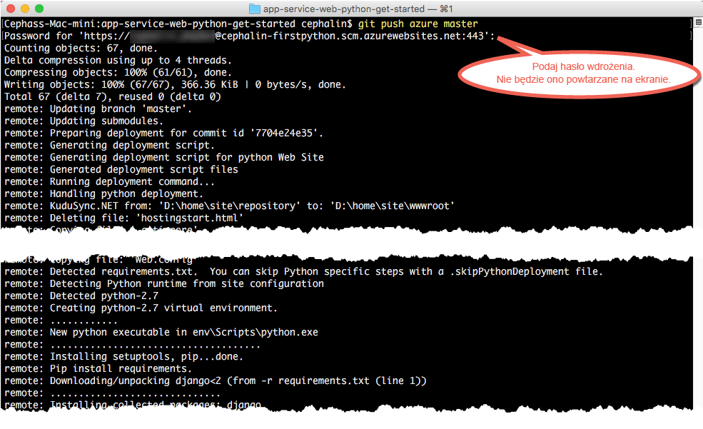

# Wdrażanie pierwszej aplikacji sieci Web Python na platformie Azure w ciągu pięciu minut

> [!div class="op_single_selector"]
> * [Pierwsza witryna HTML](app-service-web-get-started-html-cli-nodejs.md)
> * [Pierwsza aplikacja platformy .NET](app-service-web-get-started-dotnet-cli-nodejs.md)
> * [Pierwsza aplikacja PHP](app-service-web-get-started-php-cli-nodejs.md)
> * [Pierwsza aplikacja Node.js](app-service-web-get-started-nodejs-cli-nodejs.md)
> * [Pierwsza aplikacja w języku Python](app-service-web-get-started-python-cli-nodejs.md)
> * [Pierwsza aplikacja w języku Java](app-service-web-get-started-java.md)
> 
> 

Ten samouczek ułatwia wdrażanie pierwszej aplikacji sieci Web Python w [usłudze Azure App Service](../app-service/app-service-value-prop-what-is.md).
Za pomocą usługi App Service można tworzyć aplikacje sieci Web, [zaplecza aplikacji mobilnych](/documentation/learning-paths/appservice-mobileapps/) oraz [aplikacje interfejsu API](../app-service-api/app-service-api-apps-why-best-platform.md).

Wykonasz następujące zadania: 

* utworzysz aplikację sieci Web w usłudze Azure App Service;
* wdrożysz przykładowy kod Python;
* sprawdzisz działanie kodu w środowisku produkcyjnym;
* zaktualizujesz aplikację sieci Web w taki sam sposób, w jaki [wypycha się zatwierdzenia Git](https://git-scm.com/docs/git-push).

[!INCLUDE [app-service-linux](../../includes/app-service-linux.md)]

## Wersje interfejsu wiersza polecenia umożliwiające wykonanie zadania

Zadanie można wykonać przy użyciu jednej z następujących wersji interfejsu wiersza polecenia:

- [Interfejs wiersza polecenia platformy Azure w wersji 1.0](app-service-web-get-started-python-cli-nodejs.md) — nasz interfejs wiersza polecenia dla klasycznego modelu wdrażania i modelu wdrażania na potrzeby zarządzania zasobami
- [Interfejs wiersza polecenia platformy Azure w wersji 2.0 (wersja zapoznawcza)](app-service-web-get-started-python.md) — nasz interfejs wiersza polecenia nowej generacji dla modelu wdrażania na potrzeby zarządzania zasobami

## Wymagania wstępne
* [Git](http://www.git-scm.com/downloads).
* [Interfejs wiersza polecenia platformy Azure](../xplat-cli-install.md).
* Konto platformy Microsoft Azure. Jeśli nie masz konta, możesz [utworzyć konto bezpłatnej wersji próbnej](https://azure.microsoft.com/pricing/free-trial/?WT.mc_id=A261C142F) lub [aktywować korzyści dla subskrybentów programu Visual Studio](https://azure.microsoft.com/pricing/member-offers/msdn-benefits-details/?WT.mc_id=A261C142F).

> [!NOTE]
> Usługę [App Service](https://azure.microsoft.com/try/app-service/) możesz wypróbować, nie mając konta platformy Azure. Utwórz aplikację startową i testuj ją nawet przez godzinę — bez kart kredytowych i bez zobowiązań.
> 
> 

## Wdrażanie aplikacji sieci Web w języku Python
1. Otwórz nowy wiersz polecenia systemu Windows, okno programu PowerShell, powłokę systemu Linux lub terminal systemu OS X. Uruchom polecenia `git --version` i `azure --version`, aby upewnić się, że oprogramowanie Git i interfejs wiersza polecenia platformy Azure są zainstalowane na komputerze.
   
    
   
    Jeśli narzędzia nie zostały zainstalowane, pobierz je przy użyciu z linków w sekcji [Wymagania wstępne](#Prerequisites).
2. Zaloguj się do platformy Azure w następujący sposób:
   
        azure login
   
    Postępuj zgodnie z instrukcjami w komunikacie pomocy, aby kontynuować proces logowania.
   
    
3. Przestaw interfejs wiersza polecenia platformy Azure na tryb ASM, a następnie ustaw użytkownika wdrożenia dla usługi App Service. Kod zostanie później wdrożony przy użyciu tych poświadczeń.
   
        azure config mode asm
        azure site deployment user set --username <username> --pass <password>
4. Przejdź do katalogu roboczego (`CD`) i sklonuj przykładową aplikację w języku Python w następujący sposób:
   
        git clone https://github.com/Azure-Samples/app-service-web-python-get-started.git
5. Przejdź do repozytorium przykładowej aplikacji. Na przykład:
   
        cd app-service-web-python-get-started
6. Utwórz zasób aplikacji usługi App Service na platformie Azure, przypisując mu skonfigurowane wcześniej dane: unikatową nazwę aplikacji i użytkownika wdrożenia. Po wyświetleniu monitu podaj numer odpowiedniego regionu.
   
        azure site create <app_name> --git --gitusername <username>
   
    
   
    W ten sposób utworzyliśmy aplikację na platformie Azure. Ponadto w bieżącym katalogu została zainicjowana obsługa narzędzia Git i został on połączony z nową aplikacją usługi App Service jako zdalny katalog Git.
    Możesz przejść do adresu URL aplikacji (http://&lt;nazwa_aplikacji>.azurewebsites.net), aby wyświetlić piękną domyślną stronę HTML, ale teraz umieśćmy tam Twój kod.
7. Wdróż przykładowy kod do nowej aplikacji platformy Azure, tak jak wypycha się dowolny kod przy użyciu narzędzia Git. Po wyświetleniu monitu należy użyć hasła, które zostało wcześniej skonfigurowane.
   
        git push azure master
   
    
   
    Polecenie `git push` nie tylko umieszcza kod na platformie Azure, ale również wyzwala zadania wdrażania w aparacie wdrażania. 
    Jeśli w katalogu głównym (repozytorium) projektu masz jakiekolwiek pliki requirements.txt (Python), wymagane pakiety zostaną przywrócone przez skrypt wdrażania. 

Gratulacje! Udało Ci się wdrożyć aplikację w usłudze Azure App Service.

## Wyświetlanie działającej aplikacji
Aby wyświetlić aplikację działającą na platformie Azure, uruchom to polecenie w dowolnym katalogu repozytorium:

    azure site browse

## Aktualizowanie aplikacji
Teraz możesz wypychać zmiany z katalogu głównego projektu (repozytorium) przy użyciu narzędzia Git, aby w dowolnej chwili aktualizować działającą witrynę. Procedura jest taka sama, jak podczas wdrażania kodu po raz pierwszy. Na przykład za każdym razem, gdy chcesz wypchnąć nową zmianę przetestowaną lokalnie, uruchom następujące polecenia w katalogu głównym (repozytorium) projektu:

    git add .
    git commit -m "<your_message>"
    git push azure master

## Następne kroki
[Tworzenie, konfigurowanie i wdrażanie aplikacji sieci Web Django na platformie Azure w programie Visual Studio](web-sites-python-ptvs-django-mysql.md). Postępując zgodnie z tym samouczkiem, nabędziesz podstawowe umiejętności potrzebne do uruchamiania aplikacji sieci Web w języku Python na platformie Azure, takie jak:

* tworzenie i wdrażanie aplikacji w języku Python za pomocą szablonu,
* ustawianie wersji języka Python,
* tworzenie środowisk wirtualnych,
* nawiązywanie połączenia z bazą danych.

Możesz także wykonać inne zadania związane ze swoją pierwszą aplikacją sieci Web . Na przykład:

* Wypróbuj [inne sposoby wdrożenia kodu na platformie Azure](web-sites-deploy.md). Na przykład w celu wdrożenia jednego z naszych repozytoriów GitHub wystarczy wybrać pozycję **GitHub** zamiast **Lokalne repozytorium Git** w obszarze **Opcje wdrażania**.
* Przenieś swoją aplikację Azure na wyższy poziom. Uwierzytelniaj użytkowników. Skaluj ją zależnie od potrzeb. Skonfiguruj alerty dotyczące wydajności. Wszystkie te czynności możesz wykonać za pomocą kilku kliknięć. Zobacz [Dodawanie funkcji do pierwszej aplikacji sieci Web](app-service-web-get-started-2.md).

<!--HONumber=Feb17_HO2-->

