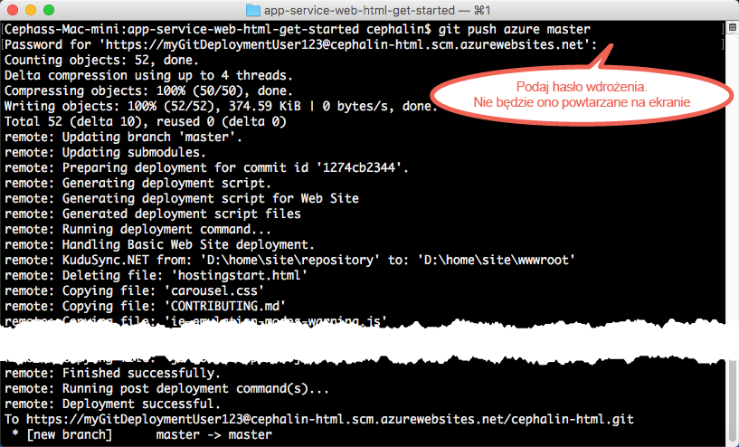

# Wdrażanie pierwszej aplikacji sieci Web na platformie Azure w ciągu pięciu minut
Ten samouczek ułatwia wdrażanie pierwszej aplikacji sieci Web w [usłudze Azure App Service](../app-service/app-service-value-prop-what-is.md).
Za pomocą usługi App Service można tworzyć aplikacje sieci Web, [zaplecza aplikacji mobilnych](/documentation/learning-paths/appservice-mobileapps/) oraz [aplikacje interfejsu API](../app-service-api/app-service-api-apps-why-best-platform.md).

Wykonasz następujące zadania: 

* utworzysz aplikację sieci Web w usłudze Azure App Service;
* wdrożysz przykładowy kod (z możliwością wyboru technologii ASP.NET, PHP, Node.js, Java lub Python);
* sprawdzisz działanie kodu w środowisku produkcyjnym;
* zaktualizujesz aplikację sieci Web w taki sam sposób, w jaki [wypycha się zatwierdzenia Git](https://git-scm.com/docs/git-push).

[!INCLUDE [app-service-linux](../../includes/app-service-linux.md)]

## Wersje interfejsu wiersza polecenia umożliwiające wykonanie zadania

Zadanie można wykonać przy użyciu jednej z następujących wersji interfejsu wiersza polecenia:

- [Interfejs wiersza polecenia platformy Azure w wersji 1.0](app-service-web-get-started-cli-nodejs.md) — nasz interfejs wiersza polecenia dla klasycznego modelu wdrażania i modelu wdrażania na potrzeby zarządzania zasobami
- [Interfejs wiersza polecenia platformy Azure w wersji 2.0 (wersja zapoznawcza)](app-service-web-get-started.md) — nasz interfejs wiersza polecenia nowej generacji dla modelu wdrażania na potrzeby zarządzania zasobami

## Wymagania wstępne
* [Git](http://www.git-scm.com/downloads).
* [Interfejs wiersza polecenia platformy Azure w wersji 2.0 (wersja zapoznawcza)](/cli/azure/install-az-cli2).
* Konto platformy Microsoft Azure. Jeśli nie masz konta, możesz [utworzyć konto bezpłatnej wersji próbnej](https://azure.microsoft.com/pricing/free-trial/?WT.mc_id=A261C142F) lub [aktywować korzyści dla subskrybentów programu Visual Studio](https://azure.microsoft.com/pricing/member-offers/msdn-benefits-details/?WT.mc_id=A261C142F).

> [!NOTE]
> Usługę [App Service](https://azure.microsoft.com/try/app-service/) możesz wypróbować, nie mając konta platformy Azure. Utwórz aplikację startową i testuj ją nawet przez godzinę — bez kart kredytowych i bez zobowiązań.
> 
> 

## Wdrażanie aplikacji sieci Web
Teraz wdrożymy aplikację sieci Web w usłudze Azure App Service.

1. Otwórz nowy wiersz polecenia systemu Windows, okno programu PowerShell, powłokę systemu Linux lub terminal systemu OS X. Uruchom polecenia `git --version` i `azure --version`, aby upewnić się, że oprogramowanie Git i interfejs wiersza polecenia platformy Azure są zainstalowane na komputerze.
   
    
   
    Jeśli narzędzia nie zostały zainstalowane, pobierz je przy użyciu z linków w sekcji [Wymagania wstępne](#Prerequisites).

2. Zaloguj się do platformy Azure w następujący sposób:
   
        az login
   
    Postępuj zgodnie z instrukcjami w komunikacie pomocy, aby kontynuować proces logowania.
   
    

3. Ustaw użytkownika wdrożenia dla usługi App Service. Kod zostanie później wdrożony przy użyciu tych poświadczeń.
   
        az appservice web deployment user set --user-name <username> --password <password>

3. Utwórz nową [grupę zasobów](../azure-resource-manager/resource-group-overview.md). Aby skorzystać z pierwszego samouczka dotyczącego usługi App Service, nie musisz wiedzieć, co to jest.

        az group create --location "<location>" --name my-first-app-group

    Aby sprawdzić, jakich wartości można użyć dla lokalizacji `<location>`, użyj polecenia interfejsu wiersza polecenia `az appservice list-locations`.

3. Utwórz nowy, BEZPŁATNY [plan usługi App Service](../app-service/azure-web-sites-web-hosting-plans-in-depth-overview.md). W przypadku pierwszego samouczka usługi App Service nie będzie naliczana opłata za aplikacje sieci Web w ramach tego planu.

        az appservice plan create --name my-free-appservice-plan --resource-group my-first-app-group --sku FREE

4. Utwórz nową aplikację sieci Web o unikatowej nazwie w aplikacji `<app_name>`.

        az appservice web create --name <app_name> --resource-group my-first-app-group --plan my-free-appservice-plan

4. Następnie pobierz przykładowy kod, który chcesz wdrożyć. Przejdź do katalogu roboczego (`CD`) i sklonuj przykładową aplikację w następujący sposób:
   
        cd <working_directory>
        git clone <github_sample_url>
   
    Dla parametru *&lt;github_sample_url>* użyj jednego z następujących adresów URL, zależnie od preferowanego środowiska:
   
   * HTML+CSS+JS: [https://github.com/Azure-Samples/app-service-web-html-get-started.git](https://github.com/Azure-Samples/app-service-web-html-get-started.git)
   * ASP.NET: [https://github.com/Azure-Samples/app-service-web-dotnet-get-started.git](https://github.com/Azure-Samples/app-service-web-dotnet-get-started.git)
   * PHP (CodeIgniter): [https://github.com/Azure-Samples/app-service-web-php-get-started.git](https://github.com/Azure-Samples/app-service-web-php-get-started.git)
   * Node.js (Express): [https://github.com/Azure-Samples/app-service-web-nodejs-get-started.git](https://github.com/Azure-Samples/app-service-web-nodejs-get-started.git)
   * Java: [https://github.com/Azure-Samples/app-service-web-java-get-started.git](https://github.com/Azure-Samples/app-service-web-java-get-started.git)
   * Python (Django): [https://github.com/Azure-Samples/app-service-web-python-get-started.git](https://github.com/Azure-Samples/app-service-web-python-get-started.git)

    
   
5. Przejdź do repozytorium przykładowej aplikacji. Na przykład:
   
        cd app-service-web-html-get-started

5. Skonfiguruj lokalne wdrożenie narzędzia Git dla aplikacji sieci Web usługi App Service za pomocą następującego polecenia:

        az appservice web source-control config-local-git --name <app_name> --resource-group my-first-app-group

    Otrzymasz dane wyjściowe JSON podobne do następujących, co oznacza, że skonfigurowano zdalne repozytorium Git:

        {
        "url": "https://<deployment_user>@<app_name>.scm.azurewebsites.net/<app_name>.git"
        }

6. Dodaj adres URL w formacie JSON jako zdalny obiekt narzędzia Git lokalnego repozytorium Git (nazywanego dla uproszczenia `azure`).

        git remote add azure https://<deployment_user>@<app_name>.scm.azurewebsites.net/<app_name>.git
   
7. Wdróż przykładowy kod w zdalnym obiekcie narzędzia Git `azure`. Gdy zostanie wyświetlony odpowiedni monit, użyj skonfigurowanych wcześniej poświadczeń wdrożenia.
   
        git push azure master
   
    
   
    Jeśli użyto jednego ze środowisk języka, wyświetlone dane wyjściowe będą się różnić. Polecenie `git push` nie tylko umieszcza kod na platformie Azure, ale również wyzwala zadania wdrażania w aparacie wdrażania. Jeśli w katalogu głównym (repozytorium) projektu znajduje się plik package.json (Node.js) lub requirements.txt (Python) albo w projekcie ASP.NET znajduje się plik packages.config, wymagane pakiety zostaną przywrócone przez skrypty wdrażania. Możesz również [włączyć rozszerzenie Composer](web-sites-php-mysql-deploy-use-git.md#composer), aby automatycznie przetwarzać pliki composer.json w aplikacji w języku PHP.

Gratulacje! Udało Ci się wdrożyć aplikację w usłudze Azure App Service.

## Wyświetlanie działającej aplikacji

Aby wyświetlić aplikację działającą na platformie Azure, uruchom następujące polecenie:

    az appservice web browse --name <app_name> --resource-group my-first-app-group

## Aktualizowanie aplikacji

Teraz możesz wypychać zmiany z katalogu głównego projektu (repozytorium) przy użyciu narzędzia Git, aby w dowolnej chwili aktualizować działającą witrynę. Procedura jest taka sama, jak podczas wdrażania kodu po raz pierwszy. Na przykład za każdym razem, gdy chcesz wypchnąć nową zmianę przetestowaną lokalnie, uruchom następujące polecenia w katalogu głównym (repozytorium) projektu:

    git add .
    git commit -m "<your_message>"
    git push azure master

## Następne kroki

Znajdź czynności tworzenia i wdrażania aplikacji w preferowanym środowisku języka:

* [.NET](web-sites-dotnet-get-started.md)
* [PHP](app-service-web-php-get-started.md)
* [Node.js](app-service-web-nodejs-get-started.md)
* [Python](web-sites-python-ptvs-django-mysql.md)
* [Java](web-sites-java-get-started.md)

Możesz także wykonać inne zadania związane ze swoją pierwszą aplikacją sieci Web . Na przykład:

* Wypróbuj [inne sposoby wdrożenia kodu na platformie Azure](web-sites-deploy.md). Na przykład w celu wdrożenia jednego z naszych repozytoriów GitHub wystarczy wybrać pozycję **GitHub** zamiast **Lokalne repozytorium Git** w obszarze **Opcje wdrażania**.
* Przenieś swoją aplikację Azure na wyższy poziom. Uwierzytelniaj użytkowników. Skaluj ją zależnie od potrzeb. Skonfiguruj alerty dotyczące wydajności. Wszystkie te czynności możesz wykonać za pomocą kilku kliknięć. Zobacz [Dodawanie funkcji do pierwszej aplikacji sieci Web](app-service-web-get-started-2.md).

<!--HONumber=Jan17_HO3-->

