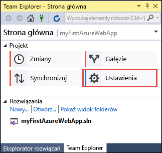
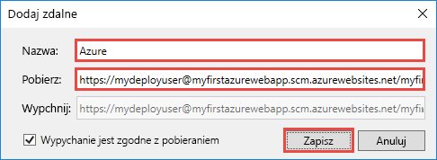

# <a name="create-an-aspnet-core-web-app-in-azure"></a>Tworzenie aplikacji internetowej ASP.NET Core na platformie Azure

> [!NOTE]
> W tym artykule opisano wdrażanie aplikacji w usłudze App Service w systemie Windows. Aby wdrożyć aplikację w usłudze App Service w systemie _Linux_, zobacz [Tworzenie aplikacji internetowej platformy .NET Core w usłudze App Service w systemie Linux](./containers/quickstart-dotnetcore.md).
>
> Jeśli szukasz czynności do wykonania w przypadku aplikacji ASP.NET Framework, zobacz [Tworzenie aplikacji internetowej środowiska ASP.NET Framework na platformie Azure](app-service-web-get-started-dotnet-framework.md). 
>

Usługa [Azure Web Apps](app-service-web-overview.md) oferuje wysoce skalowalną i samonaprawialną usługę hostowaną w Internecie.  Ten przewodnik Szybki start zawiera informacje dotyczące sposobu wdrożenia pierwszej aplikacji internetowej ASP.NET Core w usłudze Azure Web Apps. Po zakończeniu będzie istnieć grupa zasobów składająca się z planu usługi App Service i aplikacji internetowej platformy Azure wraz z wdrożoną aplikacją internetową.

[!INCLUDE [quickstarts-free-trial-note](../../includes/quickstarts-free-trial-note.md)]

## <a name="prerequisites"></a>Wymagania wstępne

W celu ukończenia tego samouczka:

* Zainstaluj program <a href="https://www.visualstudio.com/downloads/" target="_blank">Visual Studio 2017</a> z następującymi pakietami roboczymi:
    - **Tworzenie aplikacji na platformie ASP.NET i tworzenie aplikacji internetowych**
    - **Tworzenie aplikacji na platformie Azure**

    

## <a name="create-an-aspnet-core-web-app"></a>Tworzenie aplikacji internetowej ASP.NET Core

W programie Visual Studio utwórz nowy projekt, wybierając pozycję **Plik > Nowy > Projekt**. 

W oknie dialogowym **Nowy projekt** wybierz pozycję **Visual C# > Sieć Web > Aplikacja sieci Web platformy ASP.NET Core**.

Nadaj aplikacji nazwę _myFirstAzureWebApp_, a następnie wybierz pozycję **Utwórz nowe repozytorium Git** i wybierz przycisk **OK**.
   


Na platformie Azure można wdrożyć dowolny typ aplikacji internetowej ASP.NET Core. Do celów tego przewodnika Szybki start wybierz szablon **Aplikacja sieci Web** i upewnij się, że uwierzytelnianie jest ustawione na wartość **Bez uwierzytelniania**.
      
Kliknij przycisk **OK**.


Po utworzeniu projektu ASP.NET Core jest wyświetlana strona powitalna platformy ASP.NET Core zawierająca wiele linków do zasobów ułatwiających rozpoczęcie pracy. 


Z menu wybierz pozycję **Debuguj > Uruchom bez debugowania**, aby lokalnie uruchomić aplikację internetową.


[!INCLUDE [cloud-shell-try-it.md](../../includes/cloud-shell-try-it.md)]

[!INCLUDE [Configure deployment user](../../includes/configure-deployment-user.md)] 

[!INCLUDE [Create resource group](../../includes/app-service-web-create-resource-group.md)] 

[!INCLUDE [Create app service plan](../../includes/app-service-web-create-app-service-plan.md)] 

[!INCLUDE [Create web app](../../includes/app-service-web-create-web-app.md)] 


## <a name="push-to-azure-from-visual-studio"></a>Wypychanie do platformy Azure z programu Visual Studio

Po powrocie do programu Visual Studio w menu **Widok** kliknij pozycję **Team Explorer**. Zostanie wyświetlone okno **Team Explorer**.

W widoku **Strona główna** kliknij pozycję **Ustawienia** > **Ustawienia repozytorium**.



W sekcji **Elementy zdalne** obszaru **Ustawienia repozytorium** wybierz pozycję **Dodaj**. Zostanie wyświetlone okno dialogowe **Dodawanie elementu zdalnego**.

Ustaw pole **Nazwa** na _Azure_, a następnie ustaw pole **Pobierz** na adres URL, zapisany z obszaru [tworzenia aplikacji internetowej](#create-a-web-app). Kliknij pozycję **Zapisz**.



To ustawienie jest odpowiednikiem polecenia Git `git remote add Azure <URL>`.

Kliknij przycisk **Strona główna** na górze.

Wybierz pozycję **Ustawienia** > **Ustawienia globalne**. Upewnij się, że nazwa i adres e-mail zostały ustawione. W razie potrzeby wybierz pozycję **Aktualizuj**.

Podczas tworzenia projektu program Visual Studio już zatwierdził wszystkie pliki w repozytorium Git. Teraz do wykonania pozostało tylko wypchnięcie plików do platformy Azure.

Kliknij przycisk **Strona główna** na górze. Wybierz kolejno pozycje **Synchronizuj** > **Akcje** > **Otwórz wiersz polecenia**. 

Wprowadź następujące polecenie w oknie wiersza polecenia, a następnie wprowadź hasło wdrożenia po wyświetleniu monitu:

```
git push Azure master
```

Wykonanie tego polecenia może potrwać kilka minut. Podczas wykonywania polecenie wyświetli informacje podobne do następującego przykładu:

```
Counting objects: 4, done.
Delta compression using up to 8 threads.
Compressing objects: 100% (4/4), done.
Writing objects: 100% (4/4), 349 bytes | 349.00 KiB/s, done.
Total 4 (delta 3), reused 0 (delta 0)
remote: Updating branch 'master'.
remote: Updating submodules.
remote: Preparing deployment for commit id '9e20345e9c'.
remote: Generating deployment script.
remote: Project file path: .\myFirstAzureWebApp\myFirstAzureWebApp.csproj
remote: Solution file path: .\myFirstAzureWebApp.sln
remote: Generated deployment script files
remote: Running deployment command...
remote: Handling ASP.NET Core Web Application deployment.
remote:   Restoring packages for D:\home\site\repository\myFirstAzureWebApp\myFirstAzureWebApp.csproj...
remote:   Restoring packages for D:\home\site\repository\myFirstAzureWebApp\myFirstAzureWebApp.csproj...
...
remote: Finished successfully.
remote: Running post deployment command(s)...
remote: Deployment successful.
To https://<app_name>.scm.azurewebsites.net/<app_name>.git
 * [new branch]      master -> master
```

## <a name="browse-to-the-app"></a>Przechodzenie do aplikacji

W przeglądarce przejdź do adresu URL aplikacji internetowej na platformie Azure: `http://<app_name>.azurewebsites.net`.

Strona działa jako aplikacja sieci Web usługi Azure App Service.


Gratulacje, Twoja aplikacja internetowa ASP.NET Core działa w usłudze Azure App Service.

## <a name="update-the-app-and-redeploy"></a>Aktualizowanie aplikacji i ponowne wdrażanie

Za pomocą **Eksploratora rozwiązań** otwórz plik _Pages/Index.cshtml_.

Znajdź tag HTML `<div id="myCarousel" class="carousel slide" data-ride="carousel" data-interval="6000">` u góry i zastąp cały element następującym kodem:

```HTML
<div class="jumbotron">
    <h1>ASP.NET in Azure!</h1>
    <p class="lead">This is a simple app that we’ve built that demonstrates how to deploy a .NET app to Azure App Service.</p>
</div>
```

W **Eksploratorze rozwiązań** kliknij prawym przyciskiem myszy pozycję _Pages/Index.cshtml_ i kliknij pozycję **Zatwierdź**. Wprowadź wiadomość dotyczącą zatwierdzenia zmiany i kliknij pozycję **Zatwierdź wszystko**.

Po powrocie do okna wiersza polecenia wypchnij zmiany kodu do platformy Azure.

```bash
git push Azure master
```

Po zakończeniu wdrażania przejdź ponownie do adresu `http://<app_name>.azurewebsites.net`.


## <a name="manage-the-azure-web-app"></a>Zarządzanie aplikacją internetową platformy Azure

Przejdź do witryny <a href="https://portal.azure.com" target="_blank">Azure Portal</a>, aby zarządzać aplikacją internetową.

W lewym menu wybierz pozycję **App Services**, a następnie wybierz nazwę swojej aplikacji sieci Web platformy Azure.


Zostanie wyświetlona strona Omówienie aplikacji internetowej. Tutaj możesz wykonywać podstawowe zadania zarządzania, takie jak przeglądanie, zatrzymywanie, uruchamianie, ponowne uruchamianie i usuwanie. 


Menu po lewej stronie zawiera różne strony służące do konfigurowania aplikacji. 

[!INCLUDE [Clean-up section](../../includes/clean-up-section-portal.md)]

## <a name="next-steps"></a>Następne kroki

> [!div class="nextstepaction"]
> [ASP.NET Core with SQL Database (Platforma ASP.NET Core z usługą SQL Database)](app-service-web-tutorial-dotnetcore-sqldb.md)
