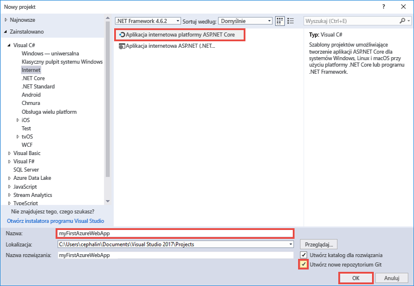
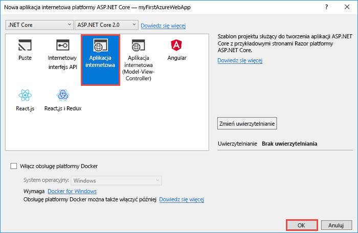
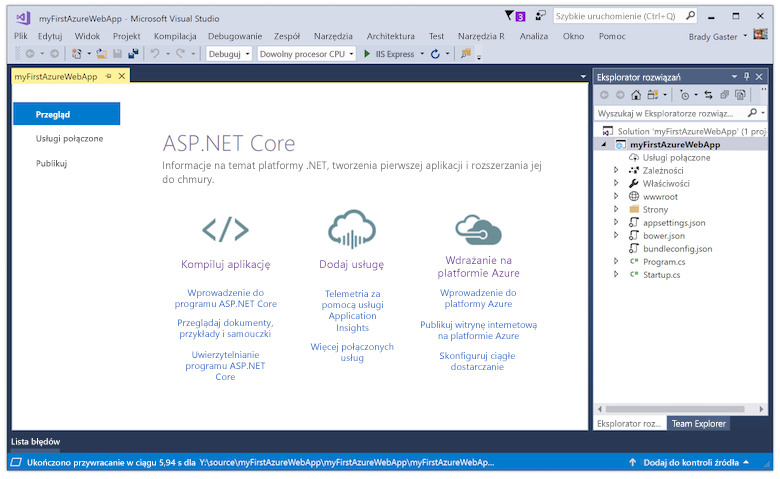
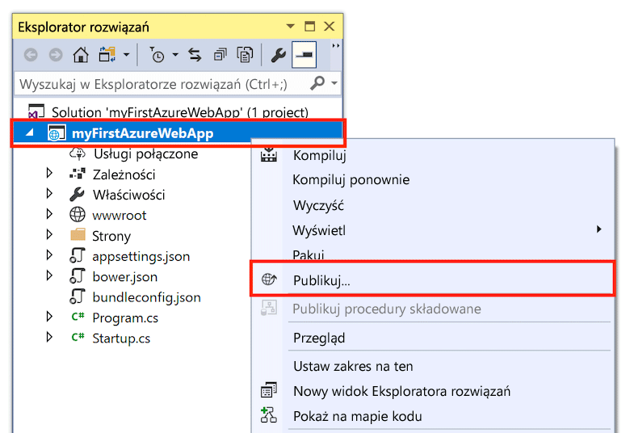
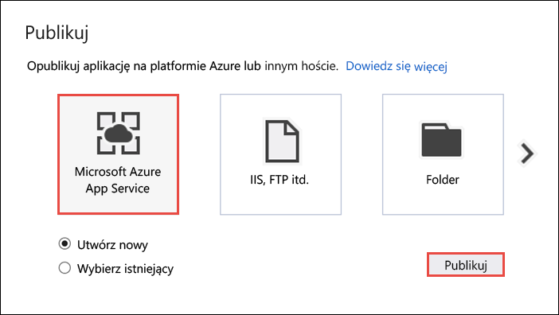
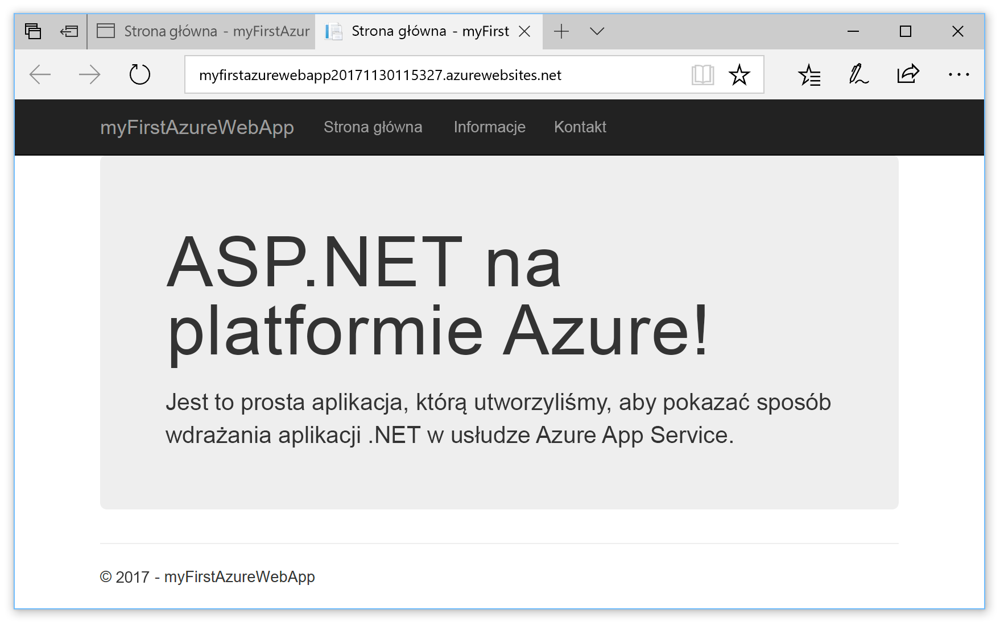

# <a name="create-an-aspnet-core-web-app-in-azure"></a>Tworzenie aplikacji internetowej ASP.NET Core na platformie Azure

> [!NOTE]
> W tym artykule opisano wdrażanie aplikacji w usłudze App Service w systemie Windows. Aby wdrożyć aplikację w usłudze App Service w systemie _Linux_, zobacz [Tworzenie aplikacji internetowej platformy .NET Core w usłudze App Service w systemie Linux](./containers/quickstart-dotnetcore.md).
>

Usługa [Azure Web Apps](app-service-web-overview.md) oferuje wysoce skalowalną i samonaprawialną usługę hostowaną w Internecie.  Ten przewodnik Szybki start zawiera informacje dotyczące sposobu wdrożenia pierwszej aplikacji internetowej ASP.NET Core w usłudze Azure Web Apps. Po zakończeniu będzie istnieć grupa zasobów składająca się z planu usługi App Service i aplikacji internetowej platformy Azure wraz z wdrożoną aplikacją internetową.

> [!NOTE]
> Jeśli szukasz sposobu tworzenia i wdrażania aplikacji internetowej platformy ASP.NET Framework, ten artykuł jest dostępny [tutaj](app-service-web-get-started-dotnet-framework.md). 
>

## <a name="prerequisites"></a>Wymagania wstępne

W celu ukończenia tego samouczka:

* Zainstaluj program <a href="https://www.visualstudio.com/downloads/" target="_blank">Visual Studio 2017</a> z następującymi pakietami roboczymi:
    - **Tworzenie aplikacji na platformie ASP.NET i tworzenie aplikacji internetowych**
    - **Tworzenie aplikacji na platformie Azure**

    

[!INCLUDE [quickstarts-free-trial-note](../../includes/quickstarts-free-trial-note.md)]

## <a name="create-an-aspnet-core-web-app"></a>Tworzenie aplikacji internetowej ASP.NET Core

W programie Visual Studio utwórz nowy projekt, wybierając pozycję **Plik > Nowy > Projekt**. 

W oknie dialogowym **Nowy projekt** wybierz pozycję **Visual C# > Sieć Web > Aplikacja sieci Web platformy ASP.NET Core**.

Nadaj aplikacji nazwę _myFirstAzureWebApp_, a następnie kliknij przycisk **OK**.
   


Na platformie Azure można wdrożyć dowolny typ aplikacji internetowej ASP.NET Core. Do celów tego przewodnika Szybki start wybierz szablon **Aplikacja sieci Web** i upewnij się, że uwierzytelnianie jest ustawione na wartość **Bez uwierzytelniania**.
      
Kliknij przycisk **OK**.



Po utworzeniu projektu ASP.NET Core zostanie wyświetlona strona powitalna platformy ASP.NET Core zawierająca wiele linków do zasobów ułatwiających rozpoczęcie pracy. 



Z menu wybierz pozycję **Debuguj > Uruchom bez debugowania**, aby lokalnie uruchomić aplikację internetową.


## <a name="publish-to-azure"></a>Publikowanie na platformie Azure

W obszarze **Eksplorator rozwiązań** kliknij prawym przyciskiem myszy projekt **myFirstAzureWebApp**, a następnie wybierz polecenie **Publikuj**.



Upewnij się, że pozycja **Microsoft Azure App Service** jest zaznaczona, a następnie kliknij przycisk **Publikuj**.



Spowoduje to otwarcie okna dialogowego **Tworzenie usługi App Service**, które ułatwi Ci utworzenie wszystkich zasobów platformy Azure niezbędnych do uruchomienia aplikacji internetowej ASP.NET Core na platformie Azure.

## <a name="sign-in-to-azure"></a>Logowanie do platformy Azure

W oknie dialogowym **Tworzenie usługi App Service** wybierz pozycję **Dodaj konto** i zaloguj się do swojej subskrypcji platformy Azure. Po zalogowaniu wybierz z listy rozwijanej konto zawierające odpowiednią subskrypcję.

> [!NOTE]
> Jeśli przeprowadzono już logowanie, nie wybieraj jeszcze pozycji **Utwórz**.
>
>
   


## <a name="create-a-resource-group"></a>Tworzenie grupy zasobów

[!INCLUDE [resource group intro text](../../includes/resource-group.md)]

Obok pozycji **Grupa zasobów** wybierz pozycję **Nowa**.

Nadaj grupie zasobów nazwę **myResourceGroup**, a następnie kliknij przycisk **OK**.

## <a name="create-an-app-service-plan"></a>Tworzenie planu usługi App Service

[!INCLUDE [app-service-plan](../../includes/app-service-plan.md)]

Obok pozycji **Plan usługi App Service** wybierz pozycję **Nowy**. 

W oknie dialogowym **Konfiguruj plan usługi App Service** użyj ustawień znajdujących się w tabeli poniżej zrzutu ekranu.


| Ustawienie | Sugerowana wartość | Opis |
|-|-|-|
|Plan usługi App Service| myAppServicePlan | Nazwa planu usługi App Service. |
| Lokalizacja | Europa Zachodnia | Centrum danych, w którym hostowana jest aplikacja internetowa. |
| Rozmiar | Bezpłatna | [Warstwa cenowa](https://azure.microsoft.com/pricing/details/app-service/?ref=microsoft.com&utm_source=microsoft.com&utm_medium=docs&utm_campaign=visualstudio) określa funkcje hostowania. |

Kliknij przycisk **OK**.

## <a name="create-and-publish-the-web-app"></a>Tworzenie i publikowanie aplikacji sieci Web

W polu **Nazwa aplikacji sieci Web** wpisz unikatową nazwę aplikacji (dozwolone znaki to `a-z`, `0-9` i `-`) lub zaakceptuj automatycznie wygenerowaną unikatową nazwę. Adres URL aplikacji internetowej to `http://<app_name>.azurewebsites.net`, gdzie `<app_name>` to nazwa aplikacji internetowej.

Wybierz pozycję **Utwórz**, aby rozpocząć tworzenie zasobów platformy Azure.


Po zakończeniu działania kreatora aplikacja internetowa ASP.NET Core zostanie opublikowana na platformie Azure, a następnie uruchomiona w domyślnej przeglądarce.


Nazwa aplikacji internetowej określona w [kroku tworzenia i publikowania](#create-and-publish-the-web-app) jest używana jako prefiks adresu URL w formacie `http://<app_name>.azurewebsites.net`.

Gratulacje, Twoja aplikacja internetowa ASP.NET Core działa w usłudze Azure App Service.

## <a name="update-the-app-and-redeploy"></a>Aktualizowanie aplikacji i ponowne wdrażanie

Za pomocą **Eksploratora rozwiązań** otwórz plik _Pages/Index.cshtml_.

Znajdź tag HTML `<div id="myCarousel" class="carousel slide" data-ride="carousel" data-interval="6000">` u góry i zastąp cały element następującym kodem:

```HTML
<div class="jumbotron">
    <h1>ASP.NET in Azure!</h1>
    <p class="lead">This is a simple app that we’ve built that demonstrates how to deploy a .NET app to Azure App Service.</p>
</div>
```

Aby przeprowadzić ponowne wdrożenie na platformie Azure, kliknij prawym przyciskiem myszy projekt **myFirstAzureWebApp** w **Eksploratorze rozwiązań**, a następnie wybierz polecenie **Publikuj**.

Na stronie publikowania wybierz pozycję **Publikuj**.

Po zakończeniu publikowania program Visual Studio otworzy w przeglądarce adres URL aplikacji internetowej.



## <a name="manage-the-azure-web-app"></a>Zarządzanie aplikacją internetową platformy Azure

Przejdź do witryny <a href="https://portal.azure.com" target="_blank">Azure Portal</a>, aby zarządzać aplikacją internetową.

W lewym menu wybierz pozycję **App Services**, a następnie wybierz nazwę swojej aplikacji sieci Web platformy Azure.


Zostanie wyświetlona strona Omówienie aplikacji internetowej. Tutaj możesz wykonywać podstawowe zadania zarządzania, takie jak przeglądanie, zatrzymywanie, uruchamianie, ponowne uruchamianie i usuwanie. 


Menu po lewej stronie zawiera różne strony służące do konfigurowania aplikacji. 

[!INCLUDE [Clean-up section](../../includes/clean-up-section-portal.md)]

## <a name="next-steps"></a>Następne kroki

> [!div class="nextstepaction"]
> [ASP.NET Core with SQL Database (Platforma ASP.NET Core z usługą SQL Database)](app-service-web-tutorial-dotnetcore-sqldb.md)
