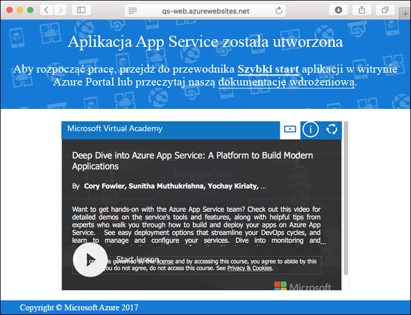
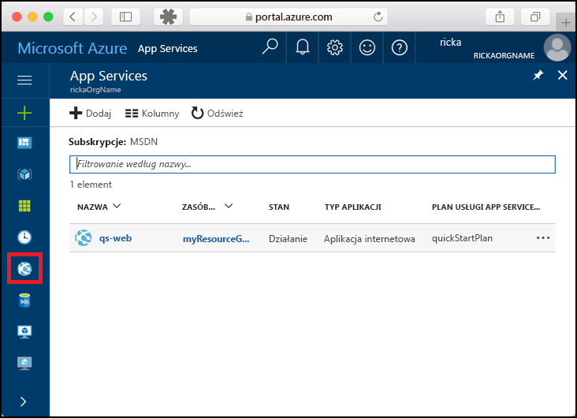
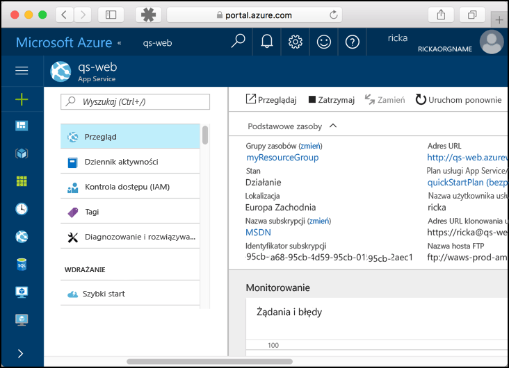

# <a name="create-a-static-html-web-app-in-azure"></a>Tworzenie statycznej aplikacji sieci Web w języku HTML na platformie Azure

Usługa [Azure Web Apps](app-service-web-overview.md) oferuje wysoce skalowalną i samonaprawialną usługę hostowania w Internecie.  W tym samouczku Szybki start przedstawiono sposób wdrażania podstawowej witryny HTML+CSS w usłudze Azure Web Apps. Możesz utworzyć aplikację internetową przy użyciu [interfejsu wiersza polecenia Azure](https://docs.microsoft.com/cli/azure/get-started-with-azure-cli), a usługa Git umożliwia wdrożenie przykładowej zawartości HTML w aplikacji internetowej.


Poniższe kroki możesz wykonać przy użyciu komputera z systemem Mac, Windows lub Linux. Po zainstalowaniu wymagań wstępnych wykonanie czynności trwa około pięciu minut.

## <a name="prerequisites"></a>Wymagania wstępne

Aby ukończyć ten przewodnik Szybki Start:

- <a href="https://git-scm.com/" target="_blank">Zainstaluj oprogramowanie Git</a>

[!INCLUDE [quickstarts-free-trial-note](../../includes/quickstarts-free-trial-note.md)]

## <a name="download-the-sample"></a>Pobierz przykład

W oknie terminala uruchom następujące polecenie, aby sklonować przykładowe repozytorium aplikacji na maszynę lokalną.

```bash
git clone https://github.com/Azure-Samples/html-docs-hello-world.git
```

Przejdź do katalogu, który zawiera przykładowy kod.

```bash
cd html-docs-hello-world
```

## <a name="view-the-html"></a>Wyświetlanie kodu HTML

Przejdź do katalogu, który zawiera przykładowy kod HTML. Otwórz plik *index.html* w swojej przeglądarce.


[!INCLUDE [cloud-shell-try-it.md](../../includes/cloud-shell-try-it.md)]

[!INCLUDE [Configure deployment user](../../includes/configure-deployment-user.md)] 

[!INCLUDE [Create resource group](../../includes/app-service-web-create-resource-group.md)] 

[!INCLUDE [Create app service plan](../../includes/app-service-web-create-app-service-plan.md)] 

[!INCLUDE [Create web app](../../includes/app-service-web-create-web-app.md)] 



[!INCLUDE [Push to Azure](../../includes/app-service-web-git-push-to-azure.md)] 

```bash
Counting objects: 13, done.
Delta compression using up to 4 threads.
Compressing objects: 100% (11/11), done.
Writing objects: 100% (13/13), 2.07 KiB | 0 bytes/s, done.
Total 13 (delta 2), reused 0 (delta 0)
remote: Updating branch 'master'.
remote: Updating submodules.
remote: Preparing deployment for commit id 'cc39b1e4cb'.
remote: Generating deployment script.
remote: Generating deployment script for Web Site
remote: Generated deployment script files
remote: Running deployment command...
remote: Handling Basic Web Site deployment.
remote: KuduSync.NET from: 'D:\home\site\repository' to: 'D:\home\site\wwwroot'
remote: Deleting file: 'hostingstart.html'
remote: Copying file: '.gitignore'
remote: Copying file: 'LICENSE'
remote: Copying file: 'README.md'
remote: Finished successfully.
remote: Running post deployment command(s)...
remote: Deployment successful.
To https://<app_name>.scm.azurewebsites.net/<app_name>.git
 * [new branch]      master -> master
```

## <a name="browse-to-the-app"></a>Przechodzenie do aplikacji

W przeglądarce przejdź do adresu URL aplikacji internetowej na platformie Azure: `http://<app_name>.azurewebsites.net`.

Strona działa jako aplikacja sieci Web usługi Azure App Service.


**Gratulacje!** Udało Ci się wdrożyć pierwszą własną aplikację w języku HTML w usłudze App Service.

## <a name="update-and-redeploy-the-app"></a>Aktualizowanie i ponowne wdrażanie aplikacji

Otwórz plik *index.html* w edytorze tekstów i wprowadź zmianę. Na przykład zmień nagłówek H1 z „Azure App Service - Sample Static HTML Site” na „Azure App Service”.

W oknie lokalnego terminala zatwierdź zmiany w usłudze Git, a następnie wypchnij zmiany kodu na platformę Azure.

```bash
git commit -am "updated HTML"
git push azure master
```

Po zakończeniu wdrożenia odśwież przeglądarkę, aby zobaczyć zmiany.


## <a name="manage-your-new-azure-web-app"></a>Zarządzanie nową aplikacją sieci Web platformy Azure

Przejdź do witryny <a href="https://portal.azure.com" target="_blank">Azure Portal</a>, aby zarządzać utworzoną aplikacją internetową.

W menu po lewej stronie kliknij pozycję **App Services**, a następnie kliknij nazwę swojej aplikacji internetowej platformy Azure.



Zostanie wyświetlona strona Omówienie aplikacji internetowej. Tutaj możesz wykonywać podstawowe zadania zarządzania, takie jak przeglądanie, zatrzymywanie, uruchamianie, ponowne uruchamianie i usuwanie. 



Menu po lewej stronie zawiera różne strony służące do konfigurowania aplikacji. 

[!INCLUDE [cli-samples-clean-up](../../includes/cli-samples-clean-up.md)]

## <a name="next-steps"></a>Następne kroki

> [!div class="nextstepaction"]
> [Mapowanie domeny niestandardowej](app-service-web-tutorial-custom-domain.md)
