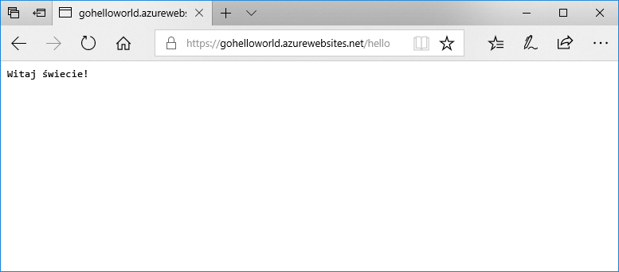

# <a name="deploy-a-dockergo-web-app-in-web-app-for-containers"></a>Wdrażanie aplikacji internetowej Docker/Go w funkcji Web App for Containers

Usługa [App Service dla systemu Linux](app-service-linux-intro.md) zapewnia wstępnie zdefiniowane stosy aplikacji w systemie Linux z obsługą języków takich jak .NET, PHP, Node.js i innych. Można także użyć niestandardowego obrazu platformy Docker, aby uruchamiać aplikację internetową na stosie aplikacji, który nie jest zdefiniowany na platformie Azure. W tym przewodniku Szybki start pokazano, jak utworzyć aplikację internetową i wdrożyć w niej obraz Go z usługi Docker Hub. Do tworzenia aplikacji internetowej używany jest [interfejs wiersza polecenia platformy Azure](https://docs.microsoft.com/cli/azure/get-started-with-azure-cli).



[!INCLUDE [quickstarts-free-trial-note](../../../includes/quickstarts-free-trial-note.md)]

[!INCLUDE [cloud-shell-try-it.md](../../../includes/cloud-shell-try-it.md)]

[!INCLUDE [Configure deployment user](../../../includes/configure-deployment-user.md)]

[!INCLUDE [Create resource group](../../../includes/app-service-web-create-resource-group.md)]

[!INCLUDE [Create app service plan](../../../includes/app-service-web-create-app-service-plan-linux.md)]

## <a name="create-a-web-app"></a>Tworzenie aplikacji sieci Web

Utwórz [aplikację sieci Web](../app-service-web-overview.md) w `myAppServicePlan`planie usługi App Service za pomocą polecenia [az webapp create](/cli/azure/webapp?view=azure-cli-latest#az_webapp_create). Nie zapomnij zastąpić elementu `<app name>` unikatową w skali globalnej nazwą aplikacji.

```azurecli-interactive
az webapp create --resource-group myResourceGroup --plan myAppServicePlan --name <app name> --deployment-container-image-name microsoft/azure-appservices-go-quickstart
```

W powyższym poleceniu parametr `--deployment-container-image-name` wskazuje publiczny obraz usługi Docker Hub [microsoft/azure-appservices-go-quickstart](https://hub.docker.com/r/microsoft/azure-appservices-go-quickstart/).

Po utworzeniu aplikacji internetowej w interfejsie wiersza polecenia platformy Azure zostaną wyświetlone dane wyjściowe podobne do następujących:

```json
{
  "availabilityState": "Normal",
  "clientAffinityEnabled": true,
  "clientCertEnabled": false,
  "cloningInfo": null,
  "containerSize": 0,
  "dailyMemoryTimeQuota": 0,
  "defaultHostName": "<app name>.azurewebsites.net",
  "deploymentLocalGitUrl": "https://<username>@<app name>.scm.azurewebsites.net/<app name>.git",
  "enabled": true,
  < JSON data removed for brevity. >
}
```

## <a name="browse-to-the-app"></a>Przechodzenie do aplikacji

```bash
http://<app_name>.azurewebsites.net/hello
```


**Gratulacje!** Wdrożono niestandardowy obraz platformy Docker, na którym działa aplikacja Go w funkcji Web App for Containers.

[!INCLUDE [Clean-up section](../../../includes/cli-script-clean-up.md)]

## <a name="next-steps"></a>Następne kroki

> [!div class="nextstepaction"]
> [Używanie niestandardowego obrazu platformy Docker](tutorial-custom-docker-image.md)
