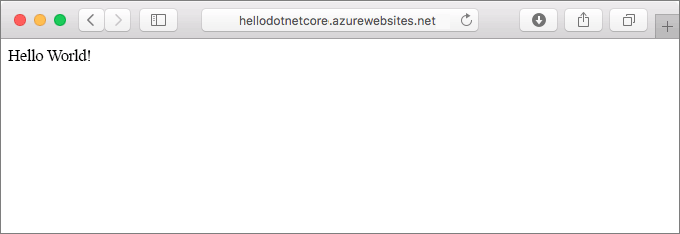
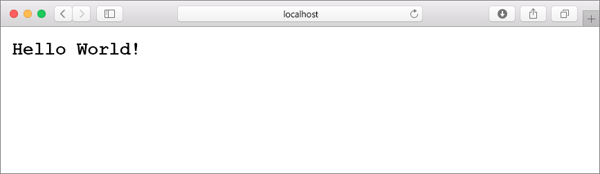
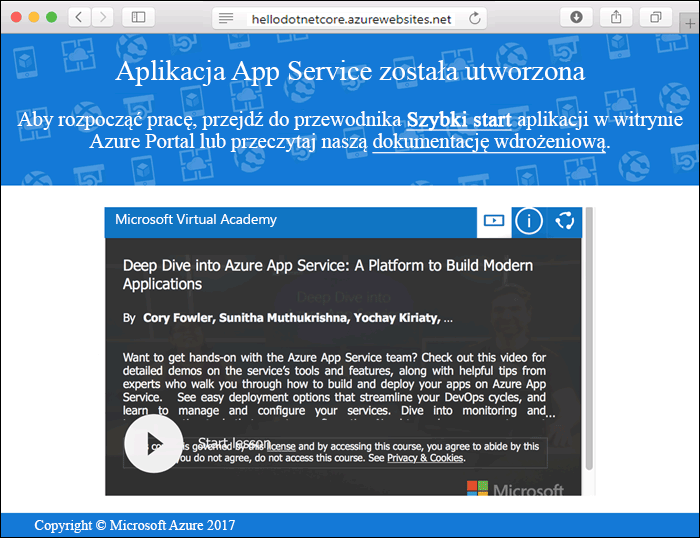
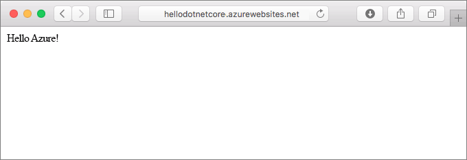
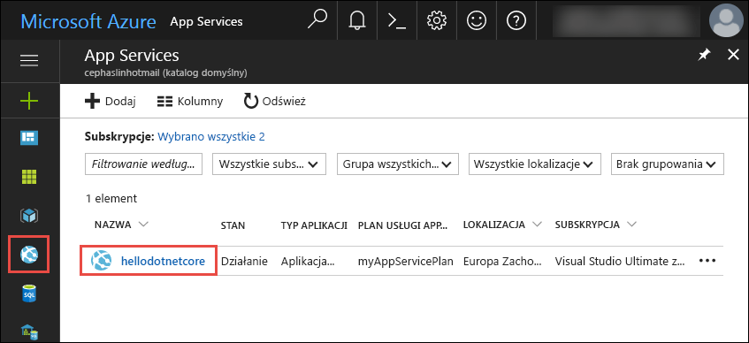
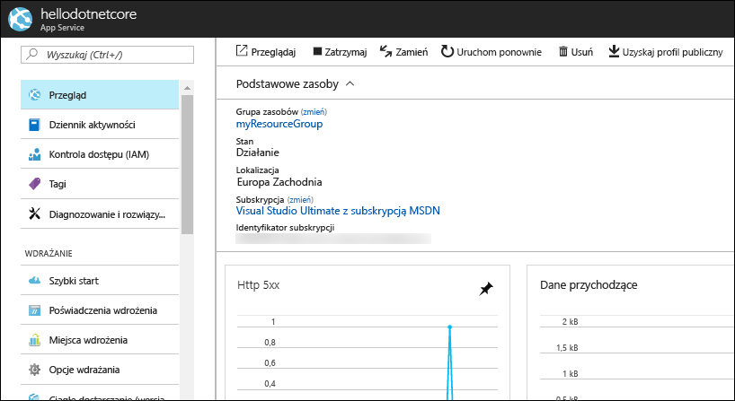

# <a name="create-a-net-core-web-app-in-app-service-on-linux"></a>Tworzenie aplikacji sieci web platformy .NET Core w usłudze App Service w systemie Linux

[Usługa aplikacji w systemie Linux](app-service-linux-intro.md) oferuje wysoce skalowalną, własnym poprawiania usługi hosta sieci web przy użyciu systemu operacyjnego Linux. Ta opcja szybkiego startu przedstawia sposób tworzenia [.NET Core](https://docs.microsoft.com/aspnet/core/) aplikacji w usłudze aplikacji w systemie Linux. Można utworzyć aplikacji sieci web w programie [interfejsu wiersza polecenia Azure](https://docs.microsoft.com/cli/azure/get-started-with-azure-cli), i Git umożliwia wdrażanie kodu platformy .NET Core aplikacji sieci web.



Poniższe kroki możesz wykonać przy użyciu komputera z systemem Mac, Windows lub Linux.

## <a name="prerequisites"></a>Wymagania wstępne

Aby ukończyć ten przewodnik Szybki Start:

* [Zainstaluj oprogramowanie Git](https://git-scm.com/)
* [Zainstaluj oprogramowanie .NET Core SDK](https://www.microsoft.com/net/download/core)

[!INCLUDE [quickstarts-free-trial-note](../../../includes/quickstarts-free-trial-note.md)]

## <a name="create-the-app-locally"></a>Tworzenie aplikacji lokalnie

W oknie terminalu na komputerze, należy utworzyć katalog o nazwie `hellodotnetcore` i zmień bieżący katalog.

```bash
md hellodotnetcore
cd hellodotnetcore
```

Utwórz nową aplikację sieci web .NET Core.

```bash
dotnet new web
```

## <a name="run-the-app-locally"></a>Lokalne uruchamianie aplikacji

Przywracanie pakietów NuGet i uruchom aplikację.

```bash
dotnet restore
dotnet run
```

Otwórz przeglądarkę sieci web i przejdź do aplikacji w `http://localhost:5000`.

Na stronie zostanie wyświetlony komunikat **Hello World** z przykładowej aplikacji.



W oknie terminalu naciśnij kombinację klawiszy **Ctrl + C**, aby zamknąć serwer sieci Web. Inicjowanie repozytorium Git dla projektu platformy .NET Core.

```bash
git init
git add .
git commit -m "first commit"
```

[!INCLUDE [cloud-shell-try-it.md](../../../includes/cloud-shell-try-it.md)]

[!INCLUDE [Configure deployment user](../../../includes/configure-deployment-user.md)]

[!INCLUDE [Create resource group](../../../includes/app-service-web-create-resource-group.md)]

[!INCLUDE [Create app service plan](../../../includes/app-service-web-create-app-service-plan-linux.md)]

## <a name="create-a-web-app-with-built-in-image"></a>Tworzenie aplikacji sieci web przy użyciu wbudowanych obrazu

[!INCLUDE [Create web app](../../../includes/app-service-web-create-web-app-dotnetcore-no-h.md)]

Przejdź do aplikacji sieci web nowo utworzony. Zastąp  _&lt;Nazwa aplikacji >_ przy użyciu unikatowej nazwy aplikacji.

```bash
http://<app name>.azurewebsites.net
```



[!INCLUDE [Push to Azure](../../../includes/app-service-web-git-push-to-azure.md)] 

```bash
Counting objects: 22, done.
Delta compression using up to 8 threads.
Compressing objects: 100% (18/18), done.
Writing objects: 100% (22/22), 51.21 KiB | 3.94 MiB/s, done.
Total 22 (delta 1), reused 0 (delta 0)
remote: Updating branch 'master'.
remote: Updating submodules.
remote: Preparing deployment for commit id '741f16d1db'.
remote: Generating deployment script.
remote: Project file path: ./hellodotnetcore.csproj
remote: Generated deployment script files
remote: Running deployment command...
remote: Handling ASP.NET Core Web Application deployment.
remote: ...............................................................................................
remote:   Restoring packages for /home/site/repository/hellodotnetcore.csproj...
remote: ....................................
remote:   Installing System.Xml.XPath 4.0.1.
remote:   Installing System.Diagnostics.Tracing 4.1.0.
remote:   Installing System.Threading.Tasks.Extensions 4.0.0.
remote:   Installing System.Reflection.Emit.ILGeneration 4.0.1.
remote:   ...
remote: Finished successfully.
remote: Running post deployment command(s)...
remote: Deployment successful.
To https://cephalin-dotnetcore.scm.azurewebsites.net/cephalin-dotnetcore.git
 * [new branch]      master -> master
```

## <a name="browse-to-the-app"></a>Przechodzenie do aplikacji

Przejdź do wdrożonej aplikacji za pomocą przeglądarki sieci Web.

```bash
http://<app_name>.azurewebsites.net
```

Przykładowy kod Node.js działa w aplikacji sieci web za pomocą wbudowanego obrazu.


**Gratulacje!** Pierwszą aplikację Node.js została wdrożona w usłudze App Service w systemie Linux.

## <a name="update-and-redeploy-the-code"></a>Aktualizowanie i ponowne wdrażanie kodu

W katalogu lokalnym, otwórz _Startup.cs_ pliku. Zmiany tekstu w wywołaniu metody małych `context.Response.WriteAsync`:

```csharp
await context.Response.WriteAsync("Hello Azure!");
```

Zatwierdź zmiany w narzędziu Git, a następnie wypchnij zmiany kodu na platformę Azure.

```bash
git commit -am "updated output"
git push azure master
```

Po zakończeniu wdrożenia przejdź z powrotem do okna przeglądarki otwartego w kroku **przechodzenia do aplikacji**, a następnie kliknij przycisk Odśwież.



## <a name="manage-your-new-azure-web-app"></a>Zarządzanie nową aplikacją sieci Web platformy Azure

Przejdź do witryny <a href="https://portal.azure.com" target="_blank">Azure Portal</a>, aby zarządzać utworzoną aplikacją internetową.

W menu po lewej stronie kliknij pozycję **App Services**, a następnie kliknij nazwę swojej aplikacji internetowej platformy Azure.



Zostanie wyświetlona strona Omówienie aplikacji internetowej. Tutaj możesz wykonywać podstawowe zadania zarządzania, takie jak przeglądanie, zatrzymywanie, uruchamianie, ponowne uruchamianie i usuwanie. 



Menu po lewej stronie zawiera różne strony służące do konfigurowania aplikacji. 

[!INCLUDE [cli-samples-clean-up](../../../includes/cli-samples-clean-up.md)]

## <a name="next-steps"></a>Następne kroki

> [!div class="nextstepaction"]
> [Tworzenie aplikacji sieci web platformy .NET Core i bazy danych SQL w usłudze Azure App Service w systemie Linux](tutorial-dotnetcore-sqldb-app.md)
