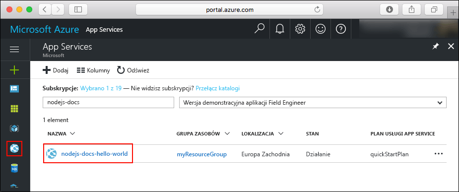
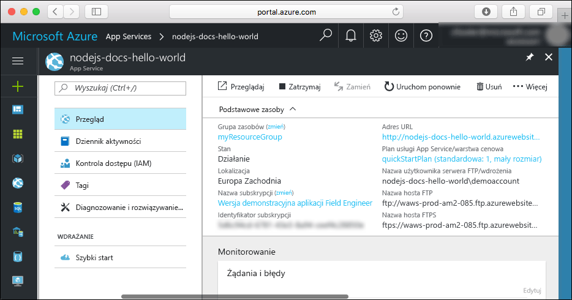

# <a name="create-a-nodejs-web-app-in-azure-app-service-on-linux"></a>Tworzenie aplikacji internetowej platformy Node.js w usłudze Azure App Service w systemie Linux

> [!NOTE]
> W tym artykule opisano wdrażanie aplikacji w usłudze App Service w systemie Linux. Aby wdrożyć aplikację w usłudze App Service w systemie _Windows_, zobacz [Tworzenie aplikacji internetowej Node.js na platformie Azure](../app-service-web-get-started-nodejs.md).
>

Usługa [App Service w systemie Linux](app-service-linux-intro.md) oferuje wysoce skalowalną i samonaprawialną usługę hostingu w Internecie przy użyciu systemu operacyjnego Linux. Ten przewodnik Szybki start pokazuje, jak wdrożyć aplikację platformy Node.js w usłudze App Service w systemie Linux przy użyciu wbudowanego obrazu. Aplikację internetową z wbudowanym obrazem można utworzyć przy użyciu [interfejsu wiersza polecenia platformy Azure](https://docs.microsoft.com/cli/azure/get-started-with-azure-cli), a usługa Git umożliwia wdrażanie kodu platformy Node.js w aplikacji internetowej.


Kroki podane w tym samouczku możesz wykonać przy użyciu komputera z systemem Mac, Windows lub Linux. Możesz również wykonać czynności przedstawione w [filmie wideo](#video) dotyczącym zagadnień opisanych w tym artykule.

[!INCLUDE [quickstarts-free-trial-note](../../../includes/quickstarts-free-trial-note.md)]

## <a name="prerequisites"></a>Wymagania wstępne

Aby ukończyć ten przewodnik Szybki start:

* <a href="https://git-scm.com/" target="_blank">Zainstaluj oprogramowanie Git</a>
* <a href="https://nodejs.org/" target="_blank">Zainstaluj środowisko Node.js i menedżer NPM</a>

## <a name="download-the-sample"></a>Pobierz przykład

W oknie terminala na maszynie uruchom następujące polecenie, aby sklonować przykładowe repozytorium aplikacji na maszynę lokalną.

```bash
git clone https://github.com/Azure-Samples/nodejs-docs-hello-world
```

To okno terminala umożliwia uruchamianie wszystkich poleceń z tego przewodnika Szybki start.

Przejdź do katalogu, który zawiera przykładowy kod.

```bash
cd nodejs-docs-hello-world
```

## <a name="run-the-app-locally"></a>Lokalne uruchamianie aplikacji

Uruchom aplikację lokalnie, otwierając okno terminala i korzystając ze skryptu `npm start` w celu uruchomienia wbudowanego serwera HTTP środowiska Node.js.

```bash
npm start
```

Otwórz przeglądarkę internetową i przejdź do przykładowej aplikacji pod adresem `http://localhost:1337`.

Na stronie zostanie wyświetlony komunikat **Hello World** z przykładowej aplikacji.


W oknie terminalu naciśnij kombinację klawiszy **Ctrl + C**, aby zamknąć serwer sieci Web.

[!INCLUDE [cloud-shell-try-it.md](../../../includes/cloud-shell-try-it.md)]

[!INCLUDE [Configure deployment user](../../../includes/configure-deployment-user.md)]

[!INCLUDE [Create resource group](../../../includes/app-service-web-create-resource-group-linux.md)]

[!INCLUDE [Create app service plan](../../../includes/app-service-web-create-app-service-plan-linux.md)]

## <a name="create-a-web-app"></a>Tworzenie aplikacji sieci Web

[!INCLUDE [Create web app](../../../includes/app-service-web-create-web-app-nodejs-linux-no-h.md)]

Przejdź do nowo utworzonej aplikacji internetowej. Zastąp ciąg _&lt;nazwa aplikacji>_ nazwą swojej aplikacji internetowej.

```bash
http://<app name>.azurewebsites.net
```

Tak powinna wyglądać nowa aplikacja internetowa:


[!INCLUDE [Push to Azure](../../../includes/app-service-web-git-push-to-azure.md)]

```bash
Counting objects: 23, done.
Delta compression using up to 4 threads.
Compressing objects: 100% (21/21), done.
Writing objects: 100% (23/23), 3.71 KiB | 0 bytes/s, done.
Total 23 (delta 8), reused 7 (delta 1)
remote: Updating branch 'master'.
remote: Updating submodules.
remote: Preparing deployment for commit id 'bf114df591'.
remote: Generating deployment script.
remote: Generating deployment script for node.js Web Site
remote: Generated deployment script files
remote: Running deployment command...
remote: Handling node.js deployment.
remote: Kudu sync from: '/home/site/repository' to: '/home/site/wwwroot'
remote: Copying file: '.gitignore'
remote: Copying file: 'LICENSE'
remote: Copying file: 'README.md'
remote: Copying file: 'index.js'
remote: Copying file: 'package.json'
remote: Copying file: 'process.json'
remote: Deleting file: 'hostingstart.html'
remote: Ignoring: .git
remote: Using start-up script index.js from package.json.
remote: Node.js versions available on the platform are: 4.4.7, 4.5.0, 6.2.2, 6.6.0, 6.9.1.
remote: Selected node.js version 6.9.1. Use package.json file to choose a different version.
remote: Selected npm version 3.10.8
remote: Finished successfully.
remote: Running post deployment command(s)...
remote: Deployment successful.
To https://<app_name>.scm.azurewebsites.net:443/<app_name>.git
 * [new branch]      master -> master
```

## <a name="browse-to-the-app"></a>Przechodzenie do aplikacji

Przejdź do wdrożonej aplikacji za pomocą przeglądarki sieci Web.

```bash
http://<app_name>.azurewebsites.net
```

Przykładowy kod platformy Node.js jest uruchamiany w aplikacji internetowej z wbudowanym obrazem.


**Gratulacje!** Udało Ci się wdrożyć pierwszą własną aplikację platformy Node.js w usłudze App Service w systemie Linux.

## <a name="update-and-redeploy-the-code"></a>Aktualizowanie i ponowne wdrażanie kodu

W katalogu lokalnym otwórz plik `index.js` w aplikacji Node.js i wprowadź niewielką zmianę w tekście w wywołaniu `response.end`:

```nodejs
response.end("Hello Azure!");
```

Zatwierdź zmiany w narzędziu Git, a następnie wypchnij zmiany kodu na platformę Azure.

```bash
git commit -am "updated output"
git push azure master
```

Po zakończeniu wdrożenia przejdź z powrotem do okna przeglądarki otwartego w kroku **przechodzenia do aplikacji**, a następnie kliknij przycisk Odśwież.


## <a name="manage-your-new-azure-web-app"></a>Zarządzanie nową aplikacją sieci Web platformy Azure

Przejdź do witryny <a href="https://portal.azure.com" target="_blank">Azure Portal</a>, aby zarządzać utworzoną aplikacją internetową.

W menu po lewej stronie kliknij pozycję **App Services**, a następnie kliknij nazwę swojej aplikacji internetowej platformy Azure.



Zostanie wyświetlona strona Omówienie aplikacji internetowej. Tutaj możesz wykonywać podstawowe zadania zarządzania, takie jak przeglądanie, zatrzymywanie, uruchamianie, ponowne uruchamianie i usuwanie. 



Menu po lewej stronie zawiera różne strony służące do konfigurowania aplikacji. 

[!INCLUDE [cli-samples-clean-up](../../../includes/cli-samples-clean-up.md)]

## <a name="video"></a>Połączenia wideo

>[!VIDEO https://www.youtube.com/embed/S9eqK7xPKqU]

## <a name="next-steps"></a>Następne kroki

> [!div class="nextstepaction"]
> [Środowisko Node.js z bazą danych MongoDB](tutorial-nodejs-mongodb-app.md)
