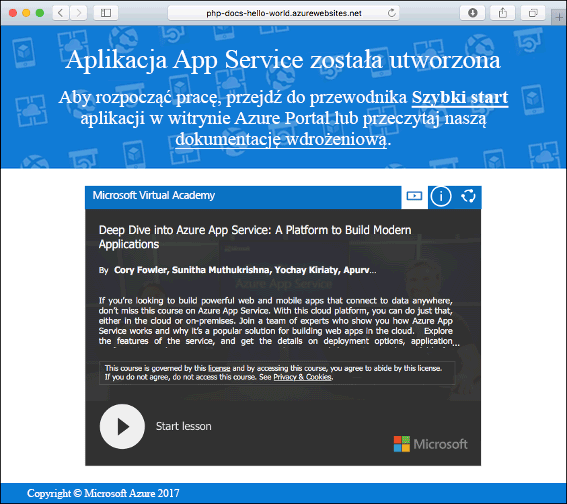
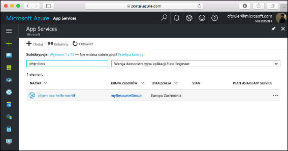
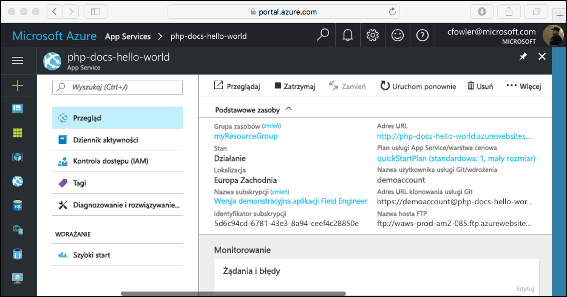

# <a name="create-a-php-web-app-in-app-service-on-linux"></a>Tworzenie aplikacji internetowej w języku PHP w usłudze App Service w systemie Linux

> [!NOTE]
> W tym artykule opisano wdrażanie aplikacji w usłudze App Service w systemie Linux. Aby wdrożyć aplikację w usłudze App Service w systemie _Windows_, zobacz [Tworzenie aplikacji internetowej PHP na platformie Azure](../app-service-web-get-started-php.md).
>

Usługa [App Service w systemie Linux](app-service-linux-intro.md) oferuje wysoce skalowalną i samonaprawialną usługę hostingu w Internecie przy użyciu systemu operacyjnego Linux. Ten samouczek Szybki start przedstawia sposób wdrażania aplikacji PHP w usłudze Azure App Service w systemie Linux. Aplikację internetową z wbudowanym obrazem możesz utworzyć przy użyciu [interfejsu wiersza polecenia platformy Azure](https://docs.microsoft.com/cli/azure/get-started-with-azure-cli) w usłudze Cloud Shell, a usługa Git umożliwia wdrażanie kodu w języku PHP w aplikacji internetowej.

![Przykładowa aplikacja działająca na platformie Azure]](media/quickstart-php/hello-world-in-browser.png)

Poniższe kroki możesz wykonać przy użyciu komputera z systemem Mac, Windows lub Linux.

## <a name="prerequisites"></a>Wymagania wstępne

Aby ukończyć ten przewodnik Szybki start:

* <a href="https://git-scm.com/" target="_blank">Zainstaluj oprogramowanie Git</a>
* <a href="https://php.net" target="_blank">Zainstaluj środowisko PHP</a>

[!INCLUDE [quickstarts-free-trial-note](../../../includes/quickstarts-free-trial-note.md)]

## <a name="download-the-sample"></a>Pobierz przykład

W oknie terminala uruchom następujące polecenia, aby sklonować aplikację przykładową na maszynę lokalną, a następnie przejść do katalogu zawierającego przykład kodu.

```bash
git clone https://github.com/Azure-Samples/php-docs-hello-world
cd php-docs-hello-world
```

## <a name="run-the-app-locally"></a>Lokalne uruchamianie aplikacji

Uruchom aplikację lokalnie, otwierając okno terminala i korzystając z polecenia `php` w celu uruchomienia wbudowanego serwera internetowego środowiska PHP.

```bash
php -S localhost:8080
```

Otwórz przeglądarkę internetową i przejdź do przykładowej aplikacji pod adresem `http://localhost:8080`.

Na stronie zostanie wyświetlony komunikat **Hello World!** z przykładowej aplikacji.


W oknie terminalu naciśnij kombinację klawiszy **Ctrl + C**, aby zamknąć serwer sieci Web.

[!INCLUDE [cloud-shell-try-it.md](../../../includes/cloud-shell-try-it.md)]

[!INCLUDE [Configure deployment user](../../../includes/configure-deployment-user.md)]

[!INCLUDE [Create resource group](../../../includes/app-service-web-create-resource-group.md)]

[!INCLUDE [Create app service plan](../../../includes/app-service-web-create-app-service-plan-linux.md)]

## <a name="create-a-web-app"></a>Tworzenie aplikacji sieci Web

[!INCLUDE [Create web app](../../../includes/app-service-web-create-web-app-php-no-h.md)] 

Przejdź do witryny, aby zobaczyć nowo utworzoną aplikację internetową z wbudowanym obrazem. Zastąp ciąg _&lt;nazwa aplikacji>_ nazwą swojej aplikacji internetowej.

```bash
http://<app_name>.azurewebsites.net
```



[!INCLUDE [Push to Azure](../../../includes/app-service-web-git-push-to-azure.md)] 

```bash
Counting objects: 2, done.
Delta compression using up to 4 threads.
Compressing objects: 100% (2/2), done.
Writing objects: 100% (2/2), 352 bytes | 0 bytes/s, done.
Total 2 (delta 1), reused 0 (delta 0)
remote: Updating branch 'master'.
remote: Updating submodules.
remote: Preparing deployment for commit id '25f18051e9'.
remote: Generating deployment script.
remote: Running deployment command...
remote: Handling Basic Web Site deployment.
remote: Kudu sync from: '/home/site/repository' to: '/home/site/wwwroot'
remote: Copying file: '.gitignore'
remote: Copying file: 'LICENSE'
remote: Copying file: 'README.md'
remote: Copying file: 'index.php'
remote: Ignoring: .git
remote: Finished successfully.
remote: Running post deployment command(s)...
remote: Deployment successful.
To https://<app_name>.scm.azurewebsites.net/<app_name>.git
   cc39b1e..25f1805  master -> master
```

## <a name="browse-to-the-app"></a>Przechodzenie do aplikacji

Przejdź do wdrożonej aplikacji za pomocą przeglądarki sieci Web.

```bash
http://<app_name>.azurewebsites.net
```

Przykładowy kod w języku PHP jest uruchamiany w aplikacji internetowej z wbudowanym obrazem.


**Gratulacje!** Udało Ci się wdrożyć pierwszą własną aplikację w języku PHP w usłudze App Service w systemie Linux.

## <a name="update-locally-and-redeploy-the-code"></a>Lokalne aktualizowanie i ponowne wdrażanie kodu

W katalogu lokalnym otwórz plik `index.php` w aplikacji w języku PHP i wprowadź niewielką zmianę w tekście ciągu obok polecenia `echo`:

```php
echo "Hello Azure!";
```

Zatwierdź zmiany w narzędziu Git, a następnie wypchnij zmiany kodu na platformę Azure.

```bash
git commit -am "updated output"
git push azure master
```

Po zakończeniu wdrożenia przejdź z powrotem do okna przeglądarki otwartego w kroku **przechodzenia do aplikacji**, a następnie odśwież stronę.


## <a name="manage-your-new-azure-web-app"></a>Zarządzanie nową aplikacją sieci Web platformy Azure

Przejdź do witryny <a href="https://portal.azure.com" target="_blank">Azure Portal</a>, aby zarządzać utworzoną aplikacją internetową.

W menu po lewej stronie kliknij pozycję **App Services**, a następnie kliknij nazwę swojej aplikacji internetowej platformy Azure.



Zostanie wyświetlona strona Omówienie aplikacji internetowej. Tutaj możesz wykonywać podstawowe zadania zarządzania, takie jak przeglądanie, zatrzymywanie, uruchamianie, ponowne uruchamianie i usuwanie.



Menu po lewej stronie zawiera różne strony służące do konfigurowania aplikacji. 

[!INCLUDE [cli-samples-clean-up](../../../includes/cli-samples-clean-up.md)]

## <a name="next-steps"></a>Następne kroki

> [!div class="nextstepaction"]
> [Środowisko PHP z bazą danych MySQL](tutorial-php-mysql-app.md)
