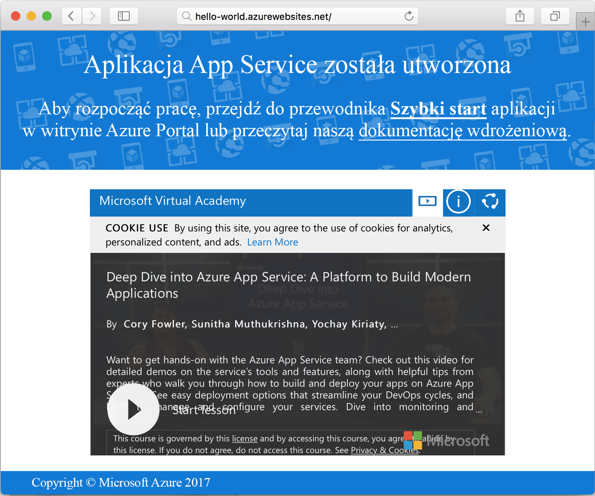

# <a name="create-a-ruby-app-in-app-service-on-linux"></a>Tworzenie aplikacji Ruby w usłudze App Service w systemie Linux

Usługa [App Service w systemie Linux](app-service-linux-intro.md) oferuje wysoce skalowalną i samonaprawialną usługę hostingu w Internecie. Ten przewodnik szybkiego startu pokazuje, jak utworzyć podstawową aplikację Ruby on Rails, a następnie wdrożyć ją na platformie Azure jako aplikację internetową w systemie Linux.


## <a name="prerequisites"></a>Wymagania wstępne

* <a href="https://www.ruby-lang.org/en/documentation/installation/#rubyinstaller" target="_blank">Zainstaluj oprogramowanie Ruby 2.4.1 lub nowsze</a>
* <a href="https://git-scm.com/" target="_blank">Zainstaluj oprogramowanie Git</a>

[!INCLUDE [quickstarts-free-trial-note](../../../includes/quickstarts-free-trial-note.md)]

## <a name="download-the-sample"></a>Pobierz przykład

W oknie terminala uruchom następujące polecenie, aby sklonować przykładowe repozytorium aplikacji na maszynę lokalną:

```bash
git clone https://github.com/Azure-Samples/ruby-docs-hello-world
```

## <a name="run-the-application-locally"></a>Uruchamianie aplikacji lokalnie

Uruchom serwer rails, aby umożliwić działanie aplikacji. Zmień katalog na *hello-world*, a polecenie `rails server` uruchomi serwer.

```bash
cd hello-world\bin
rails server
```

Przy użyciu przeglądarki internetowej przejdź pod adres `http://localhost:3000`, aby przetestować aplikację lokalnie.


## <a name="modify-app-to-display-welcome-message"></a>Modyfikowanie aplikacji w celu wyświetlania komunikatu powitalnego

Zmodyfikuj aplikację, aby wyświetlała komunikat powitalny. Najpierw musisz skonfigurować trasę, modyfikując plik *~/workspace/ruby-docs-hello-world/config/routes.rb*, tak aby zawierał trasę o nazwie `hello`.

  ```ruby
  Rails.application.routes.draw do
      #For details on the DSL available within this file, see http://guides.rubyonrails.org/routing.html
      root 'application#hello'
  end
  ```

Zmień kontroler aplikacji, aby zwracał komunikat w formie kodu HTML do przeglądarki. 

Otwórz plik *~/workspace/hello-world/app/controllers/application_controller.rb* do edycji. Zmodyfikuj klasę `ApplicationController`, aby wyglądała jak poniższy przykład kodu:

  ```ruby
  class ApplicationController > ActionController :: base
    protect_from_forgery with: :exception
    def hello
      render html: "Hello, world from Azure Web App on Linux!"
    end
  end
  ```

Aplikacja jest teraz skonfigurowana. Przy użyciu przeglądarki internetowej przejdź pod adres `http://localhost:3000`, aby potwierdzić główną stronę początkową.


[!INCLUDE [Try Cloud Shell](../../../includes/cloud-shell-try-it.md)]

[!INCLUDE [Configure deployment user](../../../includes/configure-deployment-user.md)]

## <a name="create-a-ruby-web-app-on-azure"></a>Tworzenie aplikacji internetowej Ruby na platformie Azure

Wymagana jest grupa zasobów, która zawiera zasoby wymagane przez aplikację internetową. Aby utworzyć grupę zasobów, użyj polecenia [az group create]().

```azurecli-interactive
az group create --location westeurope --name myResourceGroup
```

Użyj polecenia [az appservice plan create](https://docs.microsoft.com/cli/azure/appservice/plan#az_appservice_plan_create), aby utworzyć plan usługi aplikacji dla swojej aplikacji internetowej.

```azurecli-interactive
az appservice plan create --name myAppServicePlan --resource-group myResourceGroup --is-linux
```

Następnie wydaj polecenie [az webapp create](https://docs.microsoft.com/cli/azure/webapp), aby utworzyć aplikację internetową korzystającą z nowo utworzonego planu usługi. Zauważ, że środowisko uruchomieniowe ma ustawioną wartość `ruby|2.3`. Nie zapomnij zastąpić elementu `<app name>` unikatową nazwą aplikacji.

```azurecli-interactive
az webapp create --resource-group myResourceGroup --plan myAppServicePlan --name <app name> \
--runtime "ruby|2.3" --deployment-local-git
```

Dane wyjściowe polecenia ujawniają informacje o nowo utworzonej aplikacji internetowej, a także adres URL wdrożenia. Powinny one wyglądać podobnie do poniższego przykładu. Skopiuj adres URL do późniejszego użycia w tym samouczku.

```bash
https://<deployment user name>@<app name>.scm.azurewebsites.net/<app name>.git
```

Po utworzeniu aplikacji internetowej można wyświetlić stronę **Omówienie**. Przejdź do tej strony. Wyświetlana jest następująca strona powitalna:




## <a name="deploy-your-application"></a>Wdrażanie aplikacji

Uruchom następujące polecenia w celu wdrożenia lokalnej aplikacji w witrynie internetowej platformy Azure:

```bash
git remote add azure <Git deployment URL from above>
git add -A
git commit -m "Initial deployment commit"
git push azure master
```

Upewnij się, że operacje zdalnego wdrażania raportują powodzenie. Polecenia tworzą dane wyjściowe podobne do następującego tekstu:

```bash
remote: Using sass-rails 5.0.6
remote: Updating files in vendor/cache
remote: Bundle gems are installed into ./vendor/bundle
remote: Updating files in vendor/cache
remote: ~site/repository
remote: Finished successfully.
remote: Running post deployment command(s)...
remote: Deployment successful.
To https://<your web app name>.scm.azurewebsites.net/<your web app name>.git
  579ccb....2ca5f31  master -> master
myuser@ubuntu1234:~workspace/<app name>$
```

Po zakończeniu wdrożenia uruchom ponownie swoją aplikację internetową, aby wdrożenie weszło w życie, korzystając z polecenia [az webapp restart](https://docs.microsoft.com/cli/azure/webapp#az_webapp_restart), jak pokazano poniżej:

```azurecli-interactive
az webapp restart --name <app name> --resource-group myResourceGroup
```

Przejdź do swojej witryny i sprawdź wyniki.

```bash
http://<app name>.azurewebsites.net
```


> [!NOTE]
> Podczas ponownego uruchamiania aplikacji próba przeglądania wyników witryny powoduje wyświetlenie kodu stanu HTTP `Error 503 Server unavailable`. Proces ponownego uruchamiania może potrwać kilka minut.
>

[!INCLUDE [Clean-up section](../../../includes/cli-script-clean-up.md)]

## <a name="next-steps"></a>Następne kroki

[Azure App Service on Linux FAQ](https://docs.microsoft.com/azure/app-service-web/app-service-linux-faq) (Usługa Azure App Service w systemie Linux — często zadawane pytania)
