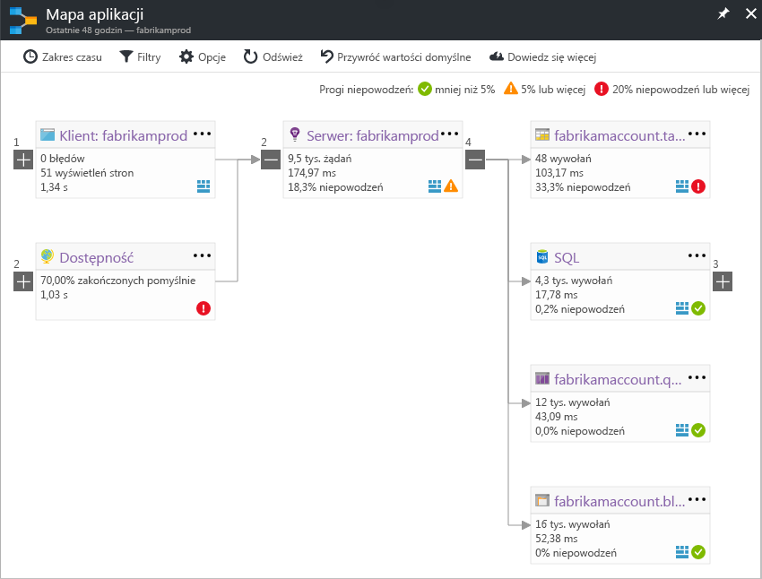

# Mapowanie aplikacji w usłudze Application Insights
W [Azure Application Insights](app-insights-overview.md), mapa aplikacji jest układu wizualnego relacji zależności składników aplikacji. Każdego składnika zawiera kluczowych wskaźników wydajności, takich jak ładowania, wydajności błędów i alerty, ułatwiające ustalenie dowolny składnik przyczyną problemu z wydajnością lub błędu. Możesz kliknąć za pośrednictwem z każdego składnika, do bardziej szczegółowych diagnostyki, takich jak zdarzenia usługi Application Insights. Jeśli aplikacja korzysta z usług Azure, możesz również kliknąć za pośrednictwem do diagnostyki Azure, takich jak zalecenia doradcy bazy danych SQL.

Podobnie jak inne wykresy można przypiąć mapę aplikacji do pulpitu nawigacyjnego platformy Azure, gdzie jest pełną funkcjonalność. 

## Otwórz mapę aplikacji
Otwórz mapę z bloku Omówienie aplikacji:

Pokazuje mapy:

* Testy dostępności
* Składnik po stronie klienta (monitorowane przy użyciu zestawu SDK JavaScript)
* Składnik po stronie serwera
* Zależności składniki klienta i serwera

Można zwijać i rozwijać grupy łącze zależności:

Jeśli masz wiele zależności jednego typu (SQL, HTTP itp.) są zgrupowane. 

## Dodatkowych problemów
Każdy węzeł ma odpowiednie wskaźniki, jak szybkości ładowania, wydajności i błąd dla tego składnika. 

Ikonami ostrzeżenia zaznacz możliwych problemów. Pomarańczowe ostrzeżenie oznacza, że błędy występują w żądaniach, wyświetleń strony lub wywołania zależności. Czerwony oznacza współczynnik awaryjności powyżej 5%. Jeśli chcesz dostosować tych progów, Otwórz opcje.

Aktywne alerty również Pokaż zapasową: 

Jeśli używasz usług SQL Azure jest ikonę, która pokazuje, kiedy są zalecenia, w jaki sposób można poprawić wydajność. 

Kliknij dowolną ikonę, aby uzyskać więcej szczegółów:

## Kliknij diagnostyczne za pośrednictwem
Każdego z węzłów na mapie oferuje docelowe kliknij za pomocą diagnostyki. Opcje się różnić w zależności od typu węzła.

Dla składników, które są hostowane na platformie Azure obejmują bezpośrednich łączy do nich.

## Filtry i zakres czasu
Domyślnie mapy znajduje się podsumowanie wszystkich danych dostępna dla wybranego zakresu czasu. Ale odfiltrowaniu może zawierać tylko nazwy operacji lub zależności.

* Nazwa operacji: dotyczy zarówno wyświetleń strony i typy żądania po stronie serwera. Po wybraniu tej opcji mapy zawiera wskaźnik KPI na węźle serwera/klienta tylko wybranej operacji. Przedstawia on wywoływany w kontekście tych określonych operacji zależności.
* Nazwa podstawowa zależności: dotyczy to również zależności przeglądarki AJAX i zależności po stronie serwera. Jeśli raport dane telemetryczne zależności niestandardowych przy użyciu interfejsu API TrackDependency pojawią się również w tym miejscu. Możesz wybrać zależności do wyświetlenia na mapie. Obecnie to pole wyboru nie filtruje żądania po stronie serwera lub wyświetleń strony po stronie klienta.

## Zapisz filtry
Aby zapisać filtry zostały zastosowane, przypiąć widok filtrowany na [pulpitu nawigacyjnego](app-insights-dashboards.md).

## Okienko błędu
Po kliknięciu węzła w mapie okienko błędu jest wyświetlana po prawej stronie podsumowania błędów dla tego węzła. Awarie są najpierw pogrupowane według Identyfikatora operacji i pogrupowane według identyfikatora problemu.

Kliknięcie awarii przejście do ostatniej wystąpienia tego błędu.

## Kondycja zasobów
W przypadku niektórych typów zasobów kondycja zasobu jest wyświetlany w górnej części okienka błędu. Na przykład kliknięcie węzła SQL spowoduje wyświetlenie kondycji bazy danych i alerty, które mają być uruchamiane.

Można kliknąć nazwę zasobu, aby wyświetlić przegląd standardowe metryki dla tego zasobu.

## System end-to-end aplikacji mapy

*Wymaga zestawu SDK w wersji 2.3 lub nowszej*

Jeśli aplikacja ma kilka składników — na przykład usługi zaplecza dodatkowo do aplikacji sieci web -, można wyświetlić wszystkich na mapie jednej zintegrowanej aplikacji.

Mapa aplikacji znajduje węzły serwera, wykonując wszystkie wywołania zależności HTTP między serwerami z zestawem SDK Insights aplikacji, które zostały zainstalowane. Przyjęto, że każdy zasób usługi Application Insights zawiera jeden serwer.

### Mapa aplikacji usługi roli (wersja zapoznawcza)

Funkcja mapy usługi roli aplikacji w wersji zapoznawczej umożliwiają mapy aplikacji z wieloma serwerami wysyłanie danych do tego samego zasobu usługi Application Insights / klucz instrumentacji. Serwery w mapie są podzielone przez właściwość cloud_RoleName elementów telemetrii. Ustaw *Mapa aplikacji usługi roli* do *na* z bloku Podgląd, aby włączyć tę konfigurację.

Ta metoda może być wskazane w aplikacji micro-services lub w innych sytuacjach, w którym ma zostać korelowanie zdarzeń na wielu serwerach w ramach pojedynczego zasobu usługi Application Insights.

## Połączenia wideo

> [!VIDEO https://channel9.msdn.com/events/Connect/2016/112/player] 

## Opinia
Prześlij opinię za pośrednictwem portalu opinie.

## Następne kroki

* [Witryna Azure Portal](https://portal.azure.com)
