# Omówienie usługi Application Insights dla opracowywania oprogramowania

Z [usługi Application Insights](app-insights-overview.md), można szybko znaleźć się, jak aplikacja działa i jest używany w przypadku na żywo. W przypadku problemu go informuje o go, pomaga ocenić wpływ i pomaga ustalić przyczynę.

Oto konta od zespołu rozwija aplikacji sieci web:

* *"Kilku dni temu, wdrożyliśmy"drobna"poprawki. Firma Microsoft nie został uruchomiony przebiegu testowego szerokie, ale Niestety niektórych nieoczekiwane zmiany otrzymano scalone ładunek, co powoduje niezgodność między z przodu i zaplecza. Natychmiast uruchamiany naszych alert wzrósł wyjątki serwera, i zostały wprowadziliśmy świadome sytuacji. Kilka kliknięć optymalizacji w portalu usługi Application Insights dotarliśmy wystarczających informacji z callstacks wyjątek, aby zawęzić problem. Firma Microsoft niezwłocznie wycofana i ograniczone szkody. Application Insights wprowadził ta część devops cykl bardzo łatwe i możliwością."*

W tym artykule możemy wykonaj zespołu w banku firmy Fabrikam, który rozwija system banku online (OBS), aby zobaczyć, jak korzystają z usługi Application Insights szybkie odpowiadanie na klientów i aktualizacje.  

Zespół działa w cyklu opracowywania oprogramowania, przedstawione na poniższej ilustracji:

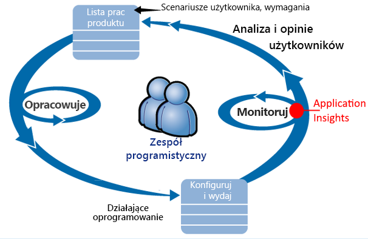

Wymagania dotyczące źródła danych do ich programowanie zaległości (Lista zadań). Funkcje te działają w skrócie przebiegów, które często dostarczają oprogramowania pracy — zwykle w postaci ulepszenia i rozszerzenia do istniejącej aplikacji. Aktywnej aplikacji jest często aktualizowana o nowe funkcje. Mimo że jest na żywo, zespół monitoruje wydajności i użycia za pomocą usługi Application Insights. Źródła danych APM do ich zaległości programowanie.

Zespół używa usługi Application Insights do aplikacji sieci web na żywo uważnie monitorować:

* Wydajność. Chcą, aby zrozumieć, jak czas reakcji zależy od liczby żądań; ile procesora CPU, sieci, dysku i inne zasoby są używane; Kod aplikacji, w których spowolnieniu wydajności; i wąskich gardeł.
* Błędy. Jeśli istnieją wyjątki lub nieudanych żądań, lub jeśli licznik wydajności nie jest poza zakresem doświadczenia, zespół musi znać szybko, aby potencjalnie akcji.
* Użycie. Przypadku nową funkcję, zespół chce dowiedzieć się, w jakim jest używany i czy użytkownicy mają trudności z nim.

Ta funkcja pozwala skupić się na opinie część cyklu:

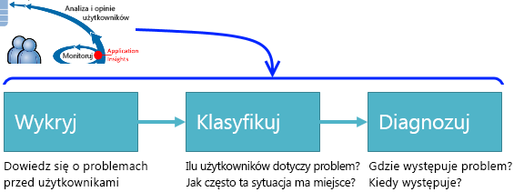

## Wykryj niską dostępności
Marcela Markova jest starszy developer zespołu OBS i Trwa liderem monitorowania wydajności w trybie online. Użytkownik konfiguruje kilka [testów dostępności](app-insights-monitor-web-app-availability.md):

* Adres URL jednym testu dla strony głównej docelowej dla aplikacji, http://fabrikambank.com/onlinebanking/. Ustawia ona kryteria HTTP o kodzie 200 i tekst "Witaj!". W przypadku niepowodzenia tego testu jest poważny problem z siecią lub serwerów lub może być problem wdrażania. (Lub ktoś zmienił Zapraszamy! komunikat na stronie bez umożliwienie jej znanych).
* Lepszy badanie wieloetapowych, loguje i pobiera bieżącego konta wyświetlania, sprawdzanie kilku szczegółów klucza na każdej stronie. Ten test sprawdza, czy działa łącze do bazy danych kont. Używa identyfikatora klienta fikcyjne: niektóre z nich, które są obsługiwane dla celów testowych.

Te testy Konfigurowanie Marcela to pewność, że zespół będzie szybko wiedzieć o wszelkich awarii.  

Błędy wyświetlane jako czerwone kropki na wykresie testu sieci web:

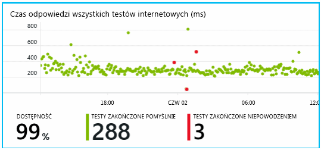

Ale co ważniejsze, pocztą e-mail alert o niezgodności zespół deweloperów. W ten sposób wiedzą o tym przed niemal wszystkich klientów.

## Monitorowanie wydajności
Na stronie Przegląd w usłudze Application Insights jest wykres przedstawiający różnych [kluczowe metryki](app-insights-web-monitor-performance.md).

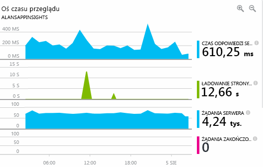

Czas ładowania strony przeglądarki jest pochodną telemetrii wysyłane bezpośrednio ze stron sieci web. Czas odpowiedzi serwera, liczba żądań na serwerze i liczba żądań zakończonych niepowodzeniem są wszystkie mierzony na serwerze sieci web i wysyłane do usługi Application Insights z tego miejsca.

Marcela jest nieco związane z wykres odpowiedzi serwera. Ten wykres pokazuje średni czas od kiedy serwer odbiera żądanie HTTP z przeglądarki użytkownika i kiedy zwraca odpowiedź. Nie jest rzadko zobaczyć zmianę na tym wykresie, jak obciążenia w systemie. Ale w takim przypadku wydaje się być korelacja małych wzrostu liczby żądań, a big wzrośnie w czasie odpowiedzi. Który może wskazywać system działa tylko podczas pracy z maksymalną wydajnością.

Użytkownik otwiera wykresy serwerów:

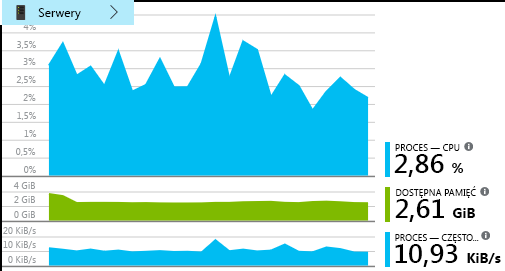

Wydaje się nie logowania ograniczenia zasobów, dlatego może być nierówności na wykresach odpowiedzi serwera są po prostu zbieżność.

## Ustaw alerty w celu spełnienia celów
Niemniej jednak użytkownik chce śledzić na czas odpowiedzi. Komputery przechodzą zbyt duże, chce od razu wiedzieć o nim.

Dlatego użytkownik ustawia [alert](app-insights-metrics-explorer.md), dla większy niż próg typowy czas odpowiedzi. Dzięki temu jej pewność, że użytkownik będzie wiadomo o nim gdy czas reakcji wolno.

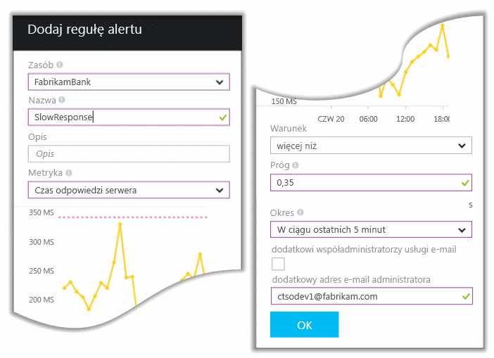

Alerty można ustawić na różnych innych metryk. Na przykład można otrzymywać wiadomości e-mail, jeśli wzrośnie liczba wyjątków lub niski przechodzi ilość dostępnej pamięci lub brak szczytu w żądań klientów.

## Poinformują Cię o alerty o wykryciu inteligentne
Następnego dnia alertów e-mail odbierane z usługi Application Insights. Jednak gdy użytkownik otwiera, użytkownik stwierdza, że nie jest ona ustawiona alert czas odpowiedzi. Zamiast tego informuje o tym jej czy został nagły wzrost nieudanych żądań — to znaczy żądań, które zwrócone kodów błędu 500 lub więcej.

Żądań zakończonych niepowodzeniem są, gdzie użytkownicy jak już wspomniano błędu — zwykle po wyjątek w kodzie. Może być zobaczy komunikat informujący o tym "Niestety nie można teraz zaktualizować szczegóły". Lub na bezwzględne najgorszy Zakłopotanie, zrzut stosu jest wyświetlany na ekranie użytkownika, dzięki uprzejmości: serwer sieci web.

Ten alert jest zaskoczeniem, ponieważ czasu, gdy użytkownik przeglądał, liczba nieudanych żądań encouragingly niski. Mała liczba błędów jest w zajęty serwer.

Również nieco zaskoczeniem dla jej ponieważ użytkownik nie ma do konfigurowania tego alertu. Usługa Application Insights obejmują wykrywanie inteligentne. Automatycznie go można dostosować do wzorca zwykle awarii aplikacji i "jest używany do" błędów na konkretnej stronie lub mocno obciążony lub z innych metryk. Alarm uruchamia tylko wtedy, gdy wzrost powyżej pochodzi mogą się spodziewać.

Jest to bardzo przydatne wiadomości e-mail. Go nie tylko podnieść alarmu. Robi zbyt wiele klasyfikacji i diagnostycznych pracy.

Przedstawia on dotyczy ilu użytkowników i strony sieci web lub operacji. Marcela można zdecydować, czy użytkownik musi pobrać całego zespołu pracujących na tym, jak szczegółowego fire lub czy można go zignorować dopiero w następnym tygodniu.

Wiadomości e-mail zawiera także określonego wyjątek wystąpił czy — nawet więcej interesujące — że błędu jest skojarzony z niepowodzeniem wywołania określonej bazy danych. W tej sekcji wyjaśniono, dlaczego usterki nagle pojawił się nawet zespołu w Marcela ostatnio nie wdrożono żadnych aktualizacji.

Marcella wysyła polecenie ping wiodące zespołu bazy danych na podstawie tej wiadomości e-mail. Użytkownik uzyskuje informacje o ich zwolnienie poprawki w ciągu ostatnich pół godziny; i Niestety, może być mogło być zmiany schematu pomocnicza...

Dlatego problemu znajduje się na sposobem jest ustalany, nawet przed badania dzienników i w ciągu 15 minut, jego wynikające. Jednak Marcela kliknie łącze, aby otworzyć usługę Application Insights. Użytkownik może uzyskać bazy danych nie powiodło się wywołanie w skojarzonej listy wywołania zależności i otwiera bezpośrednio na żądanie nie powiodło się.

## Wykryj wyjątków
Z niewielki instalacji [wyjątki](app-insights-asp-net-exceptions.md) zgłoszony do usługi Application Insights automatycznie. One również można przechwycić jawnie przez wstawianie wywołania do [funkcji TrackException()](app-insights-api-custom-events-metrics.md#trackexception) do kodu:  

    var telemetry = new TelemetryClient();
    ...
    try
    { ...
    }
    catch (Exception ex)
    {
       // Set up some properties:
       var properties = new Dictionary <string, string>
         {{"Game", currentGame.Name}};

       var measurements = new Dictionary <string, double>
         {{"Users", currentGame.Users.Count}};

       // Send the exception telemetry:
       telemetry.TrackException(ex, properties, measurements);
    }

Zespołu Fabrikam Bank powstał praktyka zawsze wysyłania danych telemetrycznych z powodu wyjątku, chyba że istnieje oczywiste odzyskiwania.  

W rzeczywistości jest szersze niż ich strategii: wysyłają dane telemetryczne w każdym przypadku, gdy klient jest sfrustrowani w ich potrzeb w celu czy lub nie odpowiada wyjątek w kodzie. Na przykład jeśli system zewnętrzny transferu między bank zwraca komunikat "nie można ukończyć tej transakcji" jakiegoś powodu operacyjne (nie błąd klienta) następnie śledzą tego zdarzenia.

    var successCode = AttemptTransfer(transferAmount, ...);
    if (successCode < 0)
    {
       var properties = new Dictionary <string, string>
            {{ "Code", returnCode, ... }};
       var measurements = new Dictionary <string, double>
         {{"Value", transferAmount}};
       telemetry.TrackEvent("transfer failed", properties, measurements);
    }

TrackException jest używane do zgłaszania wyjątkami, ponieważ wysyła kopię stosu. TrackEvent jest używane do zgłaszania inne zdarzenia. Możesz dołączyć wszystkie właściwości, które mogą być przydatne do rozpoznania.

Wyjątki i zdarzenia wyświetlane w [diagnostycznych wyszukiwania](app-insights-diagnostic-search.md) bloku. Aby przejść do szczegółów w je, aby wyświetlić dodatkowe właściwości i ślad stosu.

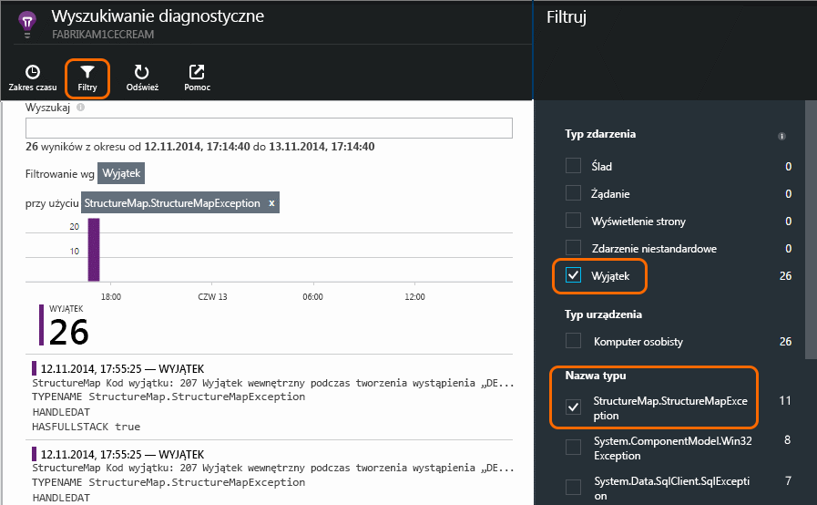

## Aktywne monitorowanie
Marcela nie tylko znajdują się wokół oczekiwanie na alerty. Wkrótce po każdym ponownego wdrażania, klika przedstawia [czas reakcji](app-insights-web-monitor-performance.md) — zarówno rysunek ogólny, jak i tabeli najwolniejsze żądania, a także liczby wyjątków.  

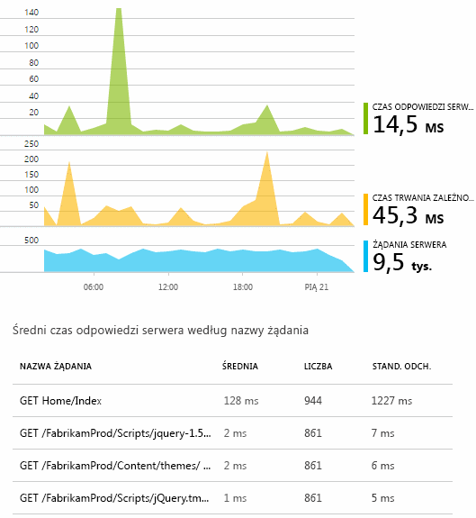

Ona ocenić wpływ wydajności każdego wdrożenia zwykle porównanie każdej tydzień z ostatniego. W przypadku nagłego pogorszenia, klika który zgłasza z odpowiednimi deweloperów.

## Klasyfikacji problemów
Klasyfikacja — ocenę ważności i zakres problem — jest to pierwszy etap po wykryciu. Należy nazywamy limit zespołu o północy? Lub może on pozostać aż do następnego wygodny przerwa w zaległości? Istnieją pewne ważne pytania w klasyfikacji.

Jak często jest wykonywane? Wykresy w bloku omówienie nadaj niektóre perspektywy problemu. Na przykład aplikacji firmy Fabrikam wygenerowanych cztery alerty testu sieci web co noc. Patrzeć na wykresie w nocy, zespół mogliby zobaczyć wystąpiły rzeczywiście niektórych punktów czerwony, chociaż większość nadal testy zostały zielony. Przechodzenia do wykresu dostępności szczegółów, jest jasne, czy zostały wszystkie te sporadyczne problemy z lokalizacji jeden test. Oczywiście była wpływające na tylko jedną trasę problem z siecią i najprawdopodobniej będzie wyczyść samej siebie.  

Z kolei znacznej i stabilna wzrostu na wykresie wyjątek razy liczby lub odpowiedzi jest oczywiście coś do awaryjne o.

Działanie przydatne Klasyfikacja jest spróbuj ją samodzielnie. Jeśli napotkasz ten sam problem, wiadomo, że jest prawdziwe.

Jaka część użytkowników dotyczy? Uzyskanie odpowiedzi nierównej dzielenia współczynnik awaryjności przez liczba sesji.

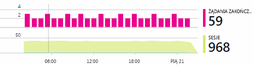

W przypadku odpowiedzi powolne porównać tabeli najwolniejsze odpowiada żądań z częstotliwością użycia każdej strony.

Jak ważna jest zablokowane scenariusz? Jeśli jest to problem funkcjonalności blokuje konkretnego scenariusza, czy ma znaczenie znacznie? Jeśli klienci nie mogą ich rachunków, jest to poważny; Jeśli nie mogą zmieniać swoje preferencje kolorów ekranu, może być go wykonać. Szczegóły zdarzenia lub wyjątek lub tożsamość powolne strony informuje o którym występują problemy dotyczące klientów.

## Diagnozowanie problemów
Diagnostyka nie jest dość taki sam, jak debugowania. Przed rozpoczęciem śledzenia przez kod powinien mieć wstępne informacje o tym, dlaczego, gdzie i kiedy występuje problem.

**Gdy jest wykonywana?** Widok historycznych oferowany przez zdarzenia i metryki wykresy ułatwia służące do skorelowania efekty z możliwych przyczyn. Jeśli występują sporadyczne pików kursów czas lub wyjątku odpowiedzi, obejrzyj liczbę żądań: Jeśli pików go w tym samym czasie, a następnie prawdopodobnie problem z zasobów. Czy trzeba przypisać więcej procesorów ani pamięci? Czy jest zależność, która nie może zarządzać obciążenia?

**Jest to nam?**  Ma gwałtowny spadek wydajności danego typu żądania — na przykład jeśli odbiorca chce otrzymywać instrukcji konta -, istnieje możliwość może być zewnętrzny podsystemu zamiast aplikacji sieci web. W Eksploratorze metryk wybierz współczynnik awaryjności zależności i czas trwania zależności stawki i porównać ich historii w ciągu ostatnich kilku godzin lub dni z tym problemem, których zostało wykryte. Jeśli są korelowanie zmiany, zewnętrznych podsystemu może być stronę.  

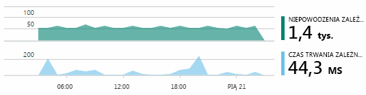

Niektóre problemy powolne zależności są problemy używanie funkcji geolokalizacji. Bank firmy Fabrikam używa maszyn wirtualnych platformy Azure i wykryte, że ma przypadkowo się one serwera sieci web i serwer kont w różnych krajach. Znacznej poprawy został przełączony w tryb przy użyciu funkcji migracji jeden z nich.

**Do czego możemy?** Jeśli problem nie zostanie wyświetlone w zależności, a jeśli go nie zawsze istnieje, prawdopodobnie jest spowodowany przez ostatnich zmian. Historyczne perspektywy podał wykresów metryki i zdarzenia ułatwia służące do skorelowania nagłym zmiany z wdrożeniami. Który zawęża wyszukiwania dla problemu. Aby zidentyfikować, które wiersze w kodzie aplikacji spowolnieniu wydajności, należy włączyć Application Insights profilera. Zapoznaj się z [profilowania aplikacji sieci web platformy Azure na żywo za pomocą usługi Application Insights](./app-insights-profiler.md). Po włączeniu profilera, zobaczysz śledzenia podobny do następującego. W tym przykładzie jest widoczny która metoda *GetStorageTableData* spowodował problem.  

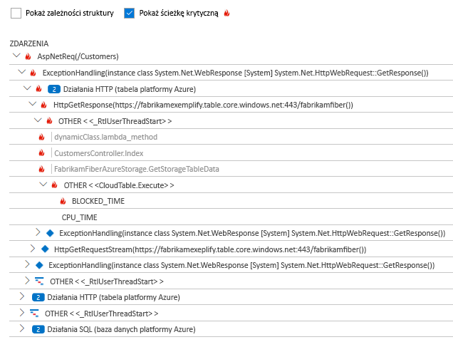

**Co się dzieje?** Niektóre problemy występują rzadko i może być trudne do śledzenia podczas testów w trybie offline. To wszystko, co można zrobić próba przechwytywania błędu, jeśli występuje on na żywo. Możesz sprawdzić zrzuty stosu w raportach wyjątku. Ponadto można napisać śledzenia wywołań, Twoje struktury rejestrowania ulubionych albo TrackTrace() lub funkcji TrackEvent().  

Firma Fabrikam miał problem tymczasowy w przypadku transferów między kontami, ale tylko w przypadku niektórych typów kont. Aby lepiej zrozumieć, co zostało dzieje, wstawiane one wywołania TrackTrace() w punktach klucza w kodzie dołączanie typu konta jako właściwość dla każdego wywołania. Który ułatwić filtrowanie tylko te dane śledzenia diagnostycznego wyszukiwania. Wartości parametrów jako właściwości i środki one również dołączone do śledzenia wywołań.

## Odpowiadanie na wykryte problemy
Gdy już zdiagnozować problem, możesz wprowadzić planu, aby go rozwiązać. Może być należy wycofać zmiany lub może być tylko Przejdź dalej i rozwiąż problem. Po zakończeniu poprawkę usługi Application Insights informuje, czy powiodło się.  

Zespół deweloperów Fabrikam Bank podjąć bardziej ustrukturyzowanymi podejście do pomiaru wydajności niż kiedyś przed ich użyciem usługi Application Insights.

* Na stronie przeglądu usługi Application Insights one Ustaw cele wydajności pod względem określonej miary.
* Projekt miary wydajności do aplikacji od początku, takich jak metryki pomiaru postępu użytkownika za pośrednictwem "lejki."  

## Monitorowanie aktywności użytkownika
Gdy czas odpowiedzi jest stale prawidłowy i istnieje kilka wyjątków, zespół deweloperów można przejść do użyteczność. Ich można traktować temat poprawić komfort użytkowników oraz zachęcają więcej użytkowników w celach żądany.

Usługa Application Insights można również co zrobić przez użytkowników z aplikacją. Po działa bez problemów, zespół chce wiedzieć, funkcji, które są najbardziej popularnych co użytkowników, takich jak lub mieć trudności z i jak często wracają. Która będzie ułatwiała ich priorytety nadchodzących pracy. I można zaplanować zmierzenie powodzenia każdej funkcji w ramach cyklu programowania.

Na przykład podróży typowy użytkownik za pośrednictwem witryny sieci web ma Wyczyść "lejka." Wielu klientów przyjrzeć się stawki różnego rodzaju pożyczki. Mniejsza liczba przejdź do wypełnienia formularza oferty. Tych, którzy pobrać oferty kilka Przejdź dalej i wyjmij pożyczki.

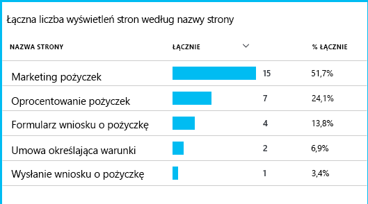

Biorąc pod uwagę, gdy największej liczby klientów porzucić, firmy mogą pracować się, jak mogą uzyskać większą liczbę użytkowników za pomocą do dołu lejka. W niektórych przypadkach może być błąd środowiska (UX) użytkownika — na przykład przycisk 'Dalej' jest trudne do znalezienia lub zgodnie z instrukcjami nie są oczywiste. Bardziej prawdopodobne są bardziej znaczących powodów biznesowych do listy dokumentów: może być stawki pożyczki są zbyt duże.

Niezależnie od przyczyny, dane pomaga zespołu wyglądają co robią użytkownicy. Kolejnych wywołań śledzenia mogą być wstawiane do pracy szczegółowe. Funkcji TrackEvent() może służyć do liczby wszystkie akcje użytkownika, z dokładniej kliknięć poszczególnych przycisku do znaczących osiągnięć, takich jak płatności poza pożyczki.

Pobieranie umożliwia zespołu o informacje dotyczące działań użytkownika. Dzisiaj zawsze, gdy projekt nową funkcję, działają się, jak będzie uzyskują swoją opinię na temat jej użycia. Projekt śledzenia wywołań funkcji od początku. Używają opinii zwiększające funkcję w każdym cyklu programowania.

[Przeczytaj więcej na temat śledzenia użycia](app-insights-usage-overview.md).

## Zastosuj cyklu opracowywania oprogramowania
Jest tak jak jedno użycie zespołu usługi Application Insights nie tylko w celu rozwiązywania problemów z poszczególnych, ale aby zwiększyć ich cyklu programistycznym. Mam nadzieję, że jej została podana sugestii dotyczących sposobu usługi Application Insights ułatwia zarządzanie aplikacjami wydajności w aplikacjach.

## Połączenia wideo

> [!VIDEO https://channel9.msdn.com/events/Connect/2016/112/player]

## Następne kroki
Możesz rozpocząć pracę na kilka sposobów, w zależności od właściwości aplikacji. Wybierz, co dogodny:

* [Aplikacja sieci web ASP.NET](app-insights-asp-net.md)
* [Aplikacja sieci web Java](app-insights-java-get-started.md)
* [Aplikacja sieci web node.js](app-insights-nodejs.md)
* Już wdrożone aplikacje hostowane na [IIS](app-insights-monitor-web-app-availability.md), [J2EE](app-insights-java-live.md), lub [Azure](app-insights-azure.md).
* [Strony sieci Web](app-insights-javascript.md) -jednej strony, aplikacji lub strony sieci web zwykłej — Użyj tej samodzielnie lub oprócz opcje serwera.
* [Badania dostępności](app-insights-monitor-web-app-availability.md) do testowania aplikacji z publicznego Internetu.
