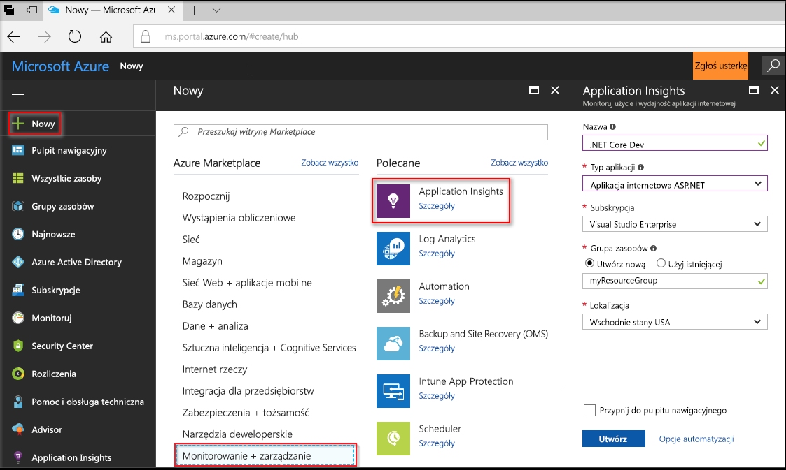
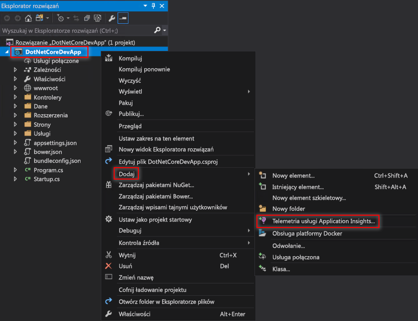
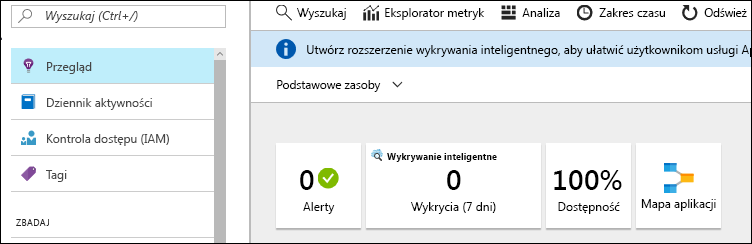
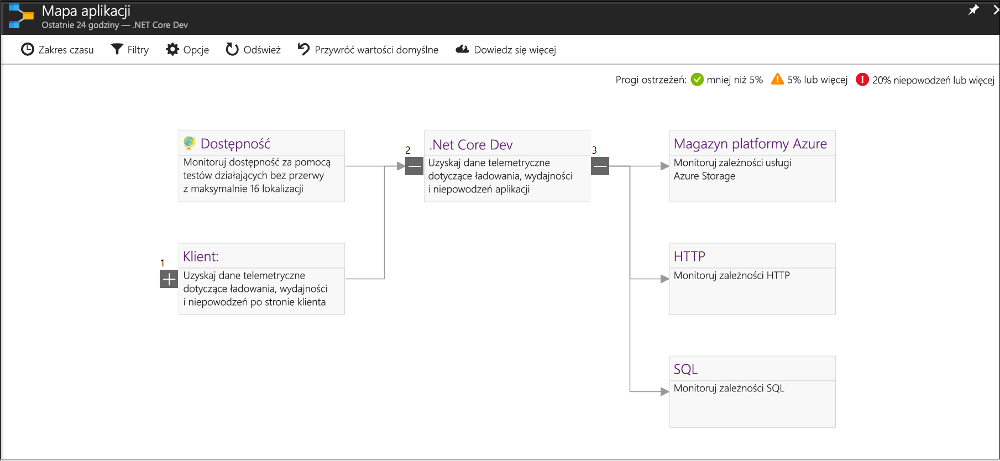
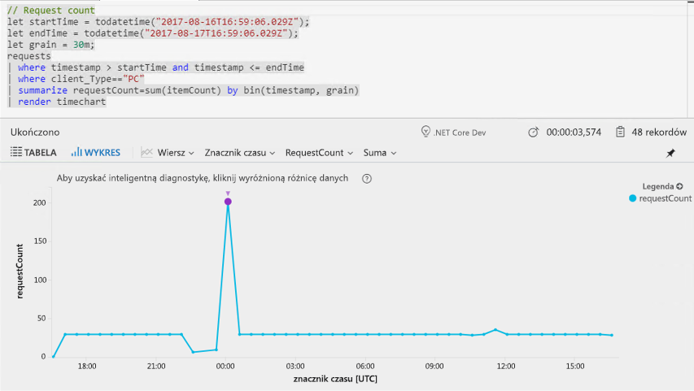
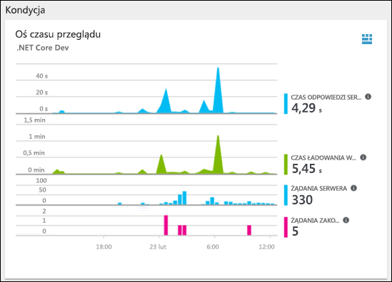
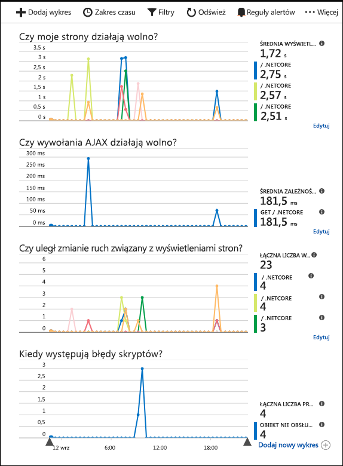

# <a name="start-monitoring-your-aspnet-core-web-application"></a>Rozpoczynanie monitorowania aplikacji internetowej ASP.NET Core

Usługa Azure Application Insights umożliwia łatwe monitorowanie dostępności, wydajności i użycia aplikacji internetowej. Pozwala też szybko identyfikować i diagnozować błędy w aplikacji bez oczekiwania na zgłoszenie ich przez użytkownika. 

Ten przewodnik Szybki start przeprowadzi Cię przez proces dodawania zestawu SDK usługi Application Insights do istniejącej aplikacji internetowej ASP.Net Core. 

## <a name="prerequisites"></a>Wymagania wstępne

Aby ukończyć ten przewodnik Szybki Start:

- Zainstaluj program [Visual Studio 2017](https://www.visualstudio.com/downloads/) z następującymi pakietami roboczymi:
  - Tworzenie aplikacji na platformie ASP.NET i aplikacji internetowych
  - Tworzenie aplikacji na platformie Azure
- [Instalowanie zestawu SDK programu .NET Core 2.0](https://www.microsoft.com/net/core)
- Wymagana jest subskrypcja platformy Azure i istniejąca aplikacja internetowa .NET Core.

Jeśli nie masz aplikacji internetowej ASP.NET Core, możesz ją utworzyć, wykonując instrukcje przedstawione w [przewodniku tworzenia aplikacji internetowej ASP.NET Core](https://docs.microsoft.com/aspnet/core/tutorials/publish-to-azure-webapp-using-vs).

Jeśli nie masz subskrypcji platformy Azure, przed rozpoczęciem utwórz [bezpłatne](https://azure.microsoft.com/free/) konto.

## <a name="log-in-to-the-azure-portal"></a>Logowanie do witryny Azure Portal

Zaloguj się do witryny [Azure Portal](https://portal.azure.com/).

## <a name="enable-application-insights"></a>Włączanie usługi Application Insights

Usługa Application Insights umożliwia zbieranie danych telemetrycznych z dowolnej aplikacji połączonej z Internetem, niezależnie od tego, czy jest to aplikacja lokalna czy aplikacja w chmurze. Aby rozpocząć wyświetlanie tych danych, wykonaj poniższe czynności.

1. Wybierz pozycję **Nowy**  >  **Monitorowanie i zarządzanie**  >  **Application Insights**.

   

    Zostanie wyświetlone okno konfiguracji. Wypełnij pola wejściowe, używając poniższej tabeli.

    | Ustawienia        |  Wartość           | Opis  |
   | ------------- |:-------------|:-----|
   | **Nazwa**      | Wartość unikatowa w skali globalnej | Nazwa identyfikująca monitorowaną aplikację |
   | **Typ aplikacji** | Aplikacja internetowa platformy ASP.NET | Typ monitorowanej aplikacji |
   | **Grupa zasobów**     | myResourceGroup      | Nazwa nowej grupy zasobów hostującej dane usługi App Insights |
   | **Lokalizacja** | Wschodnie stany USA | Wybierz lokalizację w pobliżu Ciebie lub w pobliżu miejsca hostowania aplikacji |

2. Kliknij przycisk **Utwórz**.

## <a name="configure-app-insights-sdk"></a>Konfigurowanie zestawu SDK usługi App Insights

1. Otwórz **projekt** aplikacji internetowej ASP.NET Core w programie Visual Studio, kliknij prawym przyciskiem myszy nazwę aplikacji w **Eksploratorze rozwiązań**, a następnie wybierz pozycję **Dodaj**  >  **Telemetria usługi Application Insights**.

    

2. Kliknij przycisk **Rozpocznij bezpłatnie**, wybierz **istniejący zasób** utworzony w witrynie Azure Portal, a następnie kliknij pozycję **Zarejestruj**.

3. Wybierz pozycję **Debuguj**  >  **Uruchom bez debugowania** (Ctrl+F5), aby uruchomić aplikację

> [!NOTE]
> Dane zaczną pojawiać się w portalu po 3–5 minutach. W przypadku aplikacji testowej o małym natężeniu ruchu należy pamiętać, że większość metryk jest przechwytywana tylko wtedy, gdy istnieją aktywne żądania lub operacje.

## <a name="start-monitoring-in-the-azure-portal"></a>Rozpoczynanie monitorowania w witrynie Azure Portal

1. Możesz teraz ponownie otworzyć stronę **Przegląd** usługi Application Insights w witrynie Azure Portal, wybierając pozycję **Projekt**  >  **Application Insights**  >  **Otwórz portal usługi Application Insights** w celu wyświetlenia szczegółowych informacji o obecnie uruchomionej aplikacji.

   

2. Kliknij pozycję **Mapa aplikacji**, aby uzyskać wizualny układ relacji zależności między składnikami aplikacji. Każdy składnik przedstawia kluczowe wskaźniki wydajności, takie jak obciążenie, wydajność, błędy i alerty.

   

3. Kliknij ikonę **Analiza aplikacji** .  Spowoduje to otwarcie strony **Analiza usługi Application Insights**, która udostępnia zaawansowany język zapytań na potrzeby analizy wszystkich danych zbieranych przez usługę Application Insights. W tym przypadku jest generowane zapytanie, które renderuje liczbę żądań w formie wykresu. Możesz pisać własne zapytania do analizy innych danych.

   

4. Wróć do strony **Przegląd** i sprawdź **oś czasu przeglądu kondycji**.  Ten pulpit nawigacyjny przedstawia dane statystyczne dotyczące kondycji aplikacji, w tym liczbę żądań przychodzących, czas trwania tych żądań i błędy. 

   

   Aby włączyć wykres **Wyświetlenie strony — czas ładowania** z danymi **telemetrycznymi po stronie klienta**, dodaj ten skrypt na każdej stronie, którą chcesz śledzić:

   ```HTML
   <!-- 
   To collect end-user usage analytics about your application, 
   insert the following script into each page you want to track.
   Place this code immediately before the closing </head> tag,
   and before any other scripts. Your first data will appear 
   automatically in just a few seconds.
   -->
   <script type="text/javascript">
     var appInsights=window.appInsights||function(config){
       function i(config){t[config]=function(){var i=arguments;t.queue.push(function(){t[config].apply(t,i)})}}var t={config:config},u=document,e=window,o="script",s="AuthenticatedUserContext",h="start",c="stop",l="Track",a=l+"Event",v=l+"Page",y=u.createElement(o),r,f;y.src=config.url||"https://az416426.vo.msecnd.net/scripts/a/ai.0.js";u.getElementsByTagName(o)[0].parentNode.appendChild(y);try{t.cookie=u.cookie}catch(p){}for(t.queue=[],t.version="1.0",r=["Event","Exception","Metric","PageView","Trace","Dependency"];r.length;)i("track"+r.pop());return i("set"+s),i("clear"+s),i(h+a),i(c+a),i(h+v),i(c+v),i("flush"),config.disableExceptionTracking||(r="onerror",i("_"+r),f=e[r],e[r]=function(config,i,u,e,o){var s=f&&f(config,i,u,e,o);return s!==!0&&t["_"+r](config,i,u,e,o),s}),t
       }({
           instrumentationKey:"<insert instrumentation key>"
       });
       
       window.appInsights=appInsights;
       appInsights.trackPageView();
   </script>
   ```

5. Kliknij pozycję **Przeglądarka** w nagłówku **Sprawdź**. W tym miejscu są wyświetlane metryki związane z wydajnością stron aplikacji. Możesz kliknąć pozycję **Dodaj nowy wykres**, aby utworzyć dodatkowe widoki niestandardowe, lub wybrać pozycję **Edytuj**, aby zmodyfikować istniejące typy wykresów, wysokość, paletę kolorów, grupowanie i metryki.

   

## <a name="clean-up-resources"></a>Oczyszczanie zasobów

Jeśli planujesz kontynuować pracę z kolejnymi przewodnikami Szybki start lub samouczkami, nie usuwaj zasobów utworzonych w tym przewodniku Szybki start. Jeśli nie planujesz kontynuować pracy, wykonaj następujące czynności, aby usunąć wszystkie zasoby utworzone w witrynie Azure Portal w ramach tego szybkiego startu.

1. W menu znajdującym się po lewej stronie w witrynie Azure Portal kliknij pozycję **Grupy zasobów**, a następnie kliknij pozycję **myResourceGroup**.
2. Na stronie grupy zasobów kliknij pozycję **Usuń**, wpisz w polu tekstowym nazwę **myResourceGroup**, a następnie kliknij pozycję **Usuń**.

## <a name="next-steps"></a>Następne kroki

> [!div class="nextstepaction"]
> [Wyszukiwanie i diagnozowanie wyjątków w czasie wykonywania](https://docs.microsoft.com/azure/application-insights/app-insights-tutorial-runtime-exceptions)
