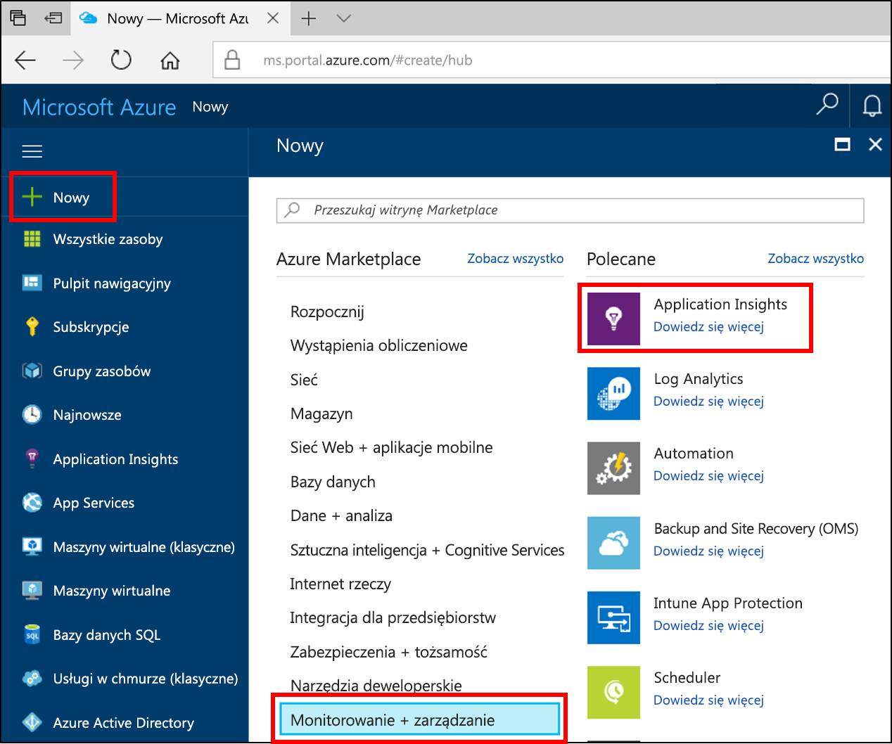
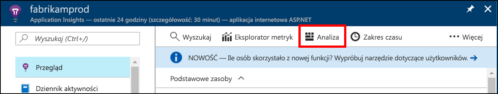
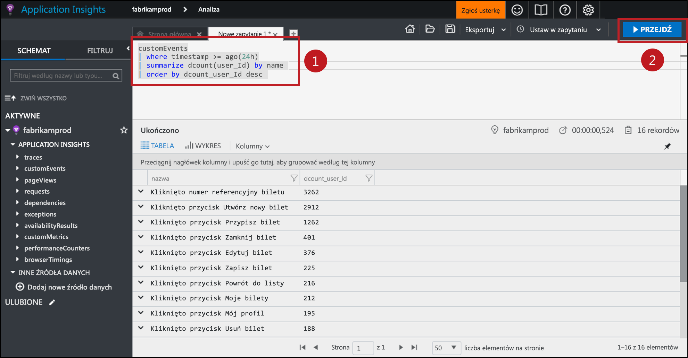
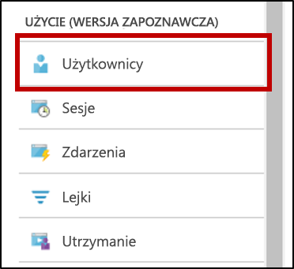
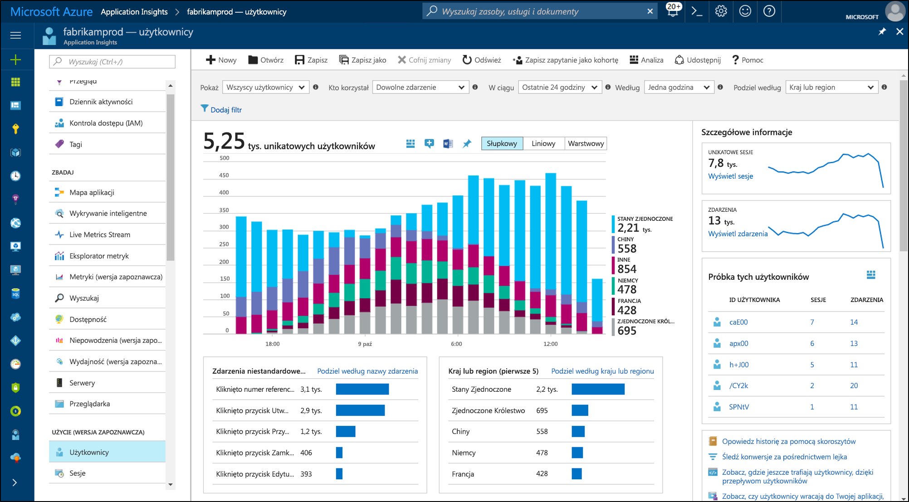
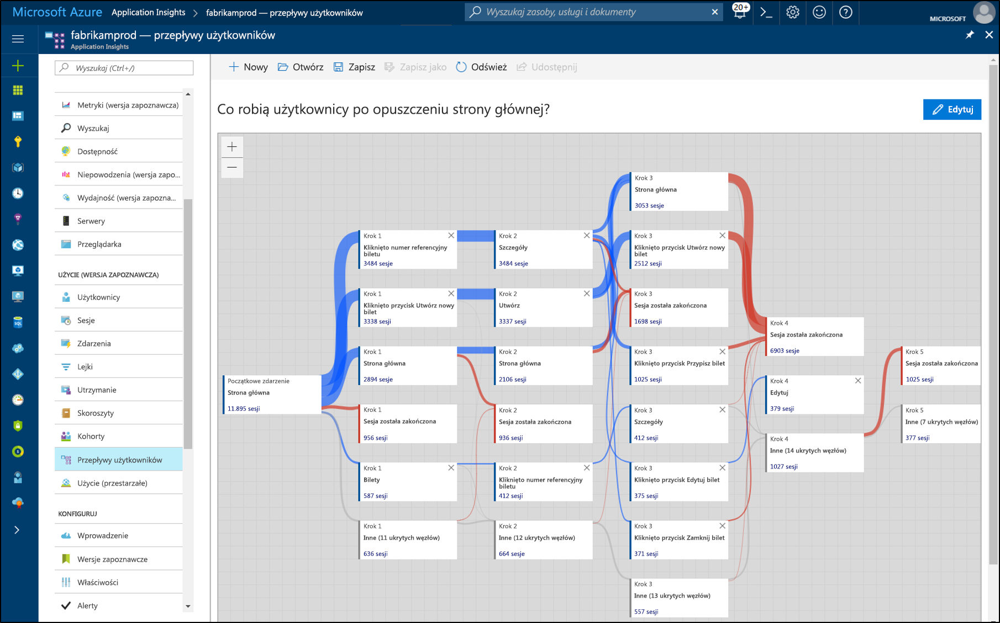

# <a name="start-analyzing-your-mobile-app-with-app-center-and-application-insights"></a>Uruchom analizowanie aplikacji mobilnej z Centrum aplikacji i usługi Application Insights

Ta opcja szybkiego startu przeprowadzi Cię przez łączenie wystąpienia aplikacji Centrum aplikacji do usługi Application Insights. Z usługi Application Insights można zapytania, segmentu, filtrować i analizowania telemetrii z bardziej zaawansowanych narzędzi niż jest dostępne z [Analytics](https://docs.microsoft.com/mobile-center/analytics/) usługi Centrum aplikacji.

## <a name="prerequisites"></a>Wymagania wstępne

Aby ukończyć ten przewodnik Szybki Start, musisz spełnić następujące warunki:

- Subskrypcja platformy Azure.
- IOS, Android, Xamarin, uniwersalnych systemu Windows lub aplikacji natywnej reagować.
 
Jeśli nie masz subskrypcji platformy Azure, przed rozpoczęciem utwórz [bezpłatne](https://azure.microsoft.com/free/) konto.

## <a name="onboard-to-app-center"></a>Dołączyć do Centrum aplikacji

Zanim użyjesz usługi Application Insights z aplikacją mobilną, należy dołączyć aplikację, aby [Centrum aplikacji](https://docs.microsoft.com/mobile-center/). Usługa Application Insights nie odbiera dane telemetryczne z aplikacji mobilnej bezpośrednio. Zamiast tego aplikacja wysyła dane telemetryczne zdarzenia niestandardowe Centrum aplikacji. Następnie Centrum aplikacji stale eksportuje kopie tych zdarzeń niestandardowych w usłudze Application Insights zdarzenia są odbierane.

Dołączyć aplikacji, użyć szybkiego startu Centrum aplikacji dla każdej platformy obsługuje Twojej aplikacji. Tworzenie oddzielnych wystąpień Centrum aplikacji dla każdej platformy:

* [iOS](https://docs.microsoft.com/mobile-center/sdk/getting-started/ios).
* [Android](https://docs.microsoft.com/mobile-center/sdk/getting-started/android).
* [Xamarin](https://docs.microsoft.com/mobile-center/sdk/getting-started/xamarin).
* [Aplikacja uniwersalna systemu Windows](https://docs.microsoft.com/mobile-center/sdk/getting-started/uwp).
* [Zareagować Native](https://docs.microsoft.com/mobile-center/sdk/getting-started/react-native).

## <a name="track-events-in-your-app"></a>Śledź zdarzenia w aplikacji

Aplikację po dołączać do Centrum aplikacji musi zostać zmodyfikowane w celu wysyłania danych telemetrycznych zdarzenie niestandardowe przy użyciu zestawu SDK Centrum aplikacji. Niestandardowe zdarzenia są jedynym typem dane telemetryczne aplikacji Centrum jest eksportowane do usługi Application Insights.

Aby wysłać zdarzeń niestandardowych z aplikacjami systemu iOS, należy użyć `trackEvent` lub `trackEvent:withProperties` metody w zestawie SDK Centrum aplikacji. [Dowiedz się więcej na temat śledzenia zdarzeń z aplikacjami systemu iOS.](https://docs.microsoft.com/mobile-center/sdk/analytics/ios)

```Swift
MSAnalytics.trackEvent("Video clicked")
```

Aby wysłać zdarzeń niestandardowych z aplikacji systemu Android, należy użyć `trackEvent` metody w zestawie SDK Centrum aplikacji. [Dowiedz się więcej na temat śledzenia zdarzeń z aplikacji systemu Android.](https://docs.microsoft.com/mobile-center/sdk/analytics/android)

```Java
Analytics.trackEvent("Video clicked")
```

Aby wysłać niestandardowych zdarzeń z innych platform aplikacji, należy użyć `trackEvent` metod w ich zestawów SDK Centrum aplikacji.

Aby upewnić się, zdarzenia niestandardowe są otrzymywane, przejdź do **zdarzenia** w obszarze **Analytics** sekcji w Centrum aplikacji. Może upłynąć kilka minut dla zdarzeń wyświetlani z, gdy są one wysyłane z aplikacji.

## <a name="create-an-application-insights-resource"></a>Tworzenie zasobu usługi Application Insights

Gdy wysyła zdarzeń niestandardowych aplikacji i te zdarzenia są odbierane przez Centrum aplikacji, musisz utworzyć zasobu usługi Application Insights dla typu Centrum aplikacji w portalu Azure:

1. Zaloguj się do witryny [Azure Portal](https://portal.azure.com/).
2. Wybierz pozycję **Nowy**  >  **Monitorowanie i zarządzanie**  >  **Application Insights**.

    

    Zostanie wyświetlone okno konfiguracji. Użyj poniższej tabeli do wypełniania pól wejściowych.

    | Ustawienia        |  Wartość           | Opis  |
   | ------------- |:-------------|:-----|
   | **Nazwa**      | Niektóre globalnie unikatowa wartość, takich jak "moja_aplikacja iOS" | Nazwa identyfikująca monitorowaną aplikację |
   | **Typ aplikacji** | Aplikacja Centrum aplikacji | Typ monitorowanej aplikacji |
   | **Grupa zasobów**     | Nową grupę zasobów lub istniejącego menu | Grupy zasobów, w którym ma zostać utworzony nowy zasób usługi Application Insights |
   | **Lokalizacja** | Lokalizacja, z menu | Wybierz lokalizację w pobliżu Ciebie lub w pobliżu miejsca hostowania aplikacji |

3. Kliknij przycisk **Utwórz**.

Jeśli aplikacja obsługuje wiele platform (systemy iOS, Android, itp.), najlepiej utworzyć oddzielne zasobów usługi Application Insights, jeden dla każdej platformy.

## <a name="export-to-application-insights"></a>Eksportowanie do usługi Application Insights

W Twojej nowy zasób usługi Application Insights na **omówienie** strony **Essentials** sekcji u góry, skopiuj klucz instrumentacji dla tego zasobu.

W wystąpieniu Centrum aplikacji dla aplikacji:

1. Na **ustawienia** kliknij przycisk **wyeksportować**.
2. Wybierz **wyeksportować nowy**, wybierz **usługi Application Insights**, następnie kliknij przycisk **Dostosuj**.
3. Wklej klucz Instrumentacji usługi Application Insights w polu.
4. Wyrazić zgodę na zwiększenie użycia subskrypcji Azure, zawierającą zasobu usługi Application Insights. Każdy zasób usługi Application Insights jest bezpłatna dla pierwszego 1 GB danych odebranych na miesiąc. [Dowiedz się więcej o cenach usługi Application Insights.](https://azure.microsoft.com/pricing/details/application-insights/)

Pamiętaj, aby Powtórz ten proces dla każdej platformy obsługuje Twojej aplikacji.

Raz [wyeksportować](https://docs.microsoft.com/mobile-center/analytics/export) ustawiono skonfigurowaniu każdego zdarzenia niestandardowe przekazanej aplikacji Centrum jest kopiowana do usługi Application Insights. Może upłynąć kilka minut dla zdarzeń w celu osiągnięcia usługi Application Insights, więc jeśli nie były wyświetlane, oczekiwania nieco diagnozowania dalsze.

Zapewniają więcej danych po raz pierwszy łączą, najnowszych 48 godzin niestandardowych zdarzeń w Centrum aplikacji są automatycznie eksportowane do usługi Application Insights.

## <a name="start-monitoring-your-app"></a>Rozpocznij monitorowanie aplikacji

Usługi Application Insights można zapytania, segmentu, filtrować i analizować dane telemetryczne niestandardowe zdarzenie z aplikacji, poza narzędzia analizy Centrum aplikacji firmy.

1. **Zapytania niestandardowe zdarzenie telemetrii.** Z usługi Application Insights **omówienie** wybierz pozycję **Analytics**. 

   

   Spowoduje otwarcie portalu Application Insights Analytics skojarzone z zasobu usługi Application Insights. Portal analityka pozwala bezpośrednio wyszukiwanie danych przy użyciu języka zapytań analizy dzienników, więc można zadawać pytania arbitralnie złożone o aplikacji i jej użytkowników.
   
   Otwórz nową kartę w portalu analityka następnie wklej w następującym zapytaniu. Zwraca liczbę liczbę unikatowych użytkowników zostały wysłane każdego niestandardowe zdarzenie z aplikacji w ciągu ostatnich 24 godzin, posortowane według tych różne liczby.

   ```AIQL
   customEvents
   | where timestamp >= ago(24h)
   | summarize dcount(user_Id) by name 
   | order by dcount_user_Id desc 
   ```

   

   1. Wybierz zapytanie, klikając zapytania w edytorze tekstu w dowolnym miejscu.
   2. Następnie kliknij przycisk **Przejdź** do uruchomienia zapytania. 

   Dowiedz się więcej o [Application Insights Analytics](app-insights-analytics.md) i [języka zapytań usługi Analiza dzienników](https://docs.loganalytics.io/docs/Language-Reference).


2. **Segment i filtrowanie telemetrii zdarzenie niestandardowe.** Z usługi Application Insights **omówienie** wybierz pozycję **użytkowników** w spisie treści.

   

   Narzędzie Użytkownicy pokazuje liczbę użytkowników aplikacji kliknięty niektórych przycisków, odwiedzi niektóre ekrany lub wykonać żadnych działań, które są śledzone jako zdarzenie z zestawem SDK Centrum aplikacji. Jeśli chcesz już zostały w sposób segmentu i filtrowanie aplikacji Centrum zdarzeń, narzędzie użytkowników jest doskonałym wyborem.

    

   Na przykład podzielić użycie według lokalizacji geograficznej, wybierając **kraj lub region** w **podział według** menu rozwijanym.

3. **Analizować wzorce konwersji, przechowywania i nawigacji w aplikacji.** Z usługi Application Insights **omówienie** wybierz pozycję **użytkownika przepływów** w spisie treści.

   

   Narzędzia przepływu użytkownika wizualizuje zdarzenia, które użytkownicy wysyłać po rozpoczęcia zdarzenia. Jest to przydatne w przypadku uzyskiwania ogólny obraz jak użytkownicy nawigują między aplikacji. Może on również ujawnić miejscach, gdzie są mieszaniu z aplikacji w przypadku wielu użytkowników, lub samodzielnego powtórzyć te same akcje.

   Oprócz użytkownika przepływów usługi Application Insights ma kilka innych użycia analytics narzędzi odpowiedzi na pytania określonych:

   * **Lejki** do analizowania i monitorowania kursy wymiany.
   * **Przechowywania** do analizowania skuteczność aplikacji zachowuje użytkowników w czasie.
   * **Skoroszyty** dla łączenie wizualizacje i tekst w raporcie możliwe do udostępnienia.
   * **Stado** do nazywania i zapisywania określonych grup użytkowników lub zdarzeń, dlatego mogą być łatwo przywoływane z innych narzędzi do analizy.

## <a name="clean-up-resources"></a>Oczyszczanie zasobów

Jeśli nie chcesz kontynuować z Centrum aplikacji przy użyciu usługi Application Insights, wyłączyć eksportu w Centrum aplikacji oraz usuwanie zasobu usługi Application Insights. Mogą uniemożliwić obciążane dalsze przez usługę Application Insights dla tego zasobu.

Aby wyłączyć eksportu w Centrum aplikacji:

1. W Centrum aplikacji, przejdź do **ustawienia** i wybierz polecenie **wyeksportować**.
2. Kliknij pozycję Eksportuj usługi Application Insights, aby usunąć, a następnie kliknij przycisk **usunąć eksportu** u dołu i potwierdź.

Aby usunąć zasób usługi Application Insights:

1. W menu po lewej stronie portalu Azure kliknij **grup zasobów** , a następnie wybierz grupę zasobów, w której został utworzony zasób usługi Application Insights.
2. Otwórz zasobu usługi Application Insights, które chcesz usunąć. Następnie kliknij przycisk **usunąć** w menu u góry zasobu i potwierdź. Spowoduje to trwałe usunięcie kopię danych, który został wyeksportowany do usługi Application Insights.

## <a name="next-steps"></a>Następne kroki

> [!div class="nextstepaction"]
> [Zrozumienie, jak klienci używają aplikacji](app-insights-usage-overview.md)