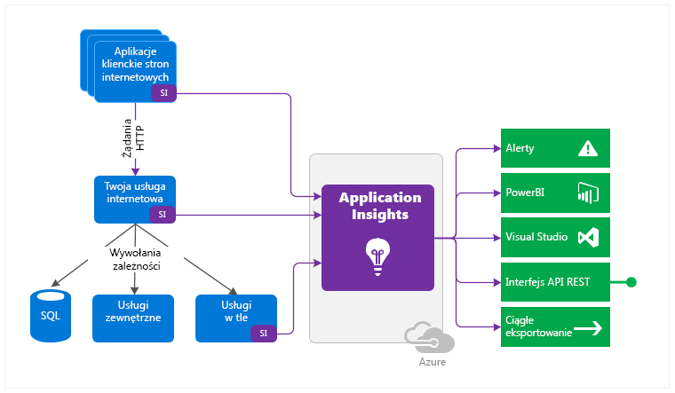

<properties 
    pageTitle="Application Insights とは何か?" 
    description="ライブ Web またはデバイス アプリケーションの使用状況とパフォーマンスを追跡します。問題を検出し、優先順位を付け、診断します。継続的に監視し、ユーザーが満足するように改善します。" 
    services="application-insights" 
    documentationCenter=""
    authors="alancameronwills" 
    manager="douge"/>

<tags 
    ms.service="application-insights" 
    ms.workload="tbd" 
    ms.tgt_pltfrm="ibiza" 
    ms.devlang="na" 
    ms.topic="article" 
    ms.date="11/23/2015" 
    ms.author="awills"/>

# Application Insights とは何か?

Application Insights は、実行中のアプリケーションを監視する拡張可能な分析サービスです。 パフォーマンスの問題の検出と診断や、ユーザーがアプリを使用して実際に実行する操作の理解に役立ちます。 開発者向けに設計された Application Insights を使用すると、アプリのパフォーマンスやユーザビリティを継続的に向上させることができます。

さまざまなプラットフォーム上の Web アプリやスタンドアロン アプリ (オンプレミスまたはクラウドでホストされた .NET または J2EE など) と連携します。

Application Insights は、開発チームを支援することを目的としています。 Application Insights では、次のことを行えます。

* [パターンの使用量の分析 ][knowusers] 、ユーザーが向上し、アプリを継続的に改善を理解します。
 * ページ ビューのカウント、新規ユーザーと再訪問ユーザー、位置情報、プラットフォーム、その他の主要な使用状況分析
 * 使用状況のパスをトレースして、各機能の使用方法を評価します。
* [検出、トリアージ、および診断 ][detect] パフォーマンスの問題し、ほとんどのユーザーが気付く前に修正します。
 *  パフォーマンスの変化またはクラッシュに関するアラート。
 *  応答時間、CPU 使用率、依存関係追跡など、パフォーマンス問題の診断に役立つメトリック。
 *  Web アプリの可用性テスト。
 *  例外のレポートとアラート。
 *  診断ログの高性能検索 (お気に入りのログ記録フレームワークのログ トレースを含む)。

各プラットフォーム用の SDK には、そのまま使用できるアプリを監視するさまざまなモジュールが用意されています。 さらに、調整されたより詳しい分析のために、独自のテレメトリをコーディングすることもできます。

アプリケーションから収集されたテレメトリ データは Azure ポータルに格納、分析されます。ここでは、直感的なビューやパワフルなツールにより迅速な分析や診断を行えます。

詳細な分析が必要? [Export](app-insights-export-telemetry.md) your data [to SQL](app-insights-code-sample-export-telemetry-sql-database.md), [to Power BI](app-insights-export-power-bi.md), or your own tools.

## プラットフォームと言語

SDK は増え続けるプラットフォームに対応します。 最新の一覧を次に示します。

 * [ASP.NET サーバー ][greenbrown] Azure または IIS サーバー上
 * [Azure クラウド サービス](app-insights-cloudservices.md)
 * [J2EE サーバー ][java]
 * [Web ページの ][client]: Html+javascript
 * [Windows デスクトップおよびサーバー アプリケーション ][desktop]
 * [他のプラットフォーム ][platforms] -Node.js、PHP、Python、Ruby、Joomla、SharePoint、WordPress

Application Insights では、再構築せずに、既存の ASP.NET Web アプリからテレメトリを取得することもできます。

アプリにクライアント、サーバー、およびその他のコンポーネントがある場合、それらすべてをインストルメント化できます。 たとえば、データを Application Insights ポータルに組み込んで、クライアントのイベントをサーバーのイベントと関連付けることができます。

## 動作のしくみ

小規模の SDK をアプリケーションにインストールし、Application Insights ポータルにアカウントを設定します。 SDK はアプリを監視し、テレメトリ データをポータルに送信します。 ポータルは統計グラフを表示し、問題の診断に役立つ高性能な検索ツールを提供します。

SDK には、ユーザー、セッション、パフォーマンスをカウントする目的などでテレメトリを集めるモジュールがいくつかあります。 テレメトリ データをポータルに送信する独自のコードを記述することもできます。 カスタムのテレメトリはユーザー ストーリーを追跡する際に特に便利です。ボタンのクリック、特定の目標の達成、ユーザーのミスなどのイベントをカウントできます。

ASP.NET サーバーと Azure の web アプリをインストールすることも [状態の監視 ][redfield], 、これには 2 つの用途があります。 次の操作が可能になります。

* 再構築または再インストールすることなく、Web アプリを監視します。
* 依存関係モジュールの呼び出しを追跡します。

### オーバーヘッドとは

パフォーマンスへの影響はごく小さいものです。 追跡は非ブロッキングを呼び出し、バッチ処理されて、個別のスレッドに送信されます。

## 作業を開始するには:

1. サブスクリプションが必要 [Microsoft Azure](http://azure.com)します。 無料でサインアップして、無料できます [価格レベル](https://azure.microsoft.com/pricing/details/application-insights/) Application Insights のです。

2. にサインオン [Azure ポータル](http://portal.azure.com)
3. Application Insights リソースを作成します。 アプリのデータはここに表示されます。

    ![[追加]、](./media/app-insights-overview/11-new.png)

    アプリケーションの種類を選択します。

4. 新しいリソースを開き、クイック スタート ガイドを開きます。

    

    これは、アプリで SDK をインストールする方法について説明します。 Web アプリについては、SDK を Web ページに追加したり、可用性テストを設定する方法についても記載されています。

詳細については、このページの左側のナビゲーション バーの [開始] でアプリの種類を選択してください。

## コード

[サンプルとチュートリアル](app-insights-code-samples.md)

[SDK ラボ](https://www.myget.org/gallery/applicationinsights-sdk-labs) -NuGet パッケージのインストール (およびアンインストールできます) として Application Insights SDK を追加します。 実際にお試しいただき、フィードバックをお寄せください。

## サポートとフィードバック

* 質問および問題点:
 * [トラブルシューティング ][qna]
 * [MSDN フォーラム](https://social.msdn.microsoft.com/Forums/vstudio/en-US/home?forum=ApplicationInsights)
 * [StackOverflow](http://stackoverflow.com/questions/tagged/ms-application-insights)
* バグ:
 * [接続](https://connect.microsoft.com/VisualStudio/Feedback/LoadSubmitFeedbackForm?FormID=6076)
* ご提案:
 * [ユーザーの声](http://visualstudio.uservoice.com/forums/121579-visual-studio/category/77108-application-insights)

## ビデオ

> [AZURE.VIDEO 218]
>
> [AZURE.VIDEO usage-monitoring-application-insights]
>
> [AZURE.VIDEO performance-monitoring-application-insights]

[android]: https://github.com/Microsoft/ApplicationInsights-Android 
[azure]: ../insights-perf-analytics.md 
[client]: app-insights-javascript.md 
[desktop]: app-insights-windows-desktop.md 
[detect]: app-insights-detect-triage-diagnose.md 
[greenbrown]: app-insights-asp-net.md 
[ios]: https://github.com/Microsoft/ApplicationInsights-iOS 
[java]: app-insights-java-get-started.md 
[knowusers]: app-insights-overview-usage.md 
[platforms]: app-insights-platforms.md 
[portal]: http://portal.azure.com/ 
[qna]: app-insights-troubleshoot-faq.md 
[redfield]: app-insights-monitor-performance-live-website-now.md 
[windows]: app-insights-windows-get-started.md 

