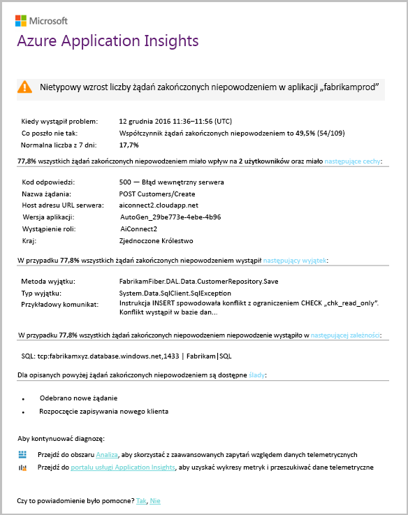

# Inteligentne wykrywanie — błąd anomalii
[Usługa Application Insights](app-insights-overview.md) automatycznie powiadamia użytkownika, w czasie rzeczywistym near czy Twoja aplikacja sieci web napotyka nietypowym wzroście współczynnika żądań zakończonych niepowodzeniem. Ta funkcja wykrywa nietypowe wzrost częstotliwość wykonywania żądań HTTP lub wywołania zależności, które ma być zgłaszane nie powiodło się. Dla żądania żądań zakończonych niepowodzeniem są zwykle z kodami odpowiedź 400 lub nowszej. Aby ułatwić klasyfikowanie i diagnozowanie problemu, analizy właściwości błędy i powiązane dane telemetryczne znajduje się w powiadomienia. Dostępne są także łącza do portalu usługi Application Insights w celu przeprowadzenia dalszej diagnostyki. Funkcja musi żadnych konfiguracji ani konfiguracji, jakiej używa do prognozowania współczynnik awaryjności normalne algorytmów uczenia maszynowego.

Ta funkcja działa w przypadku języka Java i ASP.NET aplikacji sieci web hostowanych w chmurze lub na własnych serwerach. Działa także dla wszystkich aplikacji, który generuje dane telemetryczne żądania lub zależności — na przykład jeśli masz roli procesu roboczego, który wywołuje [TrackRequest()](app-insights-api-custom-events-metrics.md#trackrequest) lub [TrackDependency()](app-insights-api-custom-events-metrics.md#trackdependency).

Po skonfigurowaniu [usługi Application Insights dla projektu](app-insights-overview.md), i pod warunkiem aplikacja generuje określoną minimalną ilość danych telemetrycznych, Inteligentne wykrywanie anomalii awarii przejście 24 godziny, aby dowiedzieć się normalne zachowanie aplikacji, zanim zostanie włączone i wysyłać alerty.

Oto przykładowy alert.

> [!NOTE]
> Domyślnie otrzymasz krótszą poczty format od tego przykładu. Ale możesz [przełączyć się do tego formatu szczegółowego](#configure-alerts).
>
>

Należy zauważyć, że informuje o tym:

* Współczynnik awaryjności w porównaniu do aplikacji normalne zachowanie.
* Ilu użytkowników dotyczy — aby wiedzieć, ile martwić się.
* Wzorzec charakterystyczny skojarzone z błędami. W tym przykładzie brak określonej odpowiedzi kod, Nazwa żądania (operacji) i wersji aplikacji. Który natychmiast wskazano, gdzie rozpocząć wyszukiwanie w kodzie. Może to być innych możliwości konkretny system operacyjny klienta lub dotyczących przeglądarki.
* Wyjątek, ślady dziennika i błąd zależności (baz danych lub innych składników zewnętrznych) który wydaje się być skojarzone z błędami scharakteryzowany.
* Łącza bezpośrednio do odpowiednich wyszukiwań na telemetrii w usłudze Application Insights.

## Zalety inteligentne wykrywania
Zwykłe [metryki alerty](app-insights-alerts.md) informujące o tym, być może wystąpił problem. Ale inteligentne wykrywanie uruchamiania diagnostyki pracy związanej z, wykonywania partii analizy, w przeciwnym razie trzeba zrobić samodzielnie. Uzyskanie wyników starannie opakowane, pomaga szybko uzyskać dostęp do katalogu głównego problemu.

## Jak to działa
Inteligentne wykrywanie monitoruje telemetrii odebranych z aplikacji, a w szczególności awariami. Ta zasada oblicza liczbę żądań dla którego `Successful request` właściwość ma wartość false, a liczba zależności wywołań, dla którego `Successful call` właściwość ma wartość false. Dla żądania, domyślnie `Successful request == (resultCode < 400)` (o ile nie zostały zapisane niestandardowy kod [filtru](app-insights-api-filtering-sampling.md#filtering) lub wygenerować własny [TrackRequest](app-insights-api-custom-events-metrics.md#trackrequest) wywołania). 

Wydajność aplikacji ma typowy wzorzec zachowania. Niektóre żądania lub wywołania zależności będą bardziej podatne na błędy niż inne; i ogólną współczynnik awaryjności może do góry w miarę wzrostu obciążenia. Wykrywanie inteligentne używa machine learning można znaleźć tych nieprawidłowości.

Jako dane telemetryczne wejścia usługi Application Insights z aplikacji sieci web, Inteligentne wykrywanie porównuje bieżące zachowanie wzorami występuje w ciągu ostatnich kilku dni. Jeżeli w porównaniu z poprzednim wydajności jest nietypowy wzrost częstość niepowodzeń, analiza zostanie wywołany.

Po wyzwoleniu analizy usługi dokonuje analizy klastra nieudanych żądań, w celu zidentyfikowania wzorców wartości charakteryzujące niepowodzenia. W powyższym przykładzie analizy wykrył, że większość awarii nastąpi kod wyniku określone, Nazwa żądania, adres URL serwera hosta i wystąpienia roli. Z kolei analizy wykrył, że właściwości systemu operacyjnego klienta jest rozproszone na wielu wartości, a więc nie ma na liście.

Gdy usługi są instrumentowane przy użyciu tych wywołań telemetrii, analizator szuka wyjątek i błąd zależności, które są skojarzone z żądań w klastrze, który zidentyfikował, wraz z przykładem wszystkie dzienniki śledzenia skojarzone z żądaniami.

Wynikowa analizy zostanie do Ciebie wysłana jako alertu, chyba że skonfigurowano go nie.

Podobnie jak [alerty ręcznie ustawić](app-insights-alerts.md), można sprawdzić stan alertu i skonfiguruj ją w bloku alerty zasobu usługi Application Insights. Jednak w przeciwieństwie do innych alertów, nie jest konieczne konfigurowanie wykrywania inteligentne. Jeśli chcesz, możesz ją wyłączyć lub zmienić jego docelowych adresów e-mail.

## Konfigurowanie alertów
Można wyłączyć inteligentne wykrywanie, zmieniać adresatów poczty e-mail, tworzenia elementu webhook lub zgadzaj się na bardziej szczegółowe komunikaty alertów.

Otwórz stronę alerty. Błąd anomalii znajduje się wraz z żadnych alertów, należy ręcznie ustawić, które można zobaczyć, czy aktualnie jest w stanie alertu.

Kliknij alert, aby go skonfigurować.

Powiadomienie, że można wyłączyć inteligentne wykrywanie, ale nie można go usunąć (lub utwórz inny).

#### Szczegółowe alertów
Wybranie opcji "Pobierz bardziej szczegółową diagnostykę" wiadomości e-mail będzie zawierać więcej informacji diagnostycznych. Czasami można zdiagnozować problem tylko na podstawie danych w wiadomości e-mail.

Istnieje bardzo małe ryzyko, że alert bardziej szczegółowe mogą zawierać poufne informacje, ponieważ zawiera on wyjątek i śledzenia wiadomości. Jednak to się tylko stanie, jeśli kod umożliwia poufne informacje w tych komunikatach.

## Klasyfikowane i diagnozowania alertu
Alert wskazuje, że wykryto nietypowy wzrost częstości nieudanych żądań. Istnieje prawdopodobieństwo, że istnieje problem związany z aplikacji lub z jego środowiska.

Z odsetek żądań i liczbę użytkowników, których dotyczy problem można zdecydować, jak pilnych jest problem. W powyższym przykładzie współczynnik awaryjności 22,5% porównuje normalną szybkość % 1, wskazuje, czy zły coś. Z drugiej strony użytkownicy tylko 11 zostały zainfekowane. Gdyby aplikacji, będzie można ocenić, jak poważny to.

W wielu przypadkach można zdiagnozować problem szybko z nazwy żądania, wyjątków, zależności błędu i śledzenia danych udostępnionych.

Brak niektórych innych operacji. Na przykład współczynnik awaryjności zależności, w tym przykładzie jest taka sama jak częstotliwość, z wyjątkiem (89.3%). Sugeruje to, że wyjątek wynika bezpośrednio z awarią zależności — umożliwiając Wyczyść informacje o tym, gdzie rozpocząć wyszukiwanie w kodzie.

Aby zbadać dokładnie, linki w każdej sekcji spowoduje przejście do prostych [stronę wyszukiwania](app-insights-diagnostic-search.md) filtrowane do odpowiednich żądań, wyjątków, zależności lub śledzenia. Alternatywnie możesz otworzyć [portalu Azure](https://portal.azure.com), przejdź do zasobu usługi Application Insights dla aplikacji i otwarcie bloku błędów.

W tym przykładzie klikając łącze "Wyświetl szczegóły błędów zależności" spowoduje otwarcie bloku wyszukiwania usługi Application Insights. Zawiera instrukcję SQL, która zawiera przykład główna przyczyna: zostały podane na pola wymagane wartości null, a nie przeszedł sprawdzania poprawności podczas zapisywania operacji.

## Ostatnie alerty można przeglądać

Kliknij przycisk **inteligentne wykrywanie** Aby uzyskać dostęp do najnowszych alertu:

## Jaka jest różnica...
Inteligentne wykrywanie anomalii awarii uzupełnia inne podobne ale różne funkcje usługi Application Insights.

* [Alerty metryki](app-insights-alerts.md) są ustawiane przez Ciebie i monitorować szeroką gamę metryk, takich jak miejsce zajmowane przez procesor CPU, żądań, czasy ładowania stron i tak dalej. Można używać ich, aby ostrzec użytkownika, na przykład, jeśli trzeba dodać więcej zasobów. Z kolei inteligentne wykrywanie anomalii awarii obejmuje niewielki zakres metryki krytycznych (obecnie tylko nieudanych żądań szybkości), przeznaczone do powiadomienia, że można w sposób czasu rzeczywistego, gdy aplikacja sieci web nie powiodło się w pobliżu żądania szybkość zwiększa się znacznie w porównaniu do aplikacji sieci web normalne zachowanie.

    Inteligentne wykrywanie automatycznie dostosowuje progu w odpowiedzi na warunki panujące.

    Inteligentne wykrywanie uruchamia pracy związanej z diagnostyki.
* [Inteligentne wykrywanie anomalii wydajności](app-insights-proactive-performance-diagnostics.md) również używa komputera analizy nietypowe wzorce w Twoje metryki odnajdywania, a nie przez użytkownika jest wymagana konfiguracja. Ale w przeciwieństwie do inteligentnego wykrywania anomalii awarii, inteligentne wykrywania anomalii wydajności ma na celu znaleźć segmentów sieci kolektora użycia, które mogą być udostępniane nieprawidłowo — na przykład określonych stron na określony typ przeglądarki. Analiza jest przeprowadzana codziennie, a jeśli dowolny wynik zostanie znaleziony, które mogą być znacznie mniej pilne niż alert. Z kolei analizy w celu wykrycia nieprawidłowości awarii jest wykonywane stale na przychodzące dane telemetryczne, a otrzymasz powiadomienie w ciągu minut Jeśli awariami serwera jest większa, niż oczekiwano.

## Jeśli zostanie wyświetlony alert inteligentne wykrywania
*Dlaczego otrzymali ten alert?*

* Wykryliśmy nietypowym wzroście współczynnika żądań zakończonych niepowodzeniem w porównaniu do normalnej linii bazowej poprzedniego okresu. Po analizie błędów i skojarzone dane telemetryczne naszym zdaniem, że istnieje problem, który powinien wyglądać w.

*Powiadomienie oznacza, że problem występuje ostatecznie?*

* Spróbujemy alert po wystąpieniu przerw w działaniu aplikacji lub pogorszenia się, ale tylko wtedy można pełni zrozumieć semantykę i wpływa na aplikację lub użytkowników.

*Tak guys przeglądania danych?*

* Nie. Usługa jest całkowicie automatyczne. Tylko otrzymasz powiadomień. Twoje dane są [prywatnej](app-insights-data-retention-privacy.md).

*Czy mają subskrybować ten alert?*

* Nie. Każda aplikacja, że wysyła żądanie telemetrii ma inteligentne wykrywanie reguły alertów.

*Można anulować subskrypcję lub otrzymywać powiadomień, zamiast tego wysyłane do moich współpracowników?*

* Reguły w alertów, kliknij Tak, reguły wykrywania inteligentne, aby go skonfigurować. Wyłącz alert lub zmieniać adresatów alertu.

*Utratą wiadomości e-mail. Gdzie można znaleźć powiadomienia w portalu?*

* W dziennikach działania. Na platformie Azure Otwórz zasobu usługi Application Insights dla aplikacji, a następnie wybierz Dzienniki aktywności.

*Niektóre alerty są o znanych problemach, a nie chcę do ich odbierania.*

* Mamy pomijania alertów w naszej listy prac.

## Następne kroki
Te narzędzia diagnostyczne pomóc sprawdzić dane telemetryczne z aplikacji:

* [Eksplorator metryk](app-insights-metrics-explorer.md)
* [Eksplorator wyszukiwania](app-insights-diagnostic-search.md)
* [Analiza - język zaawansowanych zapytań](app-insights-analytics-tour.md)

Inteligentne wykryć są całkowicie automatyczne. A może chcesz skonfigurować niektóre alerty więcej?

* [Ręcznie skonfigurowanej metryki alertów](app-insights-alerts.md)
* [Dostępność testy sieci web](app-insights-monitor-web-app-availability.md)
