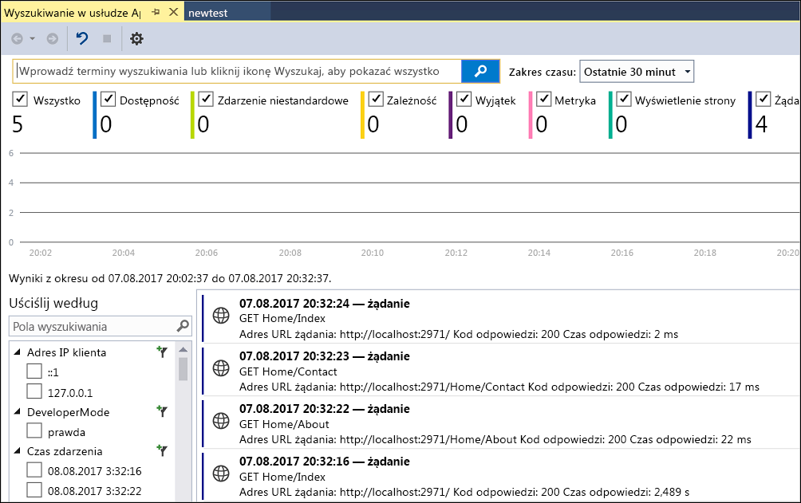
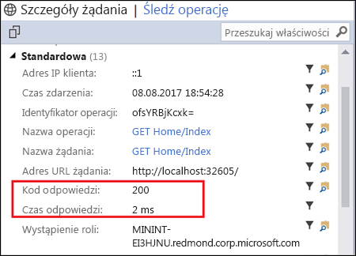
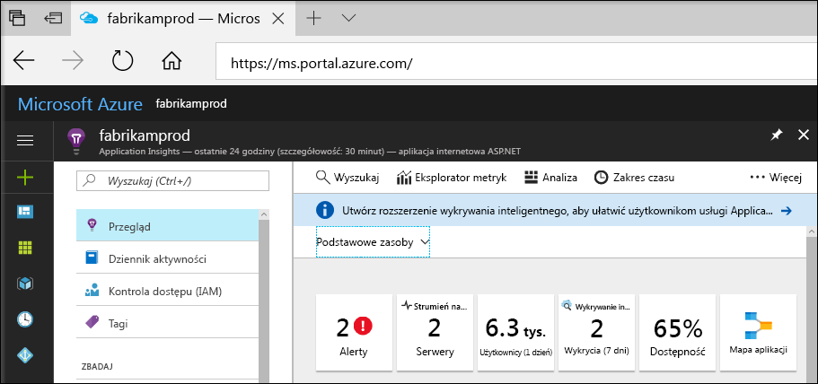
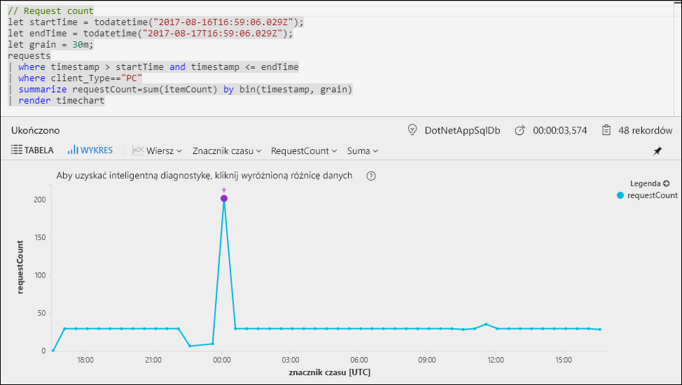
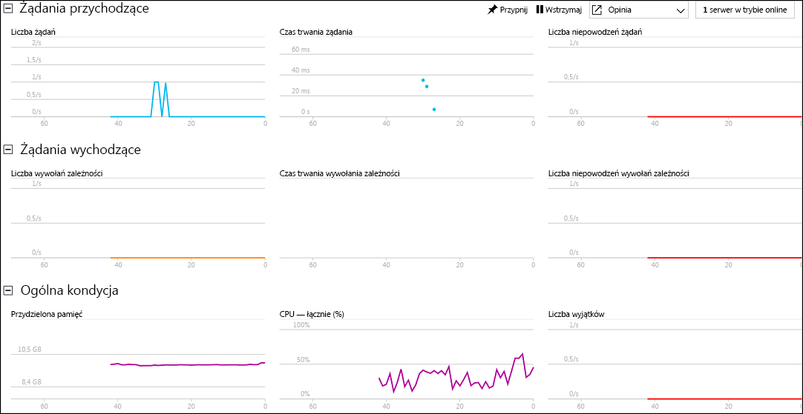

# Rozpoczynanie monitorowania aplikacji internetowej ASP.NET

Usługa Azure Application Insights umożliwia łatwe monitorowanie dostępności, wydajności i użycia aplikacji internetowej.  Pozwala też szybko identyfikować i diagnozować błędy w aplikacji bez oczekiwania na zgłoszenie ich przez użytkownika.  Dzięki uzyskiwanym za pomocą usługi Application Insights informacjom o wydajności i efektywności aplikacji można dokonywać świadomych wyborów dotyczących konserwacji i udoskonalania aplikacji.

W tym przewodniku Szybki start pokazano, jak dodać usługę Application Insights do istniejącej aplikacji internetowej ASP.NET i rozpocząć korzystanie z jednej z wielu metod analizowania aplikacji — badania statystyk udostępnianych na żywo. Jeśli nie masz aplikacji internetowej ASP.NET, możesz ją utworzyć, wykonując instrukcje przedstawione w artykule [Create a ASP.NET Web App quickstart (Przewodnik Szybki start dotyczący tworzenia aplikacji internetowej ASP.NET)](../app-service/app-service-web-get-started-dotnet.md).

## Wymagania wstępne
Aby ukończyć ten przewodnik Szybki Start:

- Zainstaluj program [Visual Studio 2017](https://www.visualstudio.com/downloads/) z następującymi pakietami roboczymi:
    - Tworzenie aplikacji na platformie ASP.NET i aplikacji internetowych
    - Tworzenie aplikacji na platformie Azure

Jeśli nie masz subskrypcji platformy Azure, przed rozpoczęciem utwórz [bezpłatne](https://azure.microsoft.com/free/) konto.

## Włączanie usługi Application Insights

1. Otwórz projekt w programie Visual Studio 2017.
2. Wybierz pozycję **Konfiguruj usługę Application Insights** z menu Projekt. Program Visual Studio doda zestaw SDK usługi Application Insights do aplikacji.
3. Kliknij pozycję **Rozpocznij za darmo**, wybierz preferowany plan rozliczeniowy i kliknij pozycję **Zarejestruj**.

    

4. Uruchom aplikację, wybierając pozycję **Rozpocznij debugowanie** z menu **Debuguj** lub naciskając klawisz F5.

## Potwierdzanie konfiguracji aplikacji

Usługa Application Insights zbiera dane telemetryczne aplikacji niezależnie od tego, gdzie jest ona uruchomiona. Aby rozpocząć wyświetlanie tych danych, wykonaj poniższe czynności.

1. Otwórz usługę Application Insights, klikając pozycję **Projekt** -> **Application Insights** -> **Wyszukaj dane telemetryczne sesji debugowania**.  Pojawią się dane telemetryczne z bieżącej sesji.  

2. Kliknij pierwsze żądanie na liście (w tym przykładzie GET Home/Index), aby wyświetlić jego szczegóły. Zwróć uwagę, że są widoczne kod stanu i czas odpowiedzi, a także inne cenne informacje dotyczące żądania.  

## Rozpoczynanie monitorowania w witrynie Azure Portal

Możesz teraz otworzyć usługę Application Insights w witrynie Azure Portal i wyświetlić różne szczegółowe informacje o uruchomionej aplikacji.

1. Kliknij prawym przyciskiem myszy folder **Connected Services Application Insights** w Eksploratorze rozwiązań i kliknij polecenie **Otwórz portal usługi Application Insights**.  Pojawią się wybrane informacje o aplikacji i różne opcje.

    

2. Kliknij pozycję **Mapa aplikacji**, aby uzyskać wizualny układ relacji zależności między składnikami aplikacji.  Każdy składnik przedstawia kluczowe wskaźniki wydajności, takie jak obciążenie, wydajność, błędy i alerty.

    

3. Kliknij ikonę usługi **App Analytics**  na jednym ze składników aplikacji.  Spowoduje to otwarcie strony **Analiza usługi Application Insights**, która udostępnia zaawansowany język zapytań na potrzeby analizy wszystkich danych zbieranych przez usługę Application Insights.  W tym przypadku jest generowane zapytanie, które renderuje liczbę żądań w formie wykresu.  Możesz pisać własne zapytania do analizy innych danych.

    

4. Wróć do strony **Omówienie** i kliknij pozycję **Transmisja strumieniowa na żywo**.  Spowoduje to wyświetlenie danych statystycznych dotyczących uruchomionej aplikacji.  Dane te obejmują informacje dotyczące liczby żądań przychodzących, czasu trwania tych żądań i błędów.  Można też sprawdzić krytyczne metryki wydajności, takie jak wydajność procesora i pamięci.

    

Jeśli wszystko jest gotowe do hostowania aplikacji na platformie Azure, można opublikować aplikację. Wykonaj instrukcje opisane w artykule [Create an ASP.NET Web App Quickstart (Przewodnik Szybki Start dotyczący tworzenia aplikacji internetowej ASP.NET)](../app-service/app-service-web-get-started-dotnet.md#update-the-app-and-redeploy).

## Następne kroki
W tym przewodniku Szybki start omówiono włączanie monitorowania aplikacji przez usługę Azure Application Insights.  Przejdź do kolejnych samouczków, aby dowiedzieć się, jak użyć tej usługi do monitorowania statystyk i wykrywania problemów w aplikacji.

> [!div class="nextstepaction"]
> [Samouczki dotyczące usługi Azure Application Insights](app-insights-tutorial-runtime-exceptions.md)