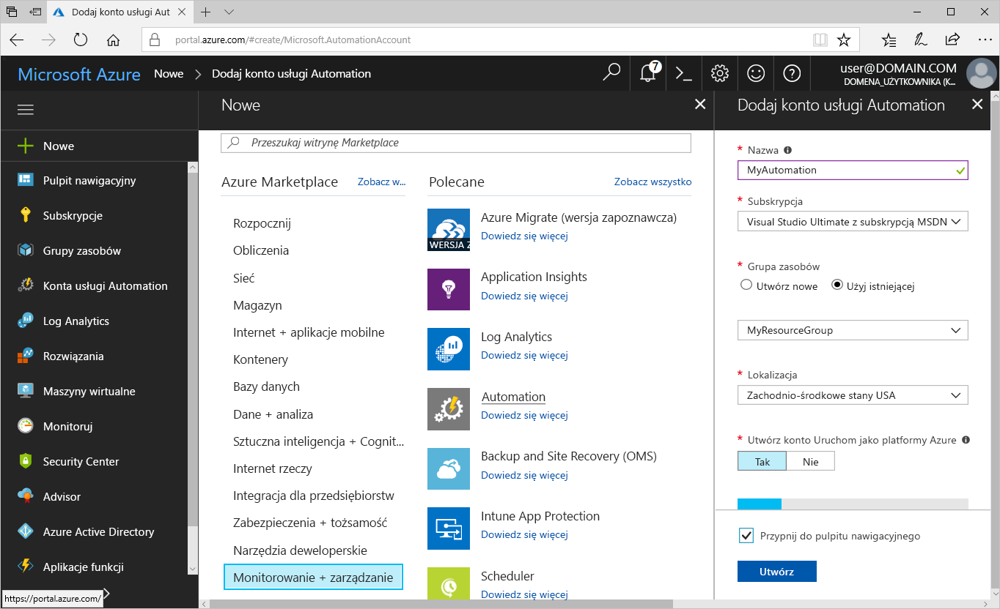
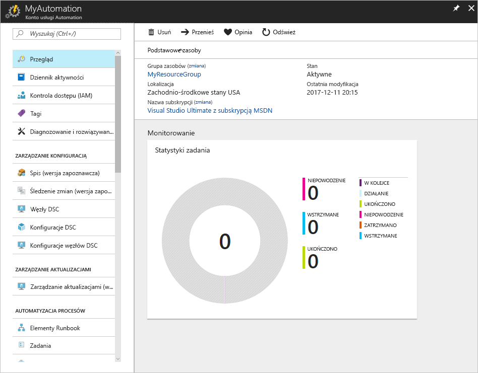
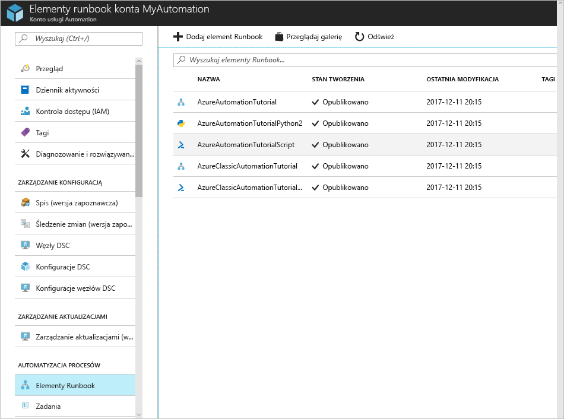
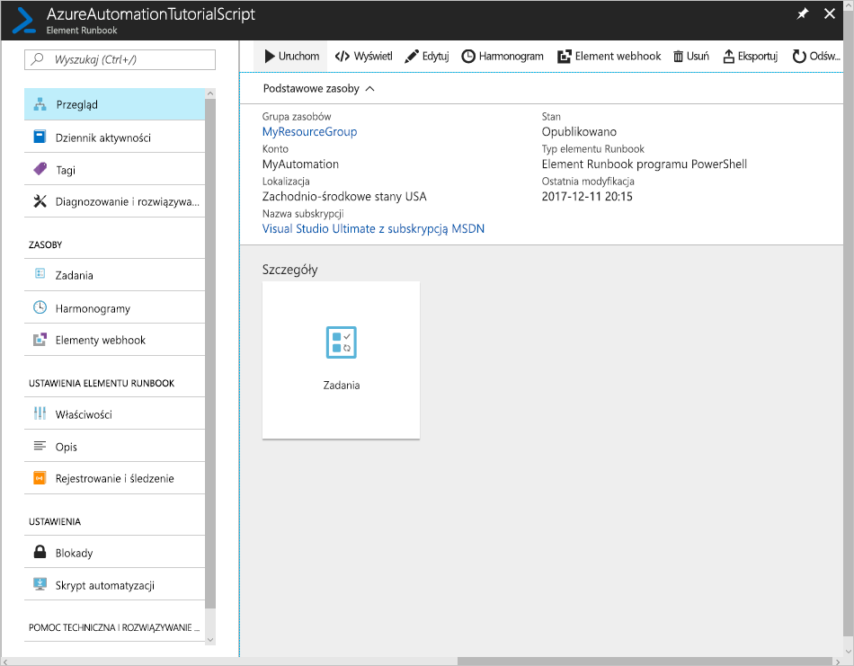

# Tworzenie konta usługi Azure Automation

Konta usługi Azure Automation można tworzyć za pośrednictwem platformy Azure. Ta metoda zapewnia oparty na przeglądarce interfejs użytkownika umożliwiający tworzenie i konfigurowanie kont usługi Automation oraz pokrewnych zasobów. W tym przewodniku Szybki start opisano tworzenie konta usługi Automation i uruchamianie elementu runbook w ramach tego konta.

Jeśli nie masz subskrypcji platformy Azure, przed rozpoczęciem utwórz [bezpłatne konto platformy Azure](https://azure.microsoft.com/free/?WT.mc_id=A261C142F).

## Zaloguj się do platformy Azure.

Zaloguj się do platformy Azure pod adresem https://portal.azure.com

## Tworzenie konta usługi Automation

1. Kliknij przycisk **Nowy** znajdujący się w lewym górnym rogu platformy Azure.

1. Wybierz pozycję **Monitorowanie + zarządzanie**, a następnie wybierz pozycję **Automation**.

1. Wprowadź informacje o koncie. W obszarze **Utwórz konto Uruchom jako platformy Azure** wybierz pozycję **Tak**, aby artefakty upraszczające uwierzytelnianie zostały automatycznie włączone. Po zakończeniu kliknij przycisk **Utwórz**, aby rozpocząć wdrażanie konta usługi Automation.

      

1. Konto usługi Automation zostanie przypięte do pulpitu nawigacyjnego platformy Azure. Po zakończeniu wdrażania zostanie automatycznie otworzony przegląd konta usługi Automation.

    

## Uruchamianie elementu runbook

Uruchom jeden z elementów runbook z samouczka.

1. Kliknij pozycję **Elementy runbook** w obszarze **AUTOMATYZACJA PROCESÓW**. Zostanie wyświetlona lista elementów runbook. Domyślnie na koncie włączonych jest kilka elementów runbook z samouczka.

    

1. Wybierz element runbook **AzureAutomationTutorialScript**. Ta akcja spowoduje otwarcie strony przeglądu elementu runbook.

    

1. Kliknij pozycję **Uruchom**, a na stronie **Uruchamianie elementu runbook** kliknij przycisk **OK**, aby uruchomić element runbook.

    

1. Gdy **Stan zadania** będzie miał wartość **Uruchomione**, kliknij pozycję **Dane wyjściowe** lub **Wszystkie dzienniki**, aby wyświetlić dane wyjściowe zadania elementu runbook. W przypadku tego elementu runbook z samouczka danymi wyjściowymi jest lista Twoich zasobów platformy Azure.

## Oczyszczanie zasobów

Gdy grupa zasobów, konto usługi Automation i wszystkie pokrewne zasoby nie będą już potrzebne, usuń je. W tym celu wybierz grupę zasobów konta usługi Automation i kliknij przycisk **Usuń**.

## Następne kroki

W tym przewodniku Szybki start wdrożono konto usługi Automation, uruchomiono element runbook i wyświetlono wyniki zadania. Aby dowiedzieć się więcej na temat usługi Azure Automation, przejdź do przewodnika Szybki start dotyczącego tworzenia pierwszego elementu runbook.

> [!div class="nextstepaction"]
> [Przewodnik Szybki start usługi Automation — tworzenie elementu runbook](./automation-quickstart-create-runbook.md)
