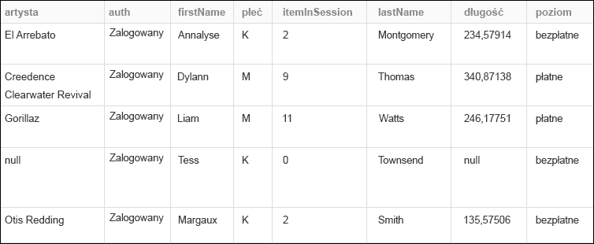
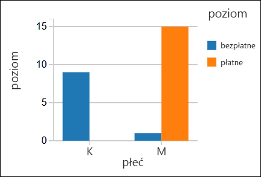

# <a name="quickstart-run-a-spark-job-on-azure-databricks-using-the-azure-portal"></a>Szybki start: uruchamianie zadania Spark w usłudze Azure Databricks przy użyciu witryny Azure Portal

W tym przewodniku Szybki start pokazano, jak utworzyć obszar roboczy usługi Azure Databricks oraz klaster Apache Spark w tym obszarze roboczym. Na koniec wyjaśniono, jak uruchomić zadanie Spark w tym klastrze Databricks. Aby uzyskać więcej informacji o usłudze Azure Databricks, zobacz [Co to jest Azure Databricks](what-is-azure-databricks.md).

## <a name="log-in-to-the-azure-portal"></a>Logowanie do witryny Azure Portal

Zaloguj się w witrynie [Azure Portal](https://portal.azure.com).

## <a name="create-a-databricks-workspace"></a>Tworzenie obszaru roboczego usługi Databricks

W tej sekcji utworzysz obszar roboczy usługi Azure Databricks przy użyciu witryny Azure Portal. 

1. W witrynie Azure Portal kliknij pozycję **+**, pozycję **Dane i analiza**, a następnie pozycję **Azure Databricks (wersja zapoznawcza)**. 

    

2. W obszarze **Azure Databricks (wersja zapoznawcza)** kliknij pozycję **Utwórz**.

3. W obszarze **Usługa Azure Databricks** podaj następujące wartości:

    

    * W polu **Nazwa obszaru roboczego** podaj nazwę obszaru roboczego usługi Databricks.
    * W polu **Subskrypcja** wybierz z listy rozwijanej subskrypcję platformy Azure.
    * W obszarze **Grupa zasobów** określ, czy chcesz utworzyć nową grupę zasobów, czy użyć istniejącej. Grupa zasobów to kontener, który zawiera powiązane zasoby dla rozwiązania platformy Azure. Aby uzyskać więcej informacji, zobacz [Omówienie usługi Azure Resource Manager](../azure-resource-manager/resource-group-overview.md).
    * W polu **Lokalizacja** wybierz pozycję **Wschodnie stany USA 2**. Inne dostępne regiony podano na stronie [dostępności usług platformy Azure według regionów](https://azure.microsoft.com/regions/services/).

4. Kliknij przycisk **Utwórz**.

## <a name="create-a-spark-cluster-in-databricks"></a>Tworzenie klastra Spark w usłudze Databricks

1. W witrynie Azure Portal przejdź do utworzonego obszaru roboczego usługi Databricks, a następnie kliknij pozycję **Inicjuj obszar roboczy**.

2. Nastąpi przekierowanie do portalu usługi Azure Databricks. W portalu kliknij pozycję **Klaster**.

    

3. Na stronie **Nowy klaster** podaj wartości, aby utworzyć klaster.

    

    * Wprowadź nazwę klastra.
    * Upewnij się, że jest wybrane pole wyboru **Zakończ po ___ min aktywności**. Podaj czas (w minutach), po jakim działanie klastra ma zostać zakończone, jeśli nie jest używany.
    * Zaakceptuj wszystkie pozostałe wartości domyślne. 
    * Kliknij pozycję **Utwórz klaster**. Po uruchomieniu klastra możesz dołączyć do niego notesy i uruchamiać zadania Spark.

Aby uzyskać więcej informacji na temat tworzenia klastrów, zobacz [Create a Spark cluster in Azure Databricks](https://docs.azuredatabricks.net/user-guide/clusters/create.html) (Tworzenie klastra Spark w usłudze Azure Databricks).

## <a name="run-a-spark-sql-job"></a>Uruchamianie zadania Spark SQL

Przed przystąpieniem do pracy z tą sekcją musisz wykonać następujące zadania:

* [Utwórz konto usługi Azure Storage](../storage/common/storage-create-storage-account.md#create-a-storage-account). 
* Pobierz przykładowy plik JSON [z usługi GitHub](https://github.com/Azure/usql/blob/master/Examples/Samples/Data/json/radiowebsite/small_radio_json.json). 
* Przekaż ten przykładowy plik JSON na utworzone konto usługi Azure Storage. Do przekazywania plików możesz używać [Eksploratora usługi Microsoft Azure Storage](../vs-azure-tools-storage-manage-with-storage-explorer.md).

Wykonaj poniższe kroki, aby utworzyć notes w usłudze Databricks, skonfigurować odczytywanie za jego pomocą danych z konta usługi Azure Blob Storage, a następnie uruchomić zadanie Spark SQL dotyczące danych.

1. W okienku po lewej stronie kliknij pozycję **Obszar roboczy**. Na liście rozwijanej **Obszar roboczy** kliknij pozycję **Utwórz**, a następnie kliknij pozycję **Notes**.

    

2. W oknie dialogowym **Tworzenie notesu** wpisz nazwę, wybierz jako język pozycję **Scala** i wybierz utworzony wcześniej klaster Spark.

    

    Kliknij przycisk **Utwórz**.

3. W poniższym fragmencie kodu zamień pozycję `{YOUR STORAGE ACCOUNT NAME}` na nazwę utworzonego konta usługi Azure Storage, a pozycję `{YOUR STORAGE ACCOUNT ACCESS KEY}` na klucz dostępu do konta usługi Storage. Wklej ten fragment w pustej komórce w notesie, a następnie naciśnij klawisze SHIFT+ENTER, aby uruchomić komórkę kodu. Ten fragment kodu konfiguruje odczytywanie za pomocą tego notesu danych z usługi Azure Blob Storage.

       spark.conf.set("fs.azure.account.key.{YOUR STORAGE ACCOUNT NAME}.blob.core.windows.net", "{YOUR STORAGE ACCOUNT ACCESS KEY}")
    
    Aby uzyskać instrukcje dotyczące pobierania klucza konta usługi Storage, zobacz [Zarządzanie kluczami dostępu do magazynu](../storage/common/storage-create-storage-account.md#manage-your-storage-account).

    > [!NOTE]
    > Z klastrem Spark w usłudze Azure Databricks można również używać usługi Azure Data Lake Store. Aby uzyskać instrukcje, zobacz [Use Data Lake Store with Azure Databricks](https://go.microsoft.com/fwlink/?linkid=864084) (Używanie usługi Data Lake Store z usługą Azure Databricks).

4. Uruchom instrukcję SQL, aby utworzyć tabelę tymczasową przy użyciu danych z przykładowego pliku danych JSON, **small_radio_json.json**. W poniższym fragmencie kodu zamień wartości symboli zastępczych na właściwe nazwy kontenera i konta magazynu. Wklej ten fragment w komórce kodu w notesie, a następnie naciśnij klawisze SHIFT+ENTER. W tym fragmencie element `path` wskazuje lokalizację przykładowego pliku JSON przekazanego na konto usługi Azure Storage.

    ```sql
    %sql 
    CREATE TEMPORARY TABLE radio_sample_data
    USING json
    OPTIONS (
     path "wasbs://{YOUR CONTAINER NAME}@{YOUR STORAGE ACCOUNT NAME}.blob.core.windows.net/small_radio_json.json"
    )
    ```

    Po pomyślnym wykonaniu polecenia wszystkie dane z pliku JSON znajdą się w tabeli w klastrze usługi Databricks.

    Magiczne polecenie języka `%sql` umożliwia uruchamianie kodu SQL z notesu, nawet jeśli notes jest innego typu. Aby uzyskać więcej informacji, zobacz [Mixing languages in a notebook](https://docs.azuredatabricks.net/user-guide/notebooks/index.html#mixing-languages-in-a-notebook) (Łączenie języków w notesie).

5. Przyjrzyjmy się migawce przykładowych danych JSON, aby lepiej zrozumieć uruchamiane zapytanie. Wklej poniższy fragment kodu w komórce kodu i naciśnij klawisze **SHIFT+ENTER**.

    ```sql
    %sql 
    SELECT * from radio_sample_data
    ```

6. Pojawią się tabelaryczne dane wyjściowe, takie jak pokazano na poniższym zrzucie ekranu (przedstawiono tu tylko niektóre kolumny):

    

    W danych przykładowych jest rejestrowana między innymi płeć odbiorców kanału radiowego (nazwa kolumny **gender** — „płeć”) i informacja o tym, czy subskrypcja jest bezpłatna, czy płatna (nazwa kolumny **level** — „poziom”).

7. Teraz utworzysz reprezentację wizualną tych danych w celu pokazania, ilu użytkowników każdej płci ma konta bezpłatne, a ilu opłaca subskrypcję. U dołu tabelarycznych danych wyjściowych kliknij ikonę **Wykres słupkowy**, a następnie pozycję **Opcje wykresu**.

    

8. W obszarze **Dostosowywanie wykresu** przeciągnij i upuść wartości, jak pokazano na zrzucie ekranu.

    

    * W obszarze **Klucze** ustaw wartość **gender** (płeć).
    * W obszarze **Grupowania serii** ustaw wartość **level** (poziom).
    * W obszarze **Wartości** ustaw wartość **level** (poziom).
    * W obszarze **Agregacja** ustaw wartość **LICZBA**.

    Kliknij przycisk **Zastosuj**.

9. Wynikiem będzie reprezentacja wizualna przedstawiona na zrzucie ekranu:

     

## <a name="clean-up-resources"></a>Oczyszczanie zasobów

Jeśli podczas tworzenia klastra Spark zostało zaznaczone pole wyboru **Zakończ po ___ min aktywności**, działanie klastra zostanie automatycznie zakończone po określonym czasie nieaktywności.

Jeśli to pole wyboru nie zostało zaznaczone, musisz ręcznie zakończyć działanie klastra. Aby to zrobić, w obszarze roboczym usługi Azure Databricks w lewym okienku kliknij pozycję **Klastry**. W obszarze klastra, którego działanie chcesz zakończyć, przesuń kursor na wielokropek w kolumnie **Akcje**, a następnie kliknij ikonę **Zakończ**.


## <a name="next-steps"></a>Następne kroki

W tym artykule został utworzony klaster Spark w usłudze Azure Databricks i przy użyciu danych w usłudze Azure Storage zostało uruchomione zadanie Spark. Aby dowiedzieć się, jak zaimportować dane z innych źródeł danych do usługi Azure Databricks, zobacz [Spark data sources](https://docs.azuredatabricks.net/spark/latest/data-sources/index.html) (Źródła danych platformy Spark). Przejdź do następnego artykułu, aby dowiedzieć się, jak używać usługi Azure Data Lake Store z usługą Azure Databricks.

> [!div class="nextstepaction"]
>[Use Data Lake Store with Azure Databricks](https://go.microsoft.com/fwlink/?linkid=864084) (Używanie usługi Data Lake Store z usługą Azure Databricks)
