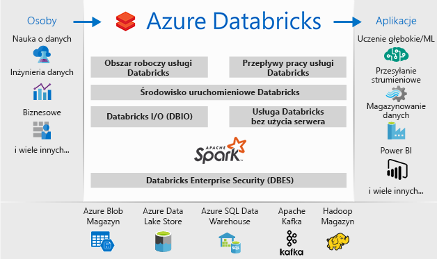
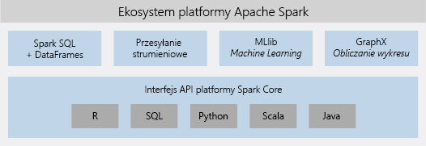

# Co to jest Azure Databricks?

Usługa Azure Databricks to platforma analizy oparta na usłudze Apache Spark zoptymalizowana pod kątem platformy usług w chmurze Microsoft Azure. Usługa Databricks, zaprojektowana wspólnie z twórcami usługi Apache Spark, jest zintegrowana z platformą Azure w celu zapewnienia konfigurowania jednym kliknięciem, usprawnionych przepływów pracy oraz interakcyjnego obszaru roboczego, który umożliwia współpracę między analitykami danych, inżynierami danych i analitykami biznesowymi.

## Platforma analityczna bazująca na projekcie Apache Spark

Usługa Azure Databricks zapewnia pełny zestaw możliwości i technologii klastra Apache Spark typu open source. Platforma Spark w usłudze Azure Databricks obejmuje następujące składniki:

* **Spark SQL i elementy DataFrame**: Spark SQL to moduł platformy Spark do pracy z danymi strukturalnymi. Element DataFrame jest rozproszoną kolekcją danych zorganizowanych w nazwanych kolumnach. Jest równoważny tabeli w relacyjnej bazie danych lub ramce danych w języku R/Python.

* **Przesyłanie strumieniowe**: przetwarzanie i analiza danych w czasie rzeczywistym dla aplikacji analitycznych i interakcyjnych. Integruje się z rozwiązaniami HDFS, Flume i Kafka.

* **MLib**: biblioteka uczenia maszynowego (Machine Learning) składająca się ze wspólnych narzędzi i algorytmów uczenia się, w tym klasyfikacji, regresji, klastrowania, filtrowania z wykorzystaniem współpracy, zmniejszania wymiarowości, a także źródłowych typów pierwotnych optymalizacji.

* **GraphX**: wykresy i obliczenia dotyczące wykresów do szerokiego zakresu zastosowań, od analizy poznawczej po eksplorację danych.

* **Interfejs API Spark Core**: zapewnia obsługę języków R, SQL, Python, Scala i Java.

## Platforma Apache Spark w usłudze Azure Databricks

Usługa Azure Databricks bazuje na możliwościach platformy Spark, zapewniając platformę chmurową, która nie wymaga zarządzania i obejmuje następujące elementy:

- W pełni zarządzane klastry Spark
- Interakcyjny obszar roboczy do eksploracji i wizualizacji
- Platforma do obsługi ulubionych aplikacji opartych na platformie Spark

### W pełni zarządzane klastry Apache Spark w chmurze

Usługa Azure Databricks zapewnia bezpieczne i niezawodne środowisko produkcyjne w chmurze, zarządzane i obsługiwane przez ekspertów ds. platformy Spark. Możesz:

* Tworzyć klastry w ciągu sekund.
* Dynamicznie automatycznie skalować klastry w górę i w dół, w tym klastry bezserwerowe, i udostępniać je między zespołami. 
* Korzystać z klastrów programowo przy użyciu interfejsów API REST. 
* Korzystać z bezpiecznych funkcji integracji danych opartych na platformie Spark, które umożliwiają ujednolicanie danych bez centralizacji. 
* Uzyskiwać natychmiastowy dostęp do najnowszych funkcji platformy Apache Spark dodawanych w każdej wersji.

### Środowisko uruchomieniowe usługi Databricks
Środowisko uruchomieniowe usługi Databricks bazuje na platformie Apache Spark i zostało natywnie zaprojektowane pod kątem chmury platformy Azure. 

Dzięki opcji **bezserwerowej** usługa Azure Databricks całkowicie eliminuje złożoność infrastruktury i wymaganie posiadania wiedzy eksperckiej w celu instalowania i konfigurowania infrastruktury danych. Opcja bezserwerowa ułatwia analitykom danych realizację szybkich cyklów pracy w zespole.

Inżynierom danych, których interesuje wydajność zadań produkcyjnych, usługa Azure Databricks zapewnia aparat platformy Spark, który jest szybszy i wydajniejszy dzięki różnym optymalizacjom warstwy wejścia/wyjścia i warstwy przetwarzania (wejście/wyjście usługi Databricks).

### Obszar roboczy współpracy

Dzięki zoptymalizowanemu pod kątem współpracy i zintegrowanemu środowisku usługa Azure Databricks upraszcza proces eksplorowania danych, tworzenia prototypów i uruchamiania aplikacji opartych na danych na platformie Spark.

* Ustalanie sposobu używania danych dzięki łatwej eksploracji danych.
* Dokumentowanie postępu w notesach w językach R, Python, Scala lub SQL.
* Wizualizowanie danych za pomocą kilku kliknięć i korzystanie ze znanych narzędzi, takich jak Matplotlib, ggoplot lub d3.
* Tworzenie dynamicznych raportów za pomocą interakcyjnych pulpitów nawigacyjnych.
* Korzystanie z platformy Spark w celu obsługi jednoczesnych interakcji z danymi.

## Zabezpieczenia przedsiębiorstwa

Usługa Azure Databricks zapewnia zabezpieczenia klasy korporacyjnej platformy Azure, w tym integrację z usługą Azure Active Directory, kontrolę opartą na rolach oraz umowy SLA, które zapewniają ochronę danych i firmy.

* Integracja z usługą Azure Active Directory umożliwia uruchamianie przy użyciu usługi Azure Databricks kompletnych rozwiązań bazujących na platformie Azure.
* Dostęp oparty na rolach usługi Azure Databricks umożliwia określanie szczegółowych uprawnień do notesów, klastrów, zadań i danych.
* Umowy SLA klasy korporacyjnej. 

## Integracja z usługami Azure

Usługa Azure Databricks jest ściśle zintegrowana z bazami danych i magazynami platformy Azure: SQL Data Warehouse, Cosmos DB, Data Lake Store i Blob Storage. 

## Integracja z usługą Power BI
Dzięki rozbudowanej integracji z usługą Power BI usługa Azure Databricks umożliwia szybkie i łatwe odnajdywanie i udostępnianie istotnych wyników analiz. Można też używać innych narzędzi do analizy biznesowej, takich jak oprogramowanie Tableau — za pośrednictwem punktów końcowych klastra JDBC/ODBC.

## Następne kroki

* [Szybki start: uruchamianie zadania Spark w usłudze Azure Databricks](quickstart-create-databricks-workspace-portal.md)
* [Praca z klastrami Spark](https://docs.azuredatabricks.net/user-guide/clusters/index.html)
* [Praca z notesami](https://docs.azuredatabricks.net/user-guide/notebooks/index.html)
* [Tworzenie zadań Spark](https://docs.azuredatabricks.net/user-guide/jobs.html)

 

