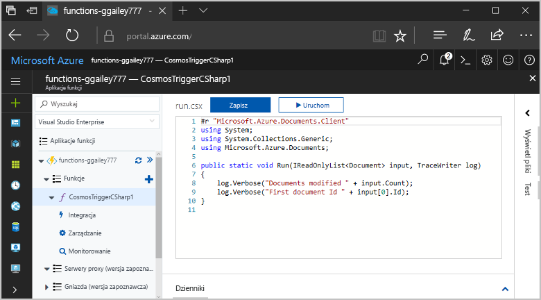
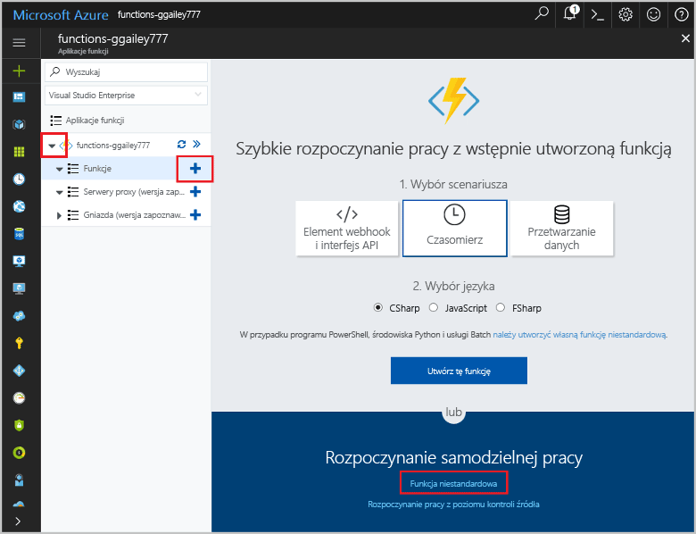
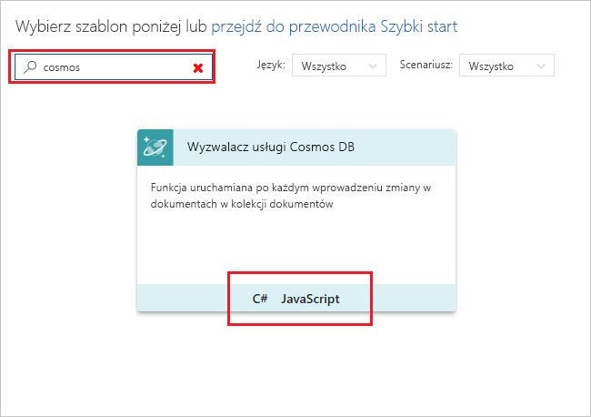
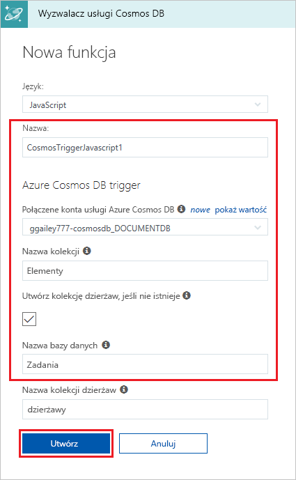
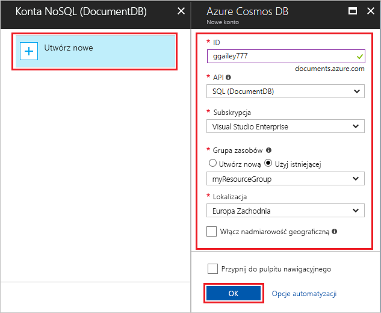
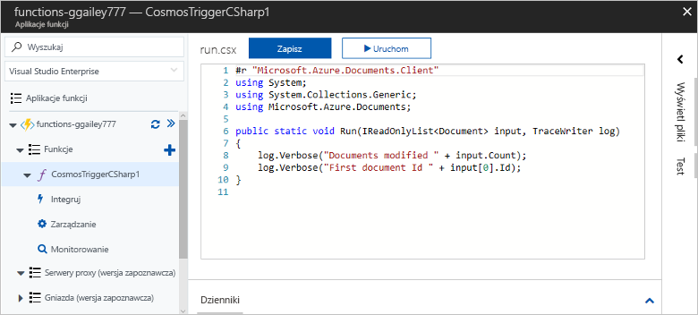
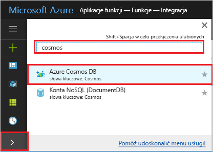
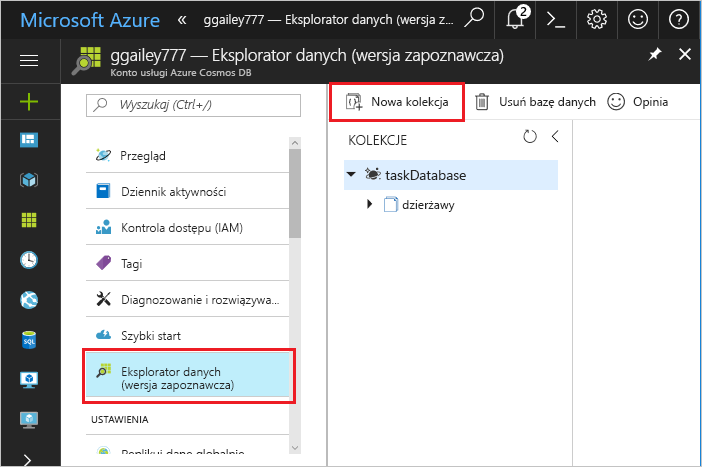
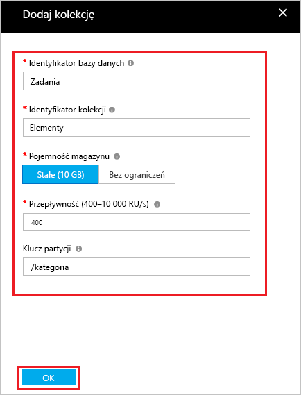
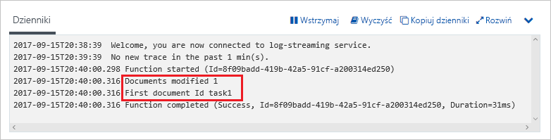

# Tworzenie funkcji wyzwalanej przez usługę Azure Cosmos DB

Dowiedz się, jak utworzyć funkcję wyzwalaną w przypadku dodania lub zmiany danych w usłudze Azure Cosmos DB. Aby uzyskać więcej informacji o usłudze Azure Cosmos DB, zobacz [Azure Cosmos DB: Serverless database computing using Azure Functions](..\cosmos-db\serverless-computing-database.md) (Azure Cosmos DB: przetwarzanie danych w bazie danych bez użycia serwera dzięki usłudze Azure Functions).

## Wymagania wstępne

W celu ukończenia tego samouczka:

+ Jeśli nie masz subskrypcji platformy Azure, przed rozpoczęciem utwórz [bezpłatne konto](https://azure.microsoft.com/free/?WT.mc_id=A261C142F).

[!INCLUDE [functions-portal-favorite-function-apps](../../includes/functions-portal-favorite-function-apps.md)]

## Tworzenie aplikacji funkcji platformy Azure

[!INCLUDE [Create function app Azure portal](../../includes/functions-create-function-app-portal.md)]

Następnie należy utworzyć funkcję w nowej aplikacji funkcji.

## Tworzenie wyzwalacza usługi Azure Cosmos DB

1. Rozwiń aplikację funkcji i kliknij przycisk **+** obok pozycji **Funkcje**. Jeśli jest to pierwsza funkcja w aplikacji funkcji, wybierz pozycję **Funkcja niestandardowa**. Spowoduje to wyświetlenie pełnego zestawu szablonów funkcji.

    

2. Znajdź i wybierz szablon **Azure CosmosDBTrigger** dla odpowiedniego języka.

    

3. Skonfiguruj nowy wyzwalacz, wprowadzając ustawienia wymienione w tabeli pod ilustracją.

    
    
    | Ustawienie      | Sugerowana wartość  | Opis                                |
    | ------------ | ---------------- | ------------------------------------------ |
    | **Nazwa funkcji** | Domyślne | Użyj domyślnej nazwy funkcji sugerowanej przez szablon. |
    | **Nazwa bazy danych** | Zadania | Nazwa bazy danych zawierającej monitorowaną kolekcję. |
    | **Nazwa kolekcji** | Items | Nazwa monitorowanej kolekcji. |
    | **Utwórz kolekcję dzierżaw, jeśli nie istnieje** | Zaznaczone | Kolekcja jeszcze nie istnieje, więc należy ją utworzyć. |

4. Wybierz pozycję **Nowe** obok etykiety **Połączenie konta usługi Azure Cosmos DB** i wybierz istniejące konto usługi Cosmos DB lub pozycję **+ Utwórz nowe**. 
 
    

6. W przypadku tworzenia nowego konta usługi Azure Cosmos DB wprowadź w obszarze **Nowe konto** ustawienia wymienione w tabeli.

    | Ustawienie      | Sugerowana wartość  | Opis                                |
    | ------------ | ---------------- | ------------------------------------------ |
    | **Identyfikator** | Nazwa bazy danych | Unikatowy identyfikator bazy danych usługi Azure Cosmos DB  |
    | **Interfejs API** | SQL (DocumentDB) | W tym temacie używany jest interfejs API bazy danych dokumentów.  |
    | **Subskrypcja** | Subskrypcja platformy Azure | Subskrypcja platformy Azure  |
    | **Grupa zasobów** | myResourceGroup |  Użyj istniejącej grupy zasobów zawierającej aplikację funkcji. |
    | **Lokalizacja**  | WestEurope | Wybierz lokalizację znajdującą się w pobliżu aplikacji funkcji lub innych aplikacji, które korzystają z przechowywanych dokumentów.  |

6. Kliknij przycisk **OK**, aby utworzyć bazę danych. Tworzenie bazy danych może potrwać kilka minut. Po utworzeniu bazy danych parametry połączenia bazy danych są przechowywane jako ustawienie aplikacji funkcji. Nazwa tego ustawienia aplikacji jest wstawiana w sekcji **Połączenie konta usługi Azure Cosmos DB**. 

7. Kliknij pozycję **Utwórz**, aby utworzyć funkcję wyzwalaną usługi Azure Cosmos DB. Po utworzeniu funkcji zostanie wyświetlony kod funkcji oparty na szablonie.  

    

    Ten szablon funkcji zapisuje w dziennikach liczbę dokumentów oraz identyfikator pierwszego dokumentu. 

Następnie należy połączyć się z kontem usługi Azure Cosmos DB i utworzyć w bazie danych kolekcję **Zadania**. 

## Tworzenie kolekcji Elementy

1. Otwórz drugie wystąpienie witryny [Azure Portal](https://portal.azure.com) w nowej karcie przeglądarki. 

2. Rozwiń pasek ikon po lewej stronie portalu, wpisz ciąg `cosmos` w polu wyszukiwania, a następnie wybierz pozycję **Azure Cosmos DB**.

    

2. Wybierz konto usługi Azure Cosmos DB, a następnie wybierz pozycję **Eksplorator danych**. 
 
3. W obszarze **Kolekcje** wybierz pozycję **taskDatabase**, a następnie **Nowa kolekcja**.

    

4. W obszarze **Dodawanie kolekcji** wprowadź ustawienia wymienione w tabeli pod ilustracją. 
 
    
 
    | Ustawienie|Sugerowana wartość|Opis |
    | ---|---|--- |
    | **Identyfikator bazy danych** | Zadania |Nazwa nowej bazy danych. Musi być zgodna z nazwą zdefiniowaną w powiązaniu funkcji. |
    | **Identyfikator kolekcji** | Items | Nazwa nowej kolekcji. Musi być zgodna z nazwą zdefiniowaną w powiązaniu funkcji.  |
    | **Pojemność magazynu** | Stała (10 GB)|Użyj wartości domyślnej. Ta wartość to pojemność magazynu bazy danych. |
    | **Przepływność** |400 RU| Użyj wartości domyślnej. Jeśli chcesz zmniejszyć opóźnienie, możesz później przeskalować przepływność w górę. |
    | **[Klucz partycji](../cosmos-db/partition-data.md#design-for-partitioning)** | /category|Klucz partycji służący do równomiernego dystrybuowania danych do każdej partycji. Wybór odpowiedniego klucza partycji jest ważny w celu utworzenia wydajnej kolekcji. | 

1. Kliknij przycisk **OK**, aby utworzyć kolekcję **Zadania**. Tworzenie kolekcji może chwilę potrwać.

Po utworzeniu kolekcji wskazanej w powiązaniu funkcji możesz przetestować funkcję, dodając dokumenty do nowej kolekcji.

## Testowanie funkcji

1. Rozwiń nową kolekcję **taskCollection** w Eksploratorze danych, a następnie wybierz kolejno pozycje **Dokumenty** i **Nowy dokument**.

    

2. Zastąp zawartość nowego dokumentu następującą zawartością, a następnie wybierz pozycję **Zapisz**.

        {
            "id": "task1",
            "category": "general",
            "description": "some task"
        }

1. Przejdź do pierwszej karty przeglądarki, zawierającej funkcję w portalu. Rozwiń dzienniki funkcji i sprawdź, czy nowy dokument spowodował wyzwolenie funkcji. Zobaczysz, że wartość identyfikatora dokumentu `task1` jest zapisana w dziennikach. 

    

4. (Opcjonalnie) Wróć do dokumentu, wprowadź zmianę i kliknij pozycję **Aktualizuj**. Następnie wróć do dzienników funkcji i sprawdź, czy aktualizacja również spowodowała wyzwolenie funkcji.

## Oczyszczanie zasobów

[!INCLUDE [Next steps note](../../includes/functions-quickstart-cleanup.md)]

## Następne kroki

Utworzono funkcję uruchamianą w przypadku dodania lub zmodyfikowania dokumentu w usłudze Azure Cosmos DB.

[!INCLUDE [Next steps note](../../includes/functions-quickstart-next-steps.md)]

Aby uzyskać więcej informacji na temat wyzwalaczy usługi Queue Storage, zobacz [Powiązania usługi Queue Storage w usłudze Azure Functions](functions-bindings-storage-queue.md).
