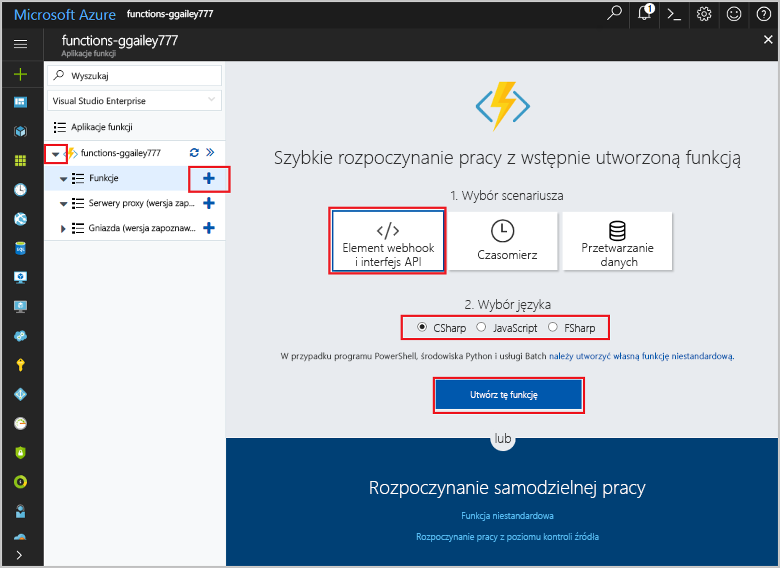
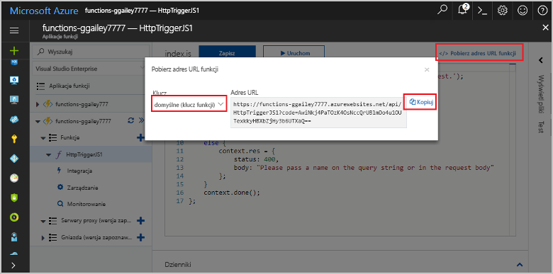

<properties
   pageTitle="Tworzenie pierwszej funkcji platformy Azure | Microsoft Azure"
   description="Utwórz swoją pierwszą funkcję platformy Azure, aplikację niekorzystającą z serwera, w niespełna dwie minuty."
   services="functions"
   documentationCenter="na"
   authors="ggailey777"
   manager="erikre"
   editor=""
   tags=""
/>

<tags
   ms.service="functions"
   ms.devlang="multiple"
   ms.topic="hero-article"
   ms.tgt_pltfrm="multiple"
   ms.workload="na"
   ms.date="09/08/2016"
   ms.author="glenga"/>

#Tworzenie pierwszej funkcji platformy Azure

##Omówienie
Azure Functions to oparte na zdarzeniach środowisko umożliwiające przeprowadzanie obliczeń na żądanie, które rozszerza istniejącą platformę aplikacji Azure o funkcje implementowania kodu wyzwalanego przez zdarzenia występujące w obrębie innych usług platformy Azure, produktów SaaS oraz systemów lokalnych. W środowisku Azure Functions aplikacje są skalowane na żądanie i płacisz tylko za użyte zasoby. Usługa Azure Functions umożliwia tworzenie zaplanowanych lub wyzwalanych jednostek kodu implementowanych w różnych językach programowania. Aby dowiedzieć się więcej o usłudze Azure Functions, zobacz [Azure Functions — omówienie](functions-overview.md).

W tym temacie opisano sposób użycia opcji szybkiego startu usługi Azure Functions w portalu w celu utworzenia prostej funkcji Node.js „hello world” wywoływanej przez wyzwalacz protokołu HTTP. Można również obejrzeć krótki film, aby sprawdzić, jak kroki te są wykonywane w portalu.

## Obejrzyj film

W poniższym filmie pokazano, jak wykonać podstawowe czynności opisane w tym samouczku. 

[AZURE.VIDEO create-your-first-azure-function-simple]

##Tworzenie funkcji przy użyciu opcji szybkiego startu

Aplikacja funkcji obsługuje wykonywanie funkcji na platformie Azure. Wykonaj poniższe kroki, aby utworzyć nową aplikację funkcji oraz nową funkcję. Nowa aplikacja funkcji jest tworzona z domyślną konfiguracją. Konkretny przykład tworzenia aplikacji funkcji można znaleźć w [innym samouczku szybkiego startu usługi Azure Functions](functions-create-first-azure-function-azure-portal.md).

Przed utworzeniem pierwszej funkcji musisz mieć aktywne konto platformy Azure. Jeśli nie masz jeszcze konta platformy Azure, [dostępne są konta bezpłatne](https://azure.microsoft.com/free/).

1. Przejdź do [portalu Azure Functions](https://functions.azure.com/signin) i zaloguj się przy użyciu konta platformy Azure.

2. Wpisz unikatową **nazwę** nowej aplikacji funkcji lub zaakceptuj nazwę wygenerowaną, wybierz preferowany **region**, a następnie kliknij pozycję **Utwórz i rozpocznij**. 

3. Na karcie **Szybki start** kliknij pozycje **Element webhook i interfejs API** oraz **JavaScript**, a następnie kliknij pozycję **Utwórz funkcję**. Zostanie utworzona nowa wstępnie zdefiniowana funkcja Node.js. 

    

4. (Opcjonalnie) Na tym etapie pracy z opcją szybkiego startu można przeprowadzić szybki przegląd funkcji usługi Azure Functions w portalu.   Po ukończeniu lub pominięciu samouczka można przetestować nową funkcję przy użyciu wyzwalacza HTTP.

##Testowanie funkcji

Ponieważ elementy szybkiego startu usługi Azure Functions zawierają funkcjonalny kod, można natychmiast przetestować nową funkcję.

1. Na karcie **Programowanie** sprawdź zawartość okna **Kod** i zwróć uwagę, że ten kod Node.js oczekuje żądania HTTP z wartością *Nazwa* przekazywaną w treści komunikatu lub w ciągu zapytania. Po uruchomieniu funkcji ta wartość jest zwracana w komunikacie odpowiedzi.

    

2. Przewiń w dół do pola tekstowego **Treść żądania**, zmień wartość właściwości *Nazwa* na swoją nazwę i kliknij pozycję **Uruchom**. Wykonanie jest wyzwalane przez testowe żądanie HTTP, informacje są zapisywane w dziennikach przesyłania strumieniowego, a odpowiedź „hello” jest wyświetlana w **danych wyjściowych**. 

3. Aby wyzwolić wykonywanie tej samej funkcji z innego okna lub karty przeglądarki, skopiuj wartość **Adres URL funkcji** z katy **Programowanie** i wklej go na pasku adresu przeglądarki, a następnie dołącz wartość ciągu zapytania `&name=yourname` i naciśnij klawisz Enter. W dziennikach są zapisywane te same informacje, a w przeglądarce tak jak poprzednio jest wyświetlana odpowiedź „hello”.

##Następne kroki

Ta opcja szybkiego startu przedstawia bardzo proste wykonywanie podstawowej funkcji wyzwalanej przez HTTP. Więcej informacji na temat używania możliwości usługi Azure Functions w aplikacjach można znaleźć w poniższych tematach.

+ [Dokumentacja usługi Azure Functions dla deweloperów](functions-reference.md)  
Dokumentacja dla programistów dotycząca kodowania funkcji oraz definiowania wyzwalaczy i powiązań.
+ [Testowanie usługi Azure Functions](functions-test-a-function.md)  
Opis różnych narzędzi i technik testowania funkcji.
+ [Jak skalować usługę Azure Functions](functions-scale.md)  
Omówienie planów usług dostępnych w środowisku Azure Functions, w tym dynamicznego planu usług, oraz sposobu wybierania właściwego planu. 
+ [Co to jest usługa Azure App Service?](../app-service/app-service-value-prop-what-is.md)  
Środowisko Azure Functions używa platformy Azure App Service na potrzeby funkcji podstawowych, takich jak wdrożenia, zmienne środowiskowe i diagnostyka. 

[AZURE.INCLUDE [Getting Started Note](../../includes/functions-get-help.md)]

<!--HONumber=Sep16_HO3-->

