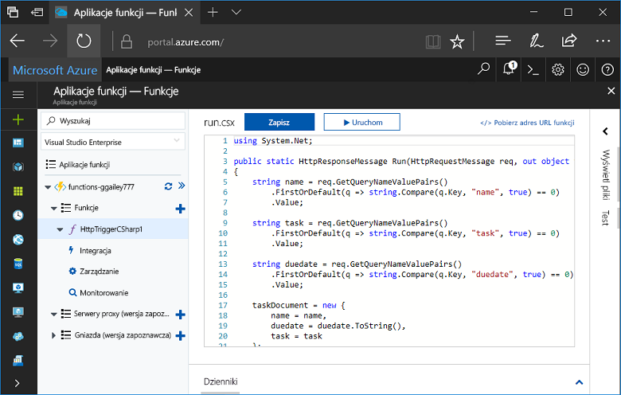
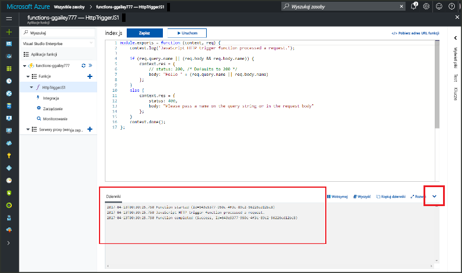

# Tworzenie pierwszej funkcji w witrynie Azure Portal

Usługa Azure Functions umożliwia wykonywanie kodu w środowisku bezserwerowym bez konieczności uprzedniego tworzenia maszyny wirtualnej lub publikowania aplikacji sieci Web. W tym temacie opisano tworzenie funkcji „hello world” w witrynie Azure Portal przy użyciu usługi Functions.

[!INCLUDE [quickstarts-free-trial-note](../../includes/quickstarts-free-trial-note.md)]

## Zaloguj się do platformy Azure.

Zaloguj się do witryny [Azure Portal](https://portal.azure.com/).

## Tworzenie aplikacji funkcji

Do obsługi wykonywania funkcji potrzebna jest aplikacja funkcji. Aplikacja funkcji umożliwia grupowanie funkcji jako jednostki logicznej, co ułatwia wdrażanie i udostępnianie zasobów oraz zarządzanie nimi. 

[!INCLUDE [Create function app Azure portal](../../includes/functions-create-function-app-portal.md)]

[!INCLUDE [functions-portal-favorite-function-apps](../../includes/functions-portal-favorite-function-apps.md)]

Następnie należy utworzyć funkcję w nowej aplikacji funkcji.

## Tworzenie funkcji wyzwalanej przez protokół HTTP

1. Rozwiń nową aplikację funkcji, a następnie kliknij przycisk **+** obok pozycji **Funkcje**.

2.  Na stronie **Szybkie rozpoczynanie pracy** wybierz pozycję **Element webhook i interfejs API**, wybierz język funkcji i kliknij pozycję **Utwórz tę funkcję**. 
   
    

Funkcja zostanie utworzona w wybranym języku i przy użyciu szablonu funkcji wyzwalanej przez protokół HTTP. Możesz uruchomić nową funkcję, wysyłając żądanie HTTP.

## Testowanie funkcji

1. W nowej funkcji kliknij przycisk **</> Pobierz adres URL funkcji**, wybierz pozycję **domyślne (klawisz funkcji)**, a następnie kliknij przycisk **Kopiuj**. 

    

2. Wklej adres URL funkcji do paska adresu przeglądarki. Dołącz ciąg zapytania `&name=<yourname>` do tego adresu URL i naciśnij klawisz `Enter` na klawiaturze, aby wykonać żądanie. Poniżej przedstawiono przykład odpowiedzi zwróconej przez funkcję w przeglądarce Edge:

    

    Adres URL żądania zawiera klucz, który domyślnie jest wymagany do uzyskania dostępu do funkcji za pośrednictwem protokołu HTTP.   

3. Gdy funkcja działa, informacje o śledzeniu są zapisywane w dziennikach. Aby wyświetlić dane wyjściowe śledzenia z poprzedniego wykonania, wróć do funkcji w portalu i kliknij strzałkę w górę w dolnej części ekranu, aby rozwinąć pozycję **Dzienniki**. 

   

## Oczyszczanie zasobów

[!INCLUDE [Clean up resources](../../includes/functions-quickstart-cleanup.md)]

## Następne kroki

Utworzono aplikację funkcji z prostą funkcją wyzwalaną przez protokół HTTP.  

[!INCLUDE [Next steps note](../../includes/functions-quickstart-next-steps.md)]

Aby uzyskać więcej informacji, zobacz [Powiązania protokołu HTTP i elementów webhook w usłudze Azure Functions](functions-bindings-http-webhook.md).

