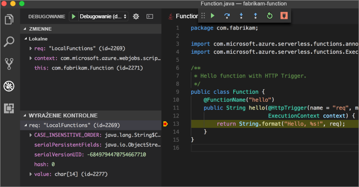

# <a name="create-your-first-function-with-java-and-maven-preview"></a>Tworzenie pierwszej funkcji przy użyciu języka Java i Maven (wersja zapoznawcza)

Ta opcja szybkiego startu prowadzi przez proces tworzenia [niekorzystającą](https://azure.microsoft.com/overview/serverless-computing/) funkcja projekt Maven, testowanie go lokalnie i wdrażania go do usługi Azure Functions. Gdy wszystko będzie gotowe, masz działające na platformie Azure aplikacji funkcji wyzwalanej przez HTTP.

 

[!INCLUDE [quickstarts-free-trial-note](../../includes/quickstarts-free-trial-note.md)]

## <a name="prerequisites"></a>Wymagania wstępne
Aby opracować funkcje aplikacji za pomocą języka Java, musi być zainstalowane następujące elementy:

-  [Oprogramowanie .NET core](https://www.microsoft.com/net/core), najnowszej wersji.
-  [Java Developer Kit](https://www.azul.com/downloads/zulu/), wersji 1.8.
-  [Interfejs wiersza polecenia platformy Azure](https://docs.microsoft.com/cli/azure)
-  [Apache Maven](https://maven.apache.org), wersja 3.0 lub nowszej.
-  [Node.js](https://nodejs.org/download/), wersji 8.6 lub nowszej.

> [!IMPORTANT] 
> Zmienna środowiskowa JAVA_HOME musi mieć ustawioną w lokalizacji instalacji zestawu JDK do ukończenia tego przewodnika Szybki Start.

## <a name="install-the-azure-functions-core-tools"></a>Zainstaluj usługę Azure Functions podstawowe narzędzia

[Azure funkcje podstawowe narzędzia 2.0](https://www.npmjs.com/package/azure-functions-core-tools) zapewniają środowisko rozwoju lokalnego służący do zapisywania, uruchamiania i debugowanie funkcji platformy Azure. Instalowanie narzędzi z [npm](https://www.npmjs.com/)znajdujący się w [Node.js](https://nodejs.org/).

```
npm install -g azure-functions-core-tools@core
```

> [!NOTE]
> Jeśli masz problemy podczas instalowania narzędzi podstawowych funkcji Azure w wersji 2.0, zobacz [środowiska uruchomieniowego 2.x wersji](/azure/azure-functions/functions-run-local#version-2x-runtime).

## <a name="generate-a-new-functions-project"></a>Generowanie nowego projektu funkcji

W pustym folderze, uruchom następujące polecenie, aby wygenerować projektu funkcji z [Maven archetype](https://maven.apache.org/guides/introduction/introduction-to-archetypes.html).

### <a name="linuxmacos"></a>Linux/MacOS

```bash
mvn archetype:generate \
    -DarchetypeGroupId=com.microsoft.azure \
    -DarchetypeArtifactId=azure-functions-archetype 
```

### <a name="windows-cmd"></a>Systemu Windows (CMD)
```cmd
mvn archetype:generate ^
    -DarchetypeGroupId=com.microsoft.azure ^
    -DarchetypeArtifactId=azure-functions-archetype
```

Maven wyświetla monit o podanie wartości wymagane do zakończenia, generowanie projektu. Dla _groupId_, _artifactId_, i _wersji_ wartości, zobacz [konwencje nazewnictwa Maven](https://maven.apache.org/guides/mini/guide-naming-conventions.html) odwołania. _AppName_ wartość musi być unikatowa w obrębie platformy Azure, więc Maven generuje nazwę aplikacji oparte na wcześniej wprowadzonych _artifactId_ jako domyślny. _PackageName_ wartość określa Java pakietu dla kodu generowanej funkcji.

```Output
Define value for property 'groupId': com.fabrikam.functions
Define value for property 'artifactId' : fabrikam-functions
Define value for property 'version' 1.0-SNAPSHOT : 
Define value for property 'package': com.fabrikam.functions
Define value for property 'appName' fabrikam-functions-20170927220323382:
Confirm properties configuration: Y
```

Maven tworzy pliki projektu w nowym folderze o nazwie _artifactId_. Wygenerowany kod w projekcie jest prostą [HTTP wyzwalane](/azure/azure-functions/functions-bindings-http-webhook) funkcji, która zwraca treść żądania:

```java
public class Function {
    @FunctionName("hello")
    public String hello(@HttpTrigger(name = "req", methods = {"get", "post"}, authLevel = AuthorizationLevel.ANONYMOUS) String req,
                        ExecutionContext context) {
        return String.format("Hello, %s!", req);
    }
}
```

## <a name="run-the-function-locally"></a>Uruchom funkcję lokalnie

Zmień katalog na folder nowo utworzonego projektu i skompilować i uruchomić funkcję z Maven:

```
cd fabrikam-function
mvn clean package 
mvn azure-functions:run
```

Te dane wyjściowe zostanie wyświetlony po uruchomieniu funkcji:

```Output
Listening on http://localhost:7071
Hit CTRL-C to exit...

Http Functions:

   hello: http://localhost:7071/api/hello
```

Funkcja z wiersza polecenia przy użyciu programu curl w terminalu nowego wyzwalacza:

```
curl -w '\n' -d LocalFunction http://localhost:7071/api/hello
```

```Output
Hello LocalFunction!
```

Użyj `Ctrl-C` w terminalu, aby zatrzymać kodu funkcji.

## <a name="deploy-the-function-to-azure"></a>Wdrażanie funkcji na platformie Azure

Proces wdrażania usługi Azure Functions używa poświadczeń konta z wiersza polecenia platformy Azure. [Zaloguj się przy użyciu interfejsu wiersza polecenia Azure](/cli/azure/authenticate-azure-cli?view=azure-cli-latest) , a następnie wdrożyć kod w nowej aplikacji funkcji, za pomocą `azure-functions:deploy` Maven docelowej.

```
az login
mvn azure-functions:deploy
```

Po zakończeniu wdrażania zostanie wyświetlony adres URL umożliwia dostęp do aplikacji Azure funkcji:

```output
[INFO] Successfully deployed Function App with package.
[INFO] Deleting deployment package from Azure Storage...
[INFO] Successfully deleted deployment package fabrikam-function-20170920120101928.20170920143621915.zip
[INFO] Successfully deployed Function App at https://fabrikam-function-20170920120101928.azurewebsites.net
[INFO] ------------------------------------------------------------------------
```

Testowanie aplikacji funkcji działających na platformie Azure przy użyciu programu curl:

```
curl -w '\n' https://fabrikam-function-20170920120101928.azurewebsites.net/api/hello -d AzureFunctions
```

```Output
Hello AzureFunctions!
```

## <a name="next-steps"></a>Następne kroki

Utworzono funkcji aplikacji Java z prostego wyzwalacza HTTP i wdrożyć ją do usługi Azure Functions.

- Przegląd [przewodnik dewelopera funkcji Java](functions-reference-java.md) Aby uzyskać więcej informacji na temat tworzenia funkcji języka Java.
- Dodaj dodatkowe funkcje za pomocą różnych wyzwalaczy na Twój projekt używający `azure-functions:add` docelowej Maven.
- Debugowanie funkcji lokalnie z kodem Visual Studio. Z [pakiet rozszerzenia języka Java](https://marketplace.visualstudio.com/items?itemName=vscjava.vscode-java-pack) zainstalowane i Otwórz projekt funkcji w programie Visual Studio Code, [dołączyć debuger](https://code.visualstudio.com/Docs/editor/debugging#_launch-configurations) do portu 5005. Następnie ustaw punkt przerwania w edytorze i wyzwalanie funkcji uruchomionej lokalnie: 


