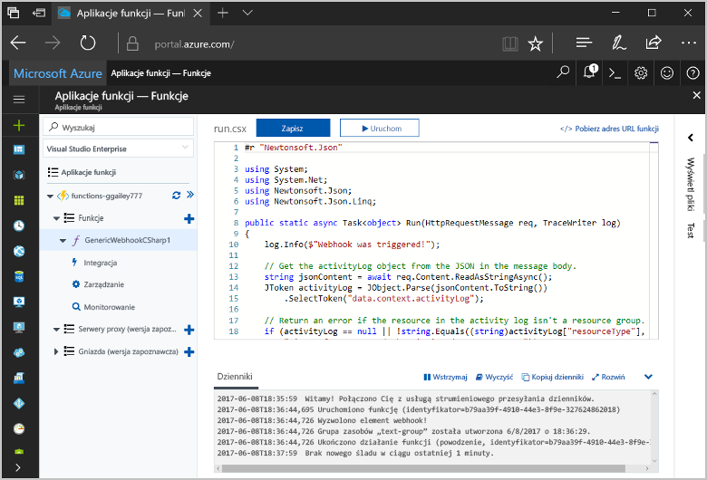
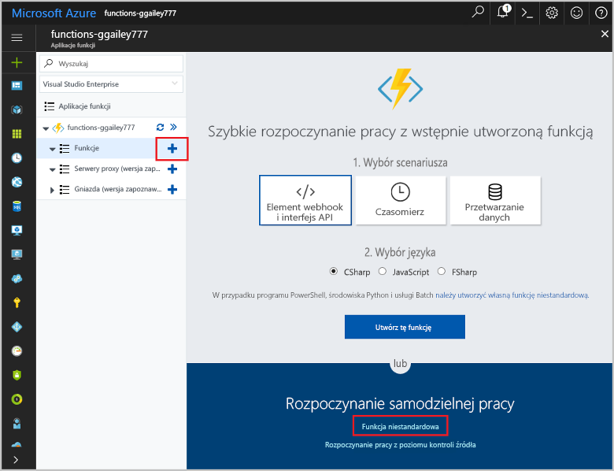
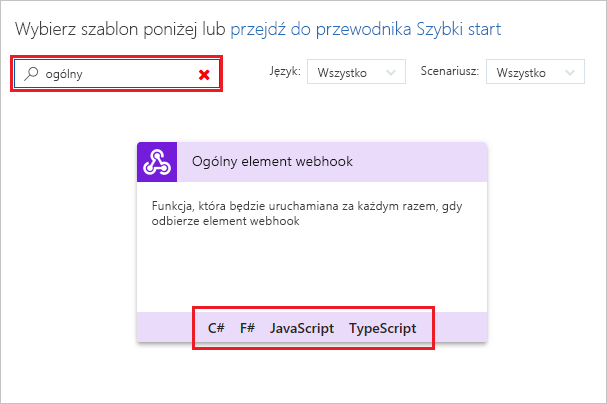
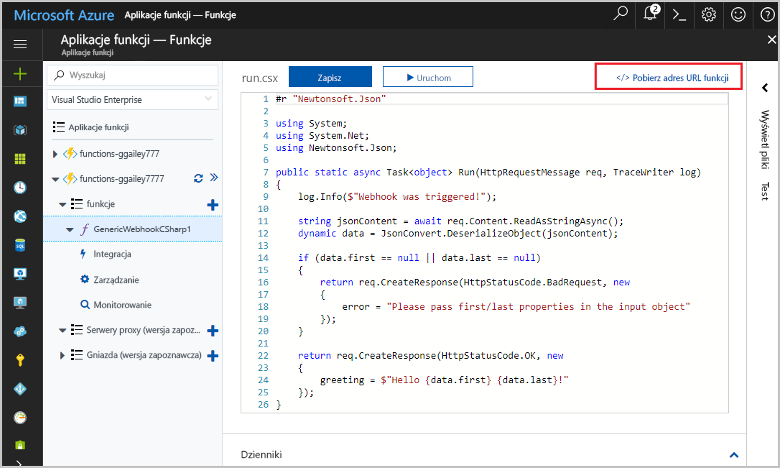
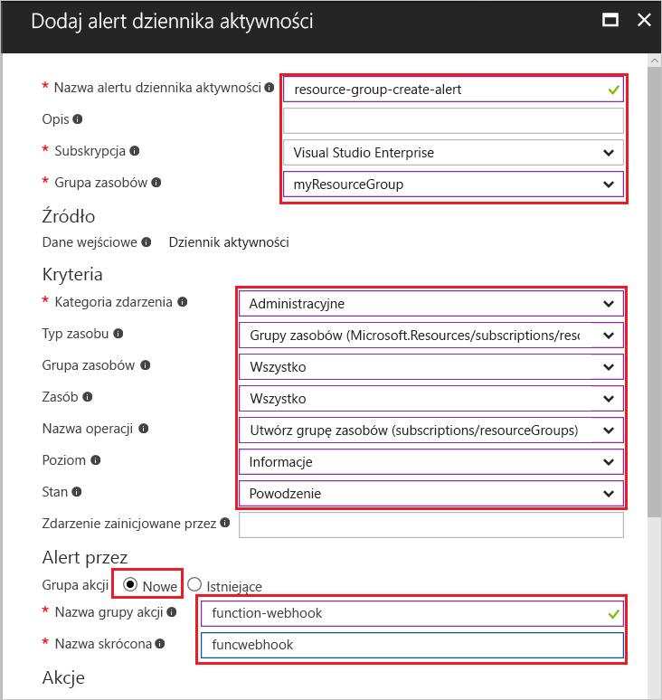
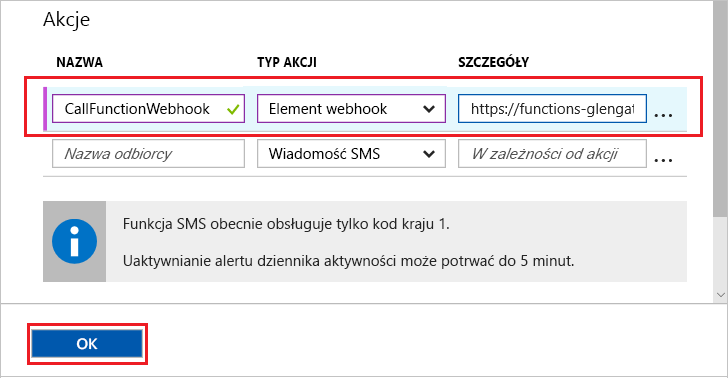
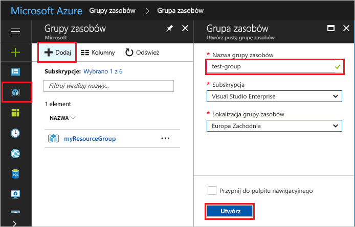
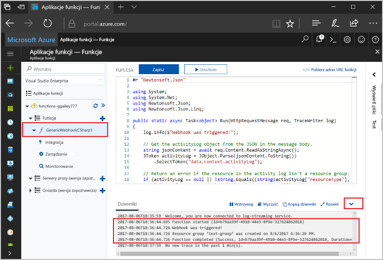

# <a name="create-a-function-triggered-by-a-generic-webhook"></a>Tworzenie funkcji wyzwalanej przez ogólny element webhook

Usługa Azure Functions umożliwia wykonywanie kodu w środowisku bezserwerowym bez konieczności uprzedniego tworzenia maszyny wirtualnej lub publikowania aplikacji sieci Web. Możesz na przykład skonfigurować wyzwalanie funkcji przez alert z usługi Azure Monitor. Z tego tematu dowiesz się, jak wykonywać kod języka C# w przypadku dodania grupy zasobów do subskrypcji.   



## <a name="prerequisites"></a>Wymagania wstępne 

W celu ukończenia tego samouczka:

+ Jeśli nie masz subskrypcji platformy Azure, przed rozpoczęciem utwórz [bezpłatne konto](https://azure.microsoft.com/free/?WT.mc_id=A261C142F).

[!INCLUDE [functions-portal-favorite-function-apps](../../includes/functions-portal-favorite-function-apps.md)]

## <a name="create-an-azure-function-app"></a>Tworzenie aplikacji funkcji platformy Azure

[!INCLUDE [Create function app Azure portal](../../includes/functions-create-function-app-portal.md)]

Następnie należy utworzyć funkcję w nowej aplikacji funkcji.

## <a name="create-function"></a>Tworzenie funkcji wyzwalanej przez ogólny element webhook

1. Rozwiń aplikację funkcji i kliknij przycisk **+** obok pozycji **Funkcje**. Jeśli jest to pierwsza funkcja w aplikacji funkcji, wybierz pozycję **Funkcja niestandardowa**. Spowoduje to wyświetlenie pełnego zestawu szablonów funkcji.

    

2. Wybierz szablon **Ogólny element webhook — C#**. Wpisz nazwę funkcji języka C#, a następnie wybierz pozycję **Utwórz**.

      

2. W nowej funkcji kliknij pozycję **</> Pobierz adres URL funkcji**, po czym skopiuj i zapisz wartość. Będzie ona używana do skonfigurowania elementu webhook. 

    
         
Następnie należy utworzyć punkt końcowy elementu webhook w alercie dziennika aktywności w usłudze Azure Monitor. 

## <a name="create-an-activity-log-alert"></a>Tworzenie alertu dziennika aktywności

1. W witrynie Azure Portal przejdź do usługi **Monitor**, wybierz pozycję **Alerty** i kliknij polecenie **Dodaj alert dziennika aktywności**.   

    

2. Użyj ustawień określonych w tabeli:

    

    | Ustawienie      |  Sugerowana wartość   | Opis                              |
    | ------------ |  ------- | -------------------------------------------------- |
    | **Nazwa alertu dziennika aktywności** | resource-group-create-alert | Nazwa alertu dziennika aktywności. |
    | **Subskrypcja** | Twoja subskrypcja | Subskrypcja używana z tym samouczkiem. | 
    |  **Grupa zasobów** | myResourceGroup | Grupa zasobów, w której wdrażane są zasoby alertów. Użycie tej samej grupy zasobów, której użyto w aplikacji funkcji, ułatwia wyczyszczenie zasobów po zakończeniu pracy z samouczkiem. |
    | **Kategoria zdarzenia** | Administracyjne | Ta kategoria obejmuje zmiany w zasobach platformy Azure.  |
    | **Typ zasobu** | Grupy zasobów | Filtruje alerty pod kątem działań związanych z grupami zasobów. |
    | **Grupa zasobów**<br/>i **Zasób** | Wszystkie | Monitorowanie wszystkich zasobów. |
    | **Nazwa operacji** | Tworzenie grupy zasobów | Filtruje alerty pod kątem operacji tworzenia. |
    | **Poziom** | Informacyjne | Uwzględnia alerty o poziomie Informacyjne. | 
    | **Stan** | Powodzenie | Filtruje alerty pod kątem pomyślnie ukończonych akcji. |
    | **Grupa akcji** | Nowa | Tworzy nową grupę akcji, służącą do definiowania akcji wykonywanych po aktywowaniu alertu. |
    | **Nazwa grupy akcji** | function-webhook | Nazwa identyfikująca grupę akcji.  | 
    | **Krótka nazwa** | funcwebhook | Krótka nazwa grupy akcji. |  

3. W obszarze **Akcje** dodaj akcję, używając ustawień wymienionych w tabeli: 

    

    | Ustawienie      |  Sugerowana wartość   | Opis                              |
    | ------------ |  ------- | -------------------------------------------------- |
    | **Nazwa** | CallFunctionWebhook | Nazwa akcji. |
    | **Typ akcji** | Webhook | Reakcją na alert będzie wywołanie adresu URL elementu webhook. |
    | **Szczegóły** | Adres URL funkcji | Wklej skopiowany wcześniej adres URL elementu webhook funkcji. |v

4. Kliknij przycisk **OK**, aby utworzyć alert i grupę akcji.  

Element webhook będzie teraz wywoływany w przypadku utworzenia grupy zasobów w ramach subskrypcji. Następnie należy zaktualizować kod funkcji w celu obsługi danych dziennika JSON w treści żądania.   

## <a name="update-the-function-code"></a>Aktualizacja kodu funkcji

1. Wróć do aplikacji funkcji w portalu i rozwiń funkcję. 

2. Zastąp kod skryptu języka C# funkcji w portalu następującym kodem:

    ```csharp
    #r "Newtonsoft.Json"
    
    using System;
    using System.Net;
    using Newtonsoft.Json;
    using Newtonsoft.Json.Linq;
    
    public static async Task<object> Run(HttpRequestMessage req, TraceWriter log)
    {
        log.Info($"Webhook was triggered!");
    
        // Get the activityLog object from the JSON in the message body.
        string jsonContent = await req.Content.ReadAsStringAsync();
        JToken activityLog = JObject.Parse(jsonContent.ToString())
            .SelectToken("data.context.activityLog");
    
        // Return an error if the resource in the activity log isn't a resource group. 
        if (activityLog == null || !string.Equals((string)activityLog["resourceType"], 
            "Microsoft.Resources/subscriptions/resourcegroups"))
        {
            log.Error("An error occured");
            return req.CreateResponse(HttpStatusCode.BadRequest, new
            {
                error = "Unexpected message payload or wrong alert received."
            });
        }
    
        // Write information about the created resource group to the streaming log.
        log.Info(string.Format("Resource group '{0}' was {1} on {2}.",
            (string)activityLog["resourceGroupName"],
            ((string)activityLog["subStatus"]).ToLower(), 
            (DateTime)activityLog["submissionTimestamp"]));
    
        return req.CreateResponse(HttpStatusCode.OK);    
    }
    ```

Możesz przetestować funkcję, tworząc nową grupę zasobów w ramach subskrypcji.

## <a name="test-the-function"></a>Testowanie funkcji

1. Kliknij ikonę grupy zasobów po lewej stronie witryny Azure Portal, wybierz pozycję **+ Dodaj**, wprowadź **Nazwę grupy zasobów** i wybierz polecenie **Utwórz**, aby utworzyć pustą grupę zasobów.
    
    

2. Wróć do funkcji i rozwiń okno **Dzienniki**. Po utworzeniu grupy zasobów alert dziennika aktywności wyzwala element webhook, powodując wykonanie funkcji. Zobaczysz, że nazwa nowej grupy zasobów została zapisana w dziennikach.  

    

3. (Opcjonalnie) Wróć do utworzonej grupy zasobów i usuń ją. Zwróć uwagę, że to działanie nie spowoduje wyzwolenia funkcji. Dzieje się tak, ponieważ operacje usuwania są odfiltrowywane przez alert. 

## <a name="clean-up-resources"></a>Oczyszczanie zasobów

[!INCLUDE [Next steps note](../../includes/functions-quickstart-cleanup.md)]

## <a name="next-steps"></a>Następne kroki

Utworzono funkcję, która jest uruchamiana w momencie otrzymania żądania od ogólnego elementu webhook. 

[!INCLUDE [Next steps note](../../includes/functions-quickstart-next-steps.md)]

Aby uzyskać więcej informacji na temat wyzwalaczy elementów webhook, zobacz temat [Powiązania protokołu HTTP i elementów webhook w usłudze Azure Functions](functions-bindings-http-webhook.md). Aby dowiedzieć się więcej na temat tworzenia funkcji w języku C#, zobacz [Azure Functions C# script developer reference](functions-reference-csharp.md) (Dokumentacja dla deweloperów skryptów języka C# dla usługi Azure Functions).

