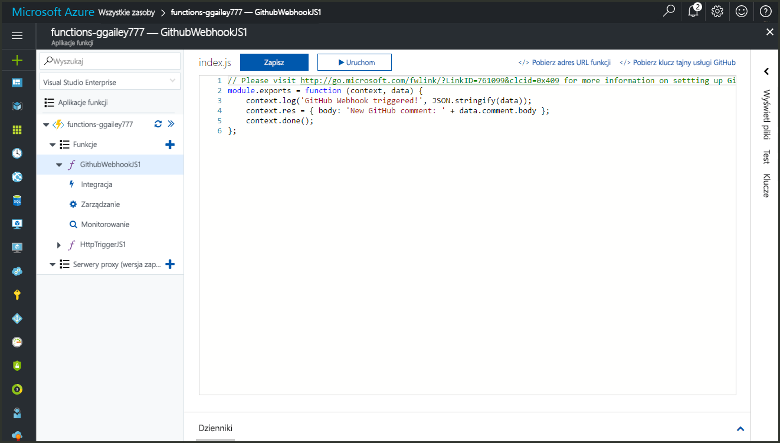
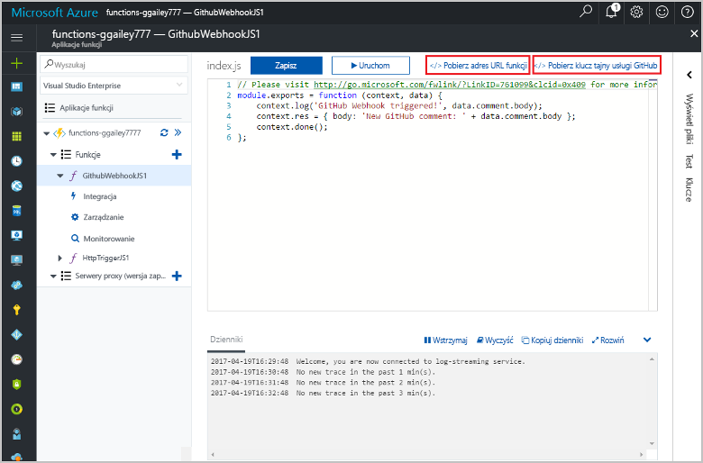

# Tworzenie funkcji wyzwalanej przez element webhook GitHub

Dowiedz się, jak utworzyć funkcję, która jest wyzwalana przez element webhook GitHub. 

Do wykonania czynności przedstawionych w tym temacie są wymagane zasoby utworzone w temacie [Tworzenie pierwszej funkcji w witrynie Azure Portal](functions-create-first-azure-function.md).

Potrzebne jest także konto usługi GitHub. Jeśli jeszcze nie masz konta usługi GitHub, [możesz je założyć bezpłatnie](https://github.com/join). 

Wykonanie wszystkich czynności opisanych w tym temacie powinno zająć mniej niż pięć minut.

## Znajdowanie aplikacji funkcji    

1. Zaloguj się do witryny [Azure Portal](https://portal.azure.com/). 

2. Na pasku wyszukiwania w górnej części portalu wpisz nazwę aplikacji funkcji i wybierz ją z listy.

## Tworzenie funkcji wyzwalanej przez element webhook GitHub

1. W aplikacji funkcji kliknij przycisk **+** obok pozycji **Funkcje**, kliknij szablon **GitHubWebHook** dla odpowiedniego języka, a następnie kliknij przycisk **Utwórz**.
   
     

2. Kliknij pozycję **</> Pobierz adres URL funkcji**, po czym skopiuj i zapisz wartości. Powtórz te czynności po kliknięciu pozycji **</> Pobierz wpis tajny usługi GitHub**. Wartości te będą potrzebne podczas konfigurowania elementu webhook w usłudze GitHub. 

     
         
W następnym kroku zostanie utworzony element webhook w repozytorium GitHub. 

## Konfigurowanie elementu webhook
1. W usłudze GitHub przejdź do repozytorium, którego jesteś właścicielem. Możesz też użyć dowolnego rozwidlonego repozytorium.
 
2. Kliknij kolejno pozycje **Ustawienia**, **Elementy webhook** i **Dodaj element webhook**.
   
    

3. Wklej adres URL funkcji i wpis tajny do pól **Adres URL ładunku** i **Wpis tajny**, a następnie wybierz wartość **application/json** dla ustawienia **Typ zawartości**.

4. Kliknij pozycję **Pozwól mi wybrać pojedyncze zdarzenia**, wybierz pozycję **Komentarz dotyczący problemu** i kliknij pozycję **Dodaj element webhook**.
   
    

Element webhook został skonfigurowany do wyzwolenia funkcji po dodaniu nowego komentarza dotyczącego problemu. 

## Testowanie funkcji
1. W swoim repozytorium GitHub otwórz kartę **Problemy** w nowym oknie przeglądarki.

2. W nowym oknie kliknij pozycję **Nowy problem**, wpisz tytuł i kliknij pozycję **Prześlij nowy problem**. 

2. W obszarze problemu wpisz komentarz i kliknij pozycję **Komentarz**. 

3. W innym oknie usługi GitHub kliknij pozycję **Edytuj** obok nowego elementu webhook, przewiń ekran do pozycji **Ostatnie dostawy** i sprawdź, czy żądanie elementu webhook zostało przetworzone przez funkcję. 
 
    

   Odpowiedź funkcji powinna zawierać tekst `New GitHub comment: <Your issue comment text>`.

## Następne kroki

[!INCLUDE [Next steps note](../../includes/functions-quickstart-next-steps.md)]

[!INCLUDE [Getting Started Note](../../includes/functions-get-help.md)]

