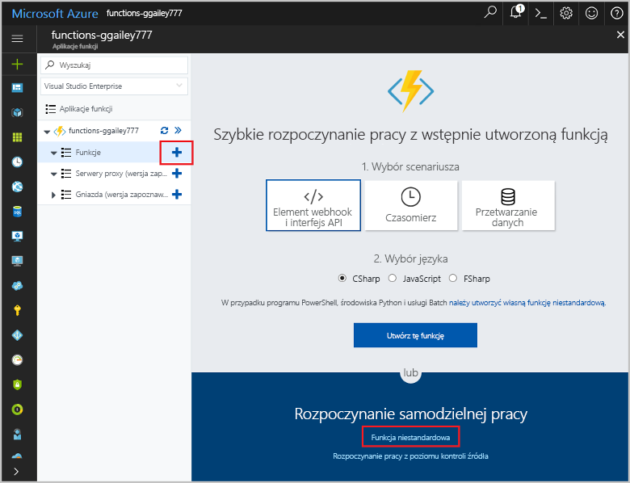
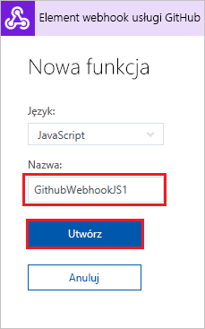
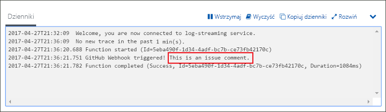

# Tworzenie funkcji wyzwalanej przez element webhook GitHub

Dowiedz się, jak utworzyć funkcję wyzwalaną przez żądanie elementu webhook protokołu HTTP z ładunkiem specyficznym dla usługi GitHub.

## Wymagania wstępne

+ Konto w usłudze GitHub z przynajmniej jednym projektem.
+ Subskrypcja platformy Azure. Jeśli nie masz subskrypcji, przed rozpoczęciem utwórz [bezpłatne konto](https://azure.microsoft.com/free/?WT.mc_id=A261C142F).

[!INCLUDE [functions-portal-favorite-function-apps](../../includes/functions-portal-favorite-function-apps.md)]

## Tworzenie aplikacji funkcji platformy Azure

[!INCLUDE [Create function app Azure portal](../../includes/functions-create-function-app-portal.md)]

Następnie należy utworzyć funkcję w nowej aplikacji funkcji.

## Tworzenie funkcji wyzwalanej przez element webhook GitHub

1. Rozwiń aplikację funkcji i kliknij przycisk **+** obok pozycji **Funkcje**. Jeśli jest to pierwsza funkcja w aplikacji funkcji, wybierz pozycję **Funkcja niestandardowa**. Spowoduje to wyświetlenie pełnego zestawu szablonów funkcji.

    

2. W polu wyszukiwania wpisz `github`, a następnie wybierz żądany język dla szablonu wyzwalacza elementu webhook GitHub. 

      

2. Wpisz **nazwę** funkcji, a następnie wybierz pozycję **Utwórz**. 

      

3. W nowej funkcji kliknij pozycję **</> Pobierz adres URL funkcji**, po czym skopiuj i zapisz wartości. Powtórz te czynności po kliknięciu pozycji **</> Pobierz wpis tajny usługi GitHub**. Wartości te będą potrzebne podczas konfigurowania elementu webhook w usłudze GitHub.

    

W następnym kroku zostanie utworzony element webhook w repozytorium GitHub.

## Konfigurowanie elementu webhook

1. W usłudze GitHub przejdź do repozytorium, którego jesteś właścicielem. Możesz też użyć dowolnego rozwidlonego repozytorium. Jeśli konieczne będzie rozwidlenie repozytorium, skorzystaj z informacji pod adresem <https://github.com/Azure-Samples/functions-quickstart>.

1. Kliknij kolejno pozycje **Ustawienia**, **Elementy webhook** i **Dodaj element webhook**.

    

1. Użyj ustawień określonych w tabeli i kliknij pozycję **Dodaj element webhook**.

    

| Ustawienie | Sugerowana wartość | Opis |
|---|---|---|
| **Adres URL ładunku** | Skopiowana wartość | Użyj wartości zwróconej po kliknięciu pozycji **</> Pobierz adres URL funkcji**. |
| **Wpis tajny**   | Skopiowana wartość | Użyj wartości zwróconej po kliknięciu pozycji **</> Pobierz wpis tajny usługi GitHub**. |
| **Typ zawartości** | application/json | Funkcja oczekuje ładunku JSON. |
| Wyzwalacze zdarzeń | Pozwól mi wybrać pojedyncze zdarzenia | Wyzwalacz ma być uruchamiany tylko w przypadku zdarzeń z komentarzami dotyczącymi problemów.  |
| | Komentarz dotyczący problemu |  |

Element webhook został skonfigurowany do wyzwolenia funkcji po dodaniu nowego komentarza dotyczącego problemu.

## Testowanie funkcji

1. W swoim repozytorium GitHub otwórz kartę **Problemy** w nowym oknie przeglądarki.

1. W nowym oknie kliknij pozycję **Nowy problem**, wpisz tytuł, a następnie kliknij pozycję **Prześlij nowy problem**.

1. W obszarze problemu wpisz komentarz i kliknij pozycję **Komentarz**.

    

1. Wróć do portalu i wyświetl dzienniki. Powinien zostać wyświetlony wpis śledzenia z nowym tekstem komentarza.

     

## Oczyszczanie zasobów

[!INCLUDE [Next steps note](../../includes/functions-quickstart-cleanup.md)]

## Następne kroki

Utworzono funkcję, która jest uruchamiana w momencie otrzymania żądania od elementu webhook GitHub.

[!INCLUDE [Next steps note](../../includes/functions-quickstart-next-steps.md)]

Aby uzyskać więcej informacji na temat wyzwalaczy elementów webhook, zobacz temat [Powiązania protokołu HTTP i elementów webhook w usłudze Azure Functions](functions-bindings-http-webhook.md).
