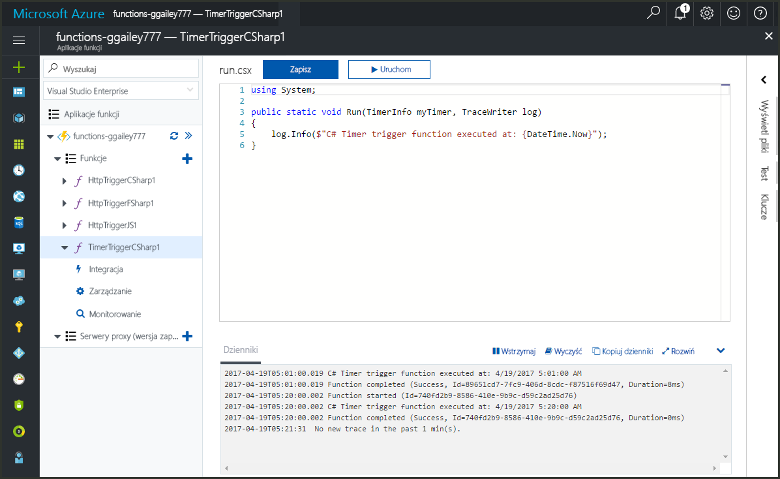
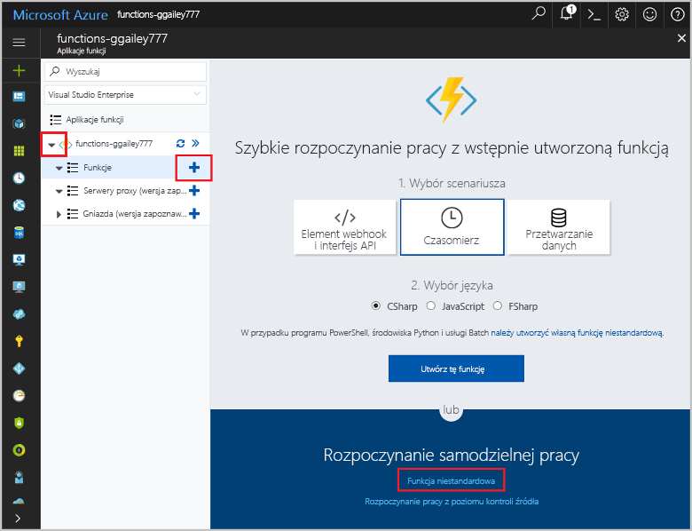
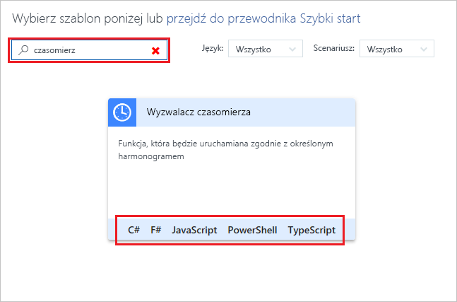
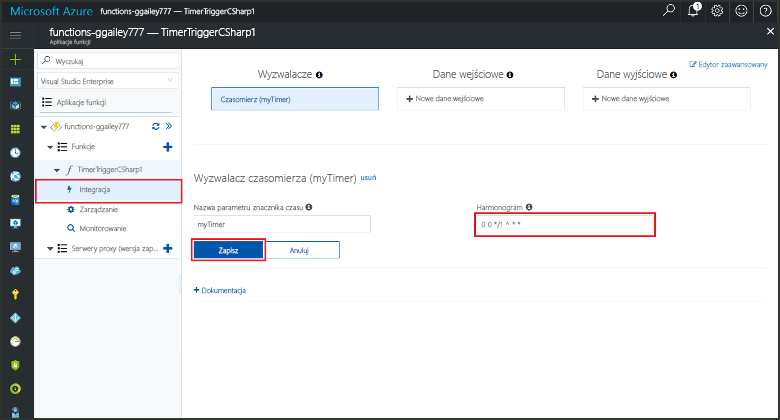

# Tworzenie funkcji wyzwalanej czasomierzem na platformie Azure

Dowiedz się, jak za pomocą usługi Azure Functions utworzyć funkcję uruchamianą zgodnie z określonym harmonogramem.

## Wymagania wstępne

W celu ukończenia tego samouczka:

+ Jeśli nie masz subskrypcji platformy Azure, przed rozpoczęciem utwórz [bezpłatne konto](https://azure.microsoft.com/free/?WT.mc_id=A261C142F).

[!INCLUDE [functions-portal-favorite-function-apps](../../includes/functions-portal-favorite-function-apps.md)]

## Tworzenie aplikacji funkcji platformy Azure

[!INCLUDE [Create function app Azure portal](../../includes/functions-create-function-app-portal.md)]

Następnie należy utworzyć funkcję w nowej aplikacji funkcji.

## Tworzenie funkcji wyzwalanej czasomierzem

1. Rozwiń aplikację funkcji i kliknij przycisk **+** obok pozycji **Funkcje**. Jeśli jest to pierwsza funkcja w aplikacji funkcji, wybierz pozycję **Funkcja niestandardowa**. Spowoduje to wyświetlenie pełnego zestawu szablonów funkcji.

    

2. Wybierz szablon **TimerTrigger** dla odpowiedniego języka. Następnie użyj ustawień określonych w tabeli:

    

    | Ustawienie | Sugerowana wartość | Opis |
    |---|---|---|
    | **Nazwa funkcji** | TimerTriggerCSharp1 | Określa nazwę funkcji wyzwalanej czasomierzem. |
    | **[Harmonogram](http://en.wikipedia.org/wiki/Cron#CRON_expression)** | 0 \*/1 \* \* \* \* | Składające się z 6 pól [wyrażenie CRON](http://en.wikipedia.org/wiki/Cron#CRON_expression) planujące uruchamianie funkcji co minutę. |

2. Kliknij przycisk **Utwórz**. Zostanie utworzona funkcja w wybranym języku uruchamiana co minutę.

3. Zweryfikuj uruchomienie, wyświetlając informacje o śledzeniu zapisane w dziennikach.

    

Teraz możesz zmienić harmonogram funkcji tak, aby była uruchamiana rzadziej, na przykład co godzinę. 

## Aktualizowanie harmonogramu czasomierza

1. Rozwiń swoją funkcję i kliknij pozycję **Integracja**. W tym miejscu określa się powiązania danych wejściowych i wyjściowych dla funkcji oraz ustawia harmonogram. 

2. W polu **Harmonogram** wprowadź nową wartość `0 0 */1 * * *`, a następnie kliknij przycisk **Zapisz**.  

Funkcja będzie teraz uruchamiana raz na godzinę. 

## Oczyszczanie zasobów

[!INCLUDE [Next steps note](../../includes/functions-quickstart-cleanup.md)]

## Następne kroki

Utworzono funkcję uruchamianą zgodnie z harmonogramem.

[!INCLUDE [Next steps note](../../includes/functions-quickstart-next-steps.md)]

Aby uzyskać więcej informacji na temat wyzwalaczy czasomierza, zobacz [Planowanie wykonywania kodu za pomocą usługi Azure Functions](functions-bindings-timer.md).