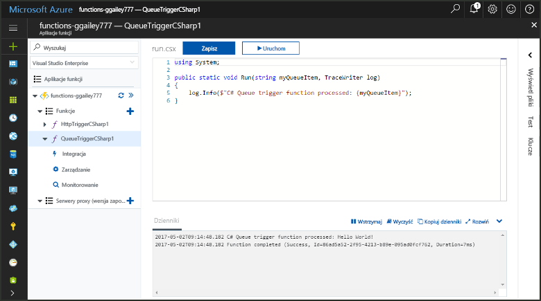
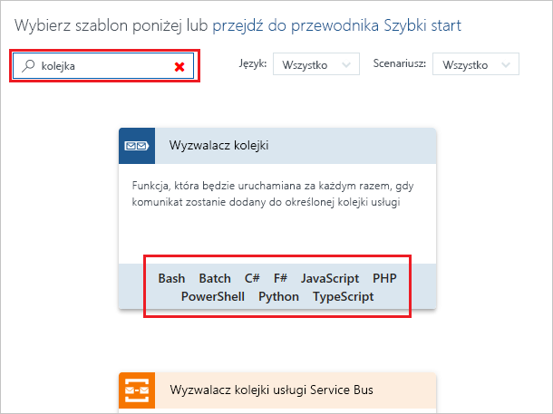
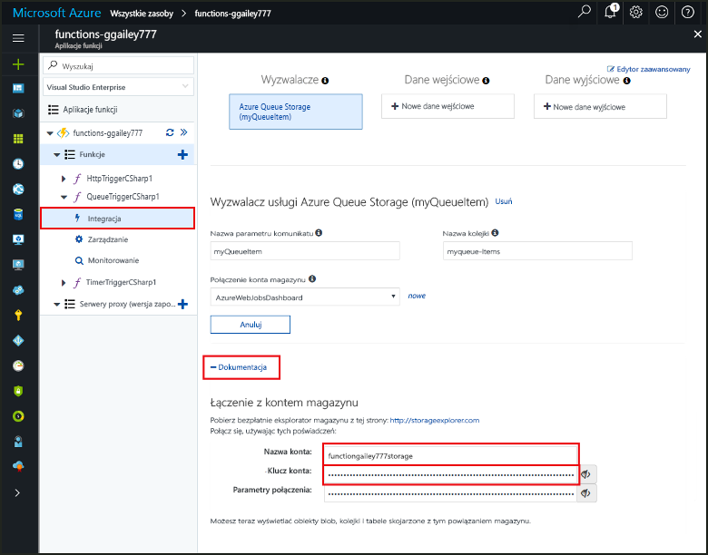
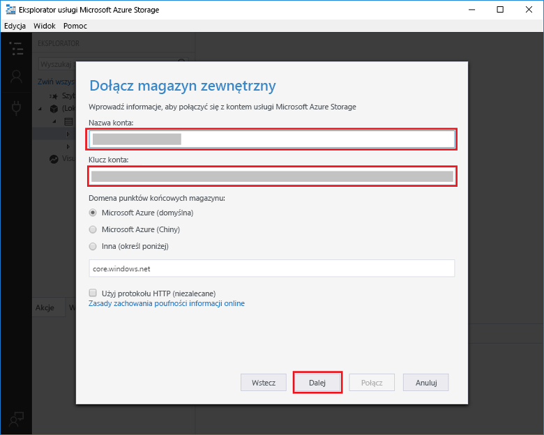
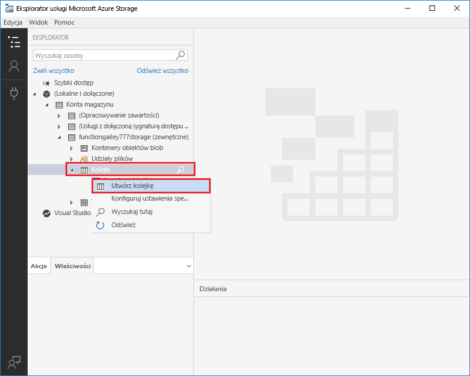
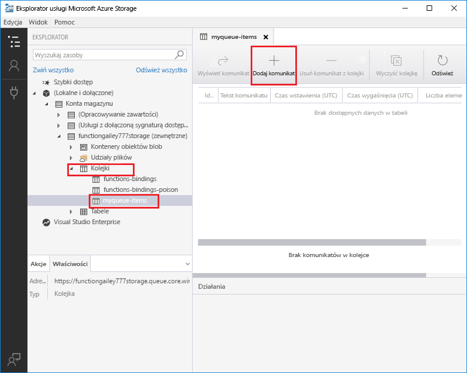
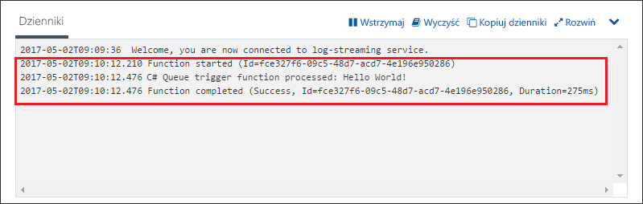

# Tworzenie funkcji wyzwalanej przez usługę Azure Queue Storage

Dowiedz się, jak utworzyć funkcję wyzwalaną w momencie przesłania komunikatów do kolejki usługi Azure Storage.

Wykonanie wszystkich czynności opisanych w tym temacie powinno zająć mniej niż pięć minut.

## Wymagania wstępne

Przed uruchomieniem tego przykładu należy wykonać następujące czynności:

- Pobrać i zainstalować program [Microsoft Azure Storage Explorer](http://storageexplorer.com/).

Jeśli nie masz subskrypcji platformy Azure, przed rozpoczęciem utwórz [bezpłatne konto](https://azure.microsoft.com/free/?WT.mc_id=A261C142F).

[!INCLUDE [functions-portal-favorite-function-apps](../../includes/functions-portal-favorite-function-apps.md)]

## Tworzenie aplikacji funkcji platformy Azure

[!INCLUDE [Create function app Azure portal](../../includes/functions-create-function-app-portal.md)]

Następnie należy utworzyć funkcję w nowej aplikacji funkcji.

## Tworzenie funkcji wyzwalanej przez kolejkę

Rozwiń swoją aplikację funkcji, kliknij przycisk **+** obok pozycji **Funkcje** i kliknij szablon **QueueTrigger** dla odpowiedniego języka. Następnie użyj ustawień określonych w tabeli i kliknij pozycję **Utwórz**.

| Ustawienie | Sugerowana wartość | Opis |
|---|---|---|
| **Nazwa kolejki**   | myqueue-items    | Nazwa kolejki, z którą zostanie nawiązane połączenie na koncie magazynu. |
| **Połączenie konta magazynu** | AzureWebJobStorage | Możesz skorzystać z połączenia konta magazynu już używanego przez aplikację funkcji lub utworzyć nowe.  |
| **Nazwa funkcji** | Unikatowa w obrębie aplikacji funkcji | Nazwa funkcji wyzwalanej przez kolejkę. |

Następnie nawiąż połączenie z kontem usługi Azure Storage i utwórz kolejkę magazynu **myqueue-items**.

## Tworzenie kolejki

1. W funkcji kliknij pozycję **Integracja**, rozwiń pozycję **Dokumentacja** i skopiuj wartości pól **Nazwa konta** oraz **Klucz konta**. Te poświadczenia służą do nawiązywania połączenia z kontem magazynu. Jeśli już nawiązano połączenie z kontem magazynu, przejdź do kroku 4.

    v

1. Uruchom narzędzie [Microsoft Azure Storage Explorer](http://storageexplorer.com/), kliknij ikonę połączenia po lewej stronie, wybierz pozycję **Użyj klucza i nazwy konta magazynu** i kliknij przycisk **Dalej**.

    

1. Wprowadź wartości **Nazwa konta** i **Klucz konta** z kroku 1, kliknij przycisk **Dalej**, a następnie przycisk **Połącz**.

    

1. Rozwiń dołączone konto magazynu, kliknij prawym przyciskiem myszy pozycję **Queues** (Kolejki), kliknij polecenie **Create queue** (Utwórz kolejkę), wpisz nazwę `myqueue-items`, a następnie naciśnij klawisz Enter.

    

Teraz, gdy masz już kolejkę magazynu, możesz przetestować funkcję, dodając komunikat do kolejki.

## Testowanie funkcji

1. Wróć do witryny Azure Portal, przejdź do swoich funkcji, rozwiń pozycję **Dzienniki** w dolnej części strony i upewnij się, że strumieniowe przesyłanie dzienników nie jest wstrzymane.

1. W programie Storage Explorer rozwiń swoje konto magazynu, wybierz kolejno pozycje **Queues** (Kolejki) i **myqueue-items**, a następnie kliknij pozycję **Add message** (Dodaj komunikat).

    

1. Wpisz komunikat „Hello World!” w polu **Message text** (Tekst komunikatu) i kliknij przycisk **OK**.

1. Poczekaj kilka sekund, a następnie wróć do dzienników funkcji i sprawdź, czy nowy komunikat został odczytany z kolejki.

    

1. Wróć do programu Storage Explorer, kliknij pozycję **Refresh** (Odśwież) i sprawdź, czy komunikat został przetworzony i nie ma go już w kolejce.

## Oczyszczanie zasobów

[!INCLUDE [Next steps note](../../includes/functions-quickstart-cleanup.md)]

## Następne kroki

Utworzono funkcję, która jest uruchamiana w momencie dodania komunikatu do kolejki magazynu.

[!INCLUDE [Next steps note](../../includes/functions-quickstart-next-steps.md)]

Aby uzyskać więcej informacji na temat wyzwalaczy usługi Queue Storage, zobacz [Powiązania usługi Queue Storage w usłudze Azure Functions](functions-bindings-storage-queue.md).
