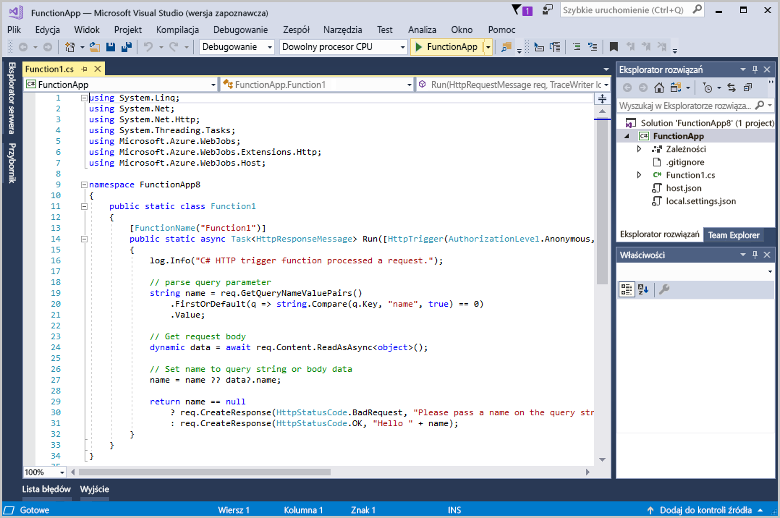

# Tworzenie pierwszej funkcji przy użyciu programu Visual Studio

Usługa Azure Functions umożliwia wykonywanie kodu w środowisku [bezserwerowym](https://azure.microsoft.com/overview/serverless-computing/) bez konieczności uprzedniego tworzenia maszyny wirtualnej lub publikowania aplikacji internetowej.

> [!VIDEO https://www.youtube-nocookie.com/embed/DrhG-Rdm80k]

W tym temacie przedstawiono użycie narzędzi programu Visual Studio 2017 dla usługi Azure Functions w celu utworzenia i przetestowania lokalnej funkcji „hello world”. Kod funkcji zostanie następnie opublikowany na platformie Azure. Te narzędzia są dostępne jako część obciążenia projektowania na platformie Azure w programie Visual Studio 2017 w wersji 15.3 lub nowszej.

## Wymagania wstępne

Do ukończenia tego samouczka niezbędne jest zainstalowanie następujących składników:

* [Program Visual Studio 2017 w wersji 15.4](https://www.visualstudio.com/vs/) lub nowszej zawierający obciążenie **Programowanie na platformie Azure**.

    
    
[!INCLUDE [quickstarts-free-trial-note](../../includes/quickstarts-free-trial-note.md)] 

## Tworzenie projektu usługi Azure Functions w programie Visual Studio

[!INCLUDE [Create a project using the Azure Functions template](../../includes/functions-vstools-create.md)]

Po utworzeniu projektu można utworzyć pierwszą funkcję.

## Tworzenie funkcji

1. W **Eksploratorze rozwiązań** kliknij prawym przyciskiem myszy węzeł projektu i wybierz polecenie **Dodaj** > **Nowy element**. Wybierz pozycję **Funkcja platformy Azure**, wprowadź `HttpTriggerCSharp.cs` w polu **Nazwa** i kliknij pozycję **Dodaj**.

2. Wybierz opcję **HttpTrigger**, wybierz pozycję **Anonimowe** w polu **Prawa dostępu** i kliknij pozycję **OK**. Do utworzonej funkcji można uzyskać dostęp przez żądanie HTTP z dowolnego klienta. 

    

    Do projektu zawierającego klasę implementującą kod funkcji zostanie dodany plik kodu. Ten kod jest oparty na szablonie, który odbiera wartość nazwy i przekazuje ją z powrotem. Atrybut **FunctionName** ustawia nazwę funkcji. Atrybut **HttpTrigger** wskazuje komunikat, który wywołuje funkcję. 

    

Po utworzeniu funkcji wyzwalanej przez protokół HTTP można ją przetestować na komputerze lokalnym.

## Lokalne testowanie funkcji

Podstawowe narzędzia usługi Azure Functions umożliwiają uruchamianie projektu usługi Azure Functions na lokalnym komputerze deweloperskim. Monit o zainstalowanie tych narzędzi pojawia się przy pierwszym uruchomieniu funkcji w programie Visual Studio.  

1. Aby przetestować funkcję, naciśnij klawisz F5. Po wyświetleniu monitu zaakceptuj żądanie programu Visual Studio dotyczące pobrania i zainstalowania podstawowych narzędzi usługi Azure Functions (CLI).  Może także być konieczne włączenie wyjątku zapory, aby umożliwić narzędziom obsługę żądań HTTP.

2. Skopiuj adres URL funkcji z danych wyjściowych środowiska uruchomieniowego usługi Azure Functions.  

    

3. Wklej adres URL żądania HTTP w pasku adresu przeglądarki. Dołącz ciąg zapytania `?name=<yourname>` do tego adresu URL i wykonaj żądanie. Na poniższym obrazie przedstawiono wyświetloną w przeglądarce odpowiedź na lokalne żądanie GET zwróconą przez funkcję: 

    

4. Aby zatrzymać debugowanie, kliknij przycisk **Zatrzymaj** na pasku narzędzi programu Visual Studio.

Gdy będziesz mieć pewność, że funkcja działa poprawnie na komputerze lokalnym, możesz opublikować projekt na platformie Azure.

## Publikowanie projektu na platformie Azure

Aby opublikować projekt, musisz mieć aplikację funkcji w swojej subskrypcji platformy Azure. Aplikację funkcji możesz utworzyć bezpośrednio w programie Visual Studio.

[!INCLUDE [Publish the project to Azure](../../includes/functions-vstools-publish.md)]

## Testowanie funkcji na platformie Azure

1. Skopiuj podstawowy adres URL aplikacji funkcji ze strony profilu publikowania. Część `localhost:port` adresu URL używaną podczas lokalnego testowania funkcji zastąp nowym podstawowym adresem URL. Tak jak poprzednio dołącz ciąg zapytania `?name=<yourname>` do tego adresu URL i wykonaj żądanie.

    Adres URL, który wywołuje funkcję wyzwalaną przez protokół HTTP, wygląda następująco:

        http://<functionappname>.azurewebsites.net/api/<functionname>?name=<yourname> 

2. Wklej nowy adres URL żądania HTTP na pasku adresu przeglądarki. Na poniższym obrazie przedstawiono wyświetloną w przeglądarce odpowiedź na zdalne żądanie GET zwróconą przez funkcję: 

    
 
## Następne kroki

W programie Visual Studio utworzono aplikację funkcji C# z prostą funkcją wyzwalaną przez protokół HTTP. 

+ Aby dowiedzieć się, jak skonfigurować projekt w celu obsługi innych typów wyzwalaczy i powiązań, zobacz sekcję [Configure the project for local development (Konfigurowanie projektu na potrzeby lokalnego projektowania)](functions-develop-vs.md#configure-the-project-for-local-development) w temacie [Azure Functions Tools for Visual Studio (Narzędzia usługi Azure Functions dla programu Visual Studio)](functions-develop-vs.md).
+ Aby dowiedzieć się więcej na temat lokalnego testowania i debugowania przy użyciu podstawowych narzędzi usługi Azure Functions, zobacz [Code and test Azure Functions locally (Kodowanie i lokalne testowanie usługi Azure Functions)](functions-run-local.md). 
+ Aby dowiedzieć się więcej o projektowaniu funkcji jako bibliotek klasy .NET, zobacz [Korzystanie z bibliotek klasy .NET w usłudze Azure Functions](functions-dotnet-class-library.md). 

