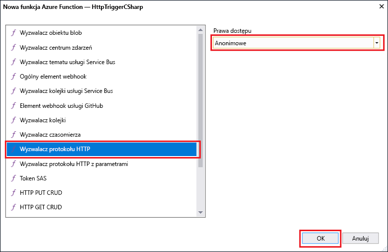
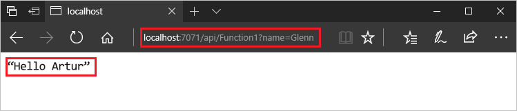
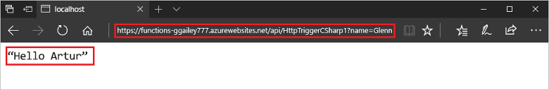

# Tworzenie pierwszej funkcji przy użyciu programu Visual Studio

Usługa Azure Functions umożliwia wykonywanie kodu w środowisku bezserwerowym bez konieczności uprzedniego tworzenia maszyny wirtualnej lub publikowania aplikacji sieci Web.

> [!IMPORTANT]
> Do wykonania czynności w tym temacie użyto wersji zapoznawczej programu Visual Studio. Przed rozpoczęciem upewnij się, że zainstalowano [program Visual Studio w wersji zapoznawczej 2017 15.3](https://www.visualstudio.com/vs/preview/).

W tym temacie przedstawiono użycie narzędzi usługi Azure Functions dla programu Visual Studio 2017 w celu utworzenia i przetestowania lokalnej funkcji „hello world”. Kod funkcji zostanie następnie opublikowany na platformie Azure.

## Wymagania wstępne

Do ukończenia tego samouczka niezbędne jest zainstalowanie następujących składników:

* [Program Visual Studio 2017 (wersja zapoznawcza) w wersji 15.3](https://www.visualstudio.com/vs/preview/) zawierający obciążenie **Programowanie na platformie Azure**.

    

[!INCLUDE [quickstarts-free-trial-note](../../includes/quickstarts-free-trial-note.md)]

## Instalowanie narzędzi usługi Azure Functions dla programu Visual Studio 2017

Przed rozpoczęciem pracy musisz pobrać i zainstalować narzędzia usługi Azure Functions dla programu Visual Studio 2017. Narzędzi tych można używać tylko z programem Visual Studio 2017 (wersja zapoznawcza) w wersji 15.3 lub nowszej. Jeśli zainstalowano już narzędzia usługi Azure Functions, można pominąć tę sekcję.

[!INCLUDE [Install the Azure Functions Tools for Visual Studio](../../includes/functions-install-vstools.md)]   

## Tworzenie projektu usługi Azure Functions w programie Visual Studio

[!INCLUDE [Create a project using the Azure Functions template](../../includes/functions-vstools-create.md)]

Po utworzeniu projektu można utworzyć pierwszą funkcję.

## Tworzenie funkcji

W **Eksploratorze rozwiązań** kliknij prawym przyciskiem myszy węzeł projektu i wybierz polecenie **Dodaj** > **Nowy element**. Wybierz pozycję **Funkcja platformy Azure** i kliknij pozycję **Dodaj**.

Wybierz pozycję **HttpTrigger**, wpisz **nazwę funkcji**, wybierz opcję **Anonimowe** w polu **Prawa dostępu** i kliknij pozycję **Utwórz**. Do utworzonej funkcji można uzyskać dostęp przez żądanie HTTP z dowolnego klienta. 

Po utworzeniu funkcji wyzwalanej przez protokół HTTP można ją przetestować na komputerze lokalnym.

## Lokalne testowanie funkcji

[!INCLUDE [Test the function locally](../../includes/functions-vstools-test.md)]

Skopiuj adres URL funkcji z danych wyjściowych środowiska uruchomieniowego usługi Azure Functions.  

 Wklej adres URL żądania HTTP w pasku adresu przeglądarki. Dołącz ciąg zapytania `&name=<yourname>` do tego adresu URL i wykonaj żądanie. Na poniższym obrazie przedstawiono wyświetloną w przeglądarce odpowiedź na lokalne żądanie GET zwróconą przez funkcję: 

Aby zatrzymać debugowanie, kliknij przycisk **Zatrzymaj** na pasku narzędzi programu Visual Studio.

Gdy będziesz mieć pewność, że funkcja działa poprawnie na komputerze lokalnym, możesz opublikować projekt na platformie Azure.

## Publikowanie projektu na platformie Azure

Aby opublikować projekt, musisz mieć aplikację funkcji w swojej subskrypcji platformy Azure. Aplikację funkcji możesz utworzyć bezpośrednio w programie Visual Studio.

[!INCLUDE [Publish the project to Azure](../../includes/functions-vstools-publish.md)]

## Testowanie funkcji na platformie Azure

Skopiuj podstawowy adres URL aplikacji funkcji ze strony profilu publikowania. Część `localhost:port` adresu URL używaną podczas lokalnego testowania funkcji zastąp nowym podstawowym adresem URL. Tak jak poprzednio dołącz ciąg zapytania `&name=<yourname>` do tego adresu URL i wykonaj żądanie.

Adres URL, który wywołuje funkcję wyzwalaną przez protokół HTTP, wygląda następująco:

    http://<functionappname>.azurewebsites.net/api/<functionname>?name=<yourname> 

Wklej nowy adres URL żądania HTTP na pasku adresu przeglądarki. Na poniższym obrazie przedstawiono wyświetloną w przeglądarce odpowiedź na zdalne żądanie GET zwróconą przez funkcję: 

 
## Następne kroki

W programie Visual Studio utworzono aplikację funkcji C# z prostą funkcją wyzwalaną przez protokół HTTP. 

[!INCLUDE [functions-quickstart-next-steps](../../includes/functions-quickstart-next-steps.md)]

Aby dowiedzieć się więcej na temat lokalnego testowania i debugowania przy użyciu podstawowych narzędzi usługi Azure Functions, zobacz [Code and test Azure Functions locally (Kodowanie i lokalne testowanie usługi Azure Functions)](functions-run-local.md). Aby dowiedzieć się więcej o projektowaniu funkcji jako bibliotek klasy .NET, zobacz [Korzystanie z bibliotek klasy .NET w usłudze Azure Functions](functions-dotnet-class-library.md). 

