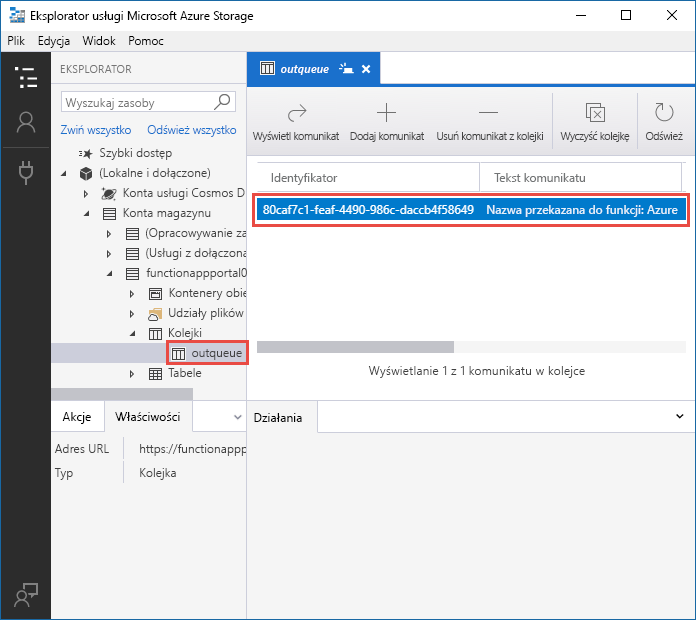
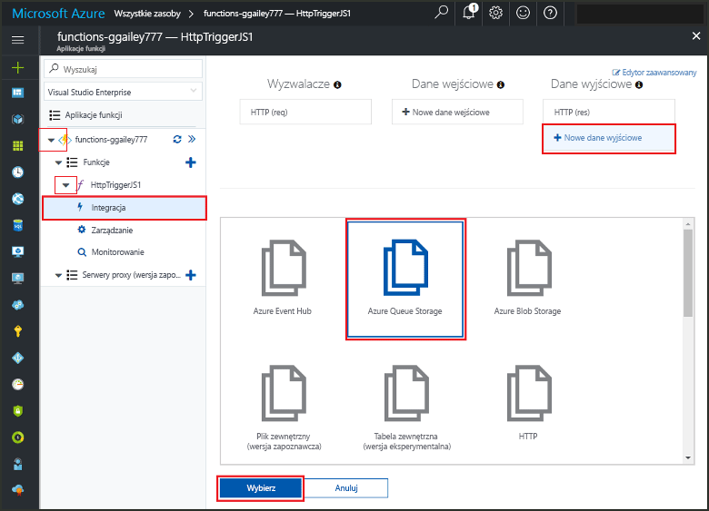
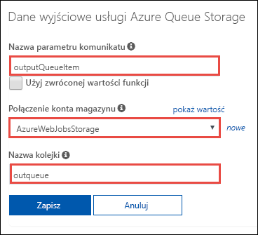
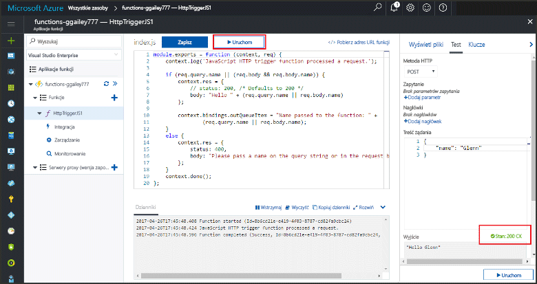
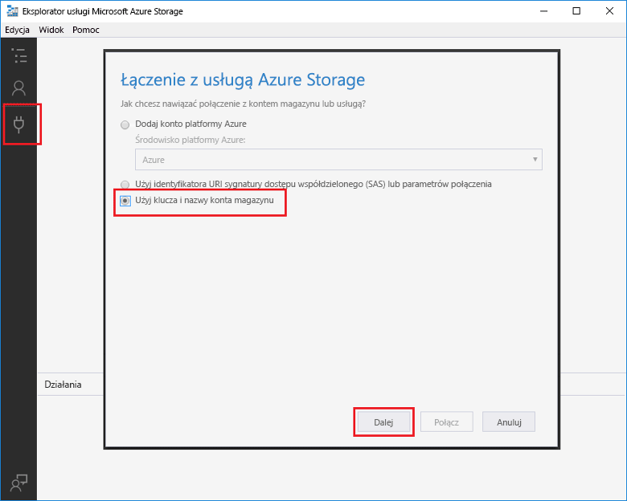
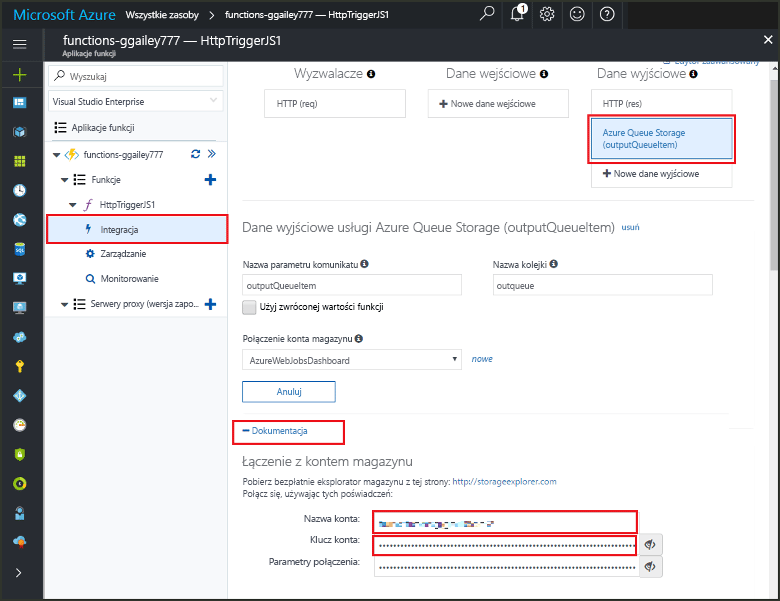
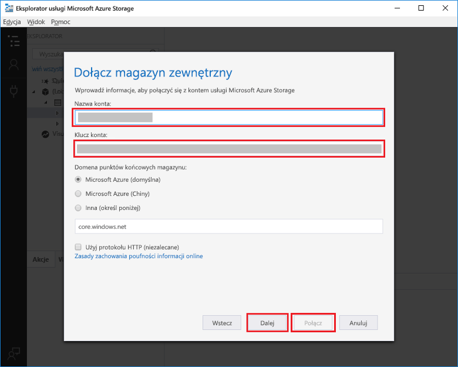

# <a name="add-messages-to-an-azure-storage-queue-using-functions"></a>Dodawanie komunikatów do kolejki usługi Azure Storage przy użyciu funkcji

W usłudze Azure Functions powiązania danych wejściowych i wyjściowych zapewniają deklaratywną metodę udostępniania danych z usług zewnętrznych na potrzeby kodu. W tym przewodniku Szybki start użyjesz powiązania danych wyjściowych do utworzenia komunikatów w kolejce w momencie wyzwolenia funkcji przez żądanie HTTP. Eksplorator usługi Azure Storage umożliwia przeglądanie komunikatów w kolejce tworzonych za pomocą funkcji:



## <a name="prerequisites"></a>Wymagania wstępne 

Aby ukończyć ten przewodnik Szybki start:

* Postępuj zgodnie z instrukcjami znajdującymi się w kroku [Tworzenie pierwszej funkcji w witrynie Azure Portal](functions-create-first-azure-function.md) i nie wykonuj kroku **Oczyszczanie zasobów**. W tym przewodniku Szybki start tworzona jest aplikacja funkcji i funkcja używana w tym miejscu.

* Zainstaluj [Eksplorator usługi Microsoft Azure Storage](http://storageexplorer.com/). To narzędzie będzie służyć do sprawdzania komunikatów w kolejce tworzonych za pomocą powiązania danych wyjściowych.

## <a name="add-binding"></a>Dodawanie powiązania danych wyjściowych

W tej sekcji użyjesz interfejsu użytkownika portalu w celu dodania powiązania danych wyjściowych usługi Queue Storage do wcześniej utworzonej funkcji. To powiązanie umożliwi utworzenie komunikatu w kolejce za pomocą minimalnej ilości kodu. Nie będzie konieczne pisanie kodu na potrzeby zadań, takich jak otwieranie połączenia z magazynem, tworzenie kolejki lub pobieranie odwołania do kolejki. Te zadania zostaną wykonane za pomocą środowiska uruchomieniowego usługi Azure Functions i powiązania danych wyjściowych kolejki.

1. W witrynie Azure Portal otwórz stronę aplikacji funkcji na potrzeby aplikacji funkcji utworzonej w kroku [Tworzenie pierwszej funkcji w witrynie Azure Portal](functions-create-first-azure-function.md). Aby to zrobić, wybierz pozycję **Więcej usług > Aplikacje funkcji**, a następnie wybierz aplikację funkcji.

2. Wybierz funkcję utworzoną we wcześniejszym przewodniku Szybki start.

1. Wybierz pozycję **Integracja > Nowe dane wyjściowe > Azure Queue Storage**.

1. Kliknij pozycję **Wybierz**.
    
    

3. W obszarze **Dane wyjściowe usługi Azure Queue Storage** użyj ustawień określonych w tabeli znajdującej się poniżej tego zrzutu ekranu: 

    

    | Ustawienie      |  Sugerowana wartość   | Opis                              |
    | ------------ |  ------- | -------------------------------------------------- |
    | **Nazwa parametru komunikatu** | outputQueueItem | Nazwa parametru powiązania danych wyjściowych. | 
    | **Połączenie konta magazynu** | AzureWebJobsStorage | Możesz skorzystać z połączenia konta magazynu już używanego przez aplikację funkcji lub utworzyć nowe.  |
    | **Nazwa kolejki**   | outqueue    | Nazwa kolejki, z którą zostanie nawiązane połączenie na koncie magazynu. |

4. Kliknij pozycję **Zapisz**, aby dodać powiązanie.
 
Po zdefiniowaniu powiązania danych wyjściowych musisz zaktualizować kod, tak aby stosować powiązanie do dodawania komunikatów do kolejki.  

## <a name="add-code-that-uses-the-output-binding"></a>Dodawanie kodu korzystającego z powiązania danych wyjściowych

W tej sekcji dodasz kod służący do zapisywania komunikatu do kolejki wyjściowej. Komunikat zawiera wartość przekazywaną do wyzwalacza HTTP w ciągu zapytania. Jeśli na przykład ciąg zapytania zawiera wartość `name=Azure`, komunikat w kolejce będzie następujący: *Nazwa przekazana do funkcji: Azure*.

1. Wybierz funkcję,której kod ma zostać wyświetlony w edytorze. 

2. Dla funkcji języka C# dodaj parametr metody na potrzeby powiązania, a następnie napisz kod w celu jego użycia:

   Dodaj parametr **outputQueueItem** do sygnatury metody, jak pokazano w poniższym przykładzie. Nazwa parametru jest taka sama, jak nazwa wprowadzona w polu **Nazwa parametru komunikatu** podczas tworzenia powiązania.

   ```cs   
   public static async Task<HttpResponseMessage> Run(HttpRequestMessage req, 
       ICollector<string> outputQueueItem, TraceWriter log)
   {
       ...
   }
   ```

   W treści funkcji języka C# tuż przed instrukcją `return` dodaj kod używający parametru w celu utworzenia komunikatu w kolejce.

   ```cs
   outputQueueItem.Add("Name passed to the function: " + name);     
   ```

3. Dla funkcji języka JavaScript dodaj kod używający powiązania danych wyjściowych w ramach obiektu `context.bindings` w celu utworzenia komunikatu w kolejce. Dodaj ten kod przed instrukcją `context.done`.

   ```javascript
   context.bindings.outputQueueItem = "Name passed to the function: " + 
               (req.query.name || req.body.name);
   ```

4. Wybierz przycisk **Zapisz**, aby zapisać zmiany.
 
## <a name="test-the-function"></a>Testowanie funkcji 

1. Po zapisaniu zmian w kodzie wybierz przycisk **Uruchom**. 

    

   Zwróć uwagę na to, że **treść żądania** zawiera `name` wartość *Azure*. Ta wartość jest wyświetlana w komunikacie w kolejce tworzonym po wywołaniu funkcji.

   Alternatywą do wyboru w tym miejscu polecenia **Uruchom** może być wywołanie funkcji, wprowadzając adres URL w przeglądarce i określając wartość `name` w ciągu zapytania. Metoda zakładająca użycie przeglądarki jest przedstawiona w [poprzednim przewodniku Szybkie start](functions-create-first-azure-function.md#test-the-function).

2. Sprawdź dzienniki, aby upewnić się, że funkcja zakończyła się pomyślnie. 

Środowisko uruchomieniowe funkcji utworzy nową kolejkę o nazwie **outqueue** w koncie magazynu przy pierwszym użyciu powiązania danych wyjściowych. Do sprawdzenia, czy kolejka i zawarty w niej komunikat został utworzony, zostanie użyty Eksplorator usługi Storage.

### <a name="connect-storage-explorer-to-your-account"></a>Łączenie Eksploratora usługi Storage z kontem

Pomiń tę sekcję, jeśli Eksplorator usługi Storage został już zainstalowany i połączony z kontem magazynu, które jest używane na potrzeby tego przewodnika Szybki start.

2. Uruchom narzędzie [Microsoft Azure Storage Explorer](http://storageexplorer.com/), wybierz ikonę połączenia po lewej stronie, wybierz pozycję **Użyj klucza i nazwy konta magazynu** i wybierz przycisk **Dalej**.

    

1. W witrynie Azure Portal na stronie funkcji aplikacji wybierz funkcję, a następnie wybierz pozycję **Integruj**.

1. Wybierz powiązanie danych wyjściowych usługi **Azure Queue Storage** dodane w poprzednim kroku.

1. Rozwiń sekcję **Dokumentacja** w dolnej części strony. 

   W portalu zostaną wyświetlone poświadczenia, których możesz użyć w Eksploratorze usługi Storage w celu nawiązania połączenia z kontem magazynu.

   

1. Skopiuj wartość **Nazwa konta** z portalu, a następnie wklej ją w polu **Nazwa konta** w Eksploratorze usługi Storage.
 
1. Kliknij ikonę Pokaż/Ukryj obok pola **Klucz konta**, aby wyświetlić wartość, a następnie skopiuj wartość **Klucz konta** i wklej ją w polu **Klucz konta** w Eksploratorze usługi Storage.
  
3. Wybierz pozycję **Dalej > Połącz**.

   

### <a name="examine-the-output-queue"></a>Sprawdzanie kolejki wyjściowej

4. W Eksploratorze usługi Storage wybierz konto magazynu używane na potrzeby tego przewodnika Szybki start.

1. Rozwiń węzeł **Kolejki**, a następnie wybierz kolejkę o nazwie **outqueue**. 

   Kolejka zawiera komunikat utworzony za pomocą powiązania danych wyjściowych kolejki po uruchomieniu funkcji wyzwalanej przez protokół HTTP. Jeśli funkcja została wywołana przy użyciu domyślnego elementu `name` o wartości *Azure*, komunikat w kolejce to *Nazwa przekazana do funkcji: Azure*.

    

2. Ponownie uruchom funkcję. W kolejce pojawi się nowy komunikat.  

## <a name="clean-up-resources"></a>Oczyszczanie zasobów

[!INCLUDE [Clean up resources](../../includes/functions-quickstart-cleanup.md)]

## <a name="next-steps"></a>Następne kroki

W tym przewodniku Szybki start dodano powiązanie danych wyjściowych do istniejącej funkcji. Aby uzyskać więcej informacji na temat tworzenia powiązań z kolejką magazynu, zobacz [Powiązania kolejki magazynu w usłudze Azure Functions](functions-bindings-storage-queue.md). 

[!INCLUDE [Next steps note](../../includes/functions-quickstart-next-steps.md)]
