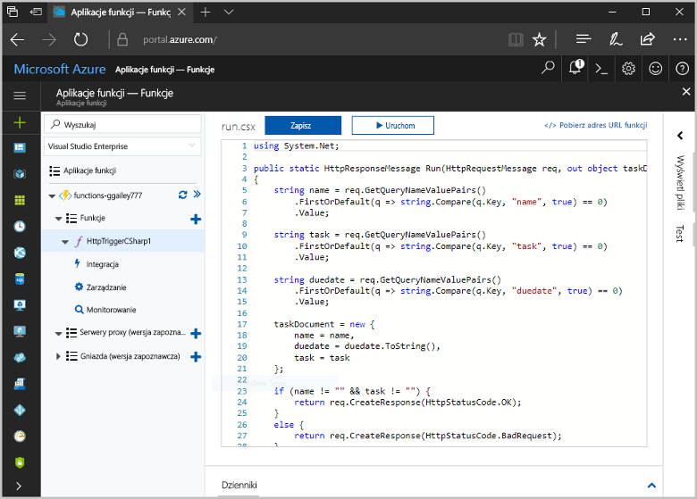
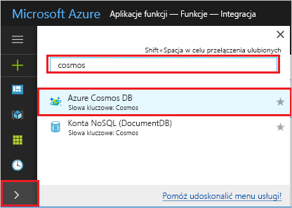

# <a name="store-unstructured-data-using-azure-functions-and-azure-cosmos-db"></a>Przechowywanie danych niestrukturalnych przy użyciu usług Azure Functions i Azure Cosmos DB

Usługa [Azure Cosmos DB](https://azure.microsoft.com/services/cosmos-db/) to doskonały sposób przechowywania danych bez struktury i danych JSON. Dzięki połączeniu usług Azure Functions i Cosmos DB przechowywanie danych staje się szybkie i proste oraz wymaga znacznie krótszego kodu niż w przypadku przechowywania danych w relacyjnej bazie danych.

> [!NOTE]
> W tej chwili wyzwalacz usługi Azure Cosmos DB, powiązania danych wejściowych i powiązania danych wyjściowych współpracują tylko z kontami interfejsu API SQL i interfejsu API programu Graph.

W usłudze Azure Functions powiązania danych wejściowych i wyjściowych zapewniają deklaratywną metodę łączenia z danymi usług zewnętrznych z funkcji. W tym temacie opisano, jak zaktualizować istniejącą funkcję C# w celu dodania powiązania danych wyjściowych, które zapisuje dane bez struktury w dokumencie usługi Cosmos DB. 



## <a name="prerequisites"></a>Wymagania wstępne

W celu ukończenia tego samouczka:

[!INCLUDE [Previous quickstart note](../../includes/functions-quickstart-previous-topics.md)]

## <a name="add-an-output-binding"></a>Dodawanie powiązania danych wyjściowych

1. Rozwiń aplikację funkcji i funkcję.

1. Wybierz pozycje **Integracja** i **+ Nowe dane wyjściowe** znajdujące się w prawej górnej części strony. Wybierz pozycję **Azure Cosmos DB** i kliknij przycisk **Wybierz**.

    

3. Użyj ustawień **Dane wyjściowe usługi Azure Cosmos DB** określonych w tabeli: 

    

    | Ustawienie      | Sugerowana wartość  | Opis                                |
    | ------------ | ---------------- | ------------------------------------------ |
    | **Nazwa parametru dokumentu** | taskDocument | Nazwa, która odwołuje się do obiektu Cosmos DB w kodzie. |
    | **Nazwa bazy danych** | taskDatabase | Nazwa bazy danych do zapisywania dokumentów. |
    | **Nazwa kolekcji** | TaskCollection | Nazwa bazy kolekcji bazy danych. |
    | **W przypadku wartości true tworzy bazę danych i kolekcję usługi Cosmos DB** | Zaznaczone | Kolekcja jeszcze nie istnieje, więc należy ją utworzyć. |

4. Wybierz pozycję **Nowe** obok etykiety **Połączenie dokumentu usługi Azure Cosmos DB** i wybierz pozycję **+ Utwórz nowe**. 

5. Użyj ustawień **Nowe konto** określonych w tabeli: 

    

    | Ustawienie      | Sugerowana wartość  | Opis                                |
    | ------------ | ---------------- | ------------------------------------------ |
    | **Identyfikator** | Nazwa bazy danych | Unikatowy identyfikator bazy danych usługi Azure Cosmos DB  |
    | **Interfejs API** | SQL | Wybierz interfejs API SQL. W tej chwili wyzwalacz usługi Azure Cosmos DB, powiązania danych wejściowych i powiązania danych wyjściowych współpracują tylko z kontami interfejsu API SQL i interfejsu API programu Graph. |
    | **Subskrypcja** | Subskrypcja platformy Azure | Subskrypcja platformy Azure  |
    | **Grupa zasobów** | myResourceGroup |  Użyj istniejącej grupy zasobów zawierającej aplikację funkcji. |
    | **Lokalizacja**  | WestEurope | Wybierz lokalizację znajdującą się w pobliżu aplikacji funkcji lub innych aplikacji, które korzystają z przechowywanych dokumentów.  |

6. Kliknij przycisk **OK**, aby utworzyć bazę danych. Tworzenie bazy danych może potrwać kilka minut. Po utworzeniu bazy danych parametry połączenia bazy danych są przechowywane jako ustawienie aplikacji funkcji. Nazwa tego ustawienia aplikacji jest wstawiana w sekcji **Połączenie konta usługi Azure Cosmos DB**. 
 
8. Po ustawieniu parametrów połączenia wybierz pozycję **Zapisz**, aby utworzyć powiązanie.

## <a name="update-the-function-code"></a>Aktualizacja kodu funkcji

Zastąp istniejący kod funkcji w języku C# następującym kodem:

```csharp
using System.Net;

public static HttpResponseMessage Run(HttpRequestMessage req, out object taskDocument, TraceWriter log)
{
    string name = req.GetQueryNameValuePairs()
        .FirstOrDefault(q => string.Compare(q.Key, "name", true) == 0)
        .Value;

    string task = req.GetQueryNameValuePairs()
        .FirstOrDefault(q => string.Compare(q.Key, "task", true) == 0)
        .Value;

    string duedate = req.GetQueryNameValuePairs()
        .FirstOrDefault(q => string.Compare(q.Key, "duedate", true) == 0)
        .Value;

    taskDocument = new {
        name = name,
        duedate = duedate.ToString(),
        task = task
    };

    if (name != "" && task != "") {
        return req.CreateResponse(HttpStatusCode.OK);
    }
    else {
        return req.CreateResponse(HttpStatusCode.BadRequest);
    }
}

```
Ten przykładowy kod odczytuje ciągi zapytań żądania HTTP i przypisuje je do pól w obiekcie `taskDocument`. Powiązanie `taskDocument` wysyła dane obiektu z tego parametru powiązania do przechowywania w powiązanej bazie danych dokumentów. Baza danych zostanie utworzona przy pierwszym uruchomieniu funkcji.

## <a name="test-the-function-and-database"></a>Testowanie funkcji i bazy danych

1. Rozwiń okno po prawej stronie i wybierz pozycję **Testuj**. W obszarze **Zapytanie** kliknij pozycję **+ Dodaj parametr** i dodaj następujące parametry do ciągu zapytania:

    + `name`
    + `task`
    + `duedate`

2. Kliknij pozycję **Uruchom** i sprawdź, czy zwracany jest stan 200.

    

1. W witrynie Azure Portal rozwiń pasek ikon po lewej stronie, wpisz ciąg `cosmos` w polu wyszukiwania, a następnie wybierz pozycję **Azure Cosmos DB**.

    

2. Wybierz konto usługi Azure Cosmos DB, a następnie wybierz pozycję **Eksplorator danych**. 

3. Rozwiń węzły **Kolekcje**, wybierz nowy dokument i upewnij się, że zawiera on wartości ciągu zapytania wraz z pewnymi dodatkowymi metadanymi. 

    

Powiązanie zostało pomyślnie dodane do wyzwalacza HTTP, który zapisuje dane niestrukturalne w bazie danych Azure Cosmos DB.

[!INCLUDE [Clean-up section](../../includes/clean-up-section-portal.md)]

## <a name="next-steps"></a>Następne kroki

[!INCLUDE [functions-quickstart-next-steps](../../includes/functions-quickstart-next-steps.md)]

Aby uzyskać więcej informacji na temat tworzenia powiązań z bazą danych usługi Cosmos DB, zobacz temat [Powiązania bazy danych usługi Cosmos DB w usłudze Azure Functions](functions-bindings-cosmosdb.md).
