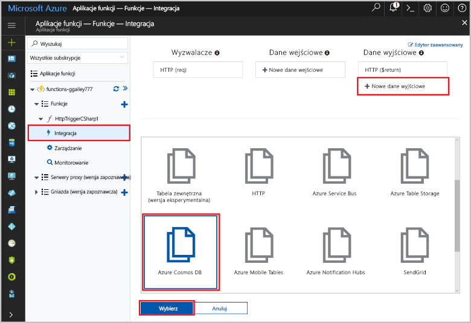
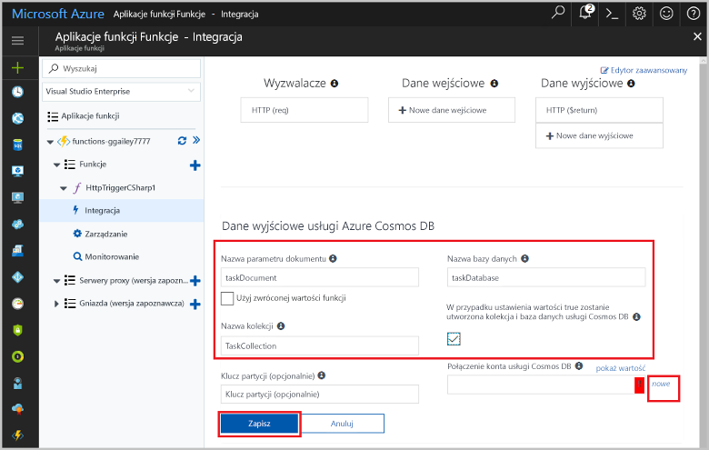
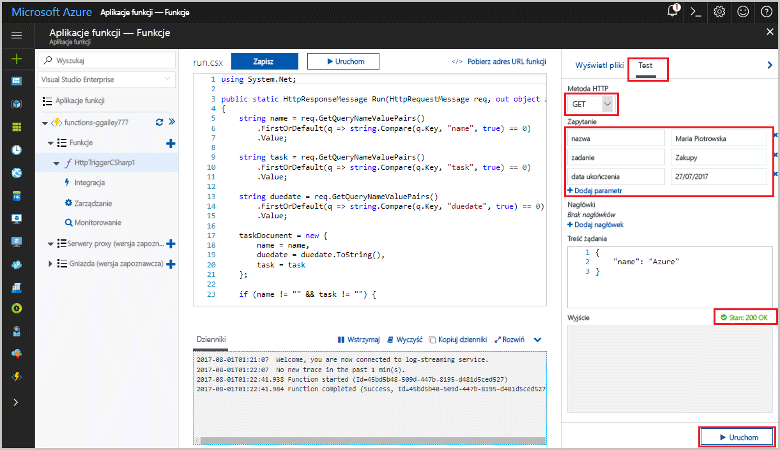
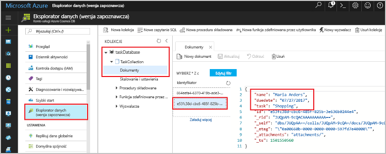

# <a name="store-unstructured-data-using-azure-functions-and-cosmos-db"></a>Przechowywanie danych niestrukturalnych przy użyciu usług Azure Functions i Cosmos DB

Azure Cosmos DB to doskonały sposób przechowywania danych niestrukturalnych i JSON. Dzięki połączeniu usług Azure Functions i Cosmos DB przechowywanie danych staje się szybkie i proste oraz wymaga znacznie krótszego kodu niż w przypadku przechowywania danych w relacyjnej bazie danych.

W tym samouczku przedstawiono sposób tworzenia w witrynie Azure Portal funkcji platformy Azure, która będzie przechowywać dane niestrukturalne w dokumencie Cosmos DB. 

## <a name="prerequisites"></a>Wymagania wstępne

[!INCLUDE [Previous quickstart note](../../includes/functions-quickstart-previous-topics.md)]

[!INCLUDE [functions-portal-favorite-function-apps](../../includes/functions-portal-favorite-function-apps.md)]

## <a name="create-a-function"></a>Tworzenie funkcji

Utwórz nowy ogólny element webhook w języku C# o nazwie `MyTaskList`.

1. Rozwiń istniejącą listę funkcji i kliknij znak +, aby utworzyć nową funkcję.
1. Wybierz pozycję GenericWebHook-CSharp i nadaj jej nazwę `MyTaskList`.


## <a name="add-an-output-binding"></a>Dodawanie powiązania danych wyjściowych

Funkcja Azure może zawierać jeden wyzwalacz i dowolną liczbę powiązań danych wejściowych i wyjściowych. W tym przykładzie użyjemy wyzwalacza żądania HTTP oraz dokumentu Cosmos DB jako powiązania danych wyjściowych.

1. Kliknij kartę funkcji *Integracja*, aby wyświetlić lub zmodyfikować wyzwalacz i powiązania funkcji.
1. Wybierz link *Nowe dane wyjściowe* znajdujący się w prawym górnym rogu strony.

Uwaga: wyzwalacz żądania HTTP został już skonfigurowany, należy jednak dodać powiązanie dokumentu Cosmos DB.



1. Wprowadź wymagane informacje, aby utworzyć powiązanie. Użyj poniższej tabeli, aby określić wartości.



|  Pole | Wartość  |
|---|---|
| Nazwa parametru dokumentu | Nazwa, która odwołuje się do obiektu Cosmos DB w kodzie |
| Nazwa bazy danych | Nazwa bazy danych do zapisywania dokumentów |
| Nazwa kolekcji | Nazwa grupowania baz danych Cosmos DB |
| Czy chcesz, aby baza danych i kolekcja Cosmos DB zostały utworzone dla Ciebie | Tak lub Nie |
| Połączenie konta usługi Cosmos DB | Ciąg połączenia wskazujący bazę danych Cosmos DB |

Należy również skonfigurować połączenie z bazą danych Cosmos DB.

1. Kliknij link „Nowe” obok etykiety *Połączenie dokumentu Cosmos DB”.
1. Wypełnij pola i wybierz odpowiednie opcje potrzebne do utworzenia dokumentu Cosmos DB.


|  Pole | Wartość  |
|---|---|
| Identyfikator | Unikatowy identyfikator bazy danych Cosmos DB  |
| Interfejs API NoSQL | Cosmos DB lub MongoDB  |
| Subskrypcja | Subskrypcja MSDN  |
| Grupa zasobów  | Utwórz nową grupę lub wybierz istniejącą.  |
| Lokalizacja  | WestEurope  |

1. Kliknij przycisk *OK*. Być może trzeba będzie zaczekać kilka minut, aż platforma Azure utworzy zasoby.
1. Kliknij przycisk *Zapisz*.

## <a name="update-the-function-code"></a>Aktualizacja kodu funkcji

Zastąp kod szablonu funkcji następującym:

Należy pamiętać, że kod w tym przykładzie jest tylko w języku C#.

```csharp
using System.Net;

public static HttpResponseMessage Run(HttpRequestMessage req, out object taskDocument, TraceWriter log)
{
    string name = req.GetQueryNameValuePairs()
        .FirstOrDefault(q => string.Compare(q.Key, "name", true) == 0)
        .Value;

    string task = req.GetQueryNameValuePairs()
        .FirstOrDefault(q => string.Compare(q.Key, "task", true) == 0)
        .Value;

    string duedate = req.GetQueryNameValuePairs()
        .FirstOrDefault(q => string.Compare(q.Key, "duedate", true) == 0)
        .Value;

    taskDocument = new {
        name = name,
        duedate = duedate.ToString(),
        task = task
    };

    if (name != "" && task != "") {
        return req.CreateResponse(HttpStatusCode.OK);
    }
    else {
        return req.CreateResponse(HttpStatusCode.BadRequest);
    }
}

```

Ten przykładowy kod odczytuje ciągi kwerendy żądania HTTP i przypisuje je jako elementy członkowskie obiektu `taskDocument`. Obiekt `taskDocument` automatycznie zapisuje dane w bazie danych Cosmos DB, a nawet tworzy bazę danych przy pierwszym użyciu.

## <a name="test-the-function-and-database"></a>Testowanie funkcji i bazy danych

1. Na karcie funkcji kliknij link *Testuj* po prawej stronie portalu, a następnie wprowadź następujące ciągi kwerendy HTTP:

| Ciąg kwerendy | Wartość |
|---|---|
| name | Chris P. Bacon |
| task | Make a BLT sandwich |
| duedate | 05/12/2017 |

1. Kliknij link *Uruchom*.
1. Sprawdź, czy funkcja zwróciła kod odpowiedzi *HTTP 200 OK*.



Upewnij się, że wpis został wprowadzony w bazie danych Cosmos DB.

1. Znajdź bazę danych w witrynie Azure Portal i wybierz ją.
1. Wybierz opcję *Eksplorator danych*.
1. Rozwijaj węzły, aż dojdziesz do wpisów dokumentu.
1. Potwierdź wpis w bazie danych. Oprócz danych użytkownika w bazie danych będą znajdować się dodatkowe metadane.



Jeśli dane znajdują się w dokumencie, pomyślnie utworzono funkcję platformy Azure, która przechowuje dane niestrukturalne w bazie danych Cosmos DB.

## <a name="clean-up-resources"></a>Oczyszczanie zasobów

[!INCLUDE [Next steps note](../../includes/functions-quickstart-cleanup.md)]

## <a name="next-steps"></a>Następne kroki

[!INCLUDE [functions-quickstart-next-steps](../../includes/functions-quickstart-next-steps.md)]

Aby uzyskać więcej informacji na temat tworzenia powiązań z bazą danych usługi Cosmos DB, zobacz temat [Powiązania bazy danych usługi Cosmos DB w usłudze Azure Functions](functions-bindings-documentdb.md).

