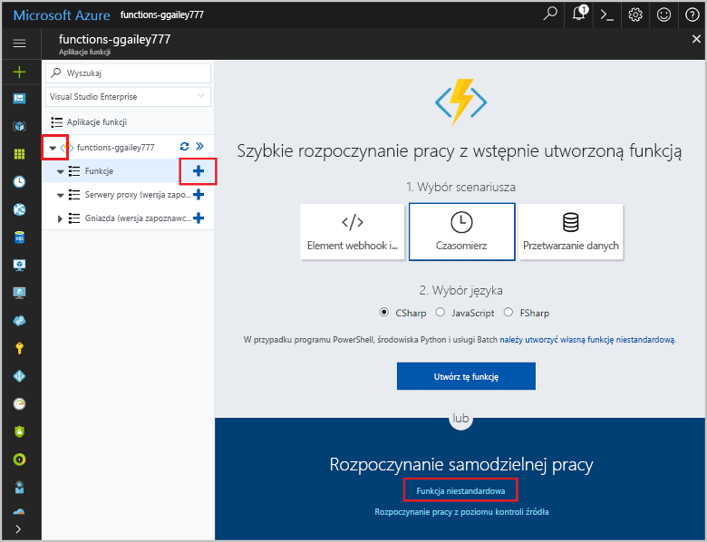

# <a name="create-an-openapi-definition-for-a-function"></a>Tworzenie definicji interfejsu OpenAPI dla funkcji
Interfejsy API REST są często opisywane przy użyciu definicji OpenAPI (wcześniej znanej jako plik struktury [Swagger](http://swagger.io/)). Ta definicja zawiera informacje o operacjach dostępnych w interfejsie API i wymaganej strukturze danych żądań i odpowiedzi dla interfejsu API.

W ramach tego samouczka utworzysz funkcję, która pozwoli określić, czy awaryjna naprawa turbiny wiatrowej jest opłacalna. Następnie utworzysz definicję interfejsu OpenAPI dla aplikacji funkcji, aby funkcja mogła zostać wywołana z poziomu innych aplikacji i usług.

Ten samouczek zawiera informacje na temat wykonywania następujących czynności:

> [!div class="checklist"]
> * Tworzenie funkcji na platformie Azure
> * Tworzenie definicji interfejsu OpenAPI za pomocą narzędzi interfejsu OpenAPI
> * Modyfikowanie definicji w celu udostępnienia dodatkowych metadanych
> * Testowanie definicji przez wywołanie funkcji

## <a name="create-a-function-app"></a>Tworzenie aplikacji funkcji

Do obsługi wykonywania funkcji potrzebna jest aplikacja funkcji. Aplikacja funkcji umożliwia grupowanie funkcji jako jednostki logicznej, co ułatwia wdrażanie, skalowanie i udostępnianie zasobów oraz zarządzanie nimi. 

[!INCLUDE [Create function app Azure portal](../../includes/functions-create-function-app-portal.md)]

[!INCLUDE [functions-portal-favorite-function-apps](../../includes/functions-portal-favorite-function-apps.md)]


## <a name="create-the-function"></a>Tworzenie funkcji

W tym samouczku wykorzystano funkcję wyzwalaną przez protokół HTTP, która uwzględnia dwa parametry: szacowany czas naprawy turbiny (w godzinach) i moc turbiny (w kilowatach). Następnie funkcja oblicza koszt naprawy oraz przychody, które mogą zostać uzyskane dzięki turbinie w ciągu 24 godzin.

1. Rozwiń aplikację funkcji i wybierz przycisk **+** obok pozycji **Funkcje**. Jeśli jest to pierwsza funkcja w aplikacji funkcji, wybierz pozycję **Funkcja niestandardowa**. Spowoduje to wyświetlenie pełnego zestawu szablonów funkcji. 

    

2. W polu wyszukiwania wpisz `http`, a następnie wybierz język **C#** dla szablonu wyzwalacza HTTP. 
 
    

3. Wpisz ciąg `TurbineRepair` w polu **Nazwa** funkcji, wybierz pozycję `Function` na liście **[Poziom uwierzytelniania](functions-bindings-http-webhook.md#http-auth)**, a następnie wybierz przycisk **Utwórz**.  

    

1. Zastąp zawartość pliku run.csx poniższym kodem, a następnie kliknij przycisk **Zapisz**:

    ```csharp
    using System.Net;

    const double revenuePerkW = 0.12; 
    const double technicianCost = 250; 
    const double turbineCost = 100;

    public static async Task<HttpResponseMessage> Run(HttpRequestMessage req, TraceWriter log)
    {   

        //Get request body
        dynamic data = await req.Content.ReadAsAsync<object>();
        int hours = data.hours;
        int capacity = data.capacity;

        //Formulas to calculate revenue and cost
        double revenueOpportunity = capacity * revenuePerkW * 24;  
        double costToFix = (hours * technicianCost) +  turbineCost;
        string repairTurbine;

        if (revenueOpportunity > costToFix){
            repairTurbine = "Yes";
        }
        else {
            repairTurbine = "No";
        }

        return req.CreateResponse(HttpStatusCode.OK, new{
            message = repairTurbine,
            revenueOpportunity = "$"+ revenueOpportunity,
            costToFix = "$"+ costToFix         
        }); 
    }
    ```
    Ten kod funkcji zwraca komunikat `Yes` lub `No` wskazujący, czy awaryjna naprawa turbiny jest opłacalna, a także wartość ewentualnego przychodu, który można uzyskać dzięki turbinie, oraz koszt naprawy turbiny. 

1. Aby przetestować tę funkcję, kliknij przycisk **Testuj** przy prawej krawędzi, co spowoduje rozwinięcie karty testu. Wprowadź poniższą wartość w polu **Treść żądania**, a następnie kliknij przycisk **Uruchom**.

    ```json
    {
    "hours": "6",
    "capacity": "2500"
    }
    ```

    

    W treści odpowiedzi jest zwracana poniższa wartość.

    ```json
    {"message":"Yes","revenueOpportunity":"$7200","costToFix":"$1600"}
    ```

Funkcja określająca opłacalność naprawy awaryjnej jest już gotowa. Następnym krokiem jest wygenerowanie i zmodyfikowanie definicji interfejsu OpenAPI dla aplikacji funkcji.

## <a name="generate-the-openapi-definition"></a>Generowanie definicji interfejsu OpenAPI

Teraz możesz przystąpić do generowania definicji interfejsu OpenAPI. Ta definicja może być używana przez inne technologie firmy Microsoft, takie jak API Apps, [PowerApps](functions-powerapps-scenario.md) i [Microsoft Flow](../azure-functions/app-service-export-api-to-powerapps-and-flow.md), a także przez narzędzia deweloperskie innych firm, takie jak [Postman](https://www.getpostman.com/docs/importing_swagger) i [wiele innych pakietów](http://swagger.io/tools/).

1. Wybierz tylko *zlecenia* obsługiwane przez Twój interfejs API (w tym przypadku POST). Dzięki temu wygenerowana definicja interfejsu API będzie bardziej czytelna.

    1. Na karcie **Integracja** nowej funkcji wyzwalacza HTTP zmień pozycję **Dozwolone metody HTTP** na pozycję **Wybrane metody**

    1. W obszarze **Wybrane metody HTTP** wyczyść zaznaczenie wszystkich pozycji oprócz **POST**, a następnie kliknij przycisk **Zapisz**.

        
        
1. Kliknij nazwę swojej aplikacji funkcji (np. **function-demo-energy**) > **Funkcje platformy** > **Definicja interfejsu API**.

    

1. Na karcie **Definicja interfejsu API** kliknij pozycję **Funkcja**.

    

    Ten krok udostępnia szereg opcji interfejsu OpenAPI dla Twojej aplikacji funkcji, takich jak punkt końcowy hostujący plik interfejsu OpenAPI z domeny Twojej aplikacji funkcji, wbudowana kopia [edytora interfejsu OpenAPI Editor](http://editor.swagger.io) i generator szablonów definicji interfejsu API.

1. Kliknij pozycję **Generuj szablon definicji interfejsu API** > **Zapisz**.

    

    Platforma Azure skanuje aplikację funkcji pod kątem funkcji wyzwalacza HTTP i generuje definicję interfejsu OpenAPI za pomocą informacji w pliku functions.json. Oto wygenerowana definicja:

    ```yaml
    swagger: '2.0'
    info:
    title: function-demo-energy.azurewebsites.net
    version: 1.0.0
    host: function-demo-energy.azurewebsites.net
    basePath: /
    schemes:
    - https
    - http
    paths:
    /api/TurbineRepair:
        post:
        operationId: /api/TurbineRepair/post
        produces: []
        consumes: []
        parameters: []
        description: >-
            Replace with Operation Object
            #http://swagger.io/specification/#operationObject
        responses:
            '200':
            description: Success operation
        security:
            - apikeyQuery: []
    definitions: {}
    securityDefinitions:
    apikeyQuery:
        type: apiKey
        name: code
        in: query
    ```

    Ta definicja jest określana jako _szablon_. Pełna definicja interfejsu OpenAPI wymaga większej ilości metadanych. Definicja zostanie zmodyfikowana w następnym kroku.

## <a name="modify-the-openapi-definition"></a>Modyfikowanie definicji interfejsu OpenAPI
Gotowa definicja szablonu zostanie teraz zmodyfikowana, aby zapewnić dodatkowe metadane na temat operacji interfejsu API i struktur danych. W obszarze **Definicja interfejsu API** usuń wygenerowaną definicję od elementu `post` do końca definicji, wklej poniższą zawartość, a następnie kliknij przycisk **Zapisz**.

```yaml
    post:
      operationId: CalculateCosts
      description: Determines if a technician should be sent for repair
      summary: Calculates costs
      x-ms-summary: Calculates costs
      x-ms-visibility: important
      produces:
        - application/json
      consumes:
        - application/json
      parameters:
        - name: body
          in: body
          description: Hours and capacity used to calculate costs
          x-ms-summary: Hours and capacity
          x-ms-visibility: important
          required: true
          schema:
            type: object
            properties:
              hours:
                description: The amount of effort in hours required to conduct repair
                type: number
                x-ms-summary: Hours
                x-ms-visibility: important
              capacity:
                description: The max output of a turbine in kilowatts
                type: number
                x-ms-summary: Capacity
                x-ms-visibility: important
      responses:
        200:
          description: Message with cost and revenue numbers
          x-ms-summary: Message
          schema:
           type: object
           properties:
            message:
              type: string
              description: Returns Yes or No depending on calculations
              x-ms-summary: Message 
            revenueOpportunity:
              type: string
              description: The revenue opportunity cost
              x-ms-summary: RevenueOpportunity 
            costToFix:
              type: string
              description: The cost in $ to fix the turbine
              x-ms-summary: CostToFix
      security:
        - apikeyQuery: []
definitions: {}
securityDefinitions:
  apikeyQuery:
    type: apiKey
    name: code
    in: query
```

W tym przypadku wystarczyłoby tylko wklejenie zaktualizowanych metadanych, ale warto zrozumieć typy modyfikacji wprowadzonych w szablonie domyślnym:

+ Określenie, że interfejs API tworzy i wykorzystuje dane w formacie JSON.

+ Określenie wymaganych parametrów (nazw i typów danych).

+ Określenie zwracanych wartości w przypadku pomyślnej odpowiedzi (nazw i typów danych).

+ Podanie przyjaznych podsumowań i opisów interfejsów API oraz ich operacji i parametrów. Informacje te będą potrzebne osobom korzystającym z tej funkcji.

+ Dodanie elementów x-ms-summary i x-ms-visibility, które są używane w interfejsie użytkownika usług Microsoft Flow i Logic Apps. Aby uzyskać więcej informacji, zobacz [Rozszerzenia interfejsu OpenAPI dla niestandardowych interfejsów API w usłudze Microsoft Flow](https://preview.flow.microsoft.com/documentation/customapi-how-to-swagger/).

> [!NOTE]
> W definicji zabezpieczeń pozostawiliśmy domyślną metodę uwierzytelniania klucza interfejsu API. Tę sekcję definicji należy zmienić w przypadku używania uwierzytelniania innego typu.

Aby uzyskać więcej informacji na temat definiowania operacji interfejsu API, zobacz [Specyfikacja interfejsu Open API](https://swagger.io/specification/#operationObject).

## <a name="test-the-openapi-definition"></a>Testowanie definicji interfejsu OpenAPI
Zanim użyjesz definicji interfejsu API, warto przetestować ją w interfejsie użytkownika usługi Azure Functions.

1. Na karcie **Zarządzanie** swojej funkcji w obszarze **Klucze hosta** skopiuj klucz **domyślny**.

    

    > [!NOTE]
    >Ten klucz służy do testowania. Można go także użyć podczas wywołania interfejsu API z poziomu aplikacji lub usługi.

1. Wróć do definicji interfejsu API: **function-demo-energy** > **Funkcje platformy** > **Definicja interfejsu API**.

1. W okienku po prawej stronie kliknij pozycję **Uwierzytelnij**, wprowadź skopiowany klucz interfejsu API i kliknij pozycję **Uwierzytelnij**.

    

1. Przewiń w dół i kliknij pozycję **Wypróbuj tę operację**.

    

1. Wprowadź wartości w polach **godziny** i **pojemność**.

    

    Zwróć uwagę na sposób wykorzystania opisów z definicji interfejsu API przez interfejs użytkownika.

1. Kliknij pozycję **Wyślij żądanie**, a następnie kliknij kartę **Sformatowane**, aby wyświetlić dane wyjściowe.

    

## <a name="next-steps"></a>Następne kroki

W niniejszym samouczku zawarto informacje na temat wykonywania następujących czynności:

> [!div class="checklist"]
> * Tworzenie funkcji na platformie Azure
> * Tworzenie definicji interfejsu OpenAPI za pomocą narzędzi interfejsu OpenAPI
> * Modyfikowanie definicji w celu udostępnienia dodatkowych metadanych
> * Testowanie definicji przez wywołanie funkcji

Przejdź do następnego tematu, aby dowiedzieć się, jak utworzyć aplikację PowerApps, która korzysta z utworzonej przez Ciebie definicji interfejsu OpenAPI.
> [!div class="nextstepaction"]
> [Wywoływanie funkcji z usługi PowerApps](functions-powerapps-scenario.md)
