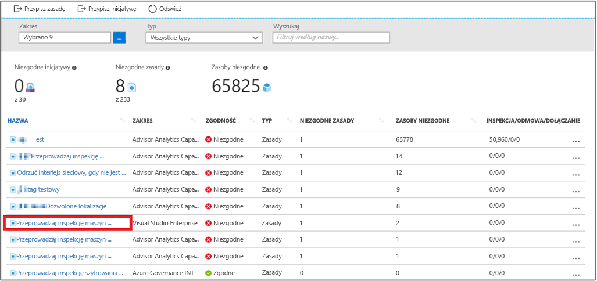

# <a name="create-a-policy-assignment-to-identify-non-compliant-resources-in-your-azure-environment-with-the-azure-cli"></a>Tworzenie przypisania zasad w celu zidentyfikowania niezgodnych zasobów w środowisku Azure za pomocą interfejsu wiersza polecenia platformy Azure

Pierwszym krokiem do zrozumienia pojęcia zgodności na platformie Azure jest określenie obecnej sytuacji dotyczącej Twoich zasobów. Ten przewodnik Szybki start przeprowadzi Cię przez proces tworzenia przypisania zasad w celu zidentyfikowania maszyn wirtualnych, które nie korzystają z dysków zarządzanych.

Po zakończeniu tego procesu pomyślnie zidentyfikujesz maszyny wirtualne, które nie korzystają z dysków zarządzanych. Są one *niezgodne* z przypisaniem zasad.

Jeśli nie masz subskrypcji platformy Azure, przed rozpoczęciem utwórz [bezpłatne](https://azure.microsoft.com/free/) konto.

[!INCLUDE [cloud-shell-try-it.md](../../includes/cloud-shell-try-it.md)]

Jeśli chcesz zainstalować interfejs wiersza polecenia i korzystać z niego lokalnie, ten przewodnik Szybki start będzie wymagał interfejsu wiersza polecenia platformy Azure w wersji 2.0.4 lub nowszej. Uruchom polecenie `az --version`, aby dowiedzieć się, jaka wersja jest używana. Jeśli konieczna będzie instalacja lub uaktualnienie, zobacz [Instalowanie interfejsu wiersza polecenia platformy Azure 2.0]( /cli/azure/install-azure-cli).

## <a name="create-a-policy-assignment"></a>Tworzenie przypisania zasad

W tym przewodniku Szybki start utworzymy przypisanie zasad i przypiszemy definicję Audit Virtual Machines without Managed Disks (Przeprowadź inspekcję maszyn wirtualnych bez dysków zarządzanych). Ta definicja zasad identyfikuje zasoby, które nie spełniają warunków określonych w definicji zasad.

Wykonaj poniższe kroki, aby utworzyć nowe przypisanie zasad:

1. Aby się upewnić, że Twoja subskrypcja współpracuje z dostawcą zasobów, zarejestruj dostawcę zasobów szczegółowych informacji o zasadach. Aby zarejestrować dostawcę zasobów, musisz mieć uprawnienia do wykonywania operacji rejestrowania dostawcy zasobów. Ta operacja jest uwzględniona w rolach Współautor i Właściciel.

    Zarejestruj dostawcę zasobów, uruchamiając następujące polecenie:

    ```azurecli
    az provider register --namespace Microsoft.PolicyInsights
    ```

    To polecenie zwróci komunikat z informacją, że rejestracja jest w toku.

    Nie można wyrejestrować dostawcy zasobów, jeśli w ramach swojej subskrypcji masz typy zasobów pochodzące od dostawcy zasobów. Aby uzyskać więcej informacji na temat rejestrowania i przeglądania dostawców zasobów, zobacz [Dostawcy zasobów i ich typy](../azure-resource-manager/resource-manager-supported-services.md).

2. Wyświetl wszystkie definicje zasad i znajdź definicję *Audit Virtual Machines without Managed Disks* (Przeprowadź inspekcję maszyn wirtualnych bez dysków zarządzanych):

    ```azurecli
az policy definition list
```

    Usługa Azure Policy zawiera już wbudowane definicje zasad, których możesz używać. Widoczne są m.in. wbudowane definicje zasad:

    - Enforce tag and its value (Wymuś tag i jego wartość)
    - Apply tag and its value (Zastosuj tag i jego wartość)
    - Require SQL Server Version 12.0 (Wymagaj programu SQL Server w wersji 12.0)

3. Następnie podaj następujące informacje i uruchom następujące polecenie, aby przypisać definicję zasad:

    - **Nazwa** wyświetlana przypisania zasad. W tym przypadku użyjmy nazwy *Audit Virtual Machines without Managed Disks* (Przeprowadź inspekcję maszyn wirtualnych bez dysków zarządzanych).
    - **Zasady** — jest to definicja zasad, na podstawie której tworzysz przypisanie. W tym przypadku jest to definicja zasad *Audit Virtual Machines without Managed Disks* (Przeprowadź inspekcję maszyn wirtualnych bez dysków zarządzanych)
    - **Zakres** — zakres określa, jakie zasoby lub grupy zasobów są wymuszane w ramach przypisania zasad. Może obejmować zarówno subskrypcje, jak i grupy zasobów.

    Użyj wcześniej zarejestrowanej subskrypcji (lub grupy zasobów). W tym przykładzie używamy identyfikatora subskrypcji **bc75htn-a0fhsi-349b-56gh-4fghti-f84852** i nazwy grupy zasobów **FabrikamOMS**. Pamiętaj, aby zamienić te dane na identyfikator subskrypcji i nazwę grupy zasobów, z którymi pracujesz.

    Polecenie powinno być podobne do następującego:

    ```azurecli
az policy assignment create --name Audit Virtual Machines without Managed Disks Assignment --policy Audit Virtual Machines without Managed Disks --scope /subscriptions/
bc75htn-a0fhsi-349b-56gh-4fghti-f84852/resourceGroups/FabrikamOMS
```

Przypisanie zasad to zasady, które zostały przypisane do określonego zakresu. Zakresem tym również może być zarówno grupa zarządzania, jak i grupa zasobów.

## <a name="identify-non-compliant-resources"></a>Identyfikowanie niezgodnych zasobów

Aby wyświetlić zasoby, które są niezgodne w tym nowym przypisaniu:

1. Przejdź z powrotem do strony usługi Azure Policy.
2. Wybierz pozycję **Zgodność** w okienku po lewej stronie i wyszukaj utworzone **przypisanie zasad**.

   

   Wszelkie zasoby niezgodne z nowym przypisaniem są wyświetlane na karcie **Niezgodne zasoby**. Na powyższej ilustracji pokazano przykłady niezgodnych zasobów.

## <a name="clean-up-resources"></a>Oczyszczanie zasobów

Inne przewodniki w tej kolekcji bazują na tym przewodniku Szybki start. Jeśli planujesz kontynuować pracę z kolejnymi samouczkami, nie usuwaj zasobów utworzonych w tym przewodniku Szybki start. Jeśli nie zamierzasz kontynuować, usuń utworzone przypisanie, uruchamiając to polecenie:

```azurecli
az policy assignment delete –name  Assignment --scope /subscriptions/ bc75htn-a0fhsi-349b-56gh-4fghti-f84852 resourceGroups/ FabrikamOMS
```

## <a name="next-steps"></a>Następne kroki

W tym przewodniku Szybki start została przypisana definicja zasad mających na celu zidentyfikowanie niezgodnych zasobów w środowisku platformy Azure.

Aby dowiedzieć się więcej na temat przypisywania zasad w celu zapewnienia zgodności zasobów tworzonych w **przyszłości**, przejdź do samouczka:

> [!div class="nextstepaction"]
> [Tworzenie zasad i zarządzanie nimi](./create-manage-policy.md)
