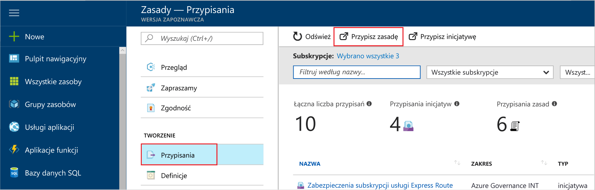
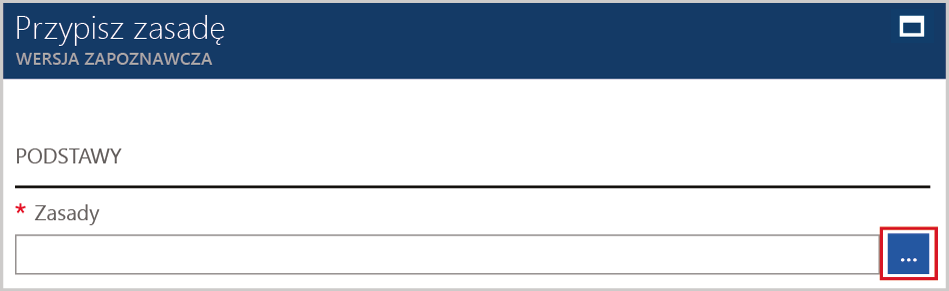
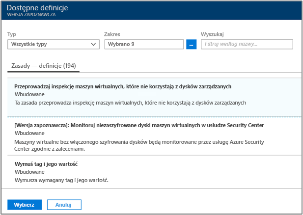
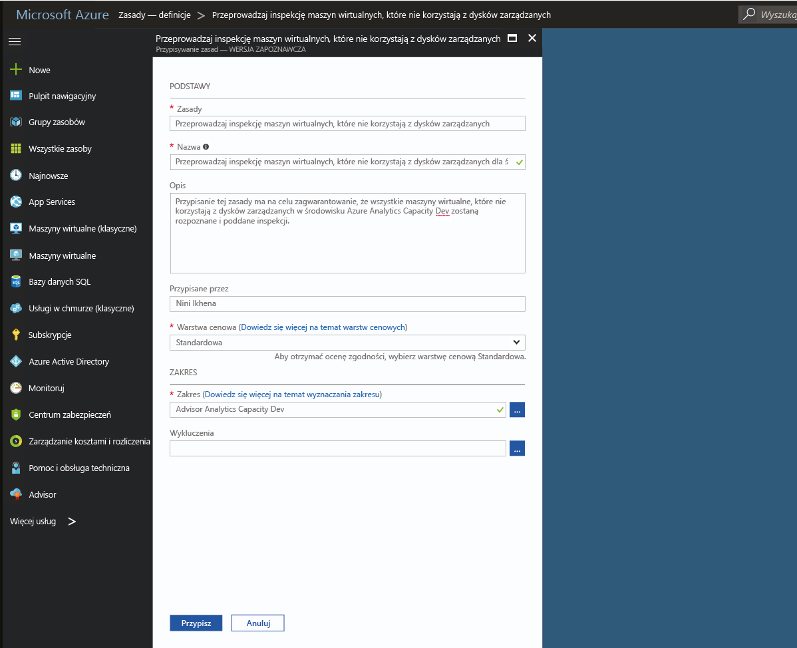
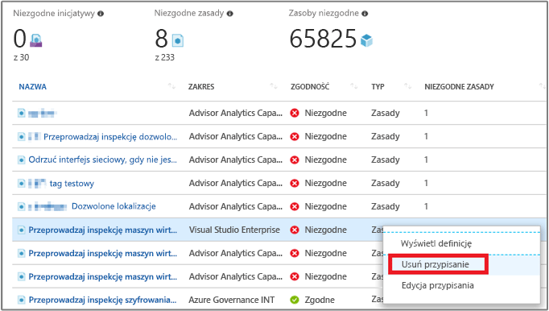

# Tworzenie przypisania zasad w celu zidentyfikowania niezgodnych zasobów w środowisku platformy Azure
Pierwszym krokiem na drodze do zrozumienia pojęcia zgodności na platformie Azure jest uświadomienie sobie obecnej sytuacji dotyczącej Twoich zasobów. Ten przewodnik Szybki start przeprowadzi Cię przez proces tworzenia przypisania zasad w celu zidentyfikowania maszyn wirtualnych, które nie korzystają z dysków zarządzanych.

Po zakończeniu tego procesu pomyślnie zidentyfikujesz maszyny wirtualne, które nie korzystają z dysków zarządzanych, w związku z czym są *niezgodne*.

Jeśli nie masz subskrypcji platformy Azure, przed rozpoczęciem utwórz [bezpłatne konto](https://azure.microsoft.com/free/?WT.mc_id=A261C142F).

## Zgoda na korzystanie z usługi Azure Policy

Usługa Azure Policy jest teraz dostępna w publicznej wersji zapoznawczej i musisz się zarejestrować, aby zawnioskować o dostęp.

1. Przejdź do usługi Azure Policy pod adresem https://aka.ms/getpolicy i wybierz pozycję **Zarejestruj się** w okienku po lewej stronie.

   

2. Wyraź zgodę na korzystanie z usługi Azure Policy, wybierając na liście **Subskrypcja** subskrypcje, z którymi chcesz pracować. Następnie wybierz pozycję **Zarejestruj**.

   

   Twój wniosek dotyczący wersji zapoznawczej zostanie automatycznie zatwierdzony. Przetworzenie rejestracji przez system może potrwać do 30 minut.

## Tworzenie przypisania zasad

W tym przewodniku Szybki start utworzymy przypisanie zasad i przypiszemy definicję zasad *Audit Virtual Machines without Managed Disks* (Przeprowadź inspekcję maszyn wirtualnych bez dysków zarządzanych).

1. Wybierz pozycję **Przypisania** w lewym okienku na stronie Azure Policy.
2. Wybierz pozycję **Przypisz zasady** w górnej części okienka **Przypisania**.

   

3. Na stronie **Przypisz zasady** kliknij  obok pola **Zasady**, aby otworzyć listę dostępnych definicji.

   

   Usługa Azure Policy zawiera już wbudowane definicje zasad, których możesz używać. Widoczne są m.in. wbudowane definicje zasad:

   - Enforce tag and its value (Wymuś tag i jego wartość)
   - Apply tag and its value (Zastosuj tag i jego wartość)
   - Require SQL Server Version 12.0 (Wymagaj programu SQL Server w wersji 12.0)

4. Przeszukaj definicje zasad, aby znaleźć definicję *Audit VMs that do not use managed disks* (Przeprowadź inspekcję maszyn wirtualnych, które nie używają dysków zarządzanych). Kliknij te zasady, a następnie kliknij przycisk **Przypisz**.

   

5. Określ właściwość **Nazwa** przypisania zasad. W tym przypadku można użyć nazwy *Audit VMs that do not use managed disks* (Przeprowadź inspekcję maszyn wirtualnych, które nie używają dysków zarządzanych). Można również dodać opcjonalny **Opis**. Opis zawiera szczegóły dotyczące sposobu identyfikowania przez to przypisanie zasad wszystkich maszyn wirtualnych utworzonych w tym środowisku, które nie korzystają z dysków zarządzanych.
6. Zmień warstwę cenową na **Standardowa**, aby upewnić się, że zasady zostaną zastosowane do istniejących zasobów.

   W ramach usługi Azure Policy dostępne są dwie warstwy cenowe — *Bezpłatna* i *Standardowa*. W warstwie Bezpłatna można wprowadzać zasady tylko dla przyszłych zasobów, podczas gdy w warstwie Standardowa można stosować je także do istniejących zasobów, co zapewnia lepsze zrozumienie stanu zgodności z przepisami. Usługa jest nadal dostępna w ograniczonej wersji zapoznawczej, dlatego nie wprowadziliśmy jeszcze modelu cenowego, w związku z czym nie otrzymasz rachunku za wybranie warstwy *Standardowa*. Aby dowiedzieć się więcej o cenach, zobacz: [Cennik usługi Azure Policy](https://azure.microsoft.com/pricing/details/azure-policy/).

7. Wybierz **Zakres**, do którego chcesz zastosować zasady.  Zakres określa, jakie zasoby lub grupy zasobów są wymuszane w ramach przypisania zasad. Może obejmować zarówno subskrypcje, jak i grupy zasobów.
8. Wybierz subskrypcję (lub grupę zasobów) zarejestrowaną wcześniej podczas rozpoczynania korzystania z usługi Azure Policy. W tym przykładzie zastosowano subskrypcję **Azure Analytics Capacity Dev**, ale mogą być dostępne różne opcje.

   

9. Wybierz opcję **Przypisz**.

Teraz możesz zidentyfikować niezgodne zasoby, aby poznać stan zgodności Twojego środowiska.

## Identyfikowanie niezgodnych zasobów

Wybierz pozycję **Zgodność** w okienku po lewej stronie i wyszukaj utworzone przypisanie zasad.

Jeśli istnieją jakiekolwiek zasoby niezgodne z nowym przypisaniem, zostaną one wyświetlone na karcie **Niezgodne zasoby**.

Jeśli warunek zostanie oceniony dla istniejących zasobów i okaże się prawdziwy dla niektórych z nich, zasoby te zostaną oznaczone jako niezgodne z zasadami. Oto tabela pokazująca, jak różne dostępne obecne działania współpracują z wynikiem oceny warunku oraz stanem zgodności zasobów.

|Zasób  |Jeśli ocena warunku w zasadach to  |Akcja w zasadach   |Stan zgodności  |
|-----------|---------|---------|---------|
|Exists     |True     |Zablokuj     |Niezgodne |
|Exists     |False    |Zablokuj     |Zgodne     |
|Exists     |True     |Append   |Niezgodne |
|Exists     |False    |Append   |Zgodne     |
|Exists     |True     |Inspekcja    |Niezgodne |
|Exists     |False    |Inspekcja    |Niezgodne |

## Oczyszczanie zasobów

Inne przewodniki w tej kolekcji bazują na tym przewodniku Szybki start. Jeśli planujesz kontynuować pracę z kolejnymi samouczkami, nie usuwaj zasobów utworzonych w tym przewodniku Szybki start. Jeśli nie planujesz kontynuować pracy, wykonaj następujące czynności, aby usunąć wszystkie zasoby utworzone w witrynie Azure Portal w ramach tego przewodnika Szybki start.
1. Wybierz pozycję **Przypisania** w lewym okienku.
2. Wyszukaj właśnie utworzone przypisanie.

   

3.  Wybierz pozycję **Usuń przypisanie**.

## Następne kroki

W tym przewodniku Szybki start przypisano definicję zasad do zakresu, co zapewnia, że wszystkie zasoby w tym zakresie są zgodne, oraz umożliwia identyfikację niezgodnych zasobów.

Aby dowiedzieć się więcej na temat przypisywania zasad w celu zapewnienia zgodności zasobów tworzonych w **przyszłości**, przejdź do samouczka:

> [!div class="nextstepaction"]
> [Tworzenie zasad i zarządzanie nimi](./create-manage-policy.md)
