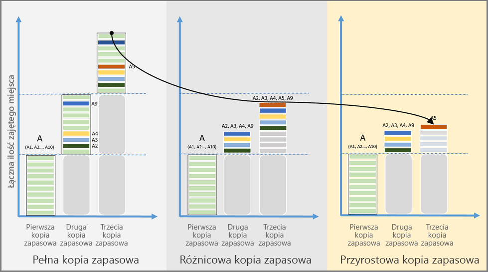

# Omówienie funkcji usługi Azure Backup
Azure Backup to oparta na platformie Azure usługa, która umożliwia tworzenie kopii zapasowej (lub ochronę) i przywracanie danych w chmurze Microsoft Cloud. Usługa Azure Backup pozwala zastąpić dotychczasowe rozwiązania tworzenia kopii zapasowych, istniejące lokalnie lub poza siedzibą firmy, rozwiązaniem opartym na chmurze, które jest niezawodne, bezpieczne i konkurencyjne cenowo. Usługa Azure Backup oferuje wiele składników, które możesz pobrać i wdrożyć na odpowiednim komputerze, serwerze lub w chmurze. Wdrażany składnik lub agent zależy od tego, co ma być chronione. Wszystkie składniki usługi Azure Backup (niezależnie od tego, czy dane są chronione lokalnie, czy w chmurze) mogą służyć do tworzenia kopii zapasowych danych w magazynie usługi Recovery Services na platformie Azure. Informacje o tym, jakich składników należy użyć do ochrony konkretnych danych, aplikacji lub obciążeń, znajdują się w [tabeli składników usługi Azure Backup](backup-introduction-to-azure-backup.md#which-azure-backup-components-should-i-use) (w dalszej części tego artykułu).

[Obejrzyj wideo z omówieniem usługi Azure Backup](https://azure.microsoft.com/documentation/videos/what-is-azure-backup/)

## Dlaczego warto używać usługi Azure Backup?
Tradycyjne rozwiązania do tworzenia kopii zapasowych rozwinęły się w kierunku traktowania chmury jako punktu końcowego, czyli statycznego miejsca docelowego przechowywania, podobnego do dysków lub taśm. Chociaż to podejście jest proste, jest ograniczone i nie w pełni wykorzystuje możliwości platformy chmury, co oznacza kosztowne, nieefektywne rozwiązanie. Jedne rozwiązania są kosztowne, ponieważ ostatecznie płaci się za niewłaściwy typ magazynu lub magazyn, który nie jest potrzebny. Inne rozwiązania są często nieefektywne, ponieważ nie oferują typu lub ilości potrzebnego miejsca albo zadania administracyjne wymagają zbyt dużo czasu. Natomiast usługa Azure Backup oferuje następujące kluczowe korzyści:

**Automatyczne zarządzanie magazynem** — hybrydowe środowiska często wymagają heterogenicznego magazynu — znajdującego się w części lokalnie, a w części w chmurze. W usłudze Azure Backup nie płaci się za korzystanie z lokalnych urządzeń magazynujących. Usługa Azure Backup automatycznie przydziela pojemność i zarządza magazynem kopii zapasowych, przy czym użytkownik płaci tylko za faktyczne użycie. Płatność tylko za faktyczne użycie oznacza, że płacisz tylko za pamięć, której używasz. Aby uzyskać więcej informacji, zobacz [artykuł Cennik platformy Azure](https://azure.microsoft.com/pricing/details/backup).

**Nieograniczone skalowanie** — usługa Azure Backup używa dostępnej mocy i nieograniczonej skali chmury Azure do zapewniania wysokiej dostępności — bez narzutu na konserwację lub monitorowanie. Możesz skonfigurować alerty, aby udostępniać informacje o zdarzeniach, ale nie musisz obawiać się o wysoką dostępność danych w chmurze.

**Wiele opcji magazynowania** — aspektem wysokiej dostępności jest replikacja magazynu. Usługa Azure Backup oferuje dwa typy replikacji: [magazyn lokalnie nadmiarowy](../storage/common/storage-redundancy.md#locally-redundant-storage) i [magazyn geograficznie nadmiarowy](../storage/common/storage-redundancy.md#geo-redundant-storage). Wybierz opcję magazynu kopii zapasowych na podstawie potrzeb:

* Magazyn lokalnie nadmiarowy (LRS) replikuje dane trzy razy (tworzy trzy kopie danych) w sparowanym centrum danych w tym samym regionie. Magazyn LRS to ekonomiczna opcja ochrony danych przed awariami sprzętu lokalnego.

* Magazyn geograficznie nadmiarowy (GRS, geo-redundant storage) replikuje dane do regionu pomocniczego (setki kilometrów od lokalizacji głównej danych źródłowych). Magazyn GRS kosztuje więcej niż LRS, ale zapewnia wyższy poziom trwałości danych nawet w przypadku wystąpienia awarii regionalnej.

**Nieograniczony transfer danych** — usługa Azure Backup nie ogranicza ilości przesyłanych danych przychodzących i wychodzących. W usłudze Azure Backup nie są również naliczane opłaty za przesyłane dane. Jeśli jednak używasz usługi Azure Import/Export do importowania dużych ilości danych, istnieje koszt związany z danymi przychodzącymi. Aby uzyskać więcej informacji o tym koszcie, zobacz [Offline-backup workflow in Azure Backup](backup-azure-backup-import-export.md) (Przepływ pracy tworzenia kopii zapasowej offline w usłudze Azure Backup). Dane wychodzące to dane transferowane z magazynu usługi Recovery Services podczas operacji przywracania.

**Szyfrowanie danych** — szyfrowanie danych umożliwia bezpieczną transmisję i przechowywanie danych w chmurze publicznej. Hasło szyfrowania przechowujesz lokalnie i nigdy nie jest ono przesyłane ani przechowywane na platformie Azure. Jeśli jest konieczne przywrócenie jakichkolwiek danych, tylko Ty masz hasło lub klucz szyfrowania.

**Kopia zapasowa spójna na poziomie aplikacji** — czy wykonujesz kopię zapasową serwera plików, maszyny wirtualnej czy też bazy danych SQL, musisz wiedzieć, że punkt odzyskiwania zawiera wszystkie dane wymagane do przywrócenia kopii zapasowej. Usługa Azure Backup umożliwia wykonywanie kopii zapasowych spójnych na poziomie aplikacji, które zapewniają, że do przywrócenia danych nie są potrzebne dodatkowe poprawki. Przywracanie danych spójnych na poziomie aplikacji skraca czas przywracania, co pozwala szybko powrócić do stanu roboczego.

**Długoterminowe przechowywanie** — zamiast przełączania kopii zapasowych z dysku na taśmę, a następnie przenoszenia taśmy do lokalizacji zewnętrznej, możesz użyć platformy Azure do przechowywania krótko- i długoterminowego. Platforma Azure nie ogranicza czasu przechowywania danych w magazynie usługi Backup ani Recovery Services. Dane możesz przechowywać w magazynie tak długo, jak chcesz. Usługa Azure Backup ma limit 9999 punktów odzyskiwania dla każdego chronionego wystąpienia. Zobacz sekcję [Tworzenie kopii zapasowej i przechowywanie](backup-introduction-to-azure-backup.md#backup-and-retention) w tym artykule, aby uzyskać informacje o tym, jaki wpływ ten limit może mieć na Twoje potrzeby związane z kopiami zapasowymi.  

## Jakich składników usługi Azure Backup mam użyć?
Jeśli nie masz pewności, które składniki usługi Azure Backup odpowiadają Twoim potrzebom, zapoznaj się z poniższą tabelą zawierającą informacje o tym, co można chronić za pomocą każdego składnika. Witryna Azure Portal udostępnia wbudowanego kreatora, który prowadzi użytkownika przez proces wybierania składnika do pobrania i wdrożenia. Kreator, który jest częścią tworzenia magazynu usługi Recovery Services, poprowadzi użytkownika przez kroki wybierania celu tworzenia kopii zapasowej oraz wybierania danych lub aplikacji do ochrony.

| Składnik | Korzyści | Limity | Co jest chronione? | Gdzie są przechowywane kopie zapasowe? |
| --- | --- | --- | --- | --- |
| Agent usługi Azure Backup (MARS) |<li>Tworzy kopię zapasową plików i folderów w fizycznym lub wirtualnym systemie operacyjnym Windows (maszyny wirtualne mogą być lokalne lub na platformie Azure)<li>Nie jest wymagany oddzielny serwer kopii zapasowych. |<li>Tworzenie kopii zapasowej 3 razy dziennie <li>Brak zależności od aplikacji; przywracanie tylko na poziomie plików, folderów i woluminów, <li>  Brak obsługi systemu Linux. |<li>Pliki, <li>Foldery |Magazyn usługi Recovery Services |
| System Center DPM |<li>Migawki z uwzględnieniem aplikacji (usługa VSS)<li>Pełna elastyczność w odniesieniu do terminów wykonywania kopii zapasowych<li>Poziom szczegółowości odzyskiwania (wszystkie)<li>Możliwość użycia magazynu usługi Recovery Services<li>Obsługa systemu Linux na maszynach wirtualnych programu VMware i funkcji Hyper-V <li>Wykonywanie kopii zapasowych i przywracanie maszyn wirtualnych VMware za pomocą programu DPM 2012 R2 |Nie można tworzyć kopii zapasowych obciążeń Oracle.|<li>Pliki, <li>Foldery,<li> Woluminy, <li>Maszyny wirtualne,<li> Aplikacje,<li> Obciążenia |<li>Magazyn usługi Recovery Services,<li> Dysk dołączony lokalnie,<li>  Taśmy (tylko lokalnie) |
| Azure Backup Server |<li>Migawki z uwzględnieniem aplikacji (usługa VSS)<li>Pełna elastyczność w odniesieniu do terminów wykonywania kopii zapasowych<li>Poziom szczegółowości odzyskiwania (wszystkie)<li>Możliwość użycia magazynu usługi Recovery Services<li>Obsługa systemu Linux na maszynach wirtualnych programu VMware i funkcji Hyper-V<li>Wykonywanie kopii zapasowych i przywracanie maszyn wirtualnych VMware <li>Nie wymaga licencji programu System Center |<li>Nie można tworzyć kopii zapasowych obciążeń Oracle.<li>Zawsze wymaga aktywnej subskrypcji platformy Azure<li>Brak obsługi tworzenia kopii zapasowej na taśmie |<li>Pliki, <li>Foldery,<li> Woluminy, <li>Maszyny wirtualne,<li> Aplikacje,<li> Obciążenia |<li>Magazyn usługi Recovery Services,<li> Dysk dołączony lokalnie |
| Usługa Backup dla maszyn wirtualnych IaaS platformy Azure |<li>Natywne kopie zapasowe w systemach Windows/Linux<li>Nie ma konieczności instalowania określonego agenta<li>Tworzenie kopii zapasowych na poziomie sieci szkieletowej nie wymaga infrastruktury kopii zapasowej |<li>Tworzenie kopii zapasowych maszyn wirtualnych raz dziennie <li>Przywracanie maszyn wirtualnych tylko na poziomie dysku<li>Nie można utworzyć kopii zapasowych lokalnie |<li>Maszyny wirtualne, <li>Wszystkie dyski (przy użyciu programu PowerShell) |
Magazyn usługi Recovery Services
 |

## Jakie są scenariusze wdrażania dla każdego składnika?
| Składnik | Czy można wdrożyć w systemie Azure? | Czy można wdrożyć lokalnie? | Obsługiwany magazyn docelowy |
| --- | --- | --- | --- |
| Agent usługi Azure Backup (MARS) |
**Tak**
 
Agenta usługi Azure Backup można wdrożyć na dowolnej maszynie wirtualnej systemu Windows Server działającej na platformie Azure.
 |
**Tak**
 
Agenta usługi Backup można wdrożyć na dowolnej maszynie wirtualnej lub dowolnym komputerze fizycznym z systemem Windows Server.
 |
Magazyn usługi Recovery Services
 |
| System Center DPM |
**Tak**

Dowiedz się więcej, [jak chronić obciążenia na platformie Azure za pomocą programu System Center DPM](backup-azure-dpm-introduction.md).
 |
**Tak**
 
Dowiedz się więcej, [jak chronić obciążenia i maszyny wirtualne w centrum danych](https://technet.microsoft.com/system-center-docs/dpm/data-protection-manager).
 |
Dysk dołączony lokalnie,
 
Magazyn usługi Recovery Services,
 
taśmy (tylko lokalnie)
 |
| Azure Backup Server |
**Tak**

Dowiedz się więcej, [jak chronić obciążenia na platformie Azure przy użyciu programu Azure Backup Server](backup-azure-microsoft-azure-backup.md).
 |
**Tak**
 
Dowiedz się więcej, [jak chronić obciążenia na platformie Azure przy użyciu programu Azure Backup Server](backup-azure-microsoft-azure-backup.md).
 |
Dysk dołączony lokalnie,
 
Magazyn usługi Recovery Services
 |
| Usługa Backup dla maszyn wirtualnych IaaS platformy Azure |
**Tak**

Część sieci szkieletowej Azure

Składnik przeznaczony do [tworzenia kopii zapasowych maszyn wirtualnych platformy Azure w modelu infrastruktura jako usługa (IaaS) ](backup-azure-vms-introduction.md).
 |
**Nie**
 
Program System Center DPM umożliwia tworzenie kopii zapasowych maszyn wirtualnych w centrum danych.
 |
Magazyn usługi Recovery Services
 |

## Dla których aplikacji i obciążeń można tworzyć kopie zapasowe?
Poniższa tabela zawiera macierz danych i obciążeń, które mogą być chronione przy użyciu usługi Azure Backup. Kolumna rozwiązania usługi Azure Backup zawiera linki do dokumentacji wdrożeniowej dla tego rozwiązania. 

| Dane lub obciążenie | Środowisko źródłowe | Rozwiązanie Azure Backup |
| --- | --- | --- |
| Pliki i foldery |Windows Server |
[Agent usługi Azure Backup](backup-configure-vault.md),
 
[System Center DPM](backup-azure-dpm-introduction.md) (+ agent usługi Azure Backup),
 
[Azure Backup Server](backup-azure-microsoft-azure-backup.md) (w tym agent usługi Azure Backup)
 |
| Pliki i foldery |Komputer z systemem Windows |
[Agent usługi Azure Backup](backup-configure-vault.md),
 
[System Center DPM](backup-azure-dpm-introduction.md) (+ agent usługi Azure Backup),
 
[Azure Backup Server](backup-azure-microsoft-azure-backup.md) (w tym agent usługi Azure Backup)
 |
| Maszyna wirtualna funkcji Hyper-V (Windows) |Windows Server |
[System Center DPM](backup-azure-backup-sql.md) (+ agent usługi Azure Backup),
 
[Azure Backup Server](backup-azure-microsoft-azure-backup.md) (w tym agent usługi Azure Backup)
 |
| Maszyna wirtualna funkcji Hyper-V (Linux) |Windows Server |
[System Center DPM](backup-azure-backup-sql.md) (+ agent usługi Azure Backup),
 
[Azure Backup Server](backup-azure-microsoft-azure-backup.md) (w tym agent usługi Azure Backup)
 |
| Maszyna wirtualna VMware |Windows Server |
[System Center DPM](backup-azure-backup-sql.md) (+ agent usługi Azure Backup),
 
[Azure Backup Server](backup-azure-microsoft-azure-backup.md) (w tym agent usługi Azure Backup)
 |
| Microsoft SQL Server |Windows Server |
[System Center DPM](backup-azure-backup-sql.md) (+ agent usługi Azure Backup),
 
[Azure Backup Server](backup-azure-microsoft-azure-backup.md) (w tym agent usługi Azure Backup)
 |
| Microsoft SharePoint |Windows Server |
[System Center DPM](backup-azure-backup-sql.md) (+ agent usługi Azure Backup),
 
[Azure Backup Server](backup-azure-microsoft-azure-backup.md) (w tym agent usługi Azure Backup)
 |
| Microsoft Exchange |Windows Server |
[System Center DPM](backup-azure-backup-sql.md) (+ agent usługi Azure Backup),
 
[Azure Backup Server](backup-azure-microsoft-azure-backup.md) (w tym agent usługi Azure Backup)
 |
| Maszyny wirtualne IaaS platformy Azure (Windows) |uruchomione na platformie Azure |[Azure Backup (rozszerzenie maszyny wirtualnej)](backup-azure-vms-introduction.md) |
| Maszyny wirtualne IaaS platformy Azure (Linux) |uruchomione na platformie Azure |[Azure Backup (rozszerzenie maszyny wirtualnej)](backup-azure-vms-introduction.md) |

## Obsługa systemu Linux
W poniższej tabeli przedstawiono składniki usługi Azure Backup, które obsługują system Linux.  

| Składnik | Obsługa w systemie Linux (zatwierdzonym przez Azure) |
| --- | --- |
| Agent usługi Azure Backup (MARS) |Nie (tylko agent oparty na systemie Windows) |
| System Center DPM |<li> Spójna na poziomie plików kopia zapasowa maszyn wirtualnych gościa z systemem Linux dla funkcji Hyper-V i programu VMWare  <li> Przywracanie maszyn wirtualnych gościa z systemem Linux dla funkcji Hyper-V i programu VMWare      *Spójna na poziomie plików kopia zapasowa nie jest dostępna dla maszyny wirtualnej platformy Azure*   |
| Azure Backup Server |<li>Spójna na poziomie plików kopia zapasowa maszyn wirtualnych gościa z systemem Linux dla funkcji Hyper-V i programu VMWare  <li> Przywracanie maszyn wirtualnych gościa z systemem Linux dla funkcji Hyper-V i programu VMWare    *Spójna na poziomie plików kopia zapasowa nie jest dostępna dla maszyny wirtualnej platformy Azure*  |
| Usługa Backup dla maszyn wirtualnych IaaS platformy Azure |Spójna na poziomie aplikacji kopia zapasowa korzystająca ze [struktury skryptów uruchamianych przed utworzeniem i po utworzeniu kopii zapasowej](backup-azure-linux-app-consistent.md)  [Szczegółowe odzyskiwanie plików](backup-azure-restore-files-from-vm.md)  [Przywracanie wszystkich dysków maszyn wirtualnych](backup-azure-arm-restore-vms.md#restore-backed-up-disks)  [Przywracanie maszyny wirtualnej](backup-azure-arm-restore-vms.md#create-a-new-vm-from-a-restore-point) |

## Korzystanie z maszyn wirtualnych usługi Premium Storage przy użyciu usługi Azure Backup
Usługa Azure Backup chroni maszyny wirtualne usługi Premium Storage. Azure Premium Storage to magazyn oparty na dyskach SSD i zaprojektowany z myślą o obsłudze dużych obciążeń wejścia/wyjścia. Usługa Premium Storage jest atrakcyjna dla obciążeń maszyn wirtualnych. Aby uzyskać więcej informacji o usłudze Premium Storage, zobacz artykuł [Premium Storage: High-Performance Storage for Azure Virtual Machine Workloads](../virtual-machines/windows/premium-storage.md) (Premium Storage: magazyn o wysokiej wydajności dla obciążeń maszyn wirtualnych platformy Azure).

### Tworzenie kopii zapasowej maszyn wirtualnych usługi Premium Storage
Podczas wykonywania kopii zapasowych maszyn wirtualnych usługi Premium Storage usługa Backup tworzy tymczasową lokalizację o nazwie „AzureBackup-” na koncie usługi Premium Storage. Rozmiar lokalizacji przejściowej jest równy rozmiarowi migawki punktu odzyskiwania. Upewnij się, że ilość wolnego miejsca na koncie Premium Storage jest wystarczająca do obsługi tymczasowej lokalizacji przejściowej. Aby uzyskać więcej informacji, zobacz [Premium Storage limitations](../virtual-machines/windows/premium-storage.md#scalability-and-performance-targets) (Ograniczenia usługi Premium Storage). Po zakończeniu zadania tworzenia kopii zapasowej lokalizacja tymczasowa zostanie usunięta. Cena przestrzeni dyskowej użytej na potrzeby lokalizacji tymczasowej jest zgodna z ogólnym [cennikiem usługi Premium Storage](../virtual-machines/windows/premium-storage.md#pricing-and-billing).

> [!NOTE]
> Nie wolno modyfikować ani edytować tej lokalizacji tymczasowej.
>
>

### Przywracanie maszyn wirtualnych usługi Premium Storage
Maszyny wirtualne usługi Premium Storage można przywrócić do usługi Premium Storage lub normalnego magazynu. Przywracanie punktu odzyskiwania maszyny wirtualnej usługi Premium Storage do magazynu w warstwie Premium to typowy proces przywracania. Jednak opłacalne może się okazać przywrócenie punktu odzyskiwania maszyny wirtualnej usługi Premium Storage do standardowego magazynu. Z tego typu przywracania można skorzystać, gdy potrzebny jest podzbiór plików z maszyny wirtualnej.

## Korzystanie z maszyn wirtualnych dysku zarządzanego z usługą Azure Backup
Usługa Azure Backup chroni maszyny wirtualne dysku zarządzanego. Dzięki dyskom zarządzanym nie musisz zarządzać kontami magazynu maszyn wirtualnych, a aprowizowanie maszyny wirtualnej jest znacznie prostsze.

### Tworzenie kopii zapasowej maszyn wirtualnych dysku zarządzanego
Proces tworzenia kopii zapasowych maszyn wirtualnych na dyskach zarządzanych nie różni się niczym od tworzenia kopii zapasowych maszyn wirtualnych w usłudze Resource Manager. W witrynie Azure Portal możesz skonfigurować zadanie tworzenia kopii zapasowej bezpośrednio w widoku maszyny wirtualnej lub widoku magazynu usługi Recovery Services. Kopie zapasowe maszyn wirtualnych możesz tworzyć na dyskach zarządzanych za pomocą kolekcji RestorePoint tworzonych na tych dyskach. Usługa Azure Backup obsługuje także tworzenie kopii zapasowych maszyn wirtualnych z dyskami zarządzanymi zaszyfrowanymi za pomocą usługi Azure Disk Encryption (ADE).

### Przywracanie maszyn wirtualnych dysku zarządzanego
Usługa Azure Backup umożliwia przywracanie kompletnej maszyny wirtualnej z dyskami zarządzanymi lub przywracanie dysków zarządzanych na konto magazynu. Platforma Azure zarządza dyskami zarządzanymi podczas procesu przywracania. Natomiast to klient (czyli Ty) zarządza kontem magazynu utworzonym w ramach procesu przywracania. W przypadku przywracania zarządzanych zaszyfrowanych maszyn wirtualnych klucze i wpisy tajne maszyny powinny już istnieć w magazynie kluczy przed rozpoczęciem operacji przywracania.

## Jakie są funkcje każdego składnika usługi Azure Backup?
Poniższe sekcje zawierają tabele podsumowujące dostępność lub obsługę różnych funkcji w każdym składniku usługi Azure Backup. W informacjach podanych po każdej tabeli znajdziesz dodatkowe wsparcie lub szczegóły.

### Magazyn
| Funkcja | Agent usługi Azure Backup | System Center DPM | Azure Backup Server | Usługa Backup dla maszyn wirtualnych IaaS platformy Azure |
| --- | --- | --- | --- | --- |
| Magazyn usługi Recovery Services |![Tak][green] |![Tak][green] |![Tak][green] |![Tak][green] |
| Przechowywanie na dysku | |![Tak][green] |![Tak][green] | |
| Przechowywanie na taśmie | |![Tak][green] | | |
| Kompresja  (w magazynie usługi Recovery Services) |![Tak][green] |![Tak][green] |![Tak][green] | |
| Przyrostowa kopia zapasowa |![Tak][green] |![Tak][green] |![Tak][green] |![Tak][green] |
| Deduplikacja dysku | |![Częściowo][yellow] |![Częściowo][yellow] | | |

Dla wszystkich składników preferowanym miejscem docelowym przechowywania jest magazyn usługi Recovery Services. Programy System Center DPM i Azure Backup Server udostępniają również opcję kopiowania na dysk lokalny. Jednak tylko program System Center DPM zapewnia możliwość zapisu danych na taśmowym urządzeniu magazynującym.

#### Kompresja
Aby zmniejszyć ilość miejsca wymaganego do magazynowania kopie zapasowe są kompresowane. Jedyny składnik, który nie korzysta z kompresji, to rozszerzenie maszyny wirtualnej. Rozszerzenie maszyny wirtualnej kopiuje wszystkie dane kopii zapasowej z konta magazynu do magazynu usługi Recovery Services w tym samym regionie. Kompresja nie jest używana podczas przesyłania danych. Przesyłanie danych bez kompresji nieco zwiększa ilość używanej pamięci. Z drugiej strony przechowywanie danych bez kompresji skraca czas ich przywracania, jeśli punkt przywracania jest potrzebny.

#### Deduplikacja dysku
Możesz skorzystać z funkcji deduplikacji podczas wdrażania programu System Center DPM lub serwera Azure Backup Server [na maszynie wirtualnej funkcji Hyper-V](http://blogs.technet.com/b/dpm/archive/2015/01/06/deduplication-of-dpm-storage-reduce-dpm-storage-consumption.aspx). System Windows Server wykonuje deduplikację danych (na poziomie hosta) na wirtualnych dyskach twardych (VHD) dołączonych do maszyny wirtualnej jako magazyn kopii zapasowych.

> [!NOTE]
> Funkcja deduplikacji nie jest dostępna na platformie Azure dla żadnego składnika usługi Backup. Gdy na platformie Azure wdrożone są programy System Center DPM i Backup Server, dyski magazynowania dołączone do maszyny wirtualnej nie mogą być deduplikowane.
>
>

### Informacje na temat przyrostowej kopii zapasowej
Każdy składnik usługi Azure Backup obsługuje przyrostową kopię zapasową, niezależnie od magazynu docelowego (dysk, taśma, magazyn usługi Recovery Services). Tworzenie przyrostowej kopii zapasowej powoduje oszczędność przestrzeni dyskowej i czasu dzięki transferowaniu tylko tych zmian, które zostały wprowadzone od czasu utworzenia ostatniej kopii zapasowej.

#### Porównanie pełnej, różnicowej i przyrostowej kopii zapasowej

Użycie magazynu, cel czasu odzyskiwania (RTO, recovery time objective) oraz użycie sieci są różne w przypadku każdego typu metody wykonywania kopii zapasowej. Aby maksymalnie zmniejszyć całkowity koszt posiadania kopii zapasowej, należy zrozumieć, jak wybrać najlepsze rozwiązanie tworzenia kopii zapasowej. Na poniższym obrazie porównano pełną, różnicową i przyrostową kopię zapasową. Na obrazie źródło danych A składa się z 10 bloków magazynu A1–A10, których kopie zapasowe są wykonywane co miesiąc. Bloki A2, A3, A4 i A9 zmieniają się w trakcie pierwszego miesiąca, a blok A5 zmienia się w następnym miesiącu.

W przypadku **pełnej kopii zapasowej** każda kopia zapasowa zawiera całe źródło danych. Pełna kopia zapasowa używa dużej ilości przepustowości sieci i magazynu przy każdym transferze kopii zapasowej.

**Różnicowa kopia zapasowa** przechowuje tylko te bloki, które uległy zmianie od momentu wykonania początkowej pełnej kopii zapasowej, co skutkuje mniejszym użyciem sieci i magazynu. Różnicowe kopie zapasowe nie zawierają nadmiarowych kopii niezmienionych danych. Jednak ponieważ bloki danych, które nie uległy zmianie między kolejnymi kopiami zapasowymi, są transferowane i przechowywane, różnicowe kopie zapasowe są nieefektywne. W drugim miesiącu jest tworzona kopia zapasowa zmienionych bloków A2, A3, A4 i A9. W trzecim miesiącu jest ponownie wykonywana kopia zapasowa tych samych bloków, a dodatkowo zmienionego bloku A5. Kopie zapasowe zmienionych bloków będą ciągle wykonywane aż do czasu wykonania kolejnej pełnej kopii zapasowej.

**Przyrostowa kopia zapasowa** osiąga wysoką efektywność użycia magazynu i sieci, ponieważ przechowuje tylko bloki danych, które uległy zmianie od momentu utworzenia poprzedniej kopii zapasowej. W przypadku przyrostowej kopii zapasowej nie ma potrzeby regularnego wykonywania pełnych kopii zapasowych. W tym przykładzie po wykonaniu pełnej kopii zapasowej w pierwszym miesiącu zmienione bloki A2, A3, A4 i A9 są oznaczane jako zmienione i transferowane w drugim miesiącu. W trzecim miesiącu jest oznaczany i transferowany jedynie zmieniony blok A5. Przenoszenie mniejszej ilości danych oszczędza zasoby magazynu i sieci, co zmniejsza całkowity koszt posiadania.   

### Bezpieczeństwo
| Funkcja | Agent usługi Azure Backup | System Center DPM | Azure Backup Server | Usługa Backup dla maszyn wirtualnych IaaS platformy Azure |
| --- | --- | --- | --- | --- |
| Bezpieczeństwo sieci  (na platformę Azure) |![Tak][green] |![Tak][green] |![Tak][green] |![Częściowo][yellow] |
| Bezpieczeństwo danych  (na platformie Azure) |![Tak][green] |![Tak][green] |![Tak][green] |![Częściowo][yellow] |

#### Bezpieczeństwo sieci
Cały ruch sieciowy z serwerów użytkownika do magazynu usługi Recovery Services związany z tworzeniem kopii zapasowych jest szyfrowany przy użyciu algorytmu Advanced Encryption Standard 256. Dane kopii zapasowej są przesyłane za pośrednictwem bezpiecznego połączenia HTTPS. Także w magazynie usługi Recovery Services dane kopii zapasowych są przechowywane w postaci zaszyfrowanej. Tylko Ty, jako klient platformy Azure, dysponujesz hasłem do odblokowania tych danych. Firma Microsoft nie może odszyfrować danych kopii zapasowej w żadnym punkcie.

> [!WARNING]
> Po utworzeniu magazynu usługi Recovery Services tylko Ty masz dostęp do klucza szyfrowania. Firma Microsoft nigdy nie przechowuje kopii klucza szyfrowania i nie ma do niego dostępu. W przypadku utraty klucza firma Microsoft nie może odzyskać danych kopii zapasowej.
>
>

#### Bezpieczeństwo danych
Tworzenie kopii zapasowych maszyn wirtualnych Azure wymaga skonfigurowania szyfrowania *w ramach* maszyny wirtualnej. W przypadku maszyn wirtualnych systemu Windows należy użyć funkcji BitLocker, a w przypadku maszyn wirtualnych systemu Linux programu **dm-crypt**. Usługa Azure Backup nie szyfruje automatycznie danych kopii zapasowych, które przechodzą przez tę ścieżkę.

### Sieć
| Funkcja | Agent usługi Azure Backup | System Center DPM | Azure Backup Server | Usługa Backup dla maszyn wirtualnych IaaS platformy Azure |
| --- | --- | --- | --- | --- |
| Kompresja sieci  (do **serwera kopii zapasowych**) | |![Tak][green] |![Tak][green] | |
| Kompresja sieci  (do **magazynu usługi Recovery Services**) |![Tak][green] |![Tak][green] |![Tak][green] | |
| Protokół sieciowy  (do **serwera kopii zapasowych**) | |TCP |TCP | |
| Protokół sieciowy  (do **magazynu usługi Recovery Services**) |HTTPS |HTTPS |HTTPS |HTTPS |

Rozszerzenie maszyny wirtualnej (na maszynie wirtualnej IaaS) odczytuje dane bezpośrednio z konta magazynu na platformie Azure w sieci magazynowania, więc kompresja tego ruchu nie jest konieczna.

W przypadku korzystania z serwera System Center DPM lub Azure Backup Server jako pomocniczego serwera kopii zapasowych kompresuj dane przesyłane z serwera podstawowego na serwer kopii zapasowych. Skompresowanie danych przed utworzeniem ich kopii zapasowej w programie DPM lub usłudze Azure Backup Server umożliwia zaoszczędzenie przepustowości.

#### Ograniczanie przepustowości sieci
Agent usługi Azure Backup umożliwia ograniczanie użycia sieci, co pozwala na sterowanie wykorzystaniem przepustowości sieci w trakcie transferu danych. Ograniczanie może być przydatne, gdy kopie zapasowe danych mają być tworzone podczas godzin pracy, ale proces tworzenia kopii zapasowej nie może kolidować z innym ruchem internetowym. Ograniczanie transferu danych ma zastosowanie do operacji tworzenia kopii zapasowej i przywracania.

## Tworzenie kopii zapasowej i przechowywanie

W usłudze Azure Backup obowiązuje limit wynoszący 9999 punktów odzyskiwania, znanych także jako kopie zapasowe lub migawki, na *chronione wystąpienie*. Chronione wystąpienie to komputer, serwer (fizyczny lub wirtualny) albo obciążenie, które skonfigurowano do tworzenia kopii zapasowych na platformie Azure. Aby uzyskać więcej informacji, zobacz [Co to jest chronione wystąpienie?](backup-introduction-to-azure-backup.md#what-is-a-protected-instance). Wystąpienie jest chronione po zapisaniu kopii zapasowej danych. Kopia zapasowa danych stanowi ochronę. Jeśli dane źródłowe zostaną utracone lub uszkodzone, za pomocą kopii zapasowej możesz je przywrócić. W poniższej tabeli przedstawiono maksymalną częstotliwość wykonywania kopii zapasowych dla każdego składnika. Konfiguracja zasad kopii zapasowych określa, jak szybko są zużywane punkty odzyskiwania. Jeśli na przykład tworzysz punkt odzyskiwania codziennie, to możesz zachować punkty odzyskiwania przez 27 lat, zanim wyczerpie się ich liczba. Jeśli natomiast używasz jednego punktu odzyskiwania na miesiąc, to punkty odzyskiwania wyczerpią się po upływie 833 lat i do tego czasu będzie je można przechowywać. W usłudze Backup punktom odzyskiwania nie jest przypisywany limit czasu wygaśnięcia.

|  | Agent usługi Azure Backup | System Center DPM | Azure Backup Server | Usługa Backup dla maszyn wirtualnych IaaS platformy Azure |
| --- | --- | --- | --- | --- |
| Częstotliwość wykonywania kopii zapasowych  (do magazynu usługi Recovery Services) |Trzy kopie zapasowe dziennie |Dwie kopie zapasowe dziennie |Dwie kopie zapasowe dziennie |Jedna kopia zapasowa dziennie |
| Częstotliwość wykonywania kopii zapasowych  (na dysku) |Nie dotyczy |<li>Co 15 minut dla programu SQL Server <li>Co godzinę dla innych obciążeń |<li>Co 15 minut dla programu SQL Server <li>Co godzinę dla innych obciążeń
 |Nie dotyczy |
| Opcje przechowywania |Codziennie, co tydzień, co miesiąc, co rok |Codziennie, co tydzień, co miesiąc, co rok |Codziennie, co tydzień, co miesiąc, co rok |Codziennie, co tydzień, co miesiąc, co rok |
| Maksymalna liczba punktów odzyskiwania na chronione wystąpienie |9999|9999|9999|9999|
| Maksymalny okres przechowywania |Zależnie od częstotliwości wykonywania kopii zapasowych |Zależnie od częstotliwości wykonywania kopii zapasowych |Zależnie od częstotliwości wykonywania kopii zapasowych |Zależnie od częstotliwości wykonywania kopii zapasowych |
| Punkty odzyskiwania na dysku lokalnym |Nie dotyczy |<li>64 dla serwerów plików,<li>448 dla serwerów aplikacji |<li>64 dla serwerów plików,<li>448 dla serwerów aplikacji |Nie dotyczy |
| Punkty odzyskiwania na taśmie |Nie dotyczy |Nieograniczona liczba |Nie dotyczy |Nie dotyczy |

## Co to jest chronione wystąpienie
Chronione wystąpienie to ogólna nazwa komputera z systemem Windows, serwera (fizycznego lub wirtualnego) albo bazy danych SQL, które skonfigurowano w celu tworzenia kopii zapasowych na platformie Azure. Wystąpienie jest chronione po skonfigurowaniu zasad kopii zapasowych dla komputera, serwera lub bazy danych i utworzeniu kopii zapasowej danych. Kolejne kopie zapasowe danych dla tego chronionego wystąpienia (są one nazywane punktami odzyskiwania) zwiększają ilość miejsca używanego w magazynie. Dla pojedynczego chronionego wystąpienia możesz utworzyć maksymalnie 9999 punktów odzyskiwania. Po usunięciu punktu odzyskiwania z magazynu nie jest on wliczany do limitu 9999 punktów odzyskiwania.
Typowe przykłady chronionych wystąpień to maszyny wirtualne, serwery aplikacji, bazy danych i komputery osobiste z systemem operacyjnym Windows. Na przykład:

* Maszyna wirtualna, na której działa funkcja Hyper-V lub sieć szkieletowa funkcji hypervisor Azure IaaS. Systemem operacyjnym gościa maszyny wirtualnej może być system Windows Server lub Linux.
* Serwer aplikacji, który może być maszyną fizyczną lub wirtualną z systemem Windows Server, obsługujący obciążenia korzystające z danych wymagających tworzenia kopii zapasowych. Typowe obciążenia to: Microsoft SQL Server, Microsoft Exchange Server, Microsoft SharePoint Server i rola serwera plików w systemie Windows Server. Aby tworzyć kopie zapasowe tych obciążeń, należy korzystać z programu System Center Data Protection Manager (DPM) lub usługi Azure Backup Server.
* Komputer osobisty lub przenośny albo stacja robocza z systemem operacyjnym Windows.

## Co to jest magazyn usługi Recovery Services?
Magazyn usługi Recovery Services jest jednostką magazynu online na platformie Azure używaną do przechowywania danych, takich jak kopie zapasowe, punkty odzyskiwania i zasady tworzenia kopii zapasowych. Magazyny usługi Recovery Services służą do przechowywania danych kopii zapasowych na potrzeby usług platformy Azure oraz lokalnych serwerów i stacji roboczych. Magazyny usługi Recovery Services ułatwiają organizowanie danych kopii zapasowych przy jednoczesnym zmniejszeniu nakładów pracy związanych z zarządzaniem. W ramach subskrypcji można utworzyć dowolną liczbę magazynów usługi Recovery Services.

Magazyny kopii zapasowych oparte na usłudze Azure Service Manager stanowiły pierwszą wersję magazynu. Magazyny usługi Recovery Services, w których dodano funkcje modelu usługi Azure Resource Manager, stanowią drugą wersję magazynu. Zobacz [artykuł z omówieniem magazynu usługi Recovery Services](backup-azure-recovery-services-vault-overview.md), aby uzyskać pełen opis różnic między funkcjami. Nie można już tworzyć magazynów kopii zapasowych w witrynie Portal, ale magazyny kopii zapasowych są nadal obsługiwane. Do zarządzania magazynami usługi Backup musisz użyć witryny Azure Portal.

> [!IMPORTANT]
> Magazyny kopii zapasowych możesz uaktualnić do magazynów usługi Recovery Services. Więcej szczegółów znajduje się w artykule [Upgrade a Backup vault to a Recovery Services vault](backup-azure-upgrade-backup-to-recovery-services.md) (Uaktualnianie magazynu kopii zapasowych do magazynu usługi Recovery Services). Firma Microsoft zachęca do przeprowadzenia uaktualnienia magazynów kopii zapasowych do magazynów usługi Recovery Services.  Po **30 listopada 2017 r.** nie będzie już można tworzyć magazynów usługi Backup przy użyciu programu PowerShell.  
Do 30 listopada 2017 r.:
- Wszystkie pozostałe magazyny kopii zapasowych zostaną automatycznie uaktualnione do magazynów usługi Recovery Services.
- Nie będzie możliwe uzyskanie dostępu do danych kopii zapasowych w klasycznej witrynie Azure Portal. Zamiast tego należy użyć witryny Azure Portal, aby uzyskać dostęp do danych kopii zapasowych w magazynach usługi Recovery Services.

## Czym różni się usługa Azure Backup od usługi Azure Site Recovery?
Usługi Azure Backup i Azure Site Recovery są zbliżone do siebie w tym sensie, że obie tworzą kopie zapasowe danych i mogą je przywracać. Jednak te usługi służą do innych celów związanych z zapewnianiem ciągłości działalności biznesowej oraz odzyskiwaniem po awarii. Za pomocą usługi Azure Backup możesz zabezpieczać i przywracać dane na bardziej szczegółowym poziomie. Jeśli na przykład prezentacja na laptopie zostanie uszkodzona, możesz ją przywrócić za pomocą usługi Azure Backup. Jeśli chcesz replikować konfigurację i dane na maszynie wirtualnej w innym centrum danych, użyj usługi Azure Site Recovery.

Usługa Azure Backup chroni dane lokalnie i w chmurze. Usługa Azure Site Recovery koordynuje replikację maszyn wirtualnych i serwerów fizycznych, pracę w trybie failover i powrót po awarii. Obie te usługi są ważne, ponieważ rozwiązanie odzyskiwania po awarii wymaga bezpiecznego przechowywania danych z możliwością ich odzyskania (usługa Backup) *oraz* utrzymywania dostępności obciążeń (usługa Site Recovery) w przypadku wystąpienia awarii.

Następujące pojęcia mogą ułatwić podejmowanie ważnych decyzji związanych z tworzeniem kopii zapasowych i odzyskiwaniem po awarii.

| Pojęcie | Szczegóły | Tworzenie kopii zapasowych | Odzyskiwanie awaryjne (DR) |
| --- | --- | --- | --- |
| Cel punktu odzyskiwania (recovery point objective, RPO) |Dopuszczalna ilość utraconych danych, jeśli wymagane jest odzyskiwanie. |Rozwiązania tworzenia kopii zapasowych charakteryzują się dużą zmiennością dopuszczalnej wartości RPO. Kopie zapasowe maszyny wirtualnej mają zwykle RPO na poziomie jednego dnia, natomiast kopie zapasowe bazy danych mają RPO o wartości 15 minut. |Rozwiązania odzyskiwania awaryjnego mają niską wartość RPO. Kopia do odzyskiwania awaryjnego może być starsza o kilka sekund lub kilka minut. |
| Cel czasu odzyskiwania (recovery time objective, RTO) |Ilość czasu potrzebnego do ukończenia odzyskiwania lub przywracania. |Ilość danych, które musi przetworzyć rozwiązanie kopii zapasowych, jest zwykle znacznie wyższa (ze względu na większą wartość RPO), a to prowadzi do większych wartości RTO. Na przykład przywrócenie danych z taśmy może potrwać kilka dni, zależnie od czasu potrzebnego do przetransportowania taśmy z oddalonej lokalizacji. |Rozwiązania w zakresie odzyskiwania awaryjnego mają mniejszą wartość RTO, ponieważ są one bardziej zsynchronizowane ze źródłem. W takim przypadku mniej zmian wymaga przetworzenia. |
| Przechowywanie |Jak długo dane muszą być przechowywane |W przypadku scenariuszy wymagających odzyskiwania operacyjnego (uszkodzenie danych, nieumyślne usunięcie pliku, błąd systemu operacyjnego) dane kopii zapasowej są zwykle zachowywane przez 30 dni lub mniej. Z punktu widzenia zgodności z przepisami dane mogą wymagać przechowywania przez miesiące, a nawet lata. Dane z kopii zapasowej doskonale nadają się do archiwizacji w takich przypadkach. |Odzyskiwanie awaryjne wymaga tylko danych odzyskiwania operacyjnego, które zazwyczaj zajmuje kilka godzin lub maksymalnie jeden dzień. Z powodu szczegółowego przechwytywania danych używanego w rozwiązaniach DR korzystanie z danych usługi DR do długoterminowego przechowywania danych nie jest zalecane. |

## Następne kroki
Użyj jednego z następujących samouczków w celu uzyskania szczegółowych, krok po kroku, instrukcji dotyczących ochrony danych w systemie Windows Server lub ochrony maszyny wirtualnej (VM) na platformie Azure:

* [Tworzenie kopii zapasowych plików i folderów](backup-try-azure-backup-in-10-mins.md)
* [Tworzenie kopii zapasowej maszyn wirtualnych platformy Azure](backup-azure-vms-first-look-arm.md)

Szczegółowe informacje na temat ochrony innych obciążeń możesz uzyskać w jednym z następujących artykułów:

* [Tworzenie kopii zapasowej systemu Windows Server](backup-configure-vault.md)
* [Tworzenie kopii zapasowej obciążeń aplikacji](backup-azure-microsoft-azure-backup.md)
* [Tworzenie kopii zapasowej maszyn wirtualnych IaaS platformy Azure](backup-azure-vms-prepare.md)

[green]: ./media/backup-introduction-to-azure-backup/green.png
[yellow]: ./media/backup-introduction-to-azure-backup/yellow.png
[red]: ./media/backup-introduction-to-azure-backup/red.png
