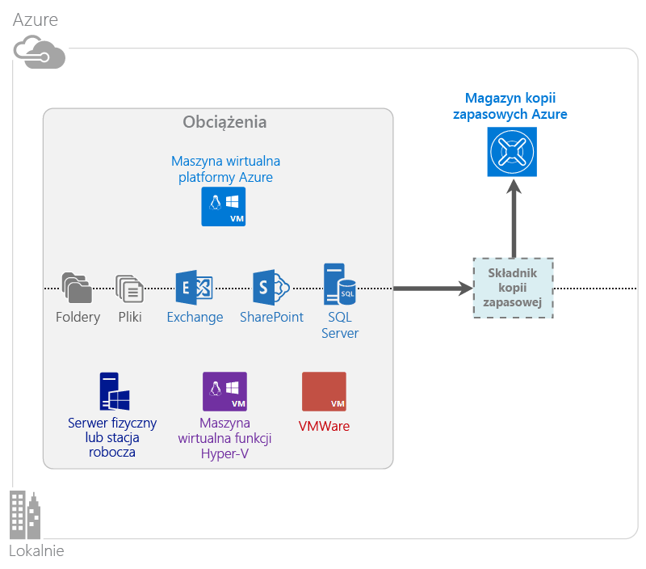

<properties
    pageTitle="Co to jest Azure Backup? | Microsoft Azure"
    description="Za pomocą usług Azure Backup oraz Recovery Services można tworzyć kopie zapasowe oraz przywracać dane i aplikacje z serwerów systemu Windows, komputerów klienckich systemu Windows, serwerów System Center DPM i maszyn wirtualnych platformy Azure."
    services="backup"
    documentationCenter=""
    authors="markgalioto"
    manager="cfreeman"
    editor="tysonn"
    keywords="tworzenie i przywracanie kopii zapasowej; recovery services; rozwiązania kopii zapasowych"/>

<tags
    ms.service="backup"
    ms.workload="storage-backup-recovery"
    ms.tgt_pltfrm="na"
    ms.devlang="na"
    ms.topic="get-started-article"
    ms.date="07/21/2016"
    ms.author="jimpark; trinadhk"/>

# Co to jest Azure Backup?
Azure Backup to usługa, która umożliwia tworzenie kopii zapasowej i przywracanie danych w chmurze Microsoft Cloud. Pozwala ona zastąpić dotychczasowe rozwiązania tworzenia kopii zapasowych, istniejące lokalne lub poza siedzibą firmy, rozwiązaniem opartym na chmurze, które jest niezawodne, bezpieczne i konkurencyjne cenowo. Pomaga również chronić zasoby, które działają w chmurze. Usługa Azure Backup udostępnia usługi odzyskiwania oparte na infrastrukturze na najwyższym światowym poziomie, która jest skalowalna, trwała i wysoce dostępna.

[Obejrzyj film wideo z omówieniem usługi Azure Backup](https://azure.microsoft.com/documentation/videos/what-is-azure-backup/)

## Dlaczego warto używać usługi Azure Backup?
Tradycyjne rozwiązania tworzenia kopii zapasowych rozwinęły się w kierunku traktowania chmury jako punktu końcowego, podobnego do dysków lub taśm. Takie podejście jest proste, ale ma swoje ograniczenia. Nie wykorzystuje w pełni możliwości platformy chmury, co prowadzi do rozwiązań nieefektywnych i kosztownych.
W przeciwieństwie do niego usługa Azure Backup udostępnia wszystkie korzyści wynikające z zastosowania zaawansowanego i niedrogiego rozwiązania tworzenia kopii zapasowych opartego na chmurze. Poniżej przedstawiono niektóre z głównych korzyści zapewnianych przez usługę Azure Backup.

| Funkcja | Korzyść |
| ------- | ------- |
| Automatyczne zarządzanie magazynem | Nie są wymagane żadne nakłady inwestycyjne na lokalne urządzenia magazynujące. Usługa Azure Backup automatycznie przydziela pojemność i zarządza magazynem kopii zapasowych, przy czym użytkownik płaci tylko za faktycznie używaną pojemność. |
| Skalowanie bez ograniczeń | Gwarancja wysokiej dostępności bez dodatkowych kosztów związanych z konserwacją i monitorowaniem. Azure Backup korzysta z siły i skali chmury Azure z jej możliwościami automatycznego skalowania bez zakłócania pracy. |
| Wiele opcji przechowywania | Wybór magazynu kopii zapasowych według potrzeb:<li>Blokowy obiekt blob magazynu lokalnie nadmiarowego doskonale nadaje się dla klientów, którzy zwracają uwagę na cenę, i zapewnia ochronę danych na wypadek lokalnych awarii sprzętowych. <li>Blokowy obiekt blob magazynu z replikacją geograficzną udostępnia o trzy kopie więcej w powiązanych centrach danych. Te dodatkowe kopie zapewniają wysoką dostępność danych kopii zapasowej, nawet w przypadku wystąpienia awarii platformy Azure na poziomie lokalizacji. |
| Nieograniczony transfer danych | Podczas operacji przywracania z magazynu kopii zapasowych nie ma opłat za jakikolwiek wychodzący transfer danych. Dane przychodzące do platformy Azure również nie są obciążone opłatą. Współdziała z usługą importu, gdzie jest dostępna. |
| Szyfrowanie danych | Szyfrowanie danych umożliwia bezpieczną transmisję i przechowywania danych klientów w chmurze publicznej. Hasło szyfrowania jest przechowywane w miejscu źródłowym i nigdy nie jest przesyłane ani przechowywane na platformie Azure. Aby przywrócić dane, wymagany jest klucz szyfrowania, a tylko klient ma pełny dostęp do danych w usłudze. |  
| Kopia zapasowa spójna na poziomie aplikacji | Kopie zapasowe spójne na poziomie aplikacji sprzyjają zapewnieniu, że w czasie przywracania nie będą wymagane poprawki, co zmniejsza cel czasu odzyskiwania. Dzięki temu klienci mogą szybciej powrócić do stanu działania. |
| Długoterminowe przechowywanie | Zamiast ponosić koszty związane z rozwiązaniami opartymi na taśmach przechowywanych poza siedzibą firmy, klienci mogą tworzyć kopie zapasowe na platformie Azure, która oferuje niedrogie rozwiązanie podobne do stosowania taśm. |

## Składniki usługi Azure Backup
Ponieważ usługa Backup jest hybrydowym rozwiązaniem tworzenia kopii zapasowych, składa się z wielu składników, które współpracują ze sobą w celu umożliwienia całościowego przepływu pracy podczas tworzenia kopii zapasowej i przywracania.

### Scenariusze wdrażania

| Składnik | Czy można wdrożyć w systemie Azure? | Czy można wdrożyć lokalnie? | Obsługiwany magazyn docelowy|
| --- | --- | --- | --- |
| Agent usługi Azure Backup | 
**Tak**
 
Agenta usługi Azure Backup można wdrożyć na dowolnej maszynie wirtualnej systemu Windows Server działającej na platformie Azure.
 | 
**Tak**
 
Agenta usługi Backup można wdrożyć na dowolnej maszynie wirtualnej lub dowolnym komputerze fizycznym z systemem Windows Server.
 | 
Magazyn usługi Azure Backup
 |
| System Center Data Protection Manager (DPM) | 
**Tak**

Dowiedz się więcej, [jak chronić obciążenia na platformie Azure za pomocą programu System Center DPM](http://blogs.technet.com/b/dpm/archive/2014/09/02/azure-iaas-workload-protection-using-data-protection-manager.aspx).
 | 
**Tak**
 
Dowiedz się więcej, [jak chronić obciążenia i maszyny wirtualne w centrum danych](https://technet.microsoft.com/library/hh758173.aspx).
 | 
Dysk dołączony lokalnie,
 
magazyn kopii zapasowych Azure,
 
taśmy (tylko lokalnie)
 |
| Azure Backup Server | 
**Tak**

Dowiedz się więcej, [jak chronić obciążenia na platformie Azure przy użyciu programu Azure Backup Server](backup-azure-microsoft-azure-backup.md).
 | 
**Tak**
 
Dowiedz się więcej, [jak chronić obciążenia na platformie Azure przy użyciu programu Azure Backup Server](backup-azure-microsoft-azure-backup.md).
 | 
Dysk dołączony lokalnie,
 
magazyn usługi Azure Backup
 |
| Azure Backup (rozszerzenie maszyny wirtualnej) | 
**Tak**

Część sieci szkieletowej Azure

Składnik przeznaczony do [tworzenia kopii zapasowych maszyn wirtualnych platformy Azure w modelu infrastruktura jako usługa (IaaS) ](backup-azure-vms-introduction.md).
 | 
**Nie**
 
Program System Center DPM umożliwia tworzenie kopii zapasowych maszyn wirtualnych w centrum danych.
 | 
Magazyn usługi Azure Backup
 |

### Korzyści i ograniczenia na poziomie składnika

| Składnik | Korzyści | Ograniczenia | Poziom szczegółowości odzyskiwania |
| --- | --- | --- | --- |
| Agent usługi Azure Backup (MARS) | <li>Można wykonywać kopie zapasowe plików i folderów na fizycznym lub wirtualnym komputerze z systemem operacyjnym Windows (maszyny wirtualne mogą znajdować się gdziekolwiek w środowisku lokalnym lub na platformie Azure)<li>Nie jest wymagany oddzielny serwer kopii zapasowej<li>Używa magazynu usługi Azure Backup | <li>Kopia zapasowa trzy razy dziennie/przywracanie na poziomie plików<li>Przywracanie tylko na poziomie plików/folderów/woluminów, bez uwzględniania aplikacji<li>Brak obsługi w systemie Linux | pliki/foldery/woluminy |
| System Center Data Protection Manager | <li>Migawki z uwzględnieniem aplikacji (usługa VSS)<li>Pełna elastyczność w odniesieniu do terminów wykonywania kopii zapasowych<li>Poziom szczegółowości odzyskiwania (wszystkie)<li>Można użyć magazynu usługi Azure Backup<li>Obsługa systemu Linux (jeśli jest hostowany na funkcji Hyper-V) | <li>Brak obsługi heterogenicznej (tworzenie kopii zapasowej maszyny wirtualnej VMware, tworzenie kopii zapasowej obciążenia Oracle).  | pliki/foldery/woluminy /maszyny wirtualne/aplikacje |
| Microsoft Azure Backup Server | <li>Migawki z uwzględnieniem aplikacji (usługa VSS)<li>Pełna elastyczność w odniesieniu do terminów wykonywania kopii zapasowych<li>Poziom szczegółowości odzyskiwania (wszystkie)<li>Można użyć magazynu usługi Azure Backup<li>Obsługa systemu Linux (jeśli jest hostowany na funkcji Hyper-V)<li>Nie wymaga licencji programu System Center | <li>Brak obsługi heterogenicznej (tworzenie kopii zapasowej maszyny wirtualnej VMware, tworzenie kopii zapasowej obciążenia Oracle).<li>Zawsze wymaga aktywnej subskrypcji platformy Azure<li>Brak obsługi tworzenia kopii zapasowej na taśmie | pliki/foldery/woluminy /maszyny wirtualne/aplikacje |
| Usługa Backup dla maszyn wirtualnych IaaS platformy Azure | <li>Natywne kopie zapasowe w systemach Windows/Linux<li>Nie ma konieczności instalowania określonego agenta<li>Tworzenie kopii zapasowych na poziomie sieci szkieletowej nie wymaga infrastruktury kopii zapasowej | <li>Kopia zapasowa raz dziennie/przywracanie na poziomie dysku<li>Nie można utworzyć kopii zapasowych lokalnie | Maszyny wirtualne Wszystkie dyski (przy użyciu programu PowerShell) |

## Dla których aplikacji i obciążeń można tworzyć kopie zapasowe?

| Obciążenie | Maszyna źródłowa | Rozwiązanie Azure Backup |
| --- | --- |---|
| Pliki i foldery | Windows Server | 
[Agent usługi Azure Backup](backup-configure-vault.md),
 
[System Center DPM](backup-azure-dpm-introduction.md) (+ agent usługi Azure Backup),
 
[Azure Backup Server](backup-azure-microsoft-azure-backup.md) (w tym agent usługi Azure Backup)
  |
| Pliki i foldery | Klient systemu Windows | 
[Agent usługi Azure Backup](backup-configure-vault.md),
 
[System Center DPM](backup-azure-dpm-introduction.md) (+ agent usługi Azure Backup),
 
[Azure Backup Server](backup-azure-microsoft-azure-backup.md) (w tym agent usługi Azure Backup)
  |
| Maszyna wirtualna funkcji Hyper-V (Windows) | Windows Server | 
[System Center DPM](backup-azure-backup-sql.md) (+ agent usługi Azure Backup),
 
[Azure Backup Server](backup-azure-microsoft-azure-backup.md) (w tym agent usługi Azure Backup)
 |
| Maszyna wirtualna funkcji Hyper-V (Linux) | Windows Server | 
[System Center DPM](backup-azure-backup-sql.md) (+ agent usługi Azure Backup),
 
[Azure Backup Server](backup-azure-microsoft-azure-backup.md) (w tym agent usługi Azure Backup)
  |
| Microsoft SQL Server | Windows Server | 
[System Center DPM](backup-azure-backup-sql.md) (+ agent usługi Azure Backup),
 
[Azure Backup Server](backup-azure-microsoft-azure-backup.md) (w tym agent usługi Azure Backup)
  |
| Microsoft SharePoint | Windows Server | 
[System Center DPM](backup-azure-backup-sql.md) (+ agent usługi Azure Backup),
 
[Azure Backup Server](backup-azure-microsoft-azure-backup.md) (w tym agent usługi Azure Backup)
   |
| Microsoft Exchange |  Windows Server | 
[System Center DPM](backup-azure-backup-sql.md) (+ agent usługi Azure Backup),
 
[Azure Backup Server](backup-azure-microsoft-azure-backup.md) (w tym agent usługi Azure Backup)
   |
| Maszyny wirtualne IaaS platformy Azure (Windows) | - | [Azure Backup (rozszerzenie maszyny wirtualnej)](backup-azure-vms-introduction.md) |
| Maszyny wirtualne IaaS platformy Azure (Linux) | - | [Azure Backup (rozszerzenie maszyny wirtualnej)](backup-azure-vms-introduction.md) |

## Obsługa w technologii ARM i w systemie Linux

| Składnik | Obsługa w technologii ARM | Obsługa w systemie Linux (zatwierdzonym przez Azure) |
| --- | --- | --- |
| Agent usługi Azure Backup (MARS) | Tak | Nie (tylko agent oparty na systemie Windows) |
| System Center Data Protection Manager | Tak (agent gość) | Tylko funkcja Hyper-V (nie maszyna wirtualna Azure), możliwa jest tylko kopia zapasowa spójna z plikami |
| Azure Backup Server (MABS) | Tak (agent gość) | Tylko funkcja Hyper-V (nie maszyna wirtualna Azure), możliwa jest tylko kopia zapasowa spójna z plikami (tak samo jak dla programu DPM) |
| Usługa Backup dla maszyn wirtualnych IaaS platformy Azure | Tak | Tak |

[AZURE.INCLUDE [learn-about-deployment-models](../../includes/learn-about-deployment-models-include.md)]

## Tworzenie kopii zapasowej i przywracanie maszyn wirtualnych usługi Premium Storage

Usługa Azure Backup chroni obecnie maszyny wirtualne usługi Premium Storage.

### Tworzenie kopii zapasowej maszyn wirtualnych usługi Premium Storage

Podczas wykonywania kopii zapasowych maszyn wirtualnych usługi Premium Storage usługa Backup tworzy tymczasową lokalizację na koncie usługi Premium Storage. Ta tymczasowa lokalizacja o nazwie „AzureBackup-” ma wielkość równą łącznemu rozmiarowi danych dysków w warstwie Premium dołączonych do maszyny wirtualnej.

>[AZURE.NOTE] Nie wolno modyfikować ani edytować tej lokalizacji tymczasowej.

Po zakończeniu zadania tworzenia kopii zapasowej lokalizacja tymczasowa zostanie usunięta. Cena przestrzeni dyskowej użytej na potrzeby lokalizacji tymczasowej jest zgodna z ogólnym [cennikiem usługi Premium Storage](../storage/storage-premium-storage.md#pricing-and-billing).

### Przywracanie maszyn wirtualnych usługi Premium Storage

Maszyny wirtualne usługi Premium Storage można przywrócić do usługi Premium Storage lub normalnego magazynu. Przywracanie punktu odzyskiwania maszyny wirtualnej usługi Premium Storage do magazynu w warstwie Premium to typowy proces przywracania. Jednak opłacalne może się okazać przywrócenie punktu odzyskiwania maszyny wirtualnej usługi Premium Storage do standardowego magazynu. Z tego typu przywracania można skorzystać, gdy potrzebny jest podzbiór plików z maszyny wirtualnej.

## Funkcjonalność
Poniżej znajduje się pięć tabel zawierających podsumowanie sposobów obsługi funkcji tworzenia kopii zapasowych w poszczególnych składnikach.

### Magazyn

| Funkcja | Agent usługi Azure Backup | System Center DPM | Azure Backup Server | Azure Backup (rozszerzenie maszyny wirtualnej) |
| ------- | --- | --- | --- | ---- |
| Magazyn usługi Azure Backup | ![Tak][green] | ![Tak][green] | ![Tak][green] | ![Tak][green] |
| Przechowywanie na dysku | | ![Tak][green] | ![Tak][green] |  |
| Przechowywanie na taśmie | | ![Tak][green] |  | |
| Kompresja (w magazynie kopii zapasowych) | ![Tak][green] | ![Tak][green]| ![Tak][green] | |
| Przyrostowa kopia zapasowa | ![Tak][green] | ![Tak][green] | ![Tak][green] | ![Tak][green] |
| Deduplikacja dysku | | ![Częściowo][yellow] | ![Częściowo][yellow]| | |

Dla wszystkich składników preferowanym miejscem docelowym przechowywania jest magazyn usługi Backup. Programy System Center DPM i Backup Server udostępniają również opcję kopiowania na dysk lokalny. Jednak tylko program System Center DPM zapewnia możliwość zapisu danych na taśmowym urządzeniu magazynującym.

#### Przyrostowa kopia zapasowa
Każdy składnik obsługuje przyrostową kopię zapasową, niezależnie od magazynu docelowego (dysk, taśma, magazyn kopii zapasowych). Tworzenie przyrostowej kopii zapasowej powoduje oszczędność przestrzeni dyskowej i czasu dzięki transferowaniu tylko tych zmian, które zostały wprowadzone od czasu utworzenia ostatniej kopii zapasowej.

#### Kompresja
Aby zmniejszyć ilość miejsca wymaganego do magazynowania kopie zapasowe są kompresowane. Jedyny składnik, który nie korzysta z kompresji, to rozszerzenie maszyny wirtualnej. W przypadku rozszerzenia maszyny wirtualnej wszystkie dane kopii zapasowej są kopiowane bez kompresji z konta magazynu klienta do magazynu kopii zapasowych w tym samym regionie. Chociaż nieużywanie kompresji nieco zwiększa wykorzystaną przestrzeń, to jednak dane przechowywane bez kompresji mogą zostać przywrócone szybciej.

#### Deduplikacja
Funkcja deduplikacji jest obsługiwana w przypadku programów System Center DPM i Backup Server, gdy są one [wdrożone w maszynie wirtualnej funkcji Hyper-V](http://blogs.technet.com/b/dpm/archive/2015/01/06/deduplication-of-dpm-storage-reduce-dpm-storage-consumption.aspx). Deduplikacja jest wykonywana na poziomie hosta przy użyciu funkcji deduplikacji systemu Windows Server na wirtualnych dyskach twardych (VHD) dołączonych do maszyny wirtualnej jako magazyn kopii zapasowych.

>[AZURE.WARNING] Funkcja deduplikacji nie jest dostępna na platformie Azure dla żadnego składnika usługi Backup. Gdy na platformie Azure wdrożone są programy System Center DPM i Backup Server, dyski magazynowania dołączone do maszyny wirtualnej nie mogą być deduplikowane.

### Bezpieczeństwo

| Funkcja | Agent usługi Azure Backup | System Center DPM | Azure Backup Server | Azure Backup (rozszerzenie maszyny wirtualnej) |
| ------- | --- | --- | --- | ---- |
| Zabezpieczenia sieci (do platformy Azure) | ![Tak][green] |![Tak][green] | ![Tak][green] | ![Częściowo][yellow]|
| Bezpieczeństwo danych (w systemie Azure) | ![Tak][green] |![Tak][green] | ![Tak][green] | ![Częściowo][yellow]|

Cały ruch sieciowy z serwerów użytkownika do magazynu usługi Backup związany z tworzeniem kopii zapasowych jest szyfrowany przy użyciu algorytmu Advanced Encryption Standard 256. Dane są przesyłane za pośrednictwem bezpiecznego linku HTTPS. Także w magazynie usługi Backup dane kopii zapasowych są przechowywane w postaci zaszyfrowanej. Tylko klient dysponuje hasłem do odblokowania tych danych. Firma Microsoft nie może odszyfrować danych kopii zapasowej w żadnym punkcie.

>[AZURE.WARNING] Klucz używany do szyfrowania danych kopii zapasowej znajduje się tylko u klienta. Firma Microsoft nie przechowuje kopii na platformie Azure i nie ma żadnego dostępu do klucza. W przypadku utraty klucza firma Microsoft nie może odzyskać danych kopii zapasowej.

Tworzenie kopii zapasowych maszyn wirtualnych Azure wymaga skonfigurowania szyfrowania *w ramach* maszyny wirtualnej. W przypadku maszyn wirtualnych systemu Windows należy użyć funkcji BitLocker, a w przypadku maszyn wirtualnych systemu Linux programu **dm-crypt**. Usługa Azure Backup nie szyfruje automatycznie danych kopii zapasowych, które przechodzą przez tę ścieżkę.

### Obsługiwane obciążenia

| Funkcja | Agent usługi Azure Backup | System Center DPM | Azure Backup Server | Azure Backup (rozszerzenie maszyny wirtualnej) |
| ------- | --- | --- | --- | ---- |
| Komputer z systemem Windows Server — pliki i foldery | ![Tak][green] | ![Tak][green] | ![Tak][green] | |
| Komputer kliencki z systemem Windows — pliki i foldery | ![Tak][green] | ![Tak][green] | ![Tak][green] | |
| Maszyna wirtualna funkcji Hyper-V (Windows) | | ![Tak][green] | ![Tak][green] | |
| Maszyna wirtualna funkcji Hyper-V (Linux) | | ![Tak][green] | ![Tak][green] | |
| Microsoft SQL Server | | ![Tak][green] | ![Tak][green] | |
| Microsoft SharePoint | | ![Tak][green] | ![Tak][green] | |
| Microsoft Exchange  | | ![Tak][green] | ![Tak][green] | |
| Maszyna wirtualna Azure (Windows) | | | | ![Tak][green] |
| Maszyna wirtualna Azure (Linux) | | | | ![Tak][green] |

### Sieć

| Funkcja | Agent usługi Azure Backup | System Center DPM | Azure Backup Server | Azure Backup (rozszerzenie maszyny wirtualnej) |
| ------- | --- | --- | --- | ---- |
| Kompresja sieci (do serwera kopii zapasowych) | | ![Tak][green] | ![Tak][green] | |
| Kompresja sieci (do magazynu kopii zapasowych) | ![Tak][green] | ![Tak][green] | ![Tak][green] | |
| Protokół sieciowy (do serwera kopii zapasowych) | | TCP | TCP | |
| Protokół sieciowy (do magazynu kopii zapasowych) | HTTPS | HTTPS | HTTPS | HTTPS |

Ponieważ rozszerzenie maszyny wirtualnej odczytuje dane bezpośrednio z konta magazynu na platformie Azure w sieci magazynowania, optymalizowanie tego ruchu nie jest niezbędne. Ruch odbywa się za pośrednictwem lokalnej sieci magazynowania w centrum danych Azure, dlatego potrzeba kompresji jest niewielka ze względu na przepustowość.

Jeśli kopia zapasowa danych jest wykonywana na serwerze kopii zapasowych (w programie DPM lub Backup Server), ruch z serwera podstawowego do serwera kopii zapasowych można skompresować, aby oszczędzić na przepustowości.

#### Ograniczanie przepustowości sieci
Agent usługi Azure Backup udostępnia możliwość ograniczania przepustowości, co pozwala na sterowanie wykorzystaniem przepustowości sieci w trakcie transferu danych. Ograniczanie może być przydatne, gdy kopie zapasowe danych mają być tworzone podczas godzin pracy, ale proces tworzenia kopii zapasowej nie może kolidować z innym ruchem internetowym. Ograniczanie transferu danych ma zastosowanie do operacji tworzenia kopii zapasowej i przywracania.

### Tworzenie kopii zapasowej i przechowywanie

|  | Agent usługi Azure Backup | System Center DPM | Azure Backup Server | Azure Backup (rozszerzenie maszyny wirtualnej) |
| --- | --- | --- | --- | --- |
| Częstotliwość wykonywania kopii zapasowych (do magazynu kopii zapasowych) | Trzy kopie zapasowe dziennie | Dwie kopie zapasowe dziennie |Dwie kopie zapasowe dziennie | Jedna kopia zapasowa dziennie |
| Częstotliwość wykonywania kopii zapasowych (na dysku) | Nie dotyczy | 
Co 15 minut dla programu SQL Server
 
Co godzinę dla innych obciążeń
 | 
Co 15 minut dla programu SQL Server
 
Co godzinę dla innych obciążeń
 |Nie dotyczy |
| Opcje przechowywania | Codziennie, co tydzień, co miesiąc, co rok | Codziennie, co tydzień, co miesiąc, co rok | Codziennie, co tydzień, co miesiąc, co rok |Codziennie, co tydzień, co miesiąc, co rok |
| Okres przechowywania | Do 99 lat | Do 99 lat | Do 99 lat | Do 99 lat |
| Punkty odzyskiwania w magazynie usługi Backup | Nieograniczona liczba | Nieograniczona liczba | Nieograniczona liczba | Nieograniczona liczba |
| Punkty odzyskiwania na dysku lokalnym | Nie dotyczy | 64 dla serwerów plików,  448 dla serwerów aplikacji | 64 dla serwerów plików,  448 dla serwerów aplikacji |Nie dotyczy |
| Punkty odzyskiwania na taśmie | Nie dotyczy | Nieograniczona liczba | Nie dotyczy | Nie dotyczy |

## Co to jest plik poświadczeń magazynu?

Plik poświadczeń magazynu jest to certyfikat wygenerowany przez portal dla każdego magazynu kopii zapasowych. Portal przekazuje następnie klucz publiczny do usługi Access Control Service (ACS). Klucz prywatny jest udostępniany użytkownikowi podczas pobierania poświadczeń i następnie wprowadzany podczas rejestracji komputera. Klucz prywatny uwierzytelnia komputer do wysyłania danych kopii zapasowej do zidentyfikowanego magazynu w usłudze Azure Backup.

Poświadczenie magazynu jest używane tylko podczas przepływu pracy związanego z rejestracją. Użytkownik jest odpowiedzialny za zapewnienie bezpieczeństwa pliku poświadczeń magazynu. Jeśli wpadnie on w ręce nieuczciwego użytkownika, może posłużyć do rejestrowania innych komputerów względem tego samego magazynu. Ponieważ jednak dane kopii zapasowej są szyfrowane przy użyciu hasła należącego tylko do klienta, istniejące dane kopii zapasowej nie zostaną ujawnione. Aby zmniejszyć znaczenie tego problemu, poświadczenia magazynu są ustawione na wygaśnięcie w ciągu 48 godzin. Chociaż poświadczenia magazynu kopii zapasowych można pobierać dowolną liczbę razy, podczas przepływu pracy związanego z rejestracją może być stosowany tylko najnowszy plik.

## Czym różni się usługa Azure Backup od usługi Azure Site Recovery?
Wielu klientów myli odzyskiwanie kopii zapasowej z odzyskiwaniem po awarii. Obie usługi przechwytują dane i zapewniają semantykę przywracania, ale ich główne cele są inne.

Usługa Azure Backup wykonuje kopię zapasową danych lokalnie i w chmurze. Usługa Azure Site Recovery koordynuje replikację maszyn wirtualnych i serwerów fizycznych, pracę w trybie failover i powrót po awarii. Obie te usługi są ważne, ponieważ rozwiązanie odzyskiwania po awarii wymaga bezpiecznego przechowywania danych z możliwością ich odzyskania (usługa Backup) *oraz* utrzymywania dostępności obciążeń (usługa Site Recovery) w przypadku wystąpienia awarii.

Następujące pojęcia ułatwiają podejmowanie ważnych decyzji związanych z tworzeniem kopii zapasowych i odzyskiwaniem po awarii.

| Pojęcie | Szczegóły | Tworzenie kopii zapasowych | Odzyskiwanie awaryjne (DR) |
| ------- | ------- | ------ | ----------------- |
| Cel punktu odzyskiwania (recovery point objective, RPO) | Dopuszczalna ilość utraconych danych, jeśli wymagane jest odzyskiwanie. | Rozwiązania tworzenia kopii zapasowych charakteryzują się dużą zmiennością dopuszczalnej wartości RPO. Kopie zapasowe maszyny wirtualnej mają zwykle RPO na poziomie jednego dnia, natomiast kopie zapasowe bazy danych mają RPO o wartości 15 minut. | Rozwiązania odzyskiwania awaryjnego mają niską wartość RPO. Kopia do odzyskiwania awaryjnego może być starsza o kilka sekund lub kilka minut. |
| Cel czasu odzyskiwania (recovery time objective, RTO) | Ilość czasu potrzebnego do ukończenia odzyskiwania lub przywracania. | Ilość danych, które musi przetworzyć rozwiązanie kopii zapasowych, jest zwykle znacznie wyższa (ze względu na większą wartość RPO), a to prowadzi do większych wartości RTO. Na przykład przywrócenie danych z taśmy może potrwać kilka dni, zależnie od czasu potrzebnego do przetransportowania taśmy z oddalonej lokalizacji. | Rozwiązania w zakresie odzyskiwania awaryjnego mają mniejszą wartość RTO, ponieważ są one bardziej zsynchronizowane ze źródłem. W takim przypadku mniej zmian wymaga przetworzenia. |
| Przechowywanie | Jak długo dane muszą być przechowywane | W przypadku scenariuszy wymagających odzyskiwania operacyjnego (uszkodzenie danych, nieumyślne usunięcie pliku, błąd systemu operacyjnego) dane kopii zapasowej są zwykle zachowywane przez 30 dni lub mniej. Z punktu widzenia zgodności z przepisami dane mogą wymagać przechowywania przez miesiące, a nawet lata. Dane z kopii zapasowej doskonale nadają się do archiwizacji w takich przypadkach. | Odzyskiwanie awaryjne wymaga tylko danych odzyskiwania operacyjnego, które zazwyczaj zajmuje kilka godzin lub maksymalnie jeden dzień. Z powodu szczegółowego przechwytywania danych używanego w rozwiązaniach DR korzystanie z danych usługi DR do długoterminowego przechowywania danych nie jest zalecane. |

## Następne kroki

Wypróbuj prostą usługę Azure Backup. Instrukcje możesz znaleźć w jednym z samouczków:

- [Wypróbuj usługę Azure Backup](backup-try-azure-backup-in-10-mins.md)
- [Wypróbuj usługę kopii zapasowych maszyny wirtualnej platformy Azure](backup-azure-vms-first-look.md)

Ponieważ te samouczki pomagają w szybkim utworzeniu kopii zapasowej, pokazują tylko najbardziej bezpośrednią ścieżkę prowadzącą do utworzenia kopii zapasowej danych. Aby uzyskać dodatkowe informacje dotyczące typu kopii zapasowej, jakim chcesz się posłużyć, zobacz:

- [Tworzenie kopii zapasowej komputera z systemem Windows](backup-configure-vault.md)
- [Tworzenie kopii zapasowej obciążeń aplikacji](backup-azure-microsoft-azure-backup.md)
- [Tworzenie kopii zapasowej maszyn wirtualnych IaaS platformy Azure](backup-azure-vms-prepare.md)

[green]: ./media/backup-introduction-to-azure-backup/green.png
[żółty]: ./media/backup-introduction-to-azure-backup/yellow.png
[red]: ./media/backup-introduction-to-azure-backup/red.png

<!--HONumber=Sep16_HO3-->

