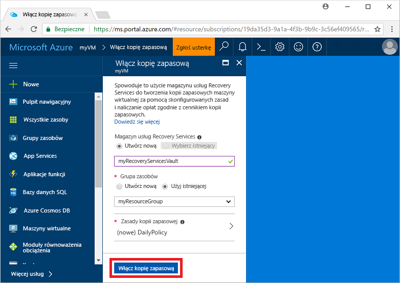
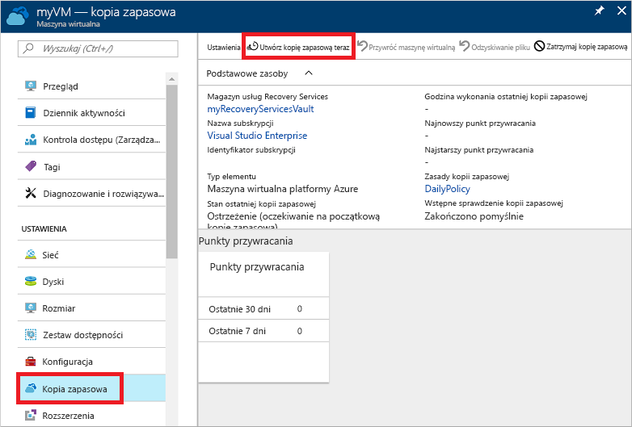

# Tworzenie kopii zapasowej maszyny wirtualnej na platformie Azure
Kopie zapasowe platformy Azure można utworzyć za pomocą witryny Azure Portal. Ta metoda bazuje na opartym na przeglądarce interfejsie użytkownika umożliwiającym tworzenie i konfigurowanie kopii zapasowych platformy Azure oraz wszystkich pokrewnych zasobów. Możesz chronić swoje dane, tworząc kopie zapasowe w regularnych odstępach czasu. Usługa Azure Backup tworzy punkty odzyskiwania, które można przechowywać w geograficznie nadmiarowych magazynach odzyskiwania. Ten artykuł szczegółowo opisuje sposób tworzenia kopii zapasowej maszyny wirtualnej za pomocą witryny Azure Portal. 

Ten przewodnik szybkiego startu umożliwia wykonanie kopii zapasowej istniejącej maszyny wirtualnej platformy Azure. Jeśli musisz utworzyć maszynę wirtualną, możesz [utworzyć maszynę wirtualną za pomocą witryny Azure Portal](../virtual-machines/windows/quick-create-portal.md).

## Zaloguj się do platformy Azure.

Zaloguj się w witrynie Azure Portal pod adresem http://portal.azure.com.

## Wybór maszyny wirtualnej, której kopia zapasowa ma być tworzona
Utwórz prostą, zaplanowaną, codzienną operację tworzenia kopii zapasowych w magazynie usługi Recovery Services. 

1. W menu po lewej stronie wybierz pozycję **Maszyny wirtualne**. 
2. Z listy wybierz maszynę wirtualną, której kopia zapasowa ma być tworzona. Jeśli użyto poleceń szybkiego startu przykładowej maszyny wirtualnej, maszyna wirtualna ma nazwę *myVM* i znajduje się w grupie zasobów *myResourceGroup*.
3. W sekcji **Ustawienia** wybierz pozycję **Kopia zapasowa**. Spowoduje to otwarcie okna **Włączenie kopii zapasowej**.

## Włączanie tworzenia kopii zapasowej na maszynie wirtualnej
Magazyn usługi Recovery Services jest kontenerem logicznym, który przechowuje dane kopii zapasowej dla każdego chronionego zasobu, takiego jak maszyny wirtualne platformy Azure. Gdy zadanie tworzenia kopii zapasowej chronionego zasobu zostaje uruchomione, tworzony jest punkt odzyskiwania w magazynie usługi Recovery Services. Następnie można użyć jednego z tych punktów odzyskiwania w celu przywrócenia danych do danego punktu w czasie.

1. Wybierz pozycję **Utwórz nowy** i podaj nazwę dla nowego magazynu, np. **myRecoveryServicesVault**.
2. Jeśli jeszcze nie wybrano grupy zasobów, wybierz pozycję **Użyj istniejącej**, a następnie wybierz grupę zasobów maszyny wirtualnej z menu rozwijanego.

    

    Magazyn jest domyślnie ustawiony na magazyn geograficznie nadmiarowy. Aby jeszcze lepiej chronić dane, ten poziom nadmiarowości magazynu gwarantuje, że dane kopii zapasowej są replikowane do dodatkowego regionu świadczenia usługi Azure, który znajduje się setki kilometrów od regionu podstawowego.

    Aby określić, kiedy zadanie tworzenia kopii zapasowej ma się uruchomić oraz jak długo mają być przechowywane punkty odzyskiwania, należy utworzyć zasady i korzystać z nich. Domyślne zasady ochrony uruchamiają zadanie tworzenia kopii zapasowej codziennie i przechowują punkty odzyskiwania przez 30 dni. Możesz użyć domyślnych wartości zasad, aby zapewnić szybką ochronę maszyny wirtualnej. 

3. Aby zaakceptować domyślne wartości zasad kopii zapasowych, wybierz pozycję **Włącz kopię zapasową**.

## Uruchamianie zadania tworzenia kopii zapasowej
Tworzenie kopii zapasowej możesz uruchomić od razu, zamiast czekać, aż zasady domyślne uruchomią zadanie w zaplanowanym czasie. Pierwsze zadanie tworzenia kopii zapasowej tworzy punkt pełnego odzyskiwania. Każde zadanie tworzenia kopii zapasowej uruchomione po początkowej kopii zapasowej tworzy przyrostowe punkty odzyskiwania. Przyrostowe punkty odzyskiwania są oszczędne pod względem czasu i miejsca w magazynie, ponieważ przesyłają wyłącznie zmiany wprowadzone od czasu ostatniej kopii zapasowej.

1. W oknie **Kopia zapasowa** maszyny wirtualnej wybierz pozycję **Utwórz kopię zapasową teraz**.

    

2. Aby zaakceptować zasady przechowywania kopii zapasowych przez 30 dni, pozostaw domyślną datę w polu **Przechowuj kopię zapasową do**. Aby uruchomić zadanie, wybierz pozycję **Kopia zapasowa**.

## Monitorowanie zadania tworzenia kopii zapasowej
W oknie **Kopia zapasowa** maszyny wirtualnej jest wyświetlany stan kopii zapasowej i liczba zakończonych punktów przywracania. Po zakończeniu zadania tworzenia kopii zapasowej maszyny wirtualnej po prawej stronie okna **Przegląd** zostaną wyświetlone następujące informacje: **Czas wykonania ostatniej kopii zapasowej**, **Najnowszy punkt przywracania** i **Najstarszy punkt przywracania**.

## Czyszczenie wdrożenia
Gdy ochrona maszyny wirtualnej nie jest już potrzebna, można ją wyłączyć i usunąć punkty przywracania oraz magazyn usługi Recovery Services, a następnie usunąć grupę zasobów i skojarzone zasoby maszyny wirtualnej

Jeśli zamierzasz kontynuować pracę z samouczkiem dotyczącym tworzenia kopii zapasowych, w którym objaśniono, jak przywracać dane dla maszyny wirtualnej, pomiń kroki opisane w tej sekcji i przejdź do sekcji [Następne kroki](#next-steps).

1. Wybierz pozycję **Kopia zapasowa** dla maszyny wirtualnej.

2. Wybierz pozycję **...Więcej**, aby wyświetlić dodatkowe opcje, a następnie wybierz pozycję **Zatrzymaj tworzenie kopii zapasowej**.

    

3. Wybierz polecenie **Usuń dane kopii zapasowej	** z menu rozwijanego.

4. W oknie dialogowym **Wpisywanie nazwy elementu kopii zapasowej** wprowadź nazwę maszyny wirtualnej, np. *myVM*. Wybierz pozycję **Zatrzymaj tworzenie kopii zapasowej**

    Po zatrzymaniu tworzenia kopii zapasowej maszyny wirtualnej i usunięciu punktów odzyskiwania, możesz usunąć grupę zasobów. Jeśli użyto istniejącej maszyny wirtualnej, możesz pozostawić grupę zasobów i maszynę wirtualną.

5. W menu po lewej stronie wybierz polecenie **Grupy zasobów**. 
6. Z listy wybierz grupę zasobów. Jeśli użyto poleceń szybkiego startu przykładowej maszyny wirtualnej, grupa zasobów ma nazwę *myResourceGroup*.
7. Wybierz pozycję **Usuń grupę zasobów**. Aby potwierdzić, wprowadź nazwę grupy zasobów, a następnie wybierz pozycję **Usuń**.

    

## Następne kroki
W tym przewodniku szybkiego startu utworzono magazyn usługi Recovery Services, włączono ochronę maszyny wirtualnej i utworzono początkowy punkt odzyskiwania. Aby dowiedzieć się więcej na temat usług Azure Backup i Recovery Services, przejdź do samouczków.

> [!div class="nextstepaction"]
> [Tworzenie kopii zapasowych wielu maszyn wirtualnych platformy Azure](./tutorial-backup-vm-at-scale.md)
