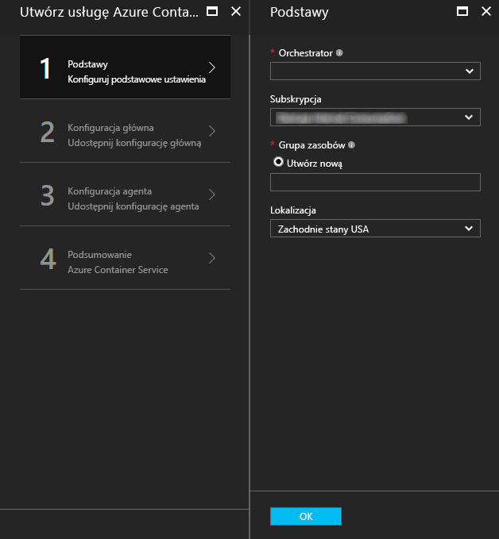
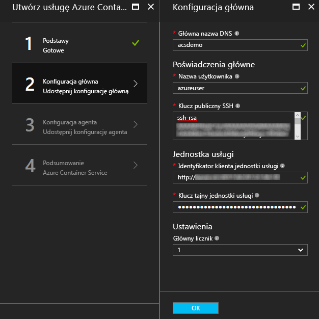
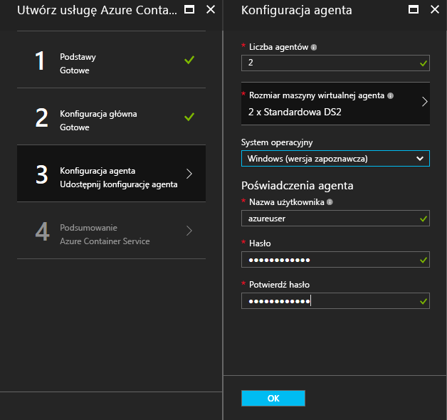
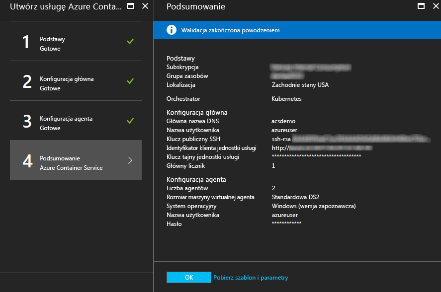
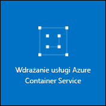

# <a name="deploy-a-docker-container-hosting-solution-using-the-azure-portal"></a>Wdrażanie rozwiązania hostingu kontenera platformy Docker w witrynie Azure Portal


Usługa kontenera platformy Azure zapewnia szybkie wdrażanie popularnych rozwiązań typu open source służących do aranżowania i klastrowania kontenerów. Ten dokument zawiera opis kroków wdrażania klastra usługi Azure Container Service przy użyciu witryny Azure Portal lub szablonu szybkiego startu usługi Azure Resource Manager. 

Wdrożenie klastra usługi Azure Container Service jest również możliwe za pomocą [interfejsu wiersza polecenia Azure w wersji 2.0](container-service-create-acs-cluster-cli.md) lub interfejsów API usługi Azure Container Service.

Aby uzyskać ogólne informacje, zobacz [Wprowadzenie do usługi Azure Container Service](../container-service-intro.md).


## <a name="prerequisites"></a>Wymagania wstępne

* **Subskrypcja platformy Azure**: jeśli jej nie masz, możesz utworzyć konto [bezpłatnej wersji próbnej](http://azure.microsoft.com/pricing/free-trial/?WT.mc_id=AA4C1C935). W przypadku większego klastra warto rozważyć subskrypcję opartą na płatności zgodnie z rzeczywistym użyciem lub inne opcje zakupu.

    > [!NOTE]
    > Użycie subskrypcji platformy Azure i [limity przydziałów zasobów](../../azure-subscription-service-limits.md), takie jak limity przydziałów rdzeni, mogą ograniczać rozmiar wdrażanego klastra. Aby zażądać zwiększenia limitu przydziału, otwórz bezpłatnie [żądanie obsługi klienta online](../../azure-supportability/how-to-create-azure-support-request.md).
    >

* **Klucz publiczny SSH RSA**: podczas wdrażania za pośrednictwem portalu lub jednego z szablonów szybkiego startu platformy Azure musisz podać klucz publiczny na potrzeby uwierzytelniania na maszynach wirtualnych usługi Azure Container Service. Aby utworzyć klucze RSA Secure Shell (SSH), zobacz wskazówki dla systemów [OS X i Linux](../../virtual-machines/linux/mac-create-ssh-keys.md) lub [Windows](../../virtual-machines/linux/ssh-from-windows.md). 

* **Klucz tajny i identyfikator klienta nazwy głównej usługi** (tylko rozwiązanie Kubernetes): aby uzyskać więcej informacji i wskazówek dotyczących tworzenia nazwy głównej usługi Azure Active Directory, zobacz [About the service principal for a Kubernetes cluster](../kubernetes/container-service-kubernetes-service-principal.md) (Informacje o nazwie głównej usługi dla klastra Kubernetes).


## <a name="create-a-cluster-by-using-the-azure-portal"></a>Tworzenie klastra przy użyciu witryny Azure Portal
1. Zaloguj się w witrynie Azure Portal, wybierz pozycję **Nowy** i w portalu Azure Marketplace wyszukaj usługę **Azure Container Service**.

      <br />

2. Kliknij pozycję **Azure Container Service**, a następnie kliknij przycisk **Utwórz**.

3. W bloku **Podstawowe** wprowadź następujące informacje:

    * **Koordynator**: wybierz jeden z koordynatorów kontenera w celu wdrożenia go w klastrze.
        * **DC/OS**: wdraża klaster DC/OS.
        * **Swarm**: wdraża klaster Docker Swarm.
        * **Kubernetes**: wdraża klaster Kubernetes.
    * **Subskrypcja**: wybierz subskrypcję platformy Azure.
    * **Grupa zasobów**: wprowadź nazwę nowej grupy zasobów dla wdrożenia.
    * **Lokalizacja**: wybierz region platformy Azure dla wdrożenia usługi Azure Container Service. Aby uzyskać informacje o dostępności, zobacz [Dostępność produktów według regionów](https://azure.microsoft.com/regions/services/).
    
      <br />
    
    Aby kontynuować, kliknij przycisk **OK**.

4. W bloku **Konfiguracja serwera głównego** wprowadź następujące ustawienia dla węzła głównego (lub węzłów głównych) systemu Linux w klastrze (niektóre ustawienia są unikatowe dla poszczególnych koordynatorów):

    * **Nazwa DNS serwera głównego**: prefiks używany do tworzenia unikatowej w pełni kwalifikowanej nazwy domeny (FQDN) dla serwera głównego. Nazwa FQDN serwera głównego ma postać *prefiks*mgmt.*lokalizacja*.cloudapp.azure.com.
    * **Nazwa użytkownika**: nazwa użytkownika konta używanego na poszczególnych maszynach wirtualnych z systemem Linux w klastrze.
    * **Klucz publiczny SSH RSA**: dodaj klucz publiczny, który będzie używany do uwierzytelniania na maszynach wirtualnych z systemem Linux. Ważne jest, aby ten klucz nie zawierał podziałów wierszy i miał prefiks `ssh-rsa`. Postfiks `username@domain` jest opcjonalny. Klucz powinien wyglądać podobnie do poniższego: **ssh-rsa AAAAB3Nz...<...>...UcyupgH azureuser@linuxvm**. 
    * **Nazwa główna usługi**: w przypadku wybrania koordynatora Kubernetes wprowadź **identyfikator klienta nazwy głównej usługi** Azure Active Directory (nazywany również identyfikatorem appId) i **klucz tajny klienta nazwy głównej usługi** (hasło). Aby uzyskać więcej informacji, zobacz [About the service principal for a Kubernetes cluster](../kubernetes/container-service-kubernetes-service-principal.md) (Informacje o nazwie głównej usługi dla klastra Kubernetes).
    * **Liczba serwerów głównych**: liczba serwerów głównych w klastrze.
    * **Diagnostyka maszyn wirtualnych**: w przypadku niektórych koordynatorów można włączyć diagnostykę maszyn wirtualnych na serwerach głównych.

      <br />

    Aby kontynuować, kliknij przycisk **OK**.

5. W bloku **Konfiguracja agenta** wprowadź następujące informacje:

    * **Liczba agentów**: w przypadku opcji Docker Swarm lub Kubernetes ta wartość to początkowa liczba agentów w zestawie skalowania agenta. W przypadku opcji DC/OS jest to początkowa liczba agentów w prywatnym zestawie skalowania. Ponadto w przypadku koordynatora DC/OS jest tworzony publiczny zestaw skalowania zawierający wstępnie określoną liczbę agentów. Liczba agentów w tym publicznym zestawie skalowania zależy od liczby serwerów głównych w klastrze: jeden agent publiczny dla jednego serwera głównego i dwóch agentów publicznych dla trzech lub pięciu serwerów głównych.
    * **Rozmiar maszyny wirtualnej agenta**: rozmiar maszyn wirtualnych agenta.
    * **System operacyjny**: to ustawienie jest obecnie dostępne tylko w przypadku wybrania koordynatora Kubernetes. Wybierz dystrybucję systemu Linux lub system operacyjny Windows Server, które będą uruchomione na agentach. To ustawienie określa, czy w klastrze można uruchamiać aplikacje kontenera systemu Linux czy Windows. 

        > [!NOTE]
        > Obsługa kontenerów systemu Windows dla klastrów Kubernetes jest dostępna w wersji zapoznawczej. W przypadku klastrów DC/OS i Swarm tylko agenci systemu Linux są obecnie obsługiwani przez usługę Azure Container Service.

    * **Poświadczenia agentów**: w przypadku wybrania systemu operacyjnego Windows wprowadź **nazwę użytkownika** i **hasło** administratora dla maszyn wirtualnych agentów. 

      <br />

    Aby kontynuować, kliknij przycisk **OK**.

6. Po zakończeniu weryfikacji usługi kliknij przycisk **OK**.

      <br />

7. Zapoznaj się z warunkami. Kliknij przycisk **Utwórz**, aby rozpocząć proces wdrażania.

    Jeśli wybrano opcję przypięcia wdrożenia do witryny Azure Portal, widoczny jest stan wdrożenia.

      <br />

Przeprowadzenie wdrożenia zajmuje kilka minut. Następnie klaster usługi Azure Container Service jest gotowy do użycia.


## <a name="create-a-cluster-by-using-a-quickstart-template"></a>Tworzenie klastra przy użyciu szablonu szybkiego startu
Na potrzeby wdrożenia klastra w usłudze Azure Container Service są dostępne szablony szybkiego startu platformy Azure. Udostępnione szablony szybkiego startu można modyfikować w celu włączenia dodatkowej lub zaawansowanej konfiguracji platformy Azure. Aby utworzyć klaster usługi Azure Container Service za pomocą szablonu szybkiego startu platformy Azure, potrzebna jest subskrypcja platformy Azure. Jeśli jej nie masz, utwórz konto [bezpłatnej wersji próbnej](http://azure.microsoft.com/pricing/free-trial/?WT.mc_id=AA4C1C935). 

Wykonaj następujące kroki, aby wdrożyć klaster przy użyciu szablonu oraz interfejsu wiersza polecenia platformy Azure w wersji 2.0 (zobacz [instrukcje instalacji i konfigurowania](/cli/azure/install-az-cli2)).

> [!NOTE] 
> Jeśli korzystasz z systemu Windows, możesz użyć podobnych kroków, aby wdrożyć szablon przy użyciu programu Azure PowerShell. Zobacz kroki w dalszej części tej sekcji. Szablon możesz także wdrożyć za pośrednictwem [portalu](../../azure-resource-manager/resource-group-template-deploy-portal.md) lub innych metod.

1. Aby wdrożyć klaster DC/OS, Docker Swarm lub Kubernetes, wybierz jeden z dostępnych szablonów szybkiego startu usługi GitHub. Częściowa lista została przedstawiona poniżej. Szablony DC/OS i Swarm są takie same — różnią się tylko domyślnie wybranym koordynatorem.

    * [Szablon DC/OS](https://github.com/Azure/azure-quickstart-templates/tree/master/101-acs-dcos)
    * [Szablon Swarm](https://github.com/Azure/azure-quickstart-templates/tree/master/101-acs-swarm)
    * [Szablon Kubernetes](https://github.com/Azure/azure-quickstart-templates/tree/master/101-acs-kubernetes)

2. Zaloguj się do konta platformy Azure (`az login`) i upewnij się, że interfejs wiersza polecenia platformy Azure jest połączony z subskrypcją platformy Azure. Domyślną subskrypcję możesz wyświetlić przy użyciu następującego polecenia:

    ```azurecli
    az account show
    ```
    
    Jeśli masz więcej niż jedną subskrypcję i chcesz ustawić inną subskrypcję domyślną, uruchom polecenie `az account set --subscription` i określ nazwę lub identyfikator subskrypcji.

3. Najlepszym rozwiązaniem jest użycie dla wdrożenia nowej grupy zasobów. Aby utworzyć grupę zasobów, użyj polecenia `az group create`, określając lokalizację i nazwę grupy zasobów: 

    ```azurecli
    az group create --name "RESOURCE_GROUP" --location "LOCATION"
    ```

4. Utwórz plik JSON zawierający wymagane parametry szablonu. Pobierz plik parametrów o nazwie `azuredeploy.parameters.json`, który towarzyszy szablonowi usługi Azure Container Service `azuredeploy.json` w witrynie GitHub. Wprowadź wymagane wartości parametrów dla klastra. 

    Aby na przykład użyć [szablonu DC/OS](https://github.com/Azure/azure-quickstart-templates/tree/master/101-acs-dcos), podaj wartości parametrów `dnsNamePrefix` i `sshRSAPublicKey`. W pliku `azuredeploy.json` można znaleźć opis oraz opcje dla innych parametrów.  
 

5. Utwórz klaster usługi Container Service przez przekazanie pliku parametrów wdrożenia przy użyciu następującego polecenia, gdzie:

    * **RESOURCE_GROUP** to nazwa grupy zasobów utworzonej w poprzednim kroku.
    * **DEPLOYMENT_NAME** (opcjonalnie) to nazwa nadawana wdrożeniu.
    * **TEMPLATE_URI** to lokalizacja pliku wdrożenia `azuredeploy.json`. Ten identyfikator URI musi wskazywać plik nieprzetworzony. Nie może to być wskaźnik do interfejsu użytkownika witryny GitHub. Aby znaleźć ten identyfikator URI, wybierz plik `azuredeploy.json` w witrynie GitHub i kliknij przycisk **Raw** (Nieprzetworzone).  

    ```azurecli
    az group deployment create -g RESOURCE_GROUP -n DEPLOYMENT_NAME --template-uri TEMPLATE_URI --parameters @azuredeploy.parameters.json
    ```

    Parametry możesz również podać jako ciąg w formacie JSON w wierszu polecenia. Użyj polecenia podobnego do następującego:

    ```azurecli
    az group deployment create -g RESOURCE_GROUP -n DEPLOYMENT_NAME --template-uri TEMPLATE_URI --parameters "{ \"param1\": {\"value1\"} … }"
    ```

    > [!NOTE]
    > Przeprowadzenie wdrożenia zajmuje kilka minut.
    > 

### <a name="equivalent-powershell-commands"></a>Równoważne polecenia programu PowerShell
Szablon klastra usługi Azure Container Service można również wdrożyć przy użyciu programu PowerShell. Ten dokument jest oparty na wersji 1.0 [modułu Azure PowerShell](https://azure.microsoft.com/blog/azps-1-0/).

1. Aby wdrożyć klaster DC/OS, Docker Swarm lub Kubernetes, wybierz jeden z dostępnych szablonów szybkiego startu usługi GitHub. Częściowa lista została przedstawiona poniżej. Zwróć uwagę na to, że szablony DC/OS i Swarm są takie same — różnią się tylko domyślnie wybranym koordynatorem.

    * [Szablon DC/OS](https://github.com/Azure/azure-quickstart-templates/tree/master/101-acs-dcos)
    * [Szablon Swarm](https://github.com/Azure/azure-quickstart-templates/tree/master/101-acs-swarm)
    * [Szablon Kubernetes](https://github.com/Azure/azure-quickstart-templates/tree/master/101-acs-kubernetes)

2. Przed utworzeniem klastra w ramach subskrypcji platformy Azure sprawdź, czy nastąpiło zalogowanie do platformy Azure z poziomu sesji programu PowerShell. W tym celu możesz użyć polecenia `Get-AzureRMSubscription`:

    ```powershell
    Get-AzureRmSubscription
    ```

3. Jeśli musisz zalogować się do platformy Azure, użyj polecenia `Login-AzureRMAccount`:

    ```powershell
    Login-AzureRmAccount
    ```

4. Najlepszym rozwiązaniem jest użycie dla wdrożenia nowej grupy zasobów. Aby utworzyć grupę zasobów, użyj polecenia `New-AzureRmResourceGroup`, określając nazwę grupy zasobów i region docelowy:

    ```powershell
    New-AzureRmResourceGroup -Name GROUP_NAME -Location REGION
    ```

5. Po utworzeniu grupy zasobów możesz utworzyć klaster przy użyciu poniższego polecenia. Identyfikator URI żądanego szablonu jest określany za pomocą parametru `-TemplateUri`. Po uruchomieniu tego polecenia program PowerShell wyświetli monit o wprowadzenie wartości parametrów wdrożenia.

    ```powershell
    New-AzureRmResourceGroupDeployment -Name DEPLOYMENT_NAME -ResourceGroupName RESOURCE_GROUP_NAME -TemplateUri TEMPLATE_URI
    ```

#### <a name="provide-template-parameters"></a>Wprowadzanie parametrów szablonu
Jeśli znasz program PowerShell, wiesz, że możesz przechodzić przez dostępne parametry polecenia cmdlet, wpisując znak minus (-), a następnie naciskając klawisz TAB. Ta funkcja działa również w przypadku parametrów zdefiniowanych w szablonie. Po wpisaniu nazwy szablonu polecenie cmdlet pobiera szablon, analizuje parametry i dynamicznie dodaje parametry szablonu do polecenia. Dzięki temu można łatwo określić wartości parametrów szablonu. A jeśli zapomnisz o podaniu wartości wymaganego parametru, w programie PowerShell zostanie wyświetlony monit dotyczący tej wartości.

Poniżej przedstawiono pełne polecenie, łącznie z parametrami. Podaj własne wartości nazw zasobów.

```powershell
New-AzureRmResourceGroupDeployment -ResourceGroupName RESOURCE_GROUP_NAME-TemplateURI TEMPLATE_URI -adminuser value1 -adminpassword value2 ....
```

## <a name="next-steps"></a>Następne kroki
Teraz, gdy masz działający klaster, możesz zapoznać się z tymi dokumentami, aby uzyskać szczegółowe informacje na temat połączeń i zarządzania:

* [Łączenie z klastrem usługi Azure Container Service](../container-service-connect.md)
* [Współpraca z usługą Azure Container Service i rozwiązaniem DC/OS](container-service-mesos-marathon-rest.md)
* [Współpraca z usługą Azure Container Service i rozwiązaniem Docker Swarm](container-service-docker-swarm.md)
* [Współpraca z usługą Azure Container Service i rozwiązaniem Kubernetes](../kubernetes/container-service-kubernetes-walkthrough.md)

